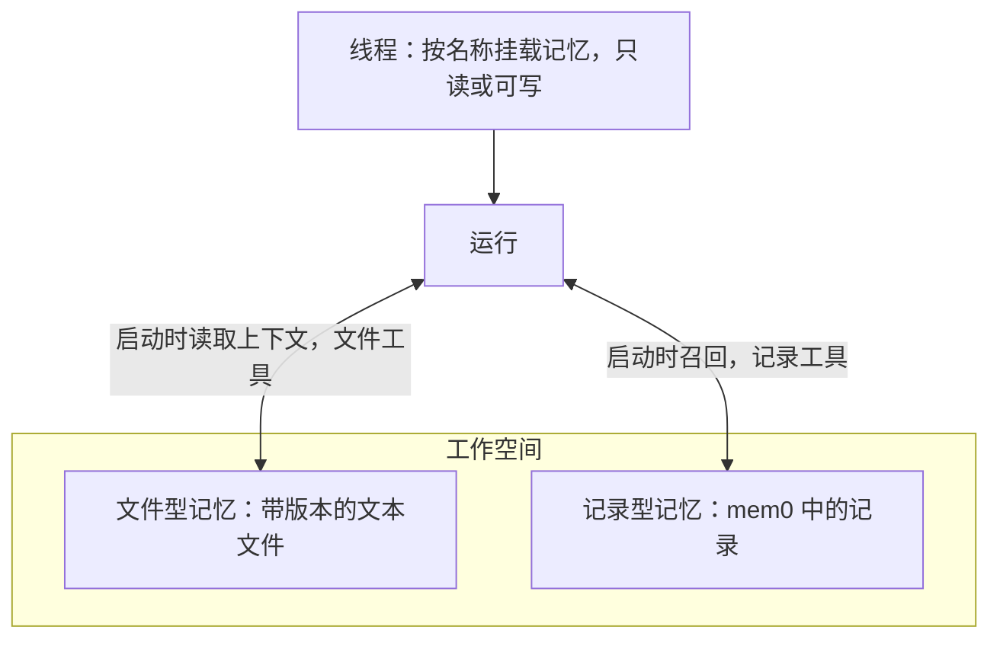

记忆是 agent 跨对话保留的偏好、决策、约定和参考事实。它属于工作空间，可同时挂载到多个线程。记忆有两种：

- **文件型记忆** 是一棵小型文本文件树。Service 在 PostgreSQL 中保存文件和每次修改的历史。每次写入都检查执行当时的文件版本，基于旧内容的修改会失败并返回当前文件，避免覆盖其他运行的工作。[文件型记忆](../a13n-harness/memory.md)介绍模型看到的内容和记忆文件的编写方法。
- **记录型记忆** 是一组简短文本记录，例如“用户偏好公制单位”，通过[记忆 provider](#set-up-a-memory-provider) 保存在 [mem0](https://mem0.ai) 后端。每次运行开始时，与输入最相关的记录会被**召回**。记录没有版本，最后一次写入生效。

线程按名称**挂载** 记忆。每次运行接收时固定线程记忆挂载，启动时读取各记忆的上下文或召回记录，并通过 `memory_file_*` 和 `memory_record_*` 工具修改。



下文所有 API 路径均位于 `/api/v1` 下。

## 创建文件型记忆

创建和修改记忆需要 `write`：

```sh
curl -X POST "$A13N_URL/api/v1/memories" \
  -H "Authorization: Bearer $A13N_API_KEY" -H "Content-Type: application/json" \
  -d '{"name": "Team conventions", "type": "postgres",
       "guide": "Keep one file per topic. Record decisions with their reason.",
       "always_load": ["README.md"]}'
```

- `type` 为 `postgres`，即 Service 自身存储，也是默认值。响应的 `id`（`mem_…`）标识记忆；记忆没有 key。
- `guide` 告诉 agent 应保存什么、如何组织，最多 `memory.guide_bytes`。省略或设为 `null` 时，使用部署按记忆类别设置的指南（`memory.default_guide.file` 或 `memory.default_guide.record`，未设置则使用内置指南）；`""` 表示没有指南。`inherited_guide` 显示 `null` 最终对应的指南。
- `always_load` 最多指定 64 个路径；这些路径的完整内容位于记忆完整上下文的开头，线程首次看到该记忆时获得完整上下文。路径可以尚不存在。只有对记忆拥有 `write` 的主体能设置它们，因此运行不能将自己的写入固定到所有后续线程。
- `PATCH …/memories/{memory_id}` 使用记忆的 `If-Match` 修改 `name`、`description`、`labels`、`guide` 和 `always_load`。之后启动的尝试使用修改后的配置，包括已在执行的运行的后续尝试。
- `DELETE …/memories/{memory_id}` 使用 `If-Match` 删除记忆及其文件、历史和线程挂载。正在使用它的运行在下一次记忆工具调用时收到 `memory_deleted`。

`GET …/memories` 列出工作空间记忆，可按 `label`、`kind`（`file` 或 `record`）和 `type` 筛选。文件型记忆显示 `file_count`、`content_bytes` 和 `history_bytes`；记录型记忆中这些值为 null。

## 记录型记忆

### 配置记忆 provider

记忆 provider 是类别为 `memory` 的 [provider](resources.md#providers)，对应记录型记忆后端的一个账号。在工作空间的 `/api/v1/memory-providers` 中添加。

托管的 **mem0 Platform** 使用 `mem0_platform` 类型和 [mem0 控制台](https://app.mem0.ai/dashboard/api-keys)生成的 API 密钥；`config.base_url` 默认 `https://api.mem0.ai`：

```sh
curl -X POST "$A13N_URL/api/v1/memory-providers" \
  -H "Authorization: Bearer $A13N_API_KEY" -H "Content-Type: application/json" \
  -d '{"type": "mem0_platform", "name": "mem0", "config": {}, "credential": {"api_key": "m0-..."}}'
```

**自托管 mem0** 需要运行 [mem0 REST 服务器](https://docs.mem0.ai/open-source/features/rest-api)，并配置自身的模型、嵌入模型和向量存储。使用 `mem0_oss` 类型，将服务器地址设为 `base_url`：

```sh
curl -X POST "$A13N_URL/api/v1/memory-providers" \
  -H "Authorization: Bearer $A13N_API_KEY" -H "Content-Type: application/json" \
  -d '{"type": "mem0_oss", "name": "mem0",
       "config": {"base_url": "https://mem0.internal.example.com"}, "credential": {"api_key": "..."}}'
```

自托管凭据可选，通过 `X-API-Key` 发送；清除已删除记忆的记录需要服务器管理员密钥。私有网络或明文 HTTP 服务器必须由部署的[出站策略](configuration.md#outbound-requests)允许。自托管服务器最多列出一份记忆的 1000 条记录。

`POST …/memory-providers/{provider_id}/test` 列出未被任何记忆使用的命名空间中的一页数据，检查地址和密钥，不做修改。

### 创建记录型记忆

```sh
curl -X POST "$A13N_URL/api/v1/memories" \
  -H "Authorization: Bearer $A13N_API_KEY" -H "Content-Type: application/json" \
  -d '{"name": "User facts", "type": "mem0_platform", "provider_id": "memprov_...",
       "guide": "Record one stable fact about the user per record."}'
```

- `type` 为 provider 类型，provider 必须是工作空间中已启用的记忆 provider。`always_load` 不适用。
- 每份记录型记忆拥有后端中的一个**命名空间**，即 mem0 的 `user_id`。默认值为 `a13n-` 加上从记忆 ID 派生的 32 位十六进制字符。设置 `namespace` 可接管已有 `user_id` 下的记录，例如应用已写入的记录；长度为 1–256 个可打印字符，不含空白或 `*`。一个命名空间只属于一份记忆；其他记忆重复使用时返回 `409 already_exists`。
- `type`、`provider_id` 和 `namespace` 永不改变。
- 删除记录型记忆也会在后台删除命名空间中的记录。完成前，新记忆不能使用该命名空间（`409 conflict`，原因为 `namespace_purging`）。后端持续拒绝时，清理在 `memory_purge` outbox 策略的 `max_attempts` 次尝试后停止（取 `outbox.by_kind.memory_purge`，否则取 `outbox.defaults`），记录保留在后端。mem0 Platform 接收清理后自行完成，因此记录可能短暂保留。

### 读取与编辑记录

用户可以读取和纠正 agent 记录的内容。读取需要 `read`；添加、更新和删除需要 `run`。

| 请求                                         | 作用                                                                       |
| -------------------------------------------- | -------------------------------------------------------------------------- |
| `GET …/memories/{id}/records?limit=&cursor=` | 按后端顺序列出记录，通过 `next_cursor` 获取下一页                          |
| `POST …/memories/{id}/records/search`        | 返回语义最接近 `{query}` 的最多 `limit` 条记录，按相关度排列，包含 `score` |
| `POST …/memories/{id}/records`               | 添加 `{text}`                                                              |
| `PUT …/memories/{id}/records/{record_id}`    | 用 `{text}` 替换完整记录文本                                               |
| `DELETE …/memories/{id}/records/{record_id}` | 删除记录                                                                   |

记录长度为 1 到 `memory.record_chars` 个字符（默认 8000）。记录没有 ETag，最后一次写入生效。后端未确认的写入返回 `409 conflict`，原因为 `write_unconfirmed`：可能已经写入，也可能没有，请先列出或搜索再重试。后端无法响应时返回 `503 unavailable`，dependency 为 `memory:{type}`；provider 已禁用时返回 `422 disabled`。记录修改的审计仅包含记录 ID，不包含文本。

### 召回

运行启动时，每份启用 `recall` 的已挂载记录型记忆搜索最接近运行输入的 `memory.recall_limit` 条记录（默认 5 条）。这些记录作为不可信数据在输入之前提供给运行，每份记忆最多 `memory.recall_bytes`（8 KiB）。召回最多等待 `memory.recall_seconds`（2 秒）；搜索失败或过慢的记忆被跳过，运行继续。只有运行的第一条输入触发召回，避免重复记录填满历史。

## 在线程上挂载记忆

线程记忆挂载决定后续运行使用哪些记忆：

```sh
curl -X POST "$A13N_URL/api/v1/threads/$THREAD/memories" \
  -H "Authorization: Bearer $A13N_API_KEY" -H "Content-Type: application/json" -H "If-Match: $THREAD_ETAG" \
  -d '{"name": "team", "memory_id": "mem_...", "access": "write"}'
```

- `name` 必须匹配 `^[a-z][a-z0-9-]{0,62}$`，模型用它引用记忆。`access` 为 `read` 时仅提供读取和搜索工具，为 `write` 时提供全部工具。
- `recall`（默认 `true`）允许记录型记忆在每次运行中召回记录；文件型记忆忽略此设置。
- 同一线程内，每个名称和记忆只能挂载一次。`PATCH …/threads/{thread_id}/memories/{name}` 修改挂载的 `access` 和 `recall`；替换记忆需先删除再添加。
- 一个线程最多 `memory.mounts_per_thread` 个记忆挂载（默认 8）；超过时返回 `409 conflict`，原因为 `memory_mount_limit`。
- 挂载修改使用**线程** 的 `If-Match`，返回新 ETag，需要 `run`，影响之后接收的运行。`GET …/threads/{thread_id}/memories` 列出挂载及线程 ETag，`DELETE …/threads/{thread_id}/memories/{name}` 移除挂载。
- 新线程和分叉线程通过 `memories` 字段指定初始挂载。分叉复制源线程的记忆挂载。归档线程会移除挂载。

要让 agent 的每个线程都使用记忆，将 agent 的 `memory_mounts` 设为 `[{name, memory_id, access, recall}]`。线程首次接收运行时，会添加线程尚未使用的名称和记忆。此后由线程自身挂载决定，所以删除后不会自动恢复。默认记忆已被删除时，首次运行以 `invalid_argument` 失败；默认挂载导致超限时，以 `memory_mount_limit` 失败。

异步[子 agent](agents-and-runs.md#subagents) 的线程先继承父运行记忆挂载，再添加自身 agent 的默认挂载。内联子 agent 没有记忆工具或上下文。

## Agent 获得的内容

`memory` [工具集](tools.md#built-in-toolsets)默认启用，包含：

- Harness [文件型记忆工具](../a13n-harness/memory.md#what-the-model-gets)，tool key 从 `file_view` 到 `file_delete`，permission ID 从 `memory.file.view` 到 `memory.file.delete`，供已挂载文件型记忆使用；
- 记录工具 `memory_record_search`、`memory_record_list`、`memory_record_add`、`memory_record_update` 和 `memory_record_delete`，tool key 从 `record_search` 到 `record_delete`，permission ID 从 `memory.record.search` 到 `memory.record.delete`，供已挂载记录型记忆使用。

禁用工具会从所有挂载中移除它；禁用工具集仍保留记忆上下文和召回内容，但没有工具。

运行开始时，每份文件型记忆添加一个上下文块：线程首次看到记忆时包含始终加载的文件和文件索引，之后只包含发生变化的文件，包括其他线程和用户的修改。历史被压缩的线程会重新获得完整上下文。运行中的记忆上下文共享 `memory.context_bytes`（默认 32 KiB），各记忆始终加载的文件最多占用 `memory.always_load_bytes`。

每次记忆调用检查运行对工作空间的访问：查看、列出和搜索需要 `read`，修改文件或记录需要 `run`。拒绝调用返回 `forbidden`；记录型记忆的 provider 被禁用时返回 `unavailable`。失败的文件调用不做修改；模型重新读取文件再决定。

Worker 可能在写入记忆后、记录运行进度前停止。恢复后的尝试会报告调用结果未知，模型在再次写入前读取文件或搜索记录。文件写入历史保留对应的运行和工具调用。

## 文件与历史

用户可以读取和纠正 agent 写入的内容。读取需要 `read`，编辑和恢复需要 `run`，清理历史需要 `write`。`{path}` 是文件路径，例如 `prefs/language.md`。

| 请求                                           | 作用                                                                          |
| ---------------------------------------------- | ----------------------------------------------------------------------------- |
| `GET …/memories/{id}/files?prefix=`            | 按路径顺序列出以 `/` 结尾的目录前缀下的文件，不含内容                         |
| `GET …/memories/{id}/files/{path}`             | 返回一个文件的内容和 `ETag`                                                   |
| `POST …/memories/{id}/files`                   | 创建 `{path, content}`；路径已占用时返回 `409 already_exists`                 |
| `PUT …/memories/{id}/files/{path}`             | 替换 `If-Match` 指定文件的内容                                                |
| `POST …/memories/{id}/files/move`              | 将 `If-Match` 指定文件从 `{source, destination}` 的源路径移动到空闲目标路径   |
| `DELETE …/memories/{id}/files/{path}`          | 删除 `If-Match` 指定的文件                                                    |
| `GET …/memories/{id}/revisions`                | 按从新到旧列出修改，可按 `path` 或 `run_id` 筛选                              |
| `GET …/memories/{id}/revisions/{seq}`          | 返回一次修改的 `previous_content`、修改后的 `content` 和 unified-diff `hunks` |
| `POST …/memories/{id}/revisions/{seq}/restore` | 以新修改恢复该次修改之前的内容；若当前路径有文件，`If-Match` 指定该文件       |
| `DELETE …/memories/{id}/revisions?path=`       | 删除一个路径保留的历史，文件保持不变                                          |

每个修订版本记录修改者：始终记录 `principal_id`（agent 的修改记录运行的主体），agent 工具调用还记录 `run_id` 和 `tool_call_id`。每次修改都改变文件 ETag，因此基于旧读取结果的编辑返回 `412 precondition_failed`。

单文件最多 `memory.max_file_bytes`（默认 64 KiB）。每个文件保留最近 `memory.revisions_per_file` 次修改（默认 10）；一份记忆的内容和历史合计不得超过 `memory.max_total_bytes`（默认 32 MiB）：优先清理最旧历史，只有内容本身超限才拒绝修改，返回 `409 conflict`，原因为 `memory_full`。全部 `memory.*` 设置请参阅[设置参考](configuration-reference.md#memory)。
