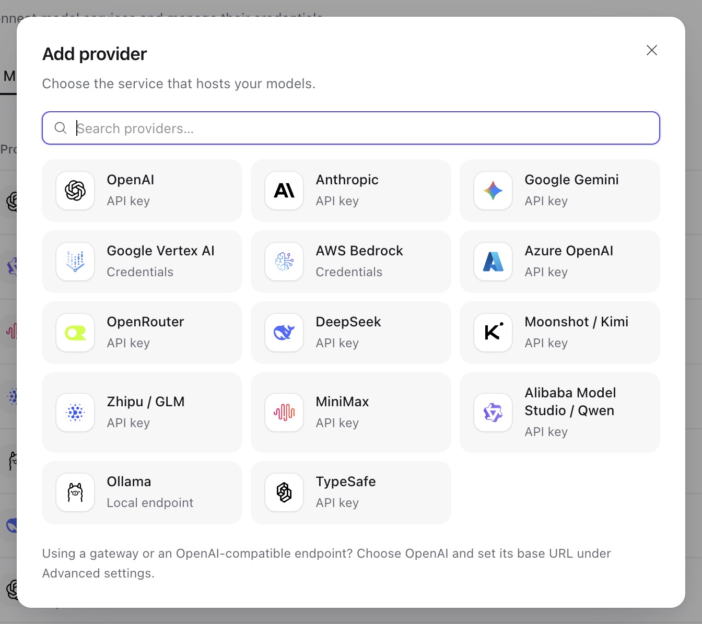

Agent 调用一个**模型**：它对应**模型 provider** 账号下的上游模型，配置调用所用的模型 API、能力和可选价格。Provider 和模型属于同一[工作空间](resources.md#workspaces)，agent 通过 key 选择模型。

## 模型 provider

在 Console 中打开 **Models → Add model → Connect a new provider**，或在 **Workspace settings → Providers** 管理 provider。通过 API 使用时，按 [Provider](resources.md#providers)中的说明在 `/api/v1/model-providers` 创建。



| 类型                                                               | 模型 API（首项为默认值）                                                          |
| ------------------------------------------------------------------ | --------------------------------------------------------------------------------- |
| `openai`                                                           | `openai.responses`, `openai.chat_completions`                                     |
| `anthropic`                                                        | `anthropic.messages`                                                              |
| `google_gemini`, `google_vertex`                                   | `google.generate_content`                                                         |
| `azure_openai`                                                     | `openai.responses`, `openai.chat_completions`                                     |
| `aws_bedrock`                                                      | `bedrock.converse`, `bedrock_mantle.responses`, `bedrock_mantle.chat_completions` |
| `openrouter`                                                       | `openrouter.chat_completions`                                                     |
| `ollama`                                                           | `ollama.chat_completions`                                                         |
| `alibaba_model_studio`, `deepseek`, `moonshot`, `minimax`, `zhipu` | `openai.chat_completions`                                                         |
| `typesafe`                                                         | `typesafe.system_one`                                                             |

各类型的配置和凭据字段来自 Harness；`GET /api/v1/provider-types/model` 以 JSON Schema 返回。多数类型接受可选 `base_url` 和 `api_key` 凭据。各类型选项请参阅 [Harness 模型](../a13n-harness/models.md)和[模型认证](../a13n-harness/model-authentication.md)。

模型 provider 还可包含最多 32 个**额外请求头**，用于按请求头路由或计费的网关。请求头值作为密钥加密，永不返回（视图只列出 `header_names`），通过 `PATCH` 按名称编辑（`"X-Team": "..."` 设置值，`null` 移除，省略则保留）。传输、认证和协议请求头名称不可设置。

## ChatGPT 订阅 provider

创建 `openai_chatgpt` provider 时不填写静态凭据。在 **Workspace settings → Providers** 选择 **ChatGPT subscription**，添加后点击 **Sign in with ChatGPT**。授权属于 Provider，由整个工作空间共享，不是个人 Connection。

授权后将浏览器地址栏的完整回调 URL 复制到 **Complete callback URL**，即使回环页面显示连接失败也可以。Service 可以部署在远端：它校验并交换粘贴的回调，不请求该 URL，也不要求浏览器访问服务器的回环监听器。

API 客户端先以 `{}` 调用 `POST /api/v1/model-providers/{id}/authorize`，再以 `{"attempt_id": "oauth_...", "callback_url": "http://127.0.0.1:1456/auth/callback?..."}` 调用 `POST …/authorization/callback`。完整回调必须保密。无效输入可修正重试；交换开始后若失败，必须重启授权。`GET …/authorization` 返回不含凭据的状态。`DELETE …/authorization` 先清除 token，再请求撤销，并报告未确认的撤销结果。保留的注册信息支持再次登录；`{"new_registration": true}` 显式发起新注册。

此 Provider 使用 `openai.responses` 和账户模型 slug。`GET …/models` 返回账户可见 slug 和显示名，Console 仍支持手动输入 ID。可见性不保证推理权限。端点固定，token 和待完成授权加密保存在 Provider 状态中，不进入 Model 配置或 Run 快照。每次请求固定 `store: false` 并使用必需的流，普通调用由原生 Model 收集该流。原生 profile 不发送 temperature、Top P 和输出 token 上限；previous-response ID 和不支持的托管工具明确失败，不会改成 API 密钥调用。Codex 凭据与此无关，不能代替该授权。

## 添加模型

在 Console 中打开 **Models → Add model**，选择 provider，再从模型目录选择模型或输入上游模型 ID。目录列出 [models.dev](https://models.dev) 中该 provider 类型支持的近期文本模型，每个模型一行；如果 provider 以多个 ID 提供同一模型（例如 Bedrock 区域），可选择 ID。通用 `openai` 类型还提供 **Other models (compatible)** ，用于通过 OpenAI 兼容端点访问其他厂商模型。选择模型会填入上游模型 ID、能力和价格，保存前可修改。如果 Service 启动以来始终无法访问 models.dev，Console 会提示目录不可用，此时请手动输入上游模型 ID。

API 的 `GET /api/v1/model-catalog` 返回目录的 `items` 和 `status`：`ready`、`stale`（无法访问 models.dev 时使用上次目录）或 `unavailable`。各条目的 `ref`、`characteristics` 和 `pricing` 可复制到新模型：

```sh
curl "$A13N_URL/api/v1/model-catalog" -H "Authorization: Bearer $A13N_API_KEY"
```

在 `/api/v1/models` 中使用 `config` 创建模型：

```json
{
  "provider_id": "mprov_...",
  "key": "local-llama",
  "name": "Llama (local)",
  "description": "Served by the team's Ollama host",
  "config": {
    "model_name": "llama3.3",
    "model_api": "ollama.chat_completions",
    "characteristics": {"capabilities": ["image_understanding"], "context_window_tokens": 131072},
    "settings": {"max_tokens": 4096}
  }
}
```

- `provider_id` 指定工作空间中的模型 provider，模型调用使用它的凭据。
- `key` 在工作空间中标识模型，用于 `/api/v1/models/local-llama` 等路径、agent 配置和用量。默认值将 provider 类型和上游模型名称用 `-` 连接并转为小写，[key](resources.md#common-conventions)不允许的字符替换为 `-`（此处 `ollama` provider 默认得到 `ollama-llama3.3`）；若已被占用（`409 already_exists`），请显式设置。Key 永不改变。
- `config.model_name` 是上游模型名称，`config.model_api` 必须属于 provider 类型支持的模型 API。
- `config.characteristics` 声明上下文窗口、上下文管理阈值和 `capabilities`：`image_understanding`、`video_understanding`、`audio_understanding`，以及用于 PDF 的 `document_understanding`。
- `config.settings` 保存原生请求默认值，例如 `thinking`、`max_tokens` 或 `openai_reasoning_summary`。Agent 的 `model_settings` 可覆盖这些值。现有扁平字段 `max_tokens`、`temperature`、`top_p`、`extra_body` 和 `extra_headers` 仍受支持；同一 key 也在 `settings` 中出现时，原生字段优先，不递归合并。
- `pricing` 为用量记录中的模型自身调用计价；目录条目携带可复制的价格。价格中的 provider 和模型仅记录来源，因此复制到另一端点的上游模型 ID 后，该价格仍生效。
- `catalog_ref`（例如 `{"provider": "openai", "model": "gpt-5.5"}`）可选记录模型初始使用的目录条目 `ref`。Console 用它显示图标和名称；Service 不会拿它与目录核验。
- `enabled: false` 创建禁用状态的模型。

模型使用其 provider 的凭据，因此创建模型或修改 `config` 也需要 provider 上的 `write` 权限。Provider 和模型属于同一工作空间。

使用 `PATCH /api/v1/models/{key}`（`name`、`description`、`config`、`pricing`、`catalog_ref`、`enabled`）和 `If-Match` 值 `"{key}:{version}"` 修改模型。`{"enabled": false}` 可禁用；模型没有删除操作。推理强度等模型 API 专属设置可以作为共享模型默认值（`config.settings`），或作为 Agent 修订版本覆盖值（`model_settings`）。两者都按 provider 类型的 `settings_schemas` 校验。这些 schema 不包含运维超时、上游模型选择、provider 账号对话状态（例如 `openai_previous_response_id`、`bedrock_inference_profile`、`openrouter_models` 或辅助 `openai_moderation` 模型），以及 `max_usage` 无法完整计量的服务端工具，例如 `openai_native_tools`。

### 图片输入预处理

模型的**高级**设置中，**图片输入**默认开启**预处理图片**与**支持 GIF**，**最多图片数**为 20，**单张图片大小上限（MiB）**为 5。关闭 GIF 支持后，模型请求中会移除二进制 GIF；不会下载图片 URL 或据此判断格式。图片数量设为 0 会移除全部图片；大小设为 0 不限制字节数。大小预算按**单张图片的 Base64 编码字节数**计算；1 MiB 为 1,048,576 字节，不是十进制 MB 或原始文件大小。

API 字段是 `config.characteristics.image_input`，不是 `config.settings`。省略时启用默认预处理，提供对象可自定义，显式 `null` 则关闭自动预处理。全部七个字段均可通过 API 配置，见[共享策略参考](../a13n-harness/models.md#image-input-policy)。编辑其他控件时，Console 保留未展示的尺寸与切分字段，以及精确的字节预算。

主模型、独立子 agent 的模型与图片理解模型各自拥有自己的策略。每次 attempt 使用当次解析出的模型配置；后续 attempt（包括恢复）与其他实时模型默认值一样，重新解析当前模型。与 Harness UI 不同，Service 不会跨 attempt 冻结模型 recipe。

### 高级请求设置

模型的 **Advanced** 区域提供 Thinking effort 和 Max output tokens，OpenAI Responses 还提供 Reasoning summary 和 Store response。这些字段与 **Settings JSON** 编辑同一份草稿，其他原生参数仍可在 JSON 中设置。保留默认值不会强制设置推理强度或输出额度；请使用上游模型支持的值。模型默认值应用于使用该模型的 agent，也应用于使用各自选定模型的 reviewer 和媒体理解调用。

对于 `openai.responses`，**Store response 默认关闭**，包括从未设置 `openai_store` 的已有模型。设置 `openai_store: true` 可开启，设为 `null` 则交由 provider 决定。此设置控制上游响应存储，不影响 Service 自身运行历史或 provider 的其他保留策略。Agent 和 Run 设置可以覆盖默认值。其他调用 API 保持既有存储行为。

模型 Settings JSON 对应 API 的 `config.settings`。Agent 的 **Provider-specific settings** 对应 `model_settings`。两者均接受 `extra_headers`；`openai.responses` 和 `openai.chat_completions` 还接受 `extra_body`，用于传入已安装 SDK 尚未识别的推理选项：

```json
{
  "extra_body": {"reasoning": {"effort": "future-effort"}},
  "extra_headers": {"x-experiment": "candidate"}
}
```

此 Responses 示例演示透传，并不表示上游支持该推理强度值。Chat Completions 使用自己的协议字段，例如 `reasoning_effort`。可用时应优先使用常规的类型化设置。SDK 最终浅合并时，原始值覆盖常规推理设置；原始嵌套对象会替换生成的对应对象，不会合并。不能用此方式修改模型选择、消息、工具、结构化输出或会话状态。请使用原生 `openai_text_verbosity`，不要直接设置 Responses 的 `text`，该容器也承载结构化输出。

省略任一对象会继承模型默认值；设为 `{}` 可在 Agent 或 Run 上清除该默认值。Run 设置会替换 Agent 的完整设置对象，因此 `model_settings: {}` 仍继承模型默认值。要清除两层默认值，发送 `model_settings: {"extra_body": {}, "extra_headers": {}}`。这些对象不接受 `null`。模型和 provider 修改影响后续执行尝试，包括恢复后的工作；发出请求前会重新检查设置。

这里的请求头值属于**可读取配置**。密钥应放在 provider 凭据或加密的额外请求头中。请求设置不能替换认证、协议、已有 provider 请求头名称或会话亲和请求头，名称大小写不同也不允许。

### 网关会话亲和

在 provider 高级连接设置的 **Session affinity** 中填写网关识别的请求头。Service 在所有模型调用路径上发送从 Thread 派生的稳定 UUID，包括 reviewer 和媒体理解调用。继续同一 Thread 时保留该值；子线程和分叉线程使用自己的值。它不使用 Service Session ID 或 Run ID；清除请求头默认值也不会禁用此功能。网关必须实现该请求头的路由逻辑；选择预设并不会配置网关。

模型的 `config.model_api` 必须仍在部署提供的 API 中；如果已不支持，检查设置时（例如保存 agent 修订版本）会返回 `503 unavailable` 和 `{"dependency": "model_api:<api>"}`。

## 媒体理解

Agent 的模型无法读取图片、视频或音频时，可以交由其他模型处理。每个工作空间可以按媒体类型设置默认模型，每个 agent 也可以单独选择。

在 Console 中使用 **Workspace settings → Media understanding**。通过 API 使用时，工作空间管理员按模型 key 一次性替换三类默认值，并提供 `GET /api/v1/media-understanding-defaults` 返回的 `ETag`：

```sh
curl -X PUT "$A13N_URL/api/v1/media-understanding-defaults" \
  -H "Authorization: Bearer $A13N_API_KEY" -H "Content-Type: application/json" -H "If-Match: $MEDIA_ETAG" \
  -d '{"image": "gpt-5.5", "audio": null}'
```

省略或设为 `null` 的类型没有默认模型。每个模型必须在工作空间中可用，并声明对应能力（`image_understanding`、`video_understanding` 或 `audio_understanding`）。

执行时优先使用 agent 自己的 `media_understanding` 选择，且必须可用，否则运行失败。已不可用的工作空间默认模型会被跳过并记录警告，该运行无法处理对应媒体类型。

## 用量与价格

运行中的每次模型调用都写入用量记录，归属于实际调用的模型，并按其价格计费，保存当时的价格快照。即使同一 agent 图中的两个模型指向相同上游模型、通过同类型 provider 调用，或 provider 返回另一个模型名称（例如别名的日期快照），也遵循此规则。参阅[用量](agents-and-runs.md#usage)。
