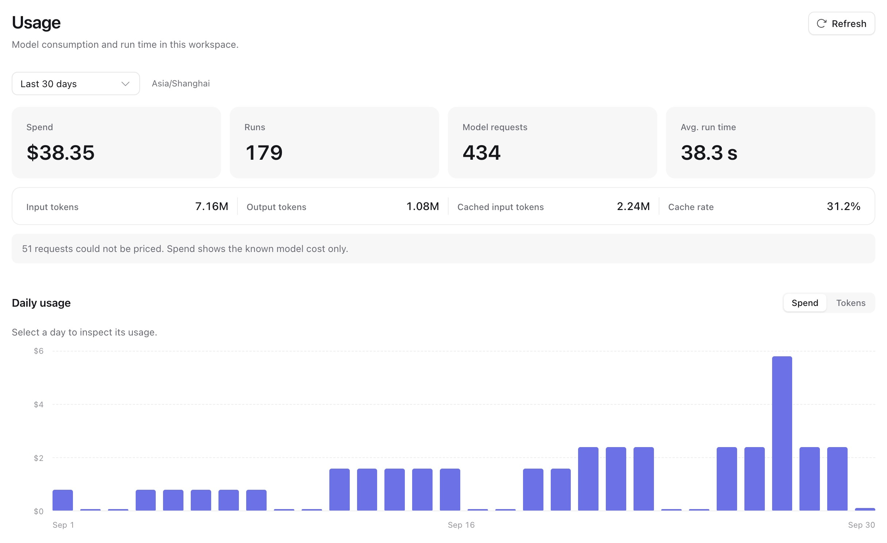

Service 记录三类观测信号，分别用于回答不同问题：

| 问题                             | 查看位置                                      |
| -------------------------------- | --------------------------------------------- |
| 这次请求或运行发生了什么？       | 按 `request_id` 或 `run_id` 搜索[日志](#logs) |
| Service 是否健康、积压或失败？   | [指标](#metrics)、告警规则和运维看板          |
| Agent 在一次尝试中做了什么？     | 该尝试的 [trace](agents-and-runs.md#traces)   |
| 租户使用了多少，其运行做了什么？ | PostgreSQL 中的[用量](#usage)记录             |

日志和指标永不包含凭据、请求或响应体、URL、查询字符串。指标不会标记租户或对象；租户级数据来自 PostgreSQL。

## 日志

每个进程默认向 stdout 输出 JSON 日志；设置 `telemetry.log_format = "pretty"` 可输出可读文本。`a13n-service run` 还可写入按大小轮转的 JSON 文件：

```toml
[telemetry]
log_level = "INFO"
log_file = "/var/log/a13n/service.log"
log_file_max_mb = 100   # rotate when the file reaches this size
log_file_backups = 5    # rotated files kept: service.log.1 … service.log.5
log_stdout = false      # only the file
```

每个进程需要独立文件。`migrate` 等运维命令始终向 stdout 记录日志。

无论由哪段代码记录，日志都携带所属工作的 ID：

| 处理过程        | 日志字段               |
| --------------- | ---------------------- |
| HTTP 请求       | `request_id`           |
| Worker 领取循环 | `worker_id`            |
| 执行尝试        | `run_id`, `attempt_id` |
| 一轮后台扫描    | `sweep`                |
| Webhook 或邮件  | `outbox_id`, `kind`    |

除失败外，Service 还记录以下事件：

| 事件                                                                 | 字段                                                                   |
| -------------------------------------------------------------------- | ---------------------------------------------------------------------- |
| `Request finished`                                                   | `method`、`route`（路由模板）、`status`、`duration_ms`；探测请求不记录 |
| `Run accepted`                                                       | `run_id`, `thread_id`, `trigger`                                       |
| `Attempt claimed`                                                    | `run_id`, `attempt_id`, `queue_wait_ms`                                |
| `Attempt ended`                                                      | `run_id`, `attempt_id`, `status`, `reason`, `duration_ms`              |
| `Run sealed`                                                         | `run_id`、`status`、`reason`（失败码）                                 |
| `Outbox delivered`, `Outbox delivery failed`, `Outbox delivery dead` | `outbox_id`, `kind`, `reason`                                          |
| `Sweep failed`                                                       | `sweep`, `error_type`                                                  |

也应配置 Service 前方的代理，隐藏自身访问日志中的查询字符串。

## 指标

设置 `telemetry.metrics_port` 后，每个进程在 `server.host` 的该端口通过 `/metrics` 提供 Prometheus 指标。Prometheus 和 VictoriaMetrics 均可抓取。请将端口保持为私有；它独立于 `server.port`，避免与 API 一起路由。Helm chart 默认使用 9464 端口。

```toml
[telemetry]
metrics_port = 9464
```

| 指标                                   | 标签                                                             | 含义                                         |
| -------------------------------------- | ---------------------------------------------------------------- | -------------------------------------------- |
| `http_server_request_duration_seconds` | `http_request_method`, `http_route`, `http_response_status_code` | 请求时长，包含事件流                         |
| `a13n_runs_accepted_total`             | `trigger`                                                        | 接收的运行数                                 |
| `a13n_runs_sealed_total`               | `status`, `reason`                                               | 已封存运行数；`reason` 为失败码              |
| `a13n_attempt_queue_wait_seconds`      | —                                                                | 已到执行时间的运行等待 worker 的时长         |
| `a13n_attempt_duration_seconds`        | `status`                                                         | 从领取到结束的尝试时长                       |
| `a13n_worker_slots`                    | `state`: `free`, `busy`                                          | Worker 的执行尝试槽位                        |
| `a13n_backlog_size`                    | `queue`                                                          | 已到执行时间的运行或某 outbox 类型的待投递数 |
| `a13n_backlog_oldest_age_seconds`      | `queue`                                                          | 最早到期项的等待时长                         |
| `a13n_outbox_deliveries_total`         | `kind`, `result`                                                 | Webhook、邮件等投递结果                      |
| `a13n_sweep_passes_total`              | `sweep`, `result`                                                | 后台扫描次数                                 |

Worker 也提供 Harness 指标，例如 `a13n_harness_run_duration_seconds`，以及模型 token 用量 `gen_ai_client_token_usage`；参阅 [Harness 观测](../a13n-harness/observation.md)。Control 副本每 15 秒查询积压数，上限为 10,000；所有 control 副本报告相同值，应取最大值。

[监控套件](https://github.com/converge-ai-labs/agent-foundation/tree/main/deploy/monitoring)包含告警规则、运维看板和用量看板，并提供 Prometheus、VictoriaMetrics、其 Kubernetes operator 和 Grafana 的配置说明。

## 排查请求或运行

从响应的 `X-Request-Id` 开始，错误体中也将它作为 `request_id` 返回：

1. 按 `request_id` 搜索日志。`Request finished` 显示路由和状态。启动运行的请求还记录 `Run accepted` 及 `run_id`；被拒绝请求没有运行，状态和错误体说明原因。排在活跃运行之后的消息会稍后启动运行，可在线程收件箱中找到。

2. 按 `run_id` 搜索日志。记录停在哪里，就能判断运行的位置：

   | 运行最后一条日志                              | 运行状态                   | 接下来查看                                                                              |
   | --------------------------------------------- | -------------------------- | --------------------------------------------------------------------------------------- |
   | `Run accepted`                                | 等待 worker                | `a13n_backlog_oldest_age_seconds{queue="runs"}`、`a13n_worker_slots` 和 worker 是否就绪 |
   | `Attempt claimed`                             | 正在执行                   | 本次尝试的 trace                                                                        |
   | `Attempt ended`，状态为 `failed` 或 `yielded` | 已回到队列，等待重试或继续 | `reason`，以及下一条 `Attempt claimed`                                                  |
   | `Run sealed`                                  | 已结束                     | `status` 和 `reason`；`GET …/runs/{run_id}` 包含失败消息                                |

3. 用 `GET …/runs/{run_id}/attempts/{attempt_id}/trace` 打开尝试的 trace，或在 Langfuse、Logfire 中按 `service_run_id` 和 `run_attempt_id` 元数据查找。

4. Webhook 或邮件未收到时，搜索对应 `kind` 的 `Outbox` 日志；dead 投递会给出 `reason`。

## 用量

租户用量作为事实记录保存在 PostgreSQL，绝不写入指标。工作空间通过[用量 API](agents-and-runs.md#usage)读取自身用量。运维人员可导入监控套件的用量看板，通过只读数据库角色读取按组织、工作空间和模型统计的运行及模型用量。

Outbox 还提供 `a13n_outbox_backlog_alert{kind}`，表示持续超过积压阈值，以及 `a13n_outbox_dead{kind}`，表示存在保留中的 dead 投递。取 control 副本中的最大值。两者均为每 15 秒更新的 0/1 gauge；进程重启后积压计时重置。默认策略、覆盖和处理建议请参阅 [outbox 保留与容量](operations.md#outbox-retention-and-capacity)。

### Console 中的工作空间用量

打开 **Observe → Usage** 查看当前工作空间。可选择最近 7 天、30 天，或最长 366 天的自定义范围。概览显示模型成本、token、缓存输入、缓存命中率、Run 数、请求数和平均 Run 时长。日图表可在 Spend 和 Tokens 间切换，再通过分页明细比较 Agent 或模型。



*图中为本地 Seed 数据生成的虚构用量历史。*

Spend 包含记录的美元模型成本。没有价格的请求单独计数：部分小计不是完整成本；成本全部未知时显示不可用。缓存输入已经包含在输入 token 中。缓存命中率按缓存输入总和除以输入总和计算，不是请求百分比的平均值。

用量日期按入库时间计算，Run 数按启动时间计算。平均 Run 时长涵盖已启动且封存的 Run，从启动到封存计算，包括中途的执行等待。等待中的 Run 在人工审批前封存；恢复后继 Run 是独立运行。延迟到达的用量可能更新此前日期的总计。图表使用浏览器显示的时区。

这些读取直接查询存储的事实，不需要 trace 后端。HTTP 端点为 `GET /api/v1/usage/overview`（总计和每日分桶）、`/api/v1/usage/agents` 和 `/api/v1/usage/models`（分页明细）。均接受 `start` 和不包含边界的 `end` RFC 3339 时间戳；overview 还接受 IANA `timezone`，明细接受 `limit` 和 `cursor`。已有 `/api/v1/usage` 继续提供按 Run、Thread 和 Session 的汇总。
