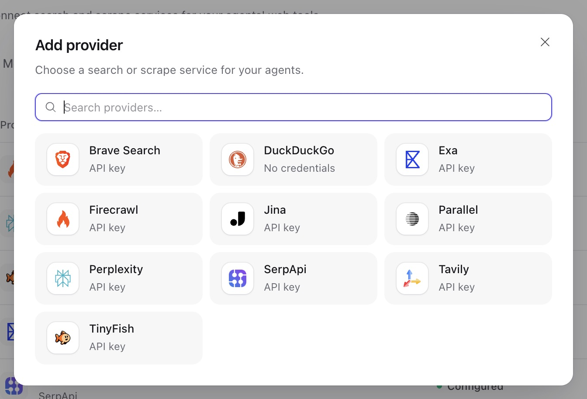
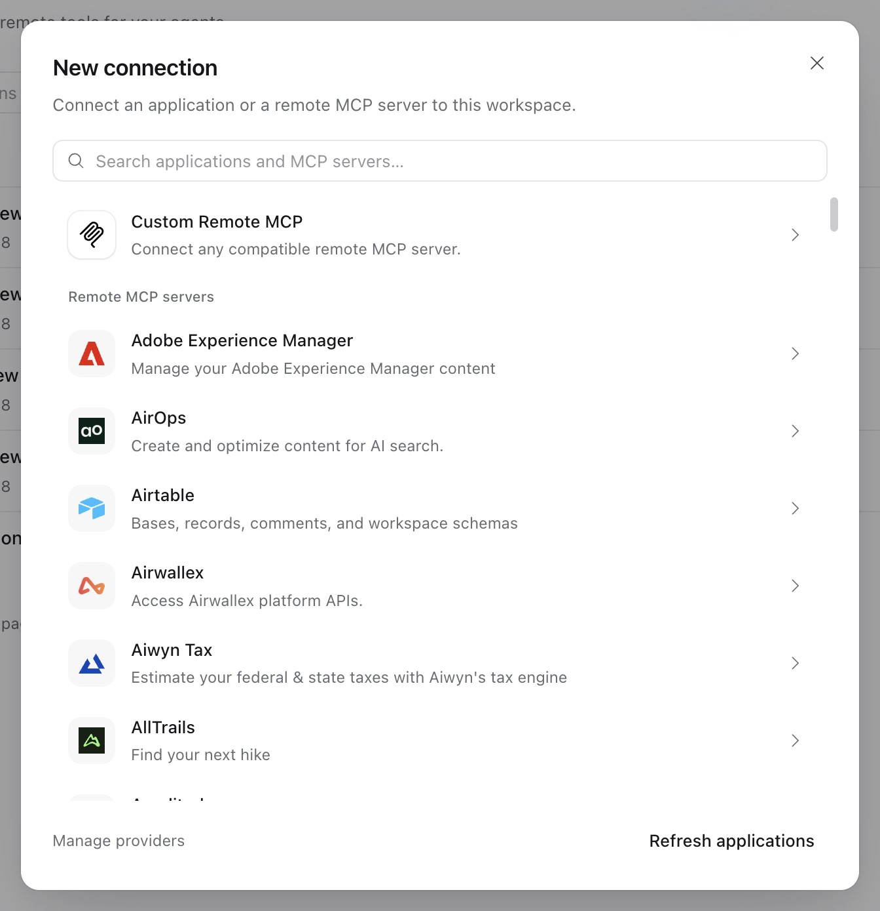

An agent's tools come from four places, all selected in its [revision](agents-and-runs.md#agent-configuration):

- **Built-in toolsets**, which the Service runs itself: files, terminal, web, memory, asset publication, agent configuration, trace queries and findings.
- **Connections**: remote MCP servers and app accounts of a connector provider such as Composio.
- **Client tools**, which your application executes and answers through [resume](agents-and-runs.md#waits-approvals-and-questions).
- **Skills**, which add instructions and files; see [Skills](skills.md).

Every tool has a [permission](agents-and-runs.md#tool-permissions) in the revision: allow, ask for approval, have a reviewer model decide, or deny.

## Built-in toolsets

`GET /api/v1/toolsets` returns the catalog with each tool's key, the name the model sees, its default state and permission, and its configuration schema.

| Toolset            | Tools (model names)                                                                                                                           | Default                                           |
| ------------------ | --------------------------------------------------------------------------------------------------------------------------------------------- | ------------------------------------------------- |
| `files`            | `view`, `write`, `edit`, `multi_edit`, `mkdir`, `move`, `copy`, `delete`, `ls`, `glob`, `grep`                                                | Enabled                                           |
| `shell` (Terminal) | `shell_exec`, `shell_info`, `shell_wait`, `shell_input`, `shell_signal`                                                                       | Enabled                                           |
| `web`              | `search`, `scrape`, `fetch`, `download`                                                                                                       | Each tool disabled                                |
| `memory`           | `memory_file_view`, `_grep`, `_create`, `_edit`, `_append`, `_move`, `_delete`; `memory_record_search`, `_list`, `_add`, `_update`, `_delete` | Enabled                                           |
| `assets`           | `publish_asset`                                                                                                                               | Disabled                                          |
| `configuration`    | `find_resources`, `read_resource`, `describe_agent_config`, `create_agent`, `create_agent_revision`                                           | Disabled; see [Agent Composer](agent-composer.md) |
| `traces`           | `list_traces`, `read_trace`, `read_trace_spans`                                                                                               | Disabled                                          |
| `findings`         | `read_finding`, `submit_finding`                                                                                                              | Disabled                                          |

Configuration, trace queries and finding submission appear under **Advanced / Platform Features**. Group switches preserve individual platform-tool choices. See [Find and improve execution issues](agents-and-runs.md#find-and-improve-execution-issues).

The files and terminal tools act on the run's mounted [environments](environments.md) and are offered to the model only when the run has one. The memory tools act on the run's mounted [memories](memory.md): file tools on file memories and record tools on record memories, and a `read` mount offers only viewing, listing and searching. `publish_asset` turns a file from an environment into a workspace [asset](files-and-webhooks.md#assets).

## Web search and scrape

`search` and `scrape` call a [web provider](resources.md#providers): add one under **Workspace settings → Providers → Web**, then select it in each tool's configuration. `fetch` and `download` use the Service's own HTTP client and need no provider. All four pass the deployment's [outbound policy](configuration.md#outbound-requests).

| Provider type                                                | Operations     | Credential |
| ------------------------------------------------------------ | -------------- | ---------- |
| `duckduckgo`                                                 | search         | none       |
| `brave`, `perplexity`, `serpapi`                             | search         | `api_key`  |
| `exa`, `parallel`, `tavily`, `firecrawl`, `jina`, `tinyfish` | search, scrape | `api_key`  |



Enable each web tool explicitly; enabling the toolset alone enables none of them. Tool configuration:

```json
{
  "web": {
    "enabled": true,
    "tools": {
      "search": {"enabled": true, "config": {"provider_id": "wprov_...", "max_results": 5}},
      "fetch": {"enabled": true, "config": {"deny_domains": ["internal.example.com"]}}
    }
  }
}
```

- `search` takes `provider_id` and `max_results` (1–10). `scrape` takes `provider_id` and `max_content_bytes` (up to 4 MiB). `fetch` returns up to 256 KiB.
- Every web tool takes `allow_domains` and `deny_domains`; a bare host includes its subdomains, and an empty list means unrestricted. None of the built-in provider types supports a domain-restricted scrape, so `scrape` refuses domain lists.
- The provider's type must serve the operation. The check happens when the revision is saved.

## Connections

A connection is a source of tools with one credential. Connections belong to a workspace; any member with `run` can use them in runs, and changing them needs `write`. In Console, open **Connections → New connection**.

| Kind                                | `type`                                            | `auth`                                 |
| ----------------------------------- | ------------------------------------------------- | -------------------------------------- |
| Remote MCP server (Streamable HTTP) | `mcp`                                             | `none`, `bearer`, `headers` or `oauth` |
| Connector app account               | The connector provider's type, such as `composio` | `account`                              |

A connection's `status` is `pending` until it has a usable credential, `ready`, or `reauthorization_required` after a lost token refresh. `failure` describes the last failed authorization operation. Credentials are write-only: views show `credential_configured` and `client_secret_configured`. `POST …/authorize` starts authorization: a browser flow, or a direct token request for an OAuth machine credential. An MCP connection whose `auth` is not `oauth` has no authorization and answers `409 conflict` with reason `no_browser_authorization`.

Connections have no delete operation. `PATCH {"enabled": false}` stops all use at once, including tool calls of runs in progress; `{"enabled": true}` restores it. `POST …/revoke` clears the credential at once and, as a best effort, asks the provider to revoke it remotely, reporting the outcome in `remote_revocation` (`revoked`, `failed`, or `skipped` when there was nothing to revoke remotely). `PATCH` and `revoke` take the connection's `If-Match`; re-read it before changing it, because authorizations and token refreshes change its version. Revoke also works on a connection that is already disabled, or whose workspace is archived: dropping a credential is offboarding, not a change.

### Remote MCP servers

In Console, open **Connections → New connection** to search and browse the remote MCP server directory. Choose a listed server, or select **Custom Remote MCP** to enter your own endpoint. Connections support OAuth, bearer tokens, static headers, or no authentication, depending on the server.



```sh
curl -X POST "$A13N_URL/api/v1/connections" \
  -H "Authorization: Bearer $A13N_API_KEY" -H "Content-Type: application/json" \
  -d '{"type": "mcp", "name": "Docs search", "auth": "bearer",
       "config": {"url": "https://mcp.example.com/mcp", "tools": ["search_docs", "read_doc"]},
       "credential": {"token": "..."}}'
```

- `config.url` must pass the [outbound policy](configuration.md#outbound-requests). Credentials never go in the URL: a query parameter named like a credential (`api_key`, `token`, ...) is refused; use `headers` authentication instead.
- `config.tools` optionally restricts the connection to named tools. Without it, the connection exposes every tool the server lists, and a run fails with `connection_tools_exceeded` if the server lists more than 128.
- `bearer` takes `{"token": "..."}`, sent as `Authorization: Bearer`. `headers` lists header names in `config.headers` and takes their values as `{"headers": {"x-api-key": "..."}}`. Transport and protocol headers (`host`, `content-type`, `cookie`, `mcp-*`, `sec-*`, `proxy-*`, ...) cannot be set.
- Changing the URL, authentication or OAuth client drops the stored credential. Changing only `config.tools` keeps it.

MCP clients live for one attempt; tool catalogs can refresh during that attempt. Each call checks the connection's current availability and the run's permissions. Service does not support MCP elicitation (a server asking the user for input); use client tools or agent questions for durable waits.

### OAuth

With `auth: "oauth"`, the connection obtains its token from the MCP server's authorization server. The connection holds **one** credential that serves every run in the workspace, whoever authorized it.

- **Browser authorization** (`grant_type: "authorization_code"`, the default). Choose **Authorize connection** in Console, or call `POST …/connections/{connection_id}/authorize` with `{"return_url": ...}` using a login session. Open the returned `redirect_url` in the same browser before `expires_at`. Service completes authorization at its callback and redirects to `return_url`. API keys cannot start this flow (`403 forbidden`); a different browser fails with `browser_mismatch`, and an expired callback fails with `authorization_expired`. Starting a new flow keeps the working credential until the new flow completes.
- **Client registration.** Without `config.oauth.client_id`, each authorization registers a public client dynamically. For a client registered in advance, set `client_id` and `token_endpoint_auth_method` (`none`, `client_secret_basic` or `client_secret_post`) and supply the write-only `client_secret`. Register the Service's redirect URI with the provider: `GET /api/v1/connections/redirect-uri` returns it (`{public_url}/api/v1/connections/callback`), and Console shows it in the connection form.
- **Machine credential** (`grant_type: "client_credentials"`, with a client secret). `authorize` obtains the token directly, without a browser, and returns `redirect_url: null`. Like a bearer token, it acts for every run of the workspace. This is the only authorization an API key may start.
- `config.oauth.scopes` requests specific scopes; empty requests the scopes the server advertises.
- Tokens refresh on use when the server issued a refresh token, through the connection's single refresh operation; concurrent callers wait for its result, and a cancelled caller never loses a rotated credential. The credential is cleared (`reauthorization_required`) only when the server refuses it as `invalid_grant`, or the request's outcome is unknown because it may have already reached the server. A request the Service never sent keeps the credential: the outbound policy refusing it (`token_endpoint_denied` for the token request, `authorization_server_denied` during discovery) or a connection failure before anything went out (`token_endpoint_unreachable`). A new authorization revokes the grant it replaces, as a best effort, unless the replacement came from the same OAuth client, since revoking it could also end the new grant.

`return_url` must be a page on the origin of [`server.public_url`](configuration.md#required-infrastructure), or an exact URL in the deployment's [`providers.return_urls`](configuration.md#outbound-requests); Console sends `{its origin}/connections/callback`. The public callback is rate limited per client address.

### Composio connections

[Composio](https://composio.dev) hosts app integrations and the external accounts' credentials. Configure it once, then connect accounts per app:

1. Add a connector provider of type `composio` with your Composio project API key: **Workspace settings → Providers → Connector**, or `POST /api/v1/connector-providers` with `{"type": "composio", "name": ..., "credential": {"api_key": "..."}}`.
2. Browse apps and their actions: `GET /api/v1/connector-providers/{provider_id}/apps` (`query`, `refresh=true`), `…/apps/{app}` and `…/apps/{app}/actions`.
3. Create a connection with `type: "composio"`, `auth: "account"`, the `connector_provider_id`, and `config` naming the `app`, the pinned `actions` (1–128) and `setup`: `auth_config_id` (an existing Composio auth config, or `create:<SCHEME>` such as `create:OAUTH2`) and the pinned `toolkit_version` (`YYYYMMDD_NN`).
4. Authorize it (a login session, like any [browser authorization](#oauth)): the user completes Composio's hosted account setup in the browser and returns through the Service's callback. The connection then binds that one external account; Composio keeps and refreshes its tokens.

Each connection binds one account and exposes exactly its pinned actions. Tool calls send a stable request ID per tool call; when an action's outcome is unknown, the agent is told to check the external state before calling it again.

### Test and discover tools

- `POST …/connections/{connection_id}/test` discovers tools now and records the outcome in `last_test`; it needs `run`.
- `GET …/connections/{connection_id}/tools` lists tools with their input and output schemas and annotations, cached for `providers.discovery_ttl`. Annotations such as read-only hints are shown as declared and never grant permission.
- Before a connector connection's account is bound, `test` fails and `/tools` returns the connector app's action catalogue instead of live discovery.

A connection exposes at most 128 tools to a model.

### Use a connection in an agent

A revision lists connections in `connection_tools`:

```json
{
  "connection_tools": [
    {"connection_id": "conn_...", "tools": ["search_docs"], "permission": "allow"},
    {"connection_id": "conn_...", "tools": null, "defer_loading": true, "permission": "ask",
     "permissions": {"delete_page": "deny"}}
  ]
}
```

- `tools: null` selects every tool the connection exposes; a list selects up to 128 of them.
- `defer_loading` (MCP only) lets the model find tools through tool search instead of receiving every definition up front.
- `permission` applies to the connection's tools, and `permissions` overrides it per tool.
- A revision can select up to 128 connections. Saving it checks that each connection is enabled and exposes the selected tools.

At execution, each connection must be `ready`. Before every call the Service checks that the connection is still enabled and authorized and that the run may still spend; otherwise the call is not sent. Calls are bounded by `providers.tool_call_seconds` and are never retried automatically.

### Caller headers

A thread can carry non-credential context for its MCP connections, such as a conversation or tenant identifier, in `mcp_headers`: `{connection_id: {header: value}}`. See [threads](agents-and-runs.md#caller-headers). Header names that the connection's own authentication uses are refused.

## MCP server suggestions

`GET /api/v1/mcp-servers?query=...` lists well-known remote MCP servers with their URL, authentication and requirements; Console uses it to prefill new connections. The Service ships a list of suggestions, and operators add or replace entries by key with `providers.mcp_servers`:

```toml
[[providers.mcp_servers]]
key = "handbook"
name = "Team handbook"
description = "Search the internal handbook."
url = "https://mcp.example.com/handbook"
auth = "oauth"
```

A suggestion only prefills the form; the connection is validated like any other.
