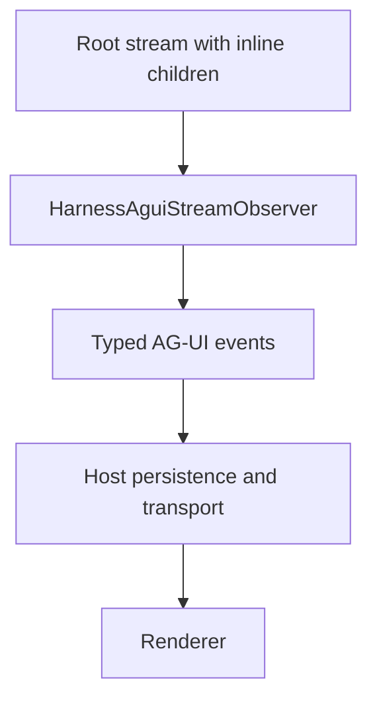

Stream Protocol (`a13n-stream-protocol`) only converts events: it does not run an Agent or provide an SSE server.

## Start here

| Task                                                            | Guide                                                           |
| --------------------------------------------------------------- | --------------------------------------------------------------- |
| Run a complete conversion without credentials                   | [Getting started](getting-started.md)                           |
| Map text, reasoning, tools, custom events, and terminal results | [Events and processors](events.md)                              |
| Rebuild a projection after a consumer restart                   | [Replay and recovery](replay.md)                                |
| Look up public exports, fragment limits, and payload shapes     | [API and payload reference](api-reference.md)                   |
| Continue Agent execution from saved state                       | [Harness State and Resume](../a13n-harness/state-and-resume.md) |



## One observer, one Run

`HarnessAguiObserver` binds to one Run. `HarnessAguiStreamObserver` instead binds to a root stream and tracks its inline children independently, attributing their output with `subagentRunId`. Host-managed asynchronous executions still use independent observers.

`observe()` returns only events produced by the current item. `snapshot()` returns detached accumulated events; it is an in-memory convenience, not a durable log. `resume()` reconstructs observer state from exact Harness source history without publishing history again.

## Install

```console
uv add a13n-stream-protocol
```

Published Stream Protocol pins the matching Harness release. The source [quickstart](getting-started.md) uses the repository's locked workspace to match this documentation on `main`.

## Ownership Summary

| Concern                                                           | Owner                 |
| ----------------------------------------------------------------- | --------------------- |
| Harness execution, source lifecycle, result, and `HarnessState`   | Harness               |
| Harness-to-AG-UI conversion and process-local reconstruction      | Agent Stream Protocol |
| Visibility policy expressed by a replay-stable processor          | Host processor        |
| Source-history retention, cursor, gap detection, and live cutover | Host                  |
| Durable AG-UI IDs, persistence, replay, and fan-out               | Host                  |
| SSE, WebSocket, Redis, or in-process delivery                     | Host transport        |
| Rendered view state                                               | Renderer              |

## Upgrade to AG-UI 1.0

Upgrade Hosts and renderers together. Python uses `ag-ui-protocol>=1,<2`; browser consumers use upstream `@ag-ui/core` types and schemas, not a replacement transport client. Standard wire fields are camelCase. There is no 0.x decoder or alias layer.

- Logical Run start emits `RUN_STARTED` once, after preparation and before public output.
- Cancellation and suspension use `RUN_FINISHED` with cancelled or interrupt outcomes; only failure uses `RUN_ERROR`. Deferred call IDs stay native, and Host answer validation is unchanged.
- Input uses CUSTOM `value.event.role` and `value.event.message_id`, with top-level metadata.
- Tool results may contain ordered upstream content parts; hidden supplemental media is never public. Unsupported media is shown as unavailable rather than reconstructed from bytes or provider handles.
- Namespace inline child display keys by `subagentRunId`. Child replies do not become root answers. Missing historical child display cannot be reconstructed from model history.

This protocol upgrade does not discard Harness continuation state or usage ledgers. Optional saved-display additions do not require resetting those stores.

## Next Steps

- Read the [Agent Harness guide](../a13n-harness/index.md) for building, streaming, and resuming Agents.
- Read the [package README](https://github.com/converge-ai-labs/agent-foundation/tree/main/packages/a13n-stream-protocol) for package and release details.
- Consult the [Agent Stream Protocol specification](https://github.com/converge-ai-labs/agent-foundation/tree/main/spec/a13n-stream-protocol) for the normative observation contract and schema boundary.

## Reference topics

| Topic                                                                         | Guide                                                                    |
| ----------------------------------------------------------------------------- | ------------------------------------------------------------------------ |
| <span id="observe-a-harness-run"></span>Observe a Harness Run                 | [Observe a Harness Run](events.md#observe-a-harness-run)                 |
| <span id="read-the-accumulated-snapshot"></span>Read the Accumulated Snapshot | [Read the Accumulated Snapshot](events.md#read-the-accumulated-snapshot) |
| <span id="apply-a-host-processor"></span>Apply a Host Processor               | [Apply a Host Processor](events.md#apply-a-host-processor)               |
| <span id="resume-from-source-history"></span>Resume from Source History       | [Resume from Source History](replay.md#resume-from-source-history)       |
| <span id="resume-is-not-agent-recovery"></span>Resume Is Not Agent Recovery   | [Resume Is Not Agent Recovery](replay.md#resume-is-not-agent-recovery)   |
| <span id="errors-and-atomicity"></span>Errors and Atomicity                   | [Errors and Atomicity](replay.md#errors-and-atomicity)                   |
