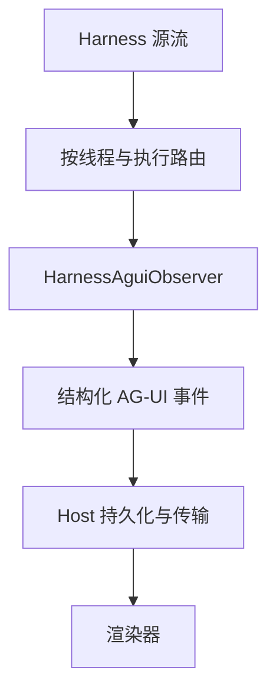

Stream Protocol（`a13n-stream-protocol`）只负责转换事件，不运行 agent，也不提供 SSE 服务器。

## 从这里开始

| 任务                                       | 指南                                                      |
| ------------------------------------------ | --------------------------------------------------------- |
| 无需凭据，运行完整转换示例                 | [快速入门](getting-started.md)                            |
| 映射文本、推理、工具、自定义事件和终结结果 | [事件与处理器](events.md)                                 |
| 消费端重启后重建投影                       | [重放与恢复](replay.md)                                   |
| 查找公开导出、分片限制和载荷格式           | [API 与载荷参考](api-reference.md)                        |
| 从保存状态继续 agent 执行                  | [Harness 状态与恢复](../a13n-harness/state-and-resume.md) |



## 一个 observer 对应一次执行

observer 会绑定到首次成功观测的源关联标识。另一次执行，包括子执行，都需要独立 observer，即使产品在同一对话中显示两次执行。

`observe()` 只返回当前条目产生的事件。`snapshot()` 返回累积事件的独立副本，是便于读取的内存状态，不是持久日志。`resume()` 从精确的 Harness 源历史重建 observer 状态，不会再次发布历史。

## 安装

```console
uv add a13n-stream-protocol
```

发布版 Stream Protocol 固定依赖匹配的 Harness 版本。源码[快速入门](getting-started.md)使用仓库锁定的工作空间，与跟随 `main` 的本文档保持一致。

## 职责归属

| 职责                                            | 负责方                |
| ----------------------------------------------- | --------------------- |
| Harness 执行、源生命周期、结果和 `HarnessState` | Harness               |
| Harness 到 AG-UI 转换及进程内重建               | Agent Stream Protocol |
| 通过重放稳定的处理器表达可见性策略              | Host 处理器           |
| 源历史保留、游标、缺口检测和切换到实时流        | Host                  |
| 持久 AG-UI ID、持久化、重放和扇出               | Host                  |
| SSE、WebSocket、Redis 或进程内交付              | Host 传输层           |
| 渲染后的视图状态                                | 渲染器                |

## 下一步

- 阅读 [Agent Harness 指南](../a13n-harness/index.md)，了解构建、流式输出和恢复 agent。
- 阅读[包 README](https://github.com/converge-ai-labs/agent-foundation/tree/main/packages/a13n-stream-protocol)，了解软件包和发布详情。
- 查阅 [Agent Stream Protocol 规范](https://github.com/converge-ai-labs/agent-foundation/tree/main/spec/a13n-stream-protocol)，了解规范性观测契约和 schema 边界。

## 参考主题

| 主题                                                                            | 指南                                                                       |
| ------------------------------------------------------------------------------- | -------------------------------------------------------------------------- |
| <span id="observe-a-harness-run"></span>观测 Harness 执行                       | [观测 Harness 执行](events.md#observe-a-harness-run)                       |
| <span id="read-the-accumulated-snapshot"></span>读取累积快照                    | [读取累积快照](events.md#read-the-accumulated-snapshot)                    |
| <span id="apply-a-host-processor"></span>应用 Host 处理器                       | [应用 Host 处理器](events.md#apply-a-host-processor)                       |
| <span id="resume-from-source-history"></span>从源历史恢复                       | [从源历史恢复](replay.md#resume-from-source-history)                       |
| <span id="resume-is-not-agent-recovery"></span>observer 恢复与 agent 恢复的区别 | [observer 恢复与 agent 恢复的区别](replay.md#resume-is-not-agent-recovery) |
| <span id="errors-and-atomicity"></span>错误与原子性                             | [错误与原子性](replay.md#errors-and-atomicity)                             |
