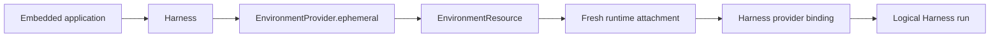

# Environment Providers

`a13n-environment-provider` defines the shared Host-facing contracts for Environment specifications, provider plugins, resource lifecycle, provider state, and fresh runtime attachments.

The two main values are:

- `EnvironmentProvider`: a resolved provider specification with create, resume, pause, destroy, reconciliation, and ephemeral-lifecycle operations;
- `EnvironmentResource`: one identified provider resource with a single-entry process-local scope and fresh attachment acquisition.

Source type communicates ownership when these values are passed to Agent Harness:

- `executable.run(..., environment=provider)` gives the Harness ownership of one temporary Resource;
- `executable.run(..., environment=entered_resource)` borrows the Host-owned Resource for one run attachment.

## High-level Harness flow

Most embedded applications pass a Provider directly:

```python
from pathlib import Path

from a13n_environment_provider import (
    DirectLocalEnvironmentProvider,
    DirectLocalProviderConfiguration,
    DirectLocalRootConfiguration,
)

provider = DirectLocalEnvironmentProvider(
    DirectLocalProviderConfiguration(
        environment_id="workspace",
        root=DirectLocalRootConfiguration(path=Path("./workspace").resolve()),
    )
)

result = await executable.run("Use the workspace", environment=provider)
```

The Harness calls `provider.ephemeral()`, which creates and enters the Resource, acquires a fresh attachment, closes attachment and Resource scopes, and destroys the latest observed resource state before terminal result delivery.



This path is appropriate only for resources that should be temporary. A suspended run also closes and destroys a Provider-owned Resource.

## Host-owned reusable Resource

A Host explicitly manages a Resource when it must survive across runs, restarts, or scheduling decisions:

```python
from a13n_environment_provider import (
    EnvironmentManagementAction,
    EnvironmentOperationContext,
)

correlation = "resource-session-workspace"
resource = await provider.create(
    operation=EnvironmentOperationContext(
        operation_id="operation-create-session-workspace",
        action=EnvironmentManagementAction.CREATE,
        resource_correlation=correlation,
        attempt=1,
    )
)

try:
    async with resource:
        first = await executable.run("Start", environment=resource)
        second = await executable.run(
            "Continue",
            environment=resource,
            previous_state=first.state,
        )
finally:
    await provider.destroy(
        resource.state,
        operation=EnvironmentOperationContext(
            operation_id="operation-destroy-session-workspace",
            action=EnvironmentManagementAction.DESTROY,
            resource_correlation=correlation,
            attempt=1,
        ),
    )
```

The Resource must already be entered. The Harness acquires and releases one fresh attachment per run but does not exit, pause, or destroy a borrowed Resource. Exiting the Resource scope closes process-local clients and attachment admission only; provider `pause()` and `destroy()` remain explicit lifecycle operations.

A later Harness run always receives a fresh attachment. Harness continuation restores `HarnessState`; provider `resume()` is a separate Host operation based on persisted `EnvironmentProviderResourceState`.

## Lifecycle ownership

Cleanup has three distinct layers:

| Layer                          | Owner and trigger                                         | Effect                                                                              |
| ------------------------------ | --------------------------------------------------------- | ----------------------------------------------------------------------------------- |
| Harness binding                | Harness run close or topology replacement                 | Stops binding-local sessions, handles, retained output, and adapters                |
| Resource and attachment scopes | Harness for Provider input; Host around borrowed Resource | Closes process-local clients, admission, and attachment material                    |
| Provider resource              | Harness through `ephemeral()` or explicit Host policy     | Creates, resumes, pauses, destroys, and reconciles the external or logical resource |

`EnvironmentProvider.ephemeral()` is the canonical temporary-resource helper. Its normal order is:

1. create the Resource;
2. enter the Resource scope;
3. yield it for fresh attachment acquisition;
4. exit the Resource scope;
5. destroy the latest Resource state.

If create reports an unknown outcome, it reconciles the exact create operation. `ABSENT` permits one retry with the same operation ID and `attempt + 1`; `RUNNING` resumes the exact observed resource. If destroy reports an unknown outcome, `ABSENT` completes successfully and `RUNNING` or `PAUSED` permits one same-operation retry. Reconciliation must return the exact operation ID.

Cleanup still runs after body or Resource-entry failure. A body failure and destruction failure are both retained. Cancellation remains the primary exception, with cleanup failure attached as diagnostic context.

## Provider specifications and catalogs

A persisted provider specification contains only credential-free desired configuration:

```python
class EnvironmentProviderSpec(BaseModel):
    provider_key: str
    schema_version: str
    parameters: Mapping[str, JsonValue]
```

The selected factory owns the exact configuration model for each supported schema version. Provider availability and schema validity do not authorize use; the Host applies current policy and supplies current credentials through a process-local runtime collaborator.

```python
catalog = build_environment_provider_factory_catalog(
    builtin_keys=("a13n.direct-local",),
    extension_keys=selected_provider_keys,
)
provider = catalog.create_provider(
    provider_spec,
    runtime=provider_runtime,
)
```

Metadata discovery imports nothing. The caller explicitly selects extension keys when building an immutable catalog. A plugin key cannot shadow a built-in key. Unknown keys and schema versions fail exactly; there is no latest-version inference, fallback provider, or placeholder built-in.

Provider state, attachments, live clients, endpoints, and credentials never belong in `EnvironmentProviderSpec` or `HarnessState`.

## Durable lifecycle and reconciliation

Every effectful operation receives a Host-generated `EnvironmentOperationContext`:

- `operation_id` identifies one logical lifecycle operation;
- `action` names create, resume, pause, or destroy;
- `resource_correlation` links operations for one intended resource;
- `attempt` starts at 1 and only advances for a retry of the same operation.

An allocating provider records operation and resource correlation in provider metadata before create can become ambiguous. `resume()` targets the exact resource from validated state and never silently creates a replacement.

`reconcile()` is bounded and read-only. It inspects one exact prior operation and returns `RUNNING`, `PAUSED`, `ABSENT`, or `UNKNOWN`; it never creates, resumes, pauses, or destroys a resource. A timeout after possible dispatch is an unknown outcome and requires exact-operation reconciliation rather than a new operation ID.

Persist `EnvironmentProviderResourceState` after each successful lifecycle transition. It is sensitive provider state, not Harness continuation state and not a bearer credential. Storage, encryption, scheduling, authorization, and recovery policy remain Host responsibilities.

## Direct Local sharing

`a13n.direct-local` exposes one existing Host directory. The directory has no Agent, Session, Harness, or Provider owner.

- the Host creates, selects, retains, backs up, shares, and removes the directory;
- Direct Local validates it and issues fresh shared attachments;
- several Agents, attachments, and ordinary Host processes can use it concurrently;
- Direct Local creates no lifecycle marker and never removes the directory;
- `destroy()` detaches the logical Provider resource only;
- `read_only` restricts operations through the binding but is not an OS sandbox against an allowed local child process.

Use Docker, E2B, or another EIP provider when workloads require isolation from the embedding OS account.

## Create a provider plugin

A plugin supplies one namespaced provider key and implements:

1. a frozen versioned Pydantic configuration model;
2. an exact process-local `EnvironmentProviderRuntime` subtype;
3. an inert `EnvironmentProviderFactory`;
4. an `EnvironmentProvider` implementing lifecycle and reconciliation methods;
5. a single-entry `EnvironmentResource` that issues fresh attachments;
6. one supported attachment backend: Direct Local or EIP.

```python
class AcmeSandboxFactory(EnvironmentProviderFactory):
    @classmethod
    def provider_key(cls) -> str:
        return "acme.sandbox"

    @classmethod
    def supported_schema_versions(cls) -> frozenset[str]:
        return frozenset({"1"})

    @classmethod
    def configuration_model(cls, schema_version: str) -> type[BaseModel]:
        if schema_version != "1":
            raise EnvironmentProviderError(...)
        return AcmeSandboxConfiguration

    def create_provider(
        self,
        configuration: BaseModel,
        *,
        runtime: EnvironmentProviderRuntime,
    ) -> EnvironmentProvider:
        if not isinstance(configuration, AcmeSandboxConfiguration):
            raise EnvironmentProviderError(...)
        if not isinstance(runtime, AcmeSandboxRuntime):
            raise EnvironmentProviderError(...)
        return AcmeSandboxProvider(configuration, runtime=runtime)
```

Register the factory class through the Provider entry-point group:

```toml
[project.entry-points."a13n_environment_provider.providers"]
"acme.sandbox" = "acme_environment.provider:AcmeSandboxFactory"
```

### Provider requirements

- Keep specification validation, factory construction, and Provider construction inert.
- Validate exact schema versions without fallback or shape inference.
- Accept credentials and client factories only through a typed process-local runtime collaborator.
- Tie every lifecycle effect to the exact operation identity and resource correlation.
- Return state before Resource-scope entry and validate it on resume, pause, destroy, and reconciliation.
- Implement unsupported actions as explicit typed failures.
- Treat reconciliation as bounded read-only observation.
- Issue only fresh supported attachments while the Resource scope is entered.
- Keep Resource scope cleanup separate from provider pause and destruction.

### Attachment requirements

A plugin returns only a supported shared attachment type:

- `DirectLocalEnvironmentAttachment` for the in-process Direct Local backend;
- `EIPEnvironmentAttachment` for an initialized-session source backed by stdio, authenticated HTTP(S), or an already accepted reverse WebSocket.

Attachments are process-local, single-use, and non-serializable. Docker, E2B, and other sandbox providers use vendor SDKs only for outer lifecycle and bootstrap; all Harness file, shell, process, output, and port operations use EIP.

## Errors and diagnostics

Provider failures expose stable category, outcome certainty, recovery guidance, and typed operation context. They also retain a rich developer-facing description, structured provider details, and normal Python exception chaining.

The rich exception is trusted local diagnostics and is not automatically safe for an API response, model context, event, or telemetry. Use `error.safe_projection()` for bounded publication.

## Design references

The normative architecture is in:

- [Environment Provider specifications](https://github.com/converge-ai-labs/agent-foundation/tree/main/spec/agent-environment-provider);
- [Harness Environment integration](https://github.com/converge-ai-labs/agent-foundation/blob/main/spec/agent-harness/08-environment-integration.md);
- [Harness hosting contract](https://github.com/converge-ai-labs/agent-foundation/blob/main/spec/agent-harness/13-hosting-contract.md).
