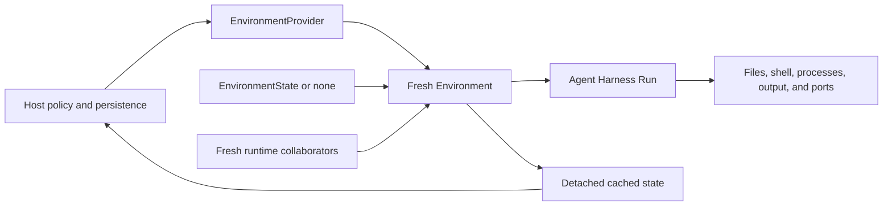

# Environment Providers

`a13n-environment-provider` defines the Provider-owned boundary between a Host-selected target and the provider-neutral operations consumed by Agent Harness.

The public lifecycle has three entities:

- `EnvironmentProvider` is an inert trusted plugin. It validates one exact configuration version and constructs fresh `Environment` adapters.
- `Environment` is a single-use, process-local adapter for one target. It owns target creation or re-entry, readiness, operations, cached state, process-local cleanup, and explicit destruction.
- `EnvironmentState` is a provider-owned portable semantic soft reference. It is supplied before an adapter is constructed and can be persisted after any lifecycle outcome.

Harness receives only already constructed `Environment` or `EnvironmentMount` values. It does not receive Providers, specifications, Resources, attachments, or provider runtime collaborators.

## Lifecycle at a glance



A normal Run follows this sequence:

1. The Host resolves an allowlisted Provider.
2. The Provider validates credential-free desired configuration.
3. The Host loads the latest authoritative `EnvironmentState` and creates fresh runtime collaborators.
4. The Provider constructs one fresh adapter without external I/O.
5. The Host prepares eagerly, or lets the first operation prepare lazily. Harness binds the local scope, uses operations, exports cached state, and closes it.
6. The Host persists the latest state and applies retention policy separately.

`close()` releases process-local clients, sessions, daemons, temporary output, and admission owned by that adapter. It is idempotent and non-destructive. Harness never calls `destroy()`.

When retention policy selects removal, the Host constructs a different fresh adapter from the exact current state and calls `destroy()` explicitly. Successful destruction clears that adapter's cached state. A failed or unknown outcome preserves the last validated state for inspection or retry.

## Resolve and construct an Environment

A persisted `EnvironmentProviderSpec` contains only a provider key, exact configuration schema version, and credential-free JSON configuration:

```python
from a13n_environment_provider import (
    EnvironmentProviderSpec,
    build_environment_provider_catalog,
)

spec = EnvironmentProviderSpec(
    provider_key="a13n.direct-local",
    schema_version="1",
    configuration={
        "root": {"path": "/srv/agent-workspaces/current"},
    },
)

catalog = build_environment_provider_catalog(
    builtin_keys=("a13n.direct-local",),
)
provider = catalog.require(spec.provider_key)
configuration = provider.validate_configuration(
    schema_version=spec.schema_version,
    value=spec.configuration,
)
environment = provider.create_environment(
    configuration=configuration,
    environment_id="workspace",
    state=None,
)
```

Provider construction, `validate_configuration()`, and `create_environment()` are inert. `enter()` also performs no target I/O. `prepare()` creates, resumes or connects the target; `ensure_ready()` triggers it on first use when preparation is lazy.

Pass the fresh adapter to Harness:

```python
result = await executable.run(
    "Inspect the workspace",
    environment=environment,
)
```

Harness enters and closes the adapter exactly once. Construct another adapter for every independent Run, even when several Runs target the same workspace, container, VM, or remote sandbox.

## Re-enter a stateful target

The Host supplies state before entry:

```python
current_state = await state_store.load(environment_key)
environment = provider.create_environment(
    configuration=configuration,
    environment_id="workspace",
    state=current_state,
    runtime=fresh_runtime,
)

try:
    result = await executable.run(
        "Continue the task",
        environment=environment,
        previous_state=previous_harness_state,
    )
finally:
    await state_store.publish(environment_key, environment.dump_state())
```

`dump_state()` is synchronous and performs no target I/O. It returns a detached deep copy of the latest validated cached state, so caller mutation cannot alter the adapter's cache. Providers update that cache as soon as changed target identity is known, before later readiness work that might fail.

State is a soft reference, not proof that a target still exists. On entry, a Provider validates the state and inspects the exact target. It may create a replacement only after authoritative absence and according to that Provider's contract. It never treats an incompatible target, ambiguous discovery, unavailable control plane, or unknown mutation outcome as absence.

`EnvironmentState` contains no bearer credential, live client, task, process-local handle, Harness mount policy, or destruction authority. Storage, authorization, retention, scheduling, and selection of the authoritative version remain Host responsibilities.

## Explicit destruction

Destroy requires a fresh, not-yet-entered adapter:

```python
cleanup = provider.create_environment(
    configuration=configuration,
    environment_id="workspace",
    state=current_state,
    runtime=fresh_runtime,
)
try:
    await cleanup.destroy()
finally:
    await state_store.publish(environment_key, cleanup.dump_state())
    await cleanup.close()
```

The Provider removes only the exact backing target and provider-owned bootstrap material represented by validated state. Shared Host directories, Docker bind sources, and external named volumes remain externally owned.

Do not use context exit, Harness completion, suspension, or cancellation as an implicit destruction signal. Those paths close process-local resources only.

## Provider catalog and plugins

`EnvironmentProviderCatalog` is an immutable explicit allowlist. Built-ins and installed extension entry points are selected by exact key, while trusted embedded code can supply Provider objects directly:

```python
from a13n_environment_provider import (
    build_environment_provider_catalog,
    discover_environment_provider_references,
)

available = discover_environment_provider_references()
catalog = build_environment_provider_catalog(
    builtin_keys=("a13n.direct-local", "a13n.docker"),
    extension_keys=("acme.sandbox",),
    explicit_providers=(development_provider,),
)
provider = catalog.require("acme.sandbox")
```

Discovery returns sorted entry-point metadata without importing target modules. Catalog construction imports only `extension_keys`; an empty or explicit-only build does not scan installed metadata. It rejects malformed, missing, duplicate, and colliding keys before loading selected extension targets. `catalog.registrations` records the concrete class and built-in or distribution provenance in built-in, extension, then explicit order.

Package presence is availability, not authorization. No catalog accepts arbitrary serialized import targets, performs ambient activation, mutates a process-global registry, or reloads changed modules. Use a fresh Host process to load changed Provider code.

Register one concrete no-argument Provider class through the entry-point group:

```toml
[project.entry-points."a13n_environment_provider.providers"]
"acme.sandbox" = "acme_agent_environment:AcmeSandboxProvider"
```

A Provider implementation should:

1. expose one stable namespaced `key` and exact `configuration_versions`;
2. validate configuration into a frozen package-owned Pydantic model;
3. accept credentials, SDK clients, transport factories, and bootstrap stores only through a fresh process-local runtime collaborator;
4. return one fresh inert `Environment` from `create_environment()` and describe its configured capabilities without target I/O;
5. validate supplied state before mutation and update cached state at every target-identity transition;
6. expose provider-neutral `EnvironmentOperations` after entry;
7. keep `close()` non-destructive and implement target removal only in explicit `destroy()`.

The entry-point name and constructed `provider.key` must match. Preconstructed Provider objects are supported only through `explicit_providers`, which is intended for embedded applications, tests, and source development.

The runnable [Provider plugin example](https://github.com/converge-ai-labs/agent-foundation/tree/main/examples/plugins) demonstrates both installed entry-point and explicit-object composition with the same immutable catalog, validation, construction, and Harness path.

For complete Host-side built-in lifecycles, including Docker state re-entry and explicit destruction, follow the [Built-in Provider Examples](examples.md).

## Built-in Providers

| Provider key        | Target and state                                                                | Cleanup boundary                                                                                        |
| ------------------- | ------------------------------------------------------------------------------- | ------------------------------------------------------------------------------------------------------- |
| `a13n.direct-local` | Existing Host directory; stateless                                              | Closes process-local process/output helpers; never removes the directory                                |
| `a13n.local-envd`   | Fresh private `agent-envd` generation over a Host-selected workspace; stateless | Stops the daemon and removes its private runtime; never removes the workspace                           |
| `a13n.docker`       | Exact local Docker container identified by `EnvironmentState`                   | Closes EIP sessions on `close()`; explicit `destroy()` removes the container and its bootstrap material |
| `a13n.e2b`          | Exact native E2B sandbox identified by `EnvironmentState`                       | Closes owned command/output resources; explicit `destroy()` kills the sandbox                           |

Direct Local is appropriate only when sharing the embedding Host account is acceptable. Its operation policy constrains calls through the adapter but is not an operating-system sandbox against an allowed child process.

Local Envd and Docker expose provider-neutral operations through EIP. The Provider owns daemon or container lifecycle and bootstrap; Harness file, shell, process, retained-output, and port operations do not use Docker exec, copy, archive, or logs.

## Local Envd runtime

The Host selects one compatible `agent-envd` executable and private-runtime allocator:

```python
from a13n_environment_provider import (
    LocalEnvdProviderRuntime,
    TemporaryLocalEnvdRuntimeAllocator,
    resolve_agent_envd_executable,
)

runtime = LocalEnvdProviderRuntime(
    executable=resolve_agent_envd_executable(),
    allocate_private_runtime=TemporaryLocalEnvdRuntimeAllocator(),
)
```

`resolve_agent_envd_executable()` checks an explicit argument, then `A13N_AGENT_ENVD_EXECUTABLE`, then `agent-envd` or `agent-envd.exe` on `PATH`. The library does not load `.env`, install a native binary, or silently fall back to Direct Local. Entry validates exact daemon/client compatibility and the required native-isolation probe.

Run the real provider path with `make local-envd-test`, or follow the [Local Envd example](examples.md#local-envd).

## Docker runtime

Docker requires an async engine adapter and a durable bootstrap store:

```python
from pathlib import Path

from a13n_environment_provider import (
    DirectoryDockerBootstrapStore,
    DockerProviderRuntime,
    DockerSDKEngine,
)

runtime = DockerProviderRuntime(
    engine=DockerSDKEngine.from_env(),
    bootstrap_store=DirectoryDockerBootstrapStore(
        Path("/var/lib/my-host/docker-bootstrap")
    ),
)
```

The built-in directory store keeps its POSIX Host root private with mode `0700`. Files inside an allocation remain readable by the fixed non-root container user through the bind mount; unrelated Host users cannot traverse the private parent. A Host needing different ownership, persistence, or sharing supplies another `DockerBootstrapStore`.

Docker publishes EIP only on a Docker-assigned `127.0.0.1` Host port. It can use existing Host bind directories and external named volumes, but it never creates or deletes those sources. Registry authentication, credential helpers, mirrors, and proxies remain Docker client configuration.

Run the real image and Harness lifecycle check with `make docker-provider-test`, or follow the [Docker state lifecycle example](examples.md#docker).

## Environment operations and tools

The Provider package owns typed files, shell, process, retained-output, and port operation contracts. An entered adapter advertises only the operation families and exact actions it can enforce.

Agent Harness applies mount names, access ceilings, routing, operation timeouts, state aggregation, and optional model-facing tools. Adding an Environment does not automatically expose tools to the model. See [Use Environments from Agent Harness](../agent-harness/environments.md) for Run inputs and `DynamicEnvironmentCapability` configuration.

## E2B runtime

E2B uses its native asynchronous SDK and command-local Python wrappers. The default `base` template works without installing `agent-envd`, uploading an executable, or building a custom template. Custom templates need Linux, Python 3.11+ with pidfd support, Bash and the configured account/root; Git-ignore queries also need Git.

```python
import os
from pydantic import SecretStr
from a13n_environment_provider import E2BEnvironment, E2BProviderConfiguration, E2BProviderRuntime

configuration = E2BProviderConfiguration(template="base", timeout_seconds=300)
runtime = E2BProviderRuntime(api_key=SecretStr(os.environ["E2B_API_KEY"]))
environment = E2BEnvironment(
    configuration, environment_id="environment-example", state=None, runtime=runtime,
)
```

Pass this Environment to Harness as usual. Persist `environment.dump_state()` on the Host and give it to a fresh adapter for re-entry. `close()` preserves the sandbox and user files; it terminates this adapter's commands and releases their output. Use fresh adapters for `stop()` (pause), `prepare()` (resume) and `destroy()` (kill). Keepalive reports actual expiry and never resumes a paused sandbox. The library never reads `.env`; Foundation Service receives the domain through Provider Backend configuration and `api_key` through its credential reference.

Output retains raw bytes with finite per-stream limits, offset/cursor reads and explicit release. Retained records consume the same capacity pool as running commands until released or closed. Stdin limits remain enforced after process rebind. Command deadlines and sandbox TTL remain effective when the Host disconnects.

The isolation boundary is the E2B sandbox. File root mapping does not confine allowed shell commands. Process groups cannot prove that all descendants were removed, so terminal status reports `cleanup="residual_confined"`. Per-command CPU, memory and process-count limits are unsupported. Per-command network denial requires sandbox-wide `allow_internet_access=False`; it cannot be added to an internet-enabled sandbox. Port inspection supports loopback TCP only. Append and patch do not provide concurrent compare-and-swap guarantees.

Run the example with `E2B_API_KEY` set in the Host environment:

```bash
cd examples/environment-provider
uv run python -m a13n_environment_provider_example.e2b
```

The example explicitly destroys its sandbox in `finally`. Live integration tests are opt-in and also destroy their targets:

```bash
A13N_TEST_E2B_API_KEY="$E2B_API_KEY" make e2b-provider-test
```
