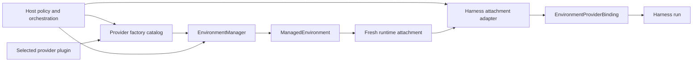

# Environment Providers

`converge-agent-environment-provider` is the shared Host-facing contract for Environment specifications, provider plugins, resource lifecycle Managers, provider state, and fresh runtime attachments.

A Host and the Harness both depend on this package for different reasons:

- the Host loads trusted provider plugins, validates exact specifications, supplies runtime collaborators, chooses lifecycle operations, retains provider state, and acquires attachments;
- `converge-agent-harness` consumes the shared attachment types and converts them into provider-neutral run bindings;
- a provider plugin implements the Provider package contracts and does not import Harness internals.

The Harness never discovers a provider plugin and never calls `create()`, `resume()`, `pause()`, `destroy()`, or `reconcile()`. Those are Host decisions performed through the selected Manager before or after a Harness run.

## Main Flow



A typical Host path is:

```python
factory_catalog = build_environment_provider_factory_catalog(
    builtin_keys=("converge.direct-local",),
    extension_keys=selected_provider_keys,
)

resolved = factory_catalog.resolve_spec(provider_spec)
manager = resolved.factory.create_manager(
    resolved.configuration,
    runtime=provider_runtime,
)

managed = await manager.resume(saved_provider_state, operation=resume_operation)
provider_state = managed.state

async with managed:
    async with managed.acquire_attachment() as attachment:
        provider_binding = create_environment_provider_binding(attachment)
        environment_binding = create_environment_run_binding(
            initial_topology=topology_with(provider_binding)
        )
        controller = environment_binding.controller
        bindings = RunBindings.local(environment=environment_binding)
        result = await executable.run(input_value, bindings=bindings)
```

The Host keeps the attachment-acquisition scope open until the adapted Harness binding has closed. Exiting the Harness binding or `ManagedEnvironment` closes process-local resources only. The Host separately decides whether a reusable provider resource should later remain available, resume, pause, or be destroyed.

## Lifecycle and Cleanup Boundaries

Cleanup has three independent layers:

| Layer                  | Trigger                                                | Effect                                                                                      |
| ---------------------- | ------------------------------------------------------ | ------------------------------------------------------------------------------------------- |
| Harness binding        | Harness run close or topology replacement              | Stops binding-local sessions, processes, retained output, and adapters                      |
| Managed resource scope | Host exits `ManagedEnvironment` or an attachment scope | Closes live provider clients, maintenance, admission, and untransferred attachment material |
| Provider resource      | Host explicitly calls Manager `pause()` or `destroy()` | Performs the selected provider lifecycle action                                             |

A provider plugin implements the complete Manager interface even when one action is unsupported or has no external effect. Harness cleanup never escalates into provider-resource destruction.

## Direct Local Sharing

`converge.direct-local` exposes one existing Host directory. The directory has no Agent, Session, Harness, or Provider owner.

- the Host creates, selects, retains, backs up, shares, and removes the directory;
- Direct Local validates it and issues fresh shared attachments;
- several Agents, attachments, and ordinary Host processes can use it concurrently;
- Direct Local creates no lifecycle marker and never removes the directory;
- `destroy()` detaches the logical Provider resource only;
- `read_only` restricts operations through the binding but is not an OS sandbox against an allowed local child process.

Use Docker, E2B, or another EIP provider when workloads require isolation from the embedding OS account.

## Provider Specifications

A persisted provider specification contains only credential-free desired configuration:

```python
class EnvironmentProviderSpec(BaseModel):
    provider_key: str
    schema_version: str
    parameters: Mapping[str, JsonValue]
```

The selected factory owns the exact configuration model for each supported schema version. Provider availability and schema validity do not authorize use; the Host still applies current policy and supplies current credentials through a process-local runtime collaborator.

Provider state, attachment values, live clients, endpoints, and credentials never belong in `EnvironmentProviderSpec` or `HarnessState`.

## Create a Provider Plugin

A plugin supplies one namespaced provider key and implements the Provider package abstractions:

1. a frozen versioned Pydantic configuration model;
2. an exact process-local `EnvironmentProviderRuntime` subtype;
3. an inert `EnvironmentProviderFactory`;
4. an `EnvironmentManager` implementing lifecycle and reconciliation methods;
5. a single-entry `ManagedEnvironment` that issues fresh attachments;
6. one supported attachment backend: Direct Local or EIP.

```python
class AcmeSandboxFactory(EnvironmentProviderFactory):
    @classmethod
    def provider_key(cls) -> str:
        return "acme.sandbox"

    @classmethod
    def supported_schema_versions(cls) -> frozenset[str]:
        return frozenset({"1"})

    @classmethod
    def configuration_model(cls, schema_version: str) -> type[BaseModel]:
        if schema_version != "1":
            raise EnvironmentProviderError(...)
        return AcmeSandboxConfiguration

    def create_manager(
        self,
        configuration: BaseModel,
        *,
        runtime: EnvironmentProviderRuntime,
    ) -> EnvironmentManager:
        if not isinstance(configuration, AcmeSandboxConfiguration):
            raise EnvironmentProviderError(...)
        if not isinstance(runtime, AcmeSandboxRuntime):
            raise EnvironmentProviderError(...)
        return AcmeSandboxManager(configuration, runtime=runtime)
```

Register the factory class through the Provider entry-point group:

```toml
[project.entry-points."converge_agent_environment_provider.providers"]
"acme.sandbox" = "acme_environment.provider:AcmeSandboxFactory"
```

Metadata discovery imports nothing. The Host explicitly selects extension keys when building an immutable factory catalog; an empty extension selection performs no metadata scan or target import. A plugin key cannot shadow a built-in key.

### Manager Requirements

Every effectful Manager call receives a Host-generated `EnvironmentOperationContext`. An allocating provider such as Docker, E2B, or a remote sandbox records operation and resource correlation in provider metadata before a create result can become ambiguous. `resume()` targets the exact resource from validated state and never silently creates a replacement.

`reconcile()` is bounded and read-only. It inspects one exact prior operation and returns `RUNNING`, `PAUSED`, `ABSENT`, or `UNKNOWN`; it never creates, resumes, pauses, or destroys a resource.

A deterministic `SINGLE_FROM_SPEC` integration that performs no allocation can derive its one target from the resolved specification instead of manufacturing provider metadata.

### Attachment Requirements

A plugin returns only a supported shared attachment type:

- `DirectLocalEnvironmentAttachment` for the in-process Direct Local backend;
- `EIPEnvironmentAttachment` for an initialized-session source backed by stdio, authenticated HTTP(S), or an already accepted reverse WebSocket.

Attachments are process-local, single-use, and non-serializable. Docker, E2B, and other sandbox providers use their SDK only for outer lifecycle and bootstrap; all Harness file, shell, process, output, and port operations use EIP.

## Errors and Developer Diagnostics

Provider failures expose stable category, outcome certainty, recovery guidance, and typed operation context. They also retain a rich developer-facing description, structured provider details, and normal Python exception chaining.

The rich exception is trusted local diagnostics and is not automatically safe for an API response, model context, event, or telemetry. Use `error.safe_projection()` for bounded publication. A timeout after possible lifecycle dispatch is an unknown outcome and requires exact-operation reconciliation; it is not a normal retry-shaped timeout.

## Design References

The normative architecture is in:

- [Environment Provider specifications](https://github.com/converge-ai-labs/agent-foundation/tree/main/spec/agent-environment-provider);
- [Harness Environment integration](https://github.com/converge-ai-labs/agent-foundation/blob/main/spec/agent-harness/08-environment-integration.md);
- [Harness hosting contract](https://github.com/converge-ai-labs/agent-foundation/blob/main/spec/agent-harness/13-hosting-contract.md).
