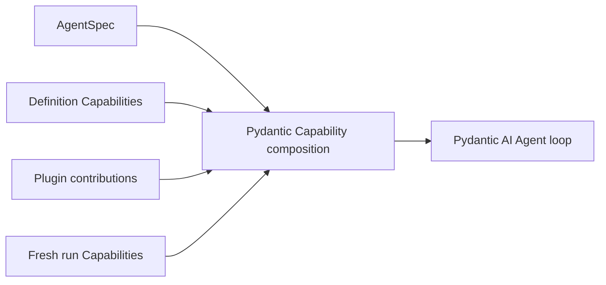

# Capabilities

Pydantic AI Capabilities are the primary feature-composition mechanism inside the Agent loop. Agent Harness provides first-party Capabilities that compose model context, Toolsets, portable state, run collaborators, and lifecycle hooks without introducing another registry or tool dispatcher.

## Composition Sources

Capabilities can enter from four trusted sources:

1. native `AgentSpec.capabilities`;
2. `AgentDefinition.capabilities` or `HarnessBuilder.build(..., capabilities=...)`;
3. a Harness plugin's Agent-bound contribution;
4. fresh `RunBindings.capabilities`.

Use definition composition for stable Agent behavior. Use run composition for current policy, provider clients, selection, and other authority that must be reconstructed for every run.



Capability presence does not itself authorize external work. Tools that cross a managed boundary still evaluate fresh run policy and provider enforcement.

## Select Capabilities with AgentSpec

`AgentSpec.capabilities` is the declarative feature-selection surface. It can select native Pydantic AI Capability types, the closed set of Harness types supported for declarative reconstruction, and exact custom types authorized by the current Host. It does not select Harness middleware plugins, Environment run extensions, Providers, credentials, policies, or live clients.

For example, `ShellReviewCapability` is a Harness-owned declarative type and can be selected directly as shown in [Shell Command Review](#shell-command-review). Most first-party Harness features are composed as concrete definition or run instances because they accept typed collaborators or code-first configuration that does not belong in portable data.

### Authorize a custom declarative type

A trusted Host can make one directly declared dataclass Capability type available to its builder:

```python
from dataclasses import dataclass

from a13n_harness import (
    AgentContext,
    AgentSpec,
    HarnessBuilder,
)
from a13n_harness.capability_types import CapabilityTypeCatalog
from pydantic_ai.agent.spec import CapabilitySpec
from pydantic_ai.capabilities import AbstractCapability


@dataclass
class PolicyInstructionsCapability(AbstractCapability[AgentContext]):
    instructions: str
    id: str | None = "policy-instructions"

    @classmethod
    def get_serialization_name(cls) -> str:
        return "policy_instructions"

    def get_instructions(self) -> str:
        return self.instructions


catalog = CapabilityTypeCatalog.from_types(
    (PolicyInstructionsCapability,),
)
agent_spec = AgentSpec(
    capabilities=[
        CapabilitySpec(
            name="policy_instructions",
            arguments={
                "instructions": "Explain material assumptions before the answer.",
            },
        )
    ]
)
executable = HarnessBuilder(
    capability_type_catalog=catalog,
).build(
    agent_spec,
    output_type=str,
    model=model,
)
```

The two steps have different authority:

1. `CapabilityTypeCatalog` makes an exact serialization name and Python type available to this builder. It performs no package discovery and enables no feature by itself.
2. `AgentSpec.capabilities` selects and configures an instance for this Agent. A name absent from the native, first-party, and Host catalogs fails during construction.

Use `HarnessBuilder.build(..., capabilities=(PolicyInstructionsCapability(...),))` instead when the definition already exists as trusted Python code. Use `RunBindings.capabilities` for fresh policy or provider collaborators that must be reconstructed for each run. A plugin may also contribute a Capability from its trusted `get_capabilities()` implementation after that plugin is explicitly enabled.

Do not confuse `AgentSpec.capabilities`, which selects Agent-loop behavior, with `AgentSpec.model_characteristics.capabilities`, which records explicit image, video, and audio understanding characteristics of the active Model.

The [integration package example](https://github.com/converge-ai-labs/agent-foundation/tree/main/examples/plugins#custom-capability) runs both the Host-authorized `AgentSpec` path and direct code composition against an offline Model.

## Common Definition Capabilities

| Capability                     | Adds                                                                                        | Needs fresh run collaborator                                   |
| ------------------------------ | ------------------------------------------------------------------------------------------- | -------------------------------------------------------------- |
| `RuntimeContextCapability`     | Bounded current time, elapsed time, usage, context-window, and selected metadata projection | No                                                             |
| `WorkspaceOutlineCapability`   | Bounded metadata-only file outline from the current Environment                             | Environment file facet                                         |
| `FileContextCapability`        | Run-frozen `AGENTS.md` and explicit file contents                                           | Environment file facet                                         |
| `DynamicEnvironmentCapability` | File and shell Toolset composition, current mount context, and mount-change notices         | Environment mount; managed calls also need current policy      |
| `ShellReviewCapability`        | Optional model-backed risk review for `environment.shell_exec`                              | Fresh invocation policy still authorizes every managed call    |
| `SkillsCapability`             | Explicit Skill discovery, selection, instructions, and paths                                | Entered Environment and optional `SkillSelectionRunCapability` |
| `WorkingStateCapability`       | Task and note tools plus model-context projection                                           | Optional `TaskStateRunCapability` in provider mode             |
| `Mem0Capability`               | One bounded automatic recall plus optional search, list, and explicit-add tools             | Borrowed `AsyncMemoryClient`, or `MEM0_API_KEY` per run        |
| `UserInteractionCapability`    | Structured user questions through native deferred tools                                     | Host handles suspension and resume                             |
| `MediaCapability`              | Media-reading Toolset                                                                       | `MediaRunCapability`                                           |
| `DocumentsCapability`          | Document-conversion Toolset                                                                 | `DocumentsRunCapability`                                       |
| `WebCapability`                | Search, fetch, and scrape Toolset                                                           | `WebRunCapability` with current client and policy              |
| `HandoffCapability`            | Explicit `summarize` tool and continuation reminder                                         | No                                                             |
| `CompactionCapability`         | Provider-usage-triggered same-Agent plain-text compaction with retained user input replay   | No                                                             |
| `SubagentCapability`           | Inline or asynchronous execution of exact declared children                                 | Definition-selected `SubagentOperator`                         |
| `CodeActCapability`            | Restricted `run_code` and optional `run_program`                                            | Explicit eligible tools and Environment files for programs     |
| `ContextualMCP`                | URL-based MCP with headers resolved once from the current logical run                       | Current `AgentContext` supplied by the Harness                 |

Provider-backed run Capabilities contain live trusted collaborators. They are not definition state and never enter `HarnessState`.

## Context Composition

Harness context features use one model-context coordinator, so each owner contributes a bounded block without directly rewriting another owner's messages.

A practical general-purpose context composition is:

```python
from a13n_harness.capabilities import (
    FileContextCapability,
    RuntimeContextCapability,
    WorkspaceOutlineCapability,
)

capabilities = (
    RuntimeContextCapability(),
    WorkspaceOutlineCapability(),
    FileContextCapability(),
)
```

- Runtime context is refreshed for each request and can expose only explicitly selected metadata keys.
- Workspace outline reads metadata, not file content, and appears only on input requests.
- File context loads selected files once for the logical run and fences the Environment route used to load them.

All three have explicit byte, item, depth, or line bounds. Configure them to match the Environment and target model rather than treating their defaults as universal.

For context lifecycle features, callers supply Harness-managed policy through the `AgentSpec.model_characteristics` construction key. An explicit Harness context window is projected onto the effective native `ModelProfile`. `HandoffCapability()` uses it to resolve its 65% reminder during build. An otherwise unconfigured `CompactionCapability()` resolves its 90% threshold at each request, preferring native `RunContext` context-window and usage values before falling back to Harness characteristics and captured provider usage. Explicit token settings override these values, and the Capabilities remain opt-in.

## Mem0 Long-Term Memory

`mem0ai` is a default Harness dependency, so no package extra is required. The integration remains behaviorally opt-in: add `Mem0Capability` to an Agent definition and either configure `MEM0_API_KEY` (plus optional `MEM0_BASE_URL`) or pass a native `AsyncMemoryClient`. Environment-created clients defer the SDK's eager remote validation to the first bounded recall or memory-tool operation, so optional recall still fails open when authentication or the provider is unavailable.

```python
from a13n_harness.capabilities import Mem0Capability, Mem0Scope

capabilities = (
    Mem0Capability(
        scope=Mem0Scope.USER,
        auto_recall=True,
        toolset=True,
        recall_limit=5,
    ),
)
```

A fixed scope exposes `memory_search`, `memory_list`, and `memory_add` without an entity or scope argument. The Harness resolves `thread` from the current `thread_id`, `agent` from the `agent_id` identity claim, and `user` from the `user_id` claim. With `scope=None`, one automatic recall searches all available scopes and each memory tool accepts only the `thread`, `agent`, or `user` selector; the model never supplies the underlying ID.

The first eligible input in each logical run performs at most one bounded recall. Recalled records enter only as an untrusted input preamble and are removed from exported history. Internal model recovery reuses the same result. `memory_add` stores exactly the supplied bounded text with Mem0 inference disabled; update and delete are not model-visible.

When no client is supplied, the Harness constructs the native async client off the event loop and closes it at logical-run cleanup. A supplied client is borrowed and is never entered or closed by the Harness:

```python
from mem0 import AsyncMemoryClient

mem0_client = AsyncMemoryClient(api_key="...")
capabilities = (Mem0Capability(client=mem0_client, scope=Mem0Scope.USER),)
```

The Host owns the borrowed client's lifecycle. The Harness does not automatically write terminal transcripts to memory because a process-local result does not prove durable checkpoint acceptance. Applications that need extraction should enqueue it only after their own successful durable commit.

## Shell Command Review

Shell review is off unless the Agent definition includes `ShellReviewCapability`. The declarative form is suitable for an `AgentSpec` loaded from JSON or YAML:

```python
from a13n_harness import AgentSpec

agent_spec = AgentSpec(
    capabilities=[
        {
            "name": "ShellReviewCapability",
            "arguments": {
                "model": "gateway@openai-responses:gpt-5.4-mini",
                "risk_threshold": "high",
                "on_flagged": "approval_required",
                "on_error": "approval_required",
                "timeout_seconds": 20,
            },
        }
    ]
)
```

The review applies only to `environment.shell_exec`; process wait, input, and signal calls are not sent to the reviewer. It runs after typed argument validation, resource resolution, and the fresh invocation policy. A policy denial therefore avoids the review model call. Review happens before credentials, grants, or Environment dispatch and can only add an approval or denial; it never grants permission that policy withheld.

The default reviewer receives the command, working directory, yield window, total timeout, Environment alias, and sorted environment variable names. Environment values are never included. Risk order is `low < medium < high < extra_high`; a result at or above `risk_threshold` applies `on_flagged`, while a timeout, invalid result, or reviewer failure applies `on_error`. Both policy and review run again after native approval resume, so a fresh denial still wins. Without an explicit `InvocationPolicyCapability`, managed Environment calls use the Harness default allow decision with no dispatch retries; an explicit policy can only narrow or condition dispatch.

Code-first definitions can supply a custom `ShellCommandReviewer` to `ShellReviewCapability` when review is implemented by a trusted in-process service rather than the default model-backed reviewer.

## Working State

`WorkingStateCapability` can keep tasks and notes inside its portable Capability namespace:

```python
from a13n_harness.capabilities import WorkingStateCapability

capabilities = (WorkingStateCapability(),)
```

This embedded mode is useful for one process-local or state-resumed Agent. Provider mode replaces task storage with a fresh `TaskStateRunCapability`; the provider remains authoritative, while Harness events report bounded committed deltas.

The Notes tools have explicit mutation semantics:

- `note_write(key, value)` creates or updates a note and reports `created` or `updated`;
- `note_delete(key)` is idempotent and reports `deleted` or `already_absent`;
- `note_get(key=None)` reads one complete value or lists sorted keys with a count.

Notes and active Tasks are projected in separate bounded request epilogues, with Notes first and Tasks last. Complete note values appear as `<note>` entries when they fit. A `<note-ref>` means the value is available through `note_get`, while `<notes-omitted>` reports entries outside the projection. Note values are never partially truncated, and empty Notes produce no Notes block. `WorkingStateConfiguration` defaults to at most 256 projected notes and 128 projected tasks within a shared 64 KiB context budget.

Notes preserve structured session facts, Tasks preserve execution state, and `summarize` preserves narrative continuity and the next step. Before a handoff, reconcile stale notes and task statuses; do not copy every note or task into the summary. Automatic compaction likewise replaces history only, after which current Notes and Tasks are projected again.

Working state is not a distributed workflow engine. Cross-worker ownership, durable leases, schedules, and delivery belong to the Host or task provider.

## Structured User Interaction

`UserInteractionCapability` exposes `ask_user_question` only to a root invocation. A root call does not block an open Harness run while waiting for a person. It produces a normal `status="suspended"` result with native deferred requests and portable state. The Host later starts a new run with fresh bindings, the previous state, and a correlated `DeferredToolResume`. A child receives neither this tool nor its guidance and cannot suspend for user interaction.

See [State and Resume](state-and-resume.md).

## Media, Documents, and Web

These features separate stable model-facing schemas from fresh provider implementations:

```python
from a13n_harness import RunBindings
from a13n_harness.capabilities import (
    DocumentsCapability,
    DocumentsRunCapability,
)

executable = HarnessBuilder().build(
    agent_spec,
    output_type=str,
    model=model,
    capabilities=(DocumentsCapability(),),
)

bindings = RunBindings.embedded(
    capabilities=(DocumentsRunCapability(converter=document_converter),),
)
```

The same pattern applies to the general URL-oriented `MediaCapability` and to Web. The definition owns what behavior the Agent may request; the run collaborator owns current provider access. Environment file [multimedia understanding](multimedia-understanding.md) is a separate first-party path: native support comes from the active `AgentSpec.model_characteristics.capabilities` value supplied through the `model_characteristics` construction key, and dedicated image, video, or audio Agents can be configured directly through process environment variables without a Host collaborator. Web additionally evaluates a live `WebPolicy` for each Host request.

### Web search and scrape backends

`WebCapability()` defaults search to `mode="auto"`: it uses provider-native Web search when the effective Model profile supports it and otherwise uses the first usable Host search backend. Native search uses the Model provider's account and billing; it does not use Host search credentials or `WebPolicy`.

Bind multiple Host backends in default fallback order, and keep search and scrape ordering independent:

```python
from a13n_harness.capabilities import (
    WebCapability,
    WebConfiguration,
    WebRunCapability,
    WebScrapeBackendBinding,
    WebScrapeConfiguration,
    WebSearchBackendBinding,
    WebSearchConfiguration,
)

web = WebCapability(
    WebConfiguration(
        search=WebSearchConfiguration(
            mode="auto",
            backend_priority=("brave", "tavily"),
            search_context_size="high",
        ),
        scrape=WebScrapeConfiguration(
            backend_priority=("firecrawl", "local"),
        ),
    )
)

bindings = RunBindings.embedded(
    capabilities=(
        WebRunCapability(
            client=web_client,
            policy=web_policy,
            search_backends=(
                WebSearchBackendBinding("google", google_search),
                WebSearchBackendBinding("brave", brave_search),
                WebSearchBackendBinding("tavily", tavily_search),
            ),
            scrape_backends=(
                WebScrapeBackendBinding("local", local_scraper),
                WebScrapeBackendBinding("firecrawl", firecrawl_scraper),
            ),
        ),
    )
)
```

With no configured preference, tuple order is the default priority. `backend_priority` moves available named backends first and then retains the remaining bound order. Set `backend="tavily"` to require exactly one Host backend with no fallback. A selected backend that is not bound fails before model dispatch. Use `search.mode="host"` to forbid native search, `search.mode="native"` to forbid Host search, and `search.mode="off"` when the Web capability is used only for fetch, scrape, or download. Scrape supports `mode="host"` and `mode="off"` and has its own exact selection or priority.

One search or scrape call shares a single operation deadline across its ordered backends. A provider error, invalid response, or provider exception advances to the next backend. A timeout, cancellation, Harness `RunError`, policy failure, or post-result authorization failure ends the operation without fallback. A valid empty search result is successful and also stops fallback.

The singular `search_provider=` and `scrape_provider=` run bindings remain convenience forms for one backend named `default`; do not combine them with the corresponding backend tuple.

When `WebCapability()` is constructed without an explicit configuration, these environment variables select its defaults:

| Variable                                   | Values                             | Default       |
| ------------------------------------------ | ---------------------------------- | ------------- |
| `A13N_HARNESS_WEB_SEARCH_MODE`             | `off`, `host`, `native`, or `auto` | `auto`        |
| `A13N_HARNESS_WEB_SEARCH_BACKEND`          | One exact bound backend ID         | unset         |
| `A13N_HARNESS_WEB_SEARCH_BACKEND_PRIORITY` | Comma-separated backend IDs        | binding order |
| `A13N_HARNESS_WEB_SEARCH_CONTEXT_SIZE`     | `low`, `medium`, or `high`         | `medium`      |
| `A13N_HARNESS_WEB_SCRAPE_MODE`             | `off` or `host`                    | `host`        |
| `A13N_HARNESS_WEB_SCRAPE_BACKEND`          | One exact bound backend ID         | unset         |
| `A13N_HARNESS_WEB_SCRAPE_BACKEND_PRIORITY` | Comma-separated backend IDs        | binding order |

An exact `*_BACKEND` value ignores the corresponding `*_BACKEND_PRIORITY` and disables fallback. Environment variables select only modes and backend IDs; provider objects and credentials still come from the fresh `WebRunCapability`. Passing `WebCapability(WebConfiguration(...))` is authoritative and does not merge environment defaults, which keeps loaded presets deterministic.

## Run-owned Shell Processes

`DynamicEnvironmentCapability` derives shell behavior from the entered Environment actions. A shell-only Environment exposes completion-only `shell_exec`. A process-capable Environment exposes exactly `shell_exec`, `shell_wait`, `shell_input`, and `shell_signal`; there is no operator configuration, background flag, process listing tool, or separate kill tool.

A process-capable `shell_exec` starts through the current `BoundEnvironment`, waits for `yield_time_seconds`, and returns terminal output directly when the command finishes quickly. Otherwise it returns a concise `process-*` reference owned by the current logical Run. `shell_wait` takes independent stdout and stderr byte offsets and reads non-consumingly. `shell_input` owns stdin writes and EOF, while `shell_signal` owns `interrupt`, `terminate`, and `kill`; mutation tools never read output.

Each published live process has one non-consuming completion watcher while the Run is active. The watcher can enqueue a bounded best-effort instruction to call `shell_wait`, but explicit polling remains authoritative. It does not create a Host event hook, durable completion record, or continuation scheduler.

The Run cleanup boundary kills and releases every owned process before Environment adapters close. Process references and observations do not enter `AgentContextState` or `HarnessState`, and a later continuation Run receives a fresh empty controller with a new reference incarnation. Cross-Run process lifetime, hosted process operators, and post-Run wake are outside this Capability contract.

## Filters

`MessageIntegrityFilterCapability` is mandatory and builder-owned. Two optional filters are public:

```python
from a13n_harness.filters import (
    ColdStartFilterCapability,
    ColdStartFilterConfiguration,
    ContentFilterCapability,
    ContentFilterConfiguration,
)

capabilities = (
    ContentFilterCapability(
        ContentFilterConfiguration(
            accepted_media=frozenset({"image", "document"}),
            max_media_items=16,
        )
    ),
    ColdStartFilterCapability(
        ColdStartFilterConfiguration(idle_seconds=3_600)
    ),
)
```

Use content filtering only for provider/model multimodal compatibility. Use cold-start filtering only when reducing old, already-consumed tool-result strings materially improves a cold-cache request. Neither is transport retry, semantic recovery, or long-term memory.

## MCP

### Native MCP

MCP uses Pydantic AI's native `MCP` Capability. Keep it in `AgentSpec.capabilities`; Agent Harness does not define a second MCP client, protocol, server schema, or peer `mcp_servers` field.

A local URL server can be reconstructed directly from an AgentSpec document:

```python
from a13n_harness import AgentSpec

agent_spec = AgentSpec.from_dict(
    {
        "capabilities": [
            {
                "MCP": {
                    "url": "https://mcp.example.com/mcp",
                    "id": "knowledge",
                    "local": True,
                    "native": False,
                    "allowed_tools": ["search"],
                }
            }
        ]
    }
)
```

The default `a13n-harness` installation includes Pydantic AI's MCP client runtime, so local URL and stdio transports need no separate Harness extra. For richer process-local inputs such as an in-process server, transport, script path, or prebuilt `MCPToolset`, construct `pydantic_ai.capabilities.MCP` in trusted code and pass it through definition Capability composition. Use `native=True, local=False` when the selected model provider should execute a URL MCP server natively.

### Run-scoped headers with `ContextualMCP`

Use `ContextualMCP` when a URL-based MCP server needs headers derived from the current logical Harness run. The definition stores an inert URL recipe. During Pydantic Capability run binding, it resolves headers and constructs a fresh upstream `MCP` before native tools or a local MCP Toolset are extracted.

For common Identity, lineage, run, and metadata values, use the declarative resolver:

```python
from a13n_harness import (
    AgentIdentityRef,
    HarnessBuilder,
    RunBindings,
)
from a13n_harness.mcp import (
    ContextualMCP,
    MCPContextHeaderBinding,
    MCPContextHeaders,
    MCPContextHeadersConfig,
)

mcp = ContextualMCP(
    "https://mcp.example.com/mcp",
    id="knowledge",
    native=True,
    local=None,
    headers={"X-Application": "support"},
    headers_factory=MCPContextHeaders(
        MCPContextHeadersConfig(
            headers={
                "X-Run-ID": MCPContextHeaderBinding("context.run_id"),
                "X-Thread-ID": MCPContextHeaderBinding("context.thread_id"),
                "X-User-ID": MCPContextHeaderBinding("identity.user_id"),
                "X-Request-Context": MCPContextHeaderBinding(
                    "context.metadata.request_context",
                    required=False,
                ),
            }
        )
    ),
)

executable = HarnessBuilder().build(
    agent_spec,
    output_type=str,
    model=model,
    capabilities=(mcp,),
)

bindings = RunBindings.embedded(
    identity=AgentIdentityRef(
        issuer="my-host",
        subject="support-agent",
        user_id="user-123",
        agent_id="agent-support",
    ),
    metadata={
        "request_context": {
            "region": "us-east",
            "labels": ["interactive", "priority"],
        }
    },
)
result = await executable.run("Find the account record", bindings=bindings)
```

`RunBindings.metadata` is the intended place for additional per-run JSON values. Put an exact top-level key there, then select it through `context.metadata.<key>`. Do not attach ad hoc attributes to `AgentContext` or encode a nested reflection path.

The declarative resolver supports these exact source families:

| Source                              | Resolved value                                        |
| ----------------------------------- | ----------------------------------------------------- |
| `identity.issuer`                   | Workload Identity issuer                              |
| `identity.subject`                  | Workload Identity subject                             |
| `identity.<claim>`                  | One exact Identity claim such as `user_id`            |
| `instance.agent_instance_id`        | Current Host-owned Agent instance ID                  |
| `instance.parent_agent_instance_id` | Optional parent Agent instance ID                     |
| `instance.delegation_id`            | Optional delegation correlation                       |
| `instance.actor`                    | Optional actor string                                 |
| `context.run_id`                    | Current logical Harness run ID                        |
| `context.thread_id`                 | Current independently advancing Thread ID             |
| `context.metadata.<top-level-key>`  | One exact value from immutable `RunBindings.metadata` |

A selected string is sent unchanged. JSON numbers, booleans, objects, and arrays use finite, sorted-key, compact JSON. For example, `{"region": "us-east", "labels": ["interactive"]}` becomes `{"labels":["interactive"],"region":"us-east"}`. A missing value or `None` fails a required binding and omits an optional binding.

Header names from `headers=` and the resolved factory result must not overlap case-insensitively. `authorization_token`, `allowed_tools`, `description`, and `defer_loading` retain upstream MCP behavior.

### Custom header factories

Use a custom synchronous or asynchronous factory when the curated selectors are not enough. It receives the complete trusted `AgentContext` for the logical run and returns an exact string-to-string mapping:

```python
from collections.abc import Mapping

from a13n_harness import AgentContext
from a13n_harness.mcp import ContextualMCP


def resolve_mcp_headers(context: AgentContext) -> Mapping[str, str]:
    return {
        "X-Run-ID": context.run_id,
        "X-Agent-Instance-ID": context.instance.agent_instance_id,
        "X-Tenant-ID": context.instance.identity.require_claim("tenant_id"),
    }


mcp = ContextualMCP(
    "https://mcp.example.com/mcp",
    id="tenant-tools",
    headers_factory=resolve_mcp_headers,
    native=True,
    local=None,
)
```

An async factory has the same input and output contract:

```python
async def resolve_mcp_headers(context: AgentContext) -> Mapping[str, str]:
    route = await route_store.resolve(context.instance.identity)
    return {"X-Route": route}
```

The factory runs once per logical Harness run. Internal model-recovery attempts reuse the same active upstream MCP and header snapshot; another logical run resolves a fresh snapshot. The factory is trusted Host code, so it may read current run services deliberately, but model content cannot choose selectors or call it directly.

### Local and provider-native execution

`ContextualMCP` accepts URL-based upstream execution only:

| Selection     | Arguments                  | Behavior                                                    |
| ------------- | -------------------------- | ----------------------------------------------------------- |
| Local default | `native=False, local=None` | Use upstream URL-based local MCP execution                  |
| Automatic     | `native=True, local=None`  | Prefer provider-native MCP with the upstream local fallback |
| Local only    | `native=False, local=True` | Require local URL-based MCP execution                       |
| Native only   | `native=True, local=False` | Require provider-native MCP execution                       |

Prebuilt clients, transports, in-process servers, scripts, and prebuilt Toolsets already own their connection setup. Use native `MCP` directly for those values rather than combining them with `ContextualMCP`.

The URL is explicit trusted configuration. Harness requires an HTTP(S) URL for `ContextualMCP` and otherwise leaves URL, transport, authorization, and provider validation to upstream MCP integrations; it does not guess whether URL components contain credentials.

### Host-authored configuration

A Host can expose the same URL-based path through its own trusted configuration model. Preserve the `ContextualMCP` fields and exact execution selection rather than inventing a second MCP runtime. Persist only credential-free desired configuration; resolve headers, short-lived credentials, and current routing through process-local factories when constructing the Capability.

An Agent can select multiple MCP servers when each has a unique `id`. Use code-first `ContextualMCP` when configuration requires callable factories, current identity, static headers, or an out-of-band secret resolver.

### Result boundary

Locally executed MCP tools are ordinary dynamically discovered function tools. Their text and JSON returns cross the mandatory Harness result boundary and default to explicit truncation rather than spill when oversized. This bounds the value integrated into model history; it does not impose a transport-body or process-memory limit before the MCP client receives the result. Provider-native MCP execution remains on the provider path and does not cross the local function-tool boundary.

## Native Capabilities and Tools

Ordinary Pydantic AI Capabilities remain valid. Place native tools or Toolsets inside a Capability rather than bypassing native composition:

```python
from pydantic_ai.capabilities import Capability


def double(value: int) -> int:
    return value * 2

capabilities = (Capability(id="math", tools=[double]),)
```

Unannotated native tools remain trusted in-process calls. Managed tool metadata activates the additional Harness policy, credential, grant, retry, event, and bounded-output path. Do not infer managed authority from a tool name.

## State and Identity

A stateful Capability owns one stable namespace in `AgentContext.state` and one exact codec version. It can read and write typed Pydantic values through `AgentContextState`; the Harness snapshots namespaces without interpreting feature-specific data.

Capability IDs, tool IDs, binding IDs, and other compact selectors are correlation and composition identities. They do not grant permissions or restore provider authority.
