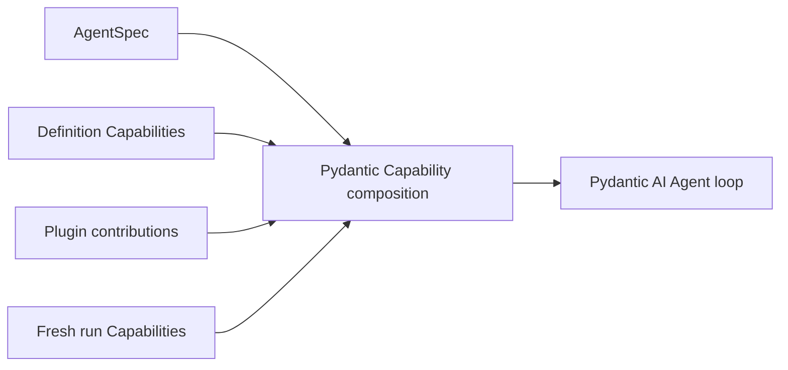

# Capabilities

Pydantic AI Capabilities are the primary feature-composition mechanism inside the Agent loop. Agent Harness provides first-party Capabilities that compose model context, Toolsets, portable state, run collaborators, and lifecycle hooks without introducing another registry or tool dispatcher.

## Composition Sources

Capabilities can enter from four trusted sources:

1. native `AgentSpec.capabilities`;
2. `AgentDefinition.capabilities` or `HarnessBuilder.build(..., capabilities=...)`;
3. a Harness plugin's Agent-bound contribution;
4. fresh `RunBindings.capabilities`.

Use definition composition for stable Agent behavior. Use run composition for current policy, provider clients, selection, and other authority that must be reconstructed for every run.



Capability presence does not itself authorize external work. Tools that cross a managed boundary still evaluate fresh run policy and provider enforcement.

## Common Definition Capabilities

| Capability                     | Adds                                                                                        | Needs fresh run collaborator                                   |
| ------------------------------ | ------------------------------------------------------------------------------------------- | -------------------------------------------------------------- |
| `RuntimeContextCapability`     | Bounded current time, elapsed time, usage, context-window, and selected metadata projection | No                                                             |
| `WorkspaceOutlineCapability`   | Bounded metadata-only file outline from the current Environment                             | Environment file facet                                         |
| `FileContextCapability`        | Run-frozen `AGENTS.md` and explicit file contents                                           | Environment file facet                                         |
| `DynamicEnvironmentCapability` | File and shell Toolset composition, dynamic Environment context, and topology notices       | Environment binding; managed calls also need current policy    |
| `SkillsCapability`             | Explicit Skill discovery, selection, instructions, and paths                                | Entered Environment and optional `SkillSelectionRunCapability` |
| `WorkingStateCapability`       | Task and note tools plus model-context projection                                           | Optional `TaskStateRunCapability` in provider mode             |
| `UserInteractionCapability`    | Structured user questions through native deferred tools                                     | Host handles suspension and resume                             |
| `MonitoredProcessCapability`   | Process-monitoring tools                                                                    | `MonitoredProcessRunCapability`                                |
| `MediaCapability`              | Media-reading Toolset                                                                       | `MediaRunCapability`                                           |
| `DocumentsCapability`          | Document-conversion Toolset                                                                 | `DocumentsRunCapability`                                       |
| `WebCapability`                | Search, fetch, and scrape Toolset                                                           | `WebRunCapability` with current client and policy              |
| `HandoffCapability`            | Explicit `summarize` tool and continuation reminder                                         | No                                                             |
| `CompactionCapability`         | Provider-usage-triggered same-Agent plain-text compaction with retained user input replay   | No                                                             |
| `DelegationCapability`         | Blocking inline child delegation                                                            | Declared subagents and `DelegationRunCapability`               |
| `CodeActCapability`            | Restricted `run_code` and optional `run_program`                                            | Explicit eligible tools and Environment files for programs     |

Provider-backed run Capabilities contain live trusted collaborators. They are not definition state and never enter `HarnessState`.

## Context Composition

Harness context features use one model-context coordinator, so each owner contributes a bounded block without directly rewriting another owner's messages.

A practical general-purpose context composition is:

```python
from a13n_harness import (
    FileContextCapability,
    RuntimeContextCapability,
    WorkspaceOutlineCapability,
)

capabilities = (
    RuntimeContextCapability(),
    WorkspaceOutlineCapability(),
    FileContextCapability(),
)
```

- Runtime context is refreshed for each request and can expose only explicitly selected metadata keys.
- Workspace outline reads metadata, not file content, and appears only on input requests.
- File context loads selected files once for the logical run and fences the Environment route used to load them.

All three have explicit byte, item, depth, or line bounds. Configure them to match the Environment and target model rather than treating their defaults as universal.

For context lifecycle features, Harness `AgentSpec.model_configuration` can resolve model-relative defaults once at build time; callers supply it through the `model_config` construction key. With a known context window, an otherwise unconfigured `HandoffCapability()` warns at 65% and `CompactionCapability()` compacts at 90%. Explicit token settings override these values, and the Capabilities remain opt-in.

## Working State

`WorkingStateCapability` can keep tasks and notes inside its portable Capability namespace:

```python
from a13n_harness import WorkingStateCapability

capabilities = (WorkingStateCapability(),)
```

This embedded mode is useful for one process-local or state-resumed Agent. Provider mode replaces task storage with a fresh `TaskStateRunCapability`; the provider remains authoritative, while Harness events report bounded committed deltas.

Working state is not a distributed workflow engine. Cross-worker ownership, durable leases, schedules, and delivery belong to the Host or task provider.

## Structured User Interaction

`UserInteractionCapability` exposes `ask_user_question`. A call does not block an open Harness run while waiting for a person. It produces a normal `status="suspended"` result with native deferred requests and portable state. The Host later starts a new run with fresh bindings, the previous state, and a correlated `DeferredToolResume`.

See [State and Resume](state-and-resume.md).

## Media, Documents, and Web

These features separate stable model-facing schemas from fresh provider implementations:

```python
from a13n_harness import (
    DocumentsCapability,
    DocumentsRunCapability,
    RunBindings,
)

executable = HarnessBuilder().build(
    agent_spec,
    output_type=str,
    model=model,
    capabilities=(DocumentsCapability(),),
)

bindings = RunBindings.embedded(
    capabilities=(DocumentsRunCapability(converter=document_converter),),
)
```

The same pattern applies to the general URL-oriented `MediaCapability` and to Web. The definition owns what behavior the Agent may request; the run collaborator owns current provider access. Environment file [multimedia understanding](multimedia-understanding.md) is a separate first-party path: native support comes from the active `AgentSpec.model_configuration.capabilities` value supplied through the `model_config` construction key, and dedicated image, video, or audio Agents can be configured directly through process environment variables without a Host collaborator. Web additionally evaluates a live `WebPolicy` for each Host request.

### Web search and scrape backends

`WebCapability()` defaults search to `mode="auto"`: it uses provider-native Web search when the effective Model profile supports it and otherwise uses the first usable Host search backend. Native search uses the Model provider's account and billing; it does not use Host search credentials or `WebPolicy`.

Bind multiple Host backends in default fallback order, and keep search and scrape ordering independent:

```python
from a13n_harness import (
    WebCapability,
    WebConfiguration,
    WebRunCapability,
    WebScrapeBackendBinding,
    WebScrapeConfiguration,
    WebSearchBackendBinding,
    WebSearchConfiguration,
)

web = WebCapability(
    WebConfiguration(
        search=WebSearchConfiguration(
            mode="auto",
            backend_priority=("brave", "tavily"),
            search_context_size="high",
        ),
        scrape=WebScrapeConfiguration(
            backend_priority=("firecrawl", "local"),
        ),
    )
)

bindings = RunBindings.embedded(
    capabilities=(
        WebRunCapability(
            client=web_client,
            policy=web_policy,
            search_backends=(
                WebSearchBackendBinding("google", google_search),
                WebSearchBackendBinding("brave", brave_search),
                WebSearchBackendBinding("tavily", tavily_search),
            ),
            scrape_backends=(
                WebScrapeBackendBinding("local", local_scraper),
                WebScrapeBackendBinding("firecrawl", firecrawl_scraper),
            ),
        ),
    )
)
```

With no configured preference, tuple order is the default priority. `backend_priority` moves available named backends first and then retains the remaining bound order. Set `backend="tavily"` to require exactly one Host backend with no fallback. A selected backend that is not bound fails before model dispatch. Use `search.mode="host"` to forbid native search, `search.mode="native"` to forbid Host search, and `search.mode="off"` when the Web capability is used only for fetch, scrape, or download. Scrape supports `mode="host"` and `mode="off"` and has its own exact selection or priority.

One search or scrape call shares a single operation deadline across its ordered backends. A provider error, invalid response, or provider exception advances to the next backend. A timeout, cancellation, Harness `RunError`, policy failure, or post-result authorization failure ends the operation without fallback. A valid empty search result is successful and also stops fallback.

The singular `search_provider=` and `scrape_provider=` run bindings remain convenience forms for one backend named `default`; do not combine them with the corresponding backend tuple.

When `WebCapability()` is constructed without an explicit configuration, these environment variables select its defaults:

| Variable                                   | Values                             | Default       |
| ------------------------------------------ | ---------------------------------- | ------------- |
| `A13N_HARNESS_WEB_SEARCH_MODE`             | `off`, `host`, `native`, or `auto` | `auto`        |
| `A13N_HARNESS_WEB_SEARCH_BACKEND`          | One exact bound backend ID         | unset         |
| `A13N_HARNESS_WEB_SEARCH_BACKEND_PRIORITY` | Comma-separated backend IDs        | binding order |
| `A13N_HARNESS_WEB_SEARCH_CONTEXT_SIZE`     | `low`, `medium`, or `high`         | `medium`      |
| `A13N_HARNESS_WEB_SCRAPE_MODE`             | `off` or `host`                    | `host`        |
| `A13N_HARNESS_WEB_SCRAPE_BACKEND`          | One exact bound backend ID         | unset         |
| `A13N_HARNESS_WEB_SCRAPE_BACKEND_PRIORITY` | Comma-separated backend IDs        | binding order |

An exact `*_BACKEND` value ignores the corresponding `*_BACKEND_PRIORITY` and disables fallback. Environment variables select only modes and backend IDs; provider objects and credentials still come from the fresh `WebRunCapability`. Passing `WebCapability(WebConfiguration(...))` is authoritative and does not merge environment defaults, which keeps loaded presets deterministic.

## Monitored Processes

Environment process tools and monitoring have separate responsibilities:

- the Environment starts, inspects, signals, waits for, and reads retained output from processes;
- `MonitoredProcessCapability` adds the model-facing monitoring workflow;
- a fresh `MonitoredProcessRunCapability` owns wake-up, accepted completion retention, and delivery behavior for the current run.

The Harness does not turn monitored processes into a durable background scheduler.

## Filters

`MessageIntegrityFilterCapability` is mandatory and builder-owned. Two optional filters are public:

```python
from a13n_harness import (
    ColdStartFilterCapability,
    ColdStartFilterConfiguration,
    ContentFilterCapability,
    ContentFilterConfiguration,
)

capabilities = (
    ContentFilterCapability(
        ContentFilterConfiguration(
            accepted_media=frozenset({"image", "document"}),
            max_media_items=16,
        )
    ),
    ColdStartFilterCapability(
        ColdStartFilterConfiguration(idle_seconds=3_600)
    ),
)
```

Use content filtering only for provider/model multimodal compatibility. Use cold-start filtering only when reducing old, already-consumed tool-result strings materially improves a cold-cache request. Neither is transport retry, semantic recovery, or long-term memory.

## Native MCP

MCP uses Pydantic AI's native `MCP` Capability. Keep it in `AgentSpec.capabilities`; Agent Harness does not define a second MCP server schema or a peer `mcp_servers` field.

A local URL server can be reconstructed directly from an AgentSpec document:

```python
from a13n_harness import AgentSpec

agent_spec = AgentSpec.from_dict(
    {
        "capabilities": [
            {
                "MCP": {
                    "url": "https://mcp.example.com/mcp",
                    "id": "knowledge",
                    "local": True,
                    "native": False,
                    "allowed_tools": ["search"],
                }
            }
        ]
    }
)
```

The default `a13n-harness` installation includes Pydantic AI's MCP client runtime, so local URL and stdio transports need no separate Harness extra. For richer process-local inputs such as an in-process server, transport, script path, or prebuilt `MCPToolset`, construct `pydantic_ai.capabilities.MCP` in trusted code and pass it through definition Capability composition. Use `native=True, local=False` when the selected model provider should execute a URL MCP server natively.

Locally executed MCP tools are ordinary dynamically discovered function tools. Their text and JSON returns cross the mandatory Harness result boundary and default to explicit truncation rather than spill when oversized. This bounds the value integrated into model history; it does not impose a transport-body or process-memory limit before the MCP client receives the result. Provider-native MCP execution remains on the provider path and does not cross the local function-tool boundary.

## Native Capabilities and Tools

Ordinary Pydantic AI Capabilities remain valid. Place native tools or Toolsets inside a Capability rather than bypassing native composition:

```python
from pydantic_ai.capabilities import Capability


def double(value: int) -> int:
    return value * 2

capabilities = (Capability(id="math", tools=[double]),)
```

Unannotated native tools remain trusted in-process calls. Managed tool metadata activates the additional Harness policy, credential, grant, retry, event, and bounded-output path. Do not infer managed authority from a tool name.

## State and Identity

A stateful Capability owns one stable namespace in `AgentContext.state` and one exact codec version. It can read and write typed Pydantic values through `AgentContextState`; the Harness snapshots namespaces without interpreting feature-specific data.

Capability IDs, tool IDs, binding IDs, and other compact selectors are correlation and composition identities. They do not grant permissions or restore provider authority.
