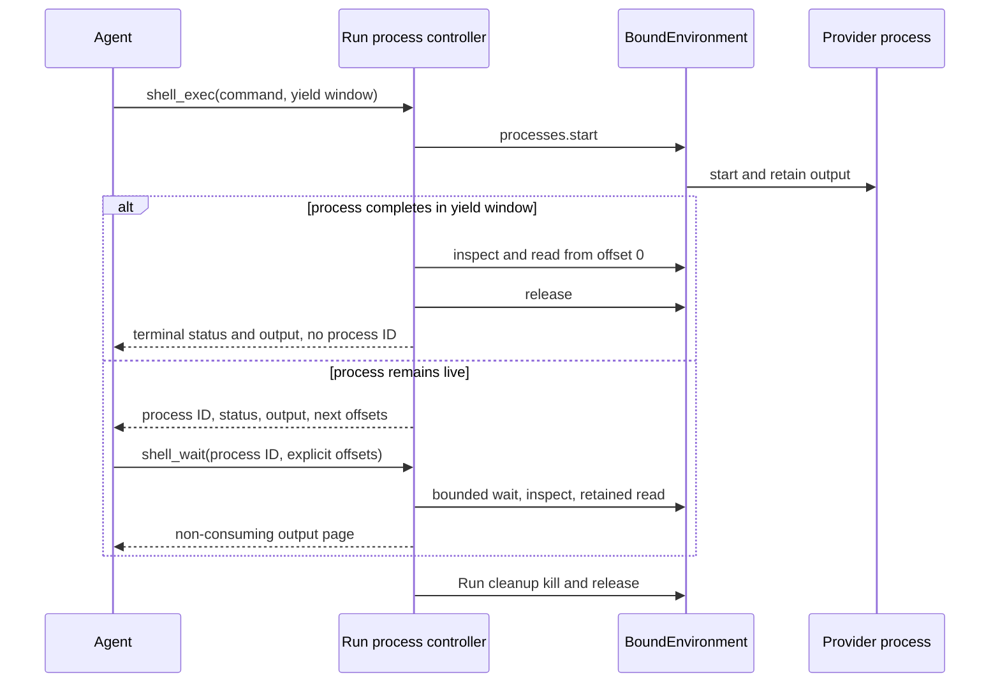

# Environments

An Environment is one fresh process-local adapter for a single provider target. The Environment Provider package owns target creation, re-entry, provider operations, cached state, and explicit destruction. Harness owns only one Run's mount names, access ceilings, routing, state aggregation, and non-destructive cleanup.

Applications pass already constructed `Environment` instances to `run()` or `stream()`. Harness never accepts a Provider, provider key, specification, state envelope, or transport session as a Run input.

Environment lifecycle is separate from model-facing tools:

- a Host selects a trusted Provider, configuration, current `EnvironmentState`, and fresh runtime collaborators;
- the Provider constructs a fresh Environment without external I/O;
- Harness enters the Environment before input production and closes it after the terminal Run fence;
- `DynamicEnvironmentCapability` optionally exposes permitted operations to the model;
- `close()` releases process-local resources and never destroys the backing target;
- only explicit Host policy creates a fresh adapter and calls `destroy()`.

## Start without an Environment

Environment input is optional. A Run with no Environment receives an empty facade and no Environment tools:

```python
result = await executable.run("Answer without using a workspace")
```

## Construct one fresh Environment per Run

Use a trusted Provider before calling Harness. Direct Local is stateless, so each Run passes `state=None`:

```python
from pathlib import Path

from a13n_environment_provider import (
    DirectLocalEnvironmentProvider,
    DirectLocalProviderConfiguration,
    DirectLocalRootConfiguration,
)

provider = DirectLocalEnvironmentProvider()
configuration = provider.validate_configuration(
    schema_version="1",
    value=DirectLocalProviderConfiguration(
        root=DirectLocalRootConfiguration(
            path=Path("./workspace").resolve(),
        ),
    ).model_dump(mode="json"),
)
environment = provider.create_environment(
    configuration=configuration,
    environment_id="workspace",
    state=None,
)

result = await executable.run(
    "Update the workspace",
    environment=environment,
)
```

Provider validation and `create_environment()` are inert. The Host calls `await environment.prepare()` for eager preparation, or leaves preparation to the first readiness check for lazy use. `environment.enter(...)` only binds the local Run scope. Harness closes the adapter on success, failure, cancellation, abandoned stream consumption, or initial multi-mount unwind. That close is non-destructive; Direct Local never deletes the Host directory, and Docker close never removes the container or bootstrap allocation.

Do not retain and reuse the adapter for a later independent Run. Construct a fresh adapter each time, even when several Runs re-enter the same provider target.

## Re-enter stateful targets

For a stateful Provider, the Host supplies its latest authoritative state before Harness receives the adapter. Harness does not restore a Provider after entry and does not treat `HarnessState` as live authority:

```python
current_state = await environment_state_store.load(thread_id, "workspace")
environment = provider.create_environment(
    configuration=configuration,
    environment_id="workspace",
    state=current_state,
    runtime=fresh_runtime,
)

try:
    result = await executable.run(
        "Continue the task",
        environment=environment,
        previous_state=previous_harness_state,
    )
finally:
    await environment_state_store.publish(
        thread_id,
        "workspace",
        environment.dump_state(),
    )
```

`dump_state()` is a synchronous, infallible read of a detached copy of the latest validated cache. It performs no target I/O. The Host can therefore read it in unconditional finalization after partial entry, cancellation, checkpoint failure, execution failure, or close failure.

`HarnessState.environment_states` records the current mount-name-to-state aggregate for continuation export. It is useful evidence, but the Host still decides which managed state is authoritative, reconstructs fresh credentials and runtime collaborators, and supplies a fresh Environment. State contains no credential, live client, PID, transport session, mount policy, or destruction authority.

## Explicit destruction belongs to the Host

Harness never calls `destroy()`. When retention policy selects cleanup, the Host constructs a fresh adapter from the exact current state and calls `destroy()` explicitly:

```python
cleanup = provider.create_environment(
    configuration=configuration,
    environment_id="workspace",
    state=current_state,
    runtime=fresh_runtime,
)
try:
    await cleanup.destroy()
finally:
    latest_state = cleanup.dump_state()
    await cleanup.close()
    await environment_state_store.publish(
        thread_id,
        "workspace",
        latest_state,
    )
```

Successful destruction clears the adapter's state. An incompatible target or unknown external outcome fails and preserves the last validated state for later Host inspection or retry. The Provider removes only the exact target and provider-owned bootstrap material represented by that state; external bind sources and shared Host workspaces remain Host-owned.

## Use several Environments

Pass `environments=` to name several already constructed adapters. `EnvironmentMount` adds one Run-local access ceiling and working directory:

```python
from a13n_harness import EnvironmentAccess, EnvironmentMount

result = await executable.run(
    "Read the source data and write the build output",
    environments={
        "build": build_environment,
        "data": EnvironmentMount(
            data_environment,
            access=EnvironmentAccess.READ_ONLY,
        ),
    },
    default_environment="build",
)
```

The routing rules are deterministic:

| Input                                             | Mount name(s)  | Default route |
| ------------------------------------------------- | -------------- | ------------- |
| `environment=source`                              | `workspace`    | `workspace`   |
| one `environments` entry                          | supplied name  | that entry    |
| several entries with `default_environment="name"` | supplied names | named entry   |
| several entries without `default_environment`     | supplied names | none          |

The default mount serves `/workspace`. Every named mount is addressable at `/environment/{name}`. With several entries and no explicit default, `/workspace/...` fails instead of selecting the first mapping entry. Mapping order never grants authority.

Initial setup is atomic. Harness validates the complete input before entry and publishes no partial mount set. If any adapter fails, Harness closes every supplied adapter that may own process-local resources in reverse order. It never destroys a target during unwind.

## Restrict a mount

`EnvironmentMount` adds a user-facing access level and default working directory to one source:

```python
from a13n_harness import (
    EnvironmentAccess,
    EnvironmentMount,
)

read_only_docs = EnvironmentMount(
    docs_resource,
    access=EnvironmentAccess.READ_ONLY,
    working_directory="/reference",
)
```

Access defaults to `EnvironmentAccess.FULL`. `READ_ONLY` exposes file reads, `READ_WRITE` exposes all file operations, and `FULL` exposes every Agent-facing Environment capability offered by the Provider, including command and process operations when supported. Provider capabilities always narrow the selected level. `FULL` does not grant Host administration, bypass a sandbox, or override operating-system security.

Exact action sets remain an internal advanced runtime and Provider enforcement seam rather than ordinary `EnvironmentMount` configuration. `working_directory` must be `None` or a canonical absolute provider path without `.` or `..` segments.

## Expose tools to the model

The Environment can exist without model-facing tools. Add `DynamicEnvironmentCapability` when the model should receive a selected stable tool surface:

```python
from a13n_harness.environment import (
    DynamicEnvironmentCapability,
    DynamicEnvironmentConfiguration,
)

capabilities = (
    DynamicEnvironmentCapability(DynamicEnvironmentConfiguration()),
)
```

Three decisions remain separate:

1. the Agent definition includes or omits the dynamic Environment Capability;
2. an optional run policy can narrow a managed invocation for the current identity and arguments;
3. the selected Environment mount and Provider enforce the exact operation.

Without an explicit Invocation Policy, managed Environment tools default to allow at the Harness boundary. That default does not create Provider capability, credentials, approval, or mount access. Tool injection improves discovery and cannot replace execution-time checks.

The tool surface follows the union of effective actions across current mounts:

- `read_only` exposes `view`, `ls`, `glob`, and `grep`;
- `read_write` adds `write`, `edit`, `multi_edit`, `mkdir`, `move`, `copy`, and `delete`;
- `full` adds `shell_exec` when a Provider offers shell execution, and adds `shell_wait`, `shell_input`, and `shell_signal` when the complete process action set is available.

When `shell_exec` is present, it supersedes exactly `move`, `copy`, and `delete`; `mkdir` remains available. An empty Environment exposes no Environment tools.

A foreground-only mount exposes `shell_exec` and runs the command to completion. A process-capable mount exposes exactly four tools:

| Tool           | Behavior                                                                                                         |
| -------------- | ---------------------------------------------------------------------------------------------------------------- |
| `shell_exec`   | Starts a command, waits up to `yield_time_seconds`, and returns a Run-owned process reference only if still live |
| `shell_wait`   | Waits boundedly, or polls with zero, then reads retained stdout and stderr from explicit caller offsets          |
| `shell_input`  | Writes UTF-8 stdin and optionally closes stdin without reading output                                            |
| `shell_signal` | Sends `interrupt`, `terminate`, or `kill` without reading output                                                 |

`timeout_seconds` on `shell_exec` is the Provider-enforced total wall-time limit. `yield_time_seconds` bounds only the initial wait. Completion inside that window returns terminal status and bounded output without a process ID. A command that remains live returns a concise reference such as `process-a3f1-1` plus current status and the next stdout and stderr offsets. There is no model-selected background mode, process listing tool, or output-returning kill tool.

Every stdout and stderr page reports the caller's `requested_offset`, the actual retained `start_offset`, the first unread `next_offset`, current retained bounds, produced bytes, producer and content completeness, and any unavailable prefix. Reads are non-consuming: repeating the same offsets is valid and Harness keeps no unread cursor. Retention overflow is explicit, and a returned `next_offset` advances only across bytes present in that bounded page.

The private process controller belongs to one logical Harness Run. It keeps only the opaque bound handle, latest bounded observation, control lock, and completion watcher for each published reference. References are not portable state and cannot be rebound in a later Run. A completion watcher may enqueue one best-effort instruction to call `shell_wait`; it contains no process output and does not replace polling.

Run cleanup closes process admission, cancels Harness watcher tasks, kills every still-live Run-owned process, and releases each handle and retained-output object before Environment adapters close. No process handle, reference, output offset, status mirror, or cleanup fact enters `AgentContextState`, `HarnessState`, or Provider `EnvironmentState`.



`glob` and `grep` send their include pattern, repository-ignore and hidden-name policy, context width, and scan/result ceilings to the selected `FileOperator` in one call. Direct Local performs one worker-thread scan; EIP performs one `file.find` or `file.search` request. Set `include_ignored=True` only when ignored repository paths should be searched.

For supported image, audio, and video files, `view` either attaches native `BinaryContent` or invokes a dedicated understanding Agent. The `model_characteristics` construction value on the active Harness `AgentSpec` is the sole native-input authority; Harness never infers support from a model name or Pydantic AI `Model.profile`. Dedicated defaults read ordinary process environment variables, and a fresh run Capability can override them.

See [Multimedia Understanding](multimedia-understanding.md) for capability declarations, environment configuration, default prompt behavior, run-scoped providers, usage attribution, and ordinary tool-result failures.

## Manage Provider state outside Harness

A production Host normally keeps desired Provider configuration and current `EnvironmentState` in its own authoritative records. For each independent Run it:

1. selects the trusted Provider and validates desired configuration;
2. loads current managed state, where authoritative `None` suppresses stale fallback state;
3. constructs fresh runtime collaborators and one fresh Environment per mount;
4. invokes Harness with those already constructed adapters;
5. reads every adapter's cached state in unconditional finalization;
6. publishes changed state according to Host concurrency policy;
7. invokes explicit destruction only when retention or prune policy authorizes it.

The shared package deliberately defines no Host table, lease, Thread-link, prune-candidate, pause-mode, or reconciliation-operation schema. A Host can add those models without moving lifecycle authority back into Harness.

## Advanced Run-local mount mutation

Most applications should use `environment=` or `environments=`. Trusted Harness integrations can use the advanced Environment runtime when they need live Run-local `mount()`, `replace()`, `unmount()`, or `set_default()` behavior.

Each mutation still accepts an `EnvironmentMount` containing one fresh adapter. A candidate is entered before commit; failure leaves the published mount set unchanged and closes the candidate. Replacement allocates a fresh mount incarnation, preserves default selection, and retires the old adapter only after its operation leases drain. Mutation never discovers a Provider, restores state, persists desired mounts, or calls `destroy()`.

High-level Environment arguments and an explicitly supplied advanced runtime are mutually exclusive. They use the same routing, permission, fencing, state-dump, and non-destructive cleanup implementation.

## Direct Local boundary

`a13n.direct-local` exposes an explicitly selected existing Host directory. It is an operation backend, not a sandbox claim:

- the Host creates, selects, retains, backs up, shares, and removes the directory;
- a fresh Direct Local Environment validates and uses it for one Run;
- `dump_state()` returns `None` because the target is deterministic and stateless;
- `close()` and `destroy()` never delete the directory;
- `read_only` constrains provider operations but is not an operating-system sandbox against an allowed child process.

Use Local Envd or Docker when untrusted code needs an isolated execution boundary. Both still require fresh adapters per independent Run; Local Envd owns only its current private daemon generation, while Docker can re-enter the exact container represented by state.
