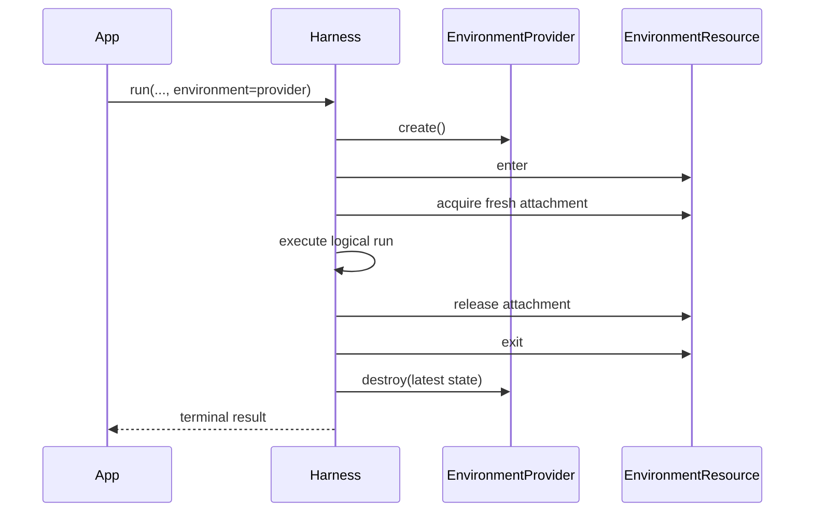
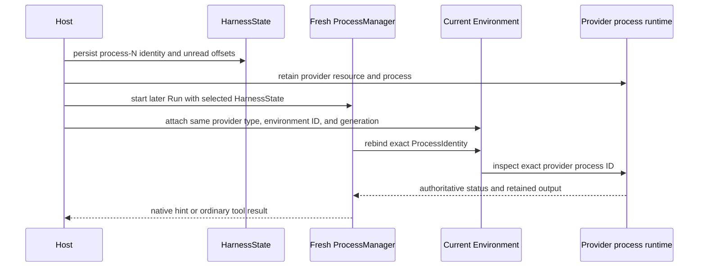

# Environments

An Environment is the Harness run-scoped boundary for files, commands, processes, retained output, and ports. Most applications supply an Environment provider or an already entered resource directly to `run()` or `stream()`; they do not assemble attachments, bindings, or topologies.

Environment lifecycle is separate from model-facing tools:

- an Environment makes operations available to trusted application code through `AgentContext.environment`;
- `DynamicEnvironmentCapability` optionally exposes selected Environment operations to the model;
- source type determines who owns the provider resource lifecycle.

## Start without an Environment

Environment input is optional. Ordinary embedded runs need no `RunBindings` value and receive an empty Environment topology:

```python
result = await executable.run("Answer without using a workspace")
```

This is the simplest path for Agents that only need a model and non-Environment tools.

## Let the Harness own a temporary resource

Pass an `EnvironmentProvider` when one temporary resource should exist only for the logical run:

```python
from pathlib import Path

from a13n_environment_provider import (
    DirectLocalEnvironmentProvider,
    DirectLocalProviderConfiguration,
    DirectLocalRootConfiguration,
)

provider = DirectLocalEnvironmentProvider(
    DirectLocalProviderConfiguration(
        environment_id="local-workspace",
        root=DirectLocalRootConfiguration(path=Path("./workspace").resolve()),
    )
)

result = await executable.run(
    "Update the workspace",
    environment=provider,
)
```

The Harness performs the complete ephemeral lifecycle:



Provider destruction completes before `run()` returns or a terminal stream result is delivered. The same cleanup runs when input preparation, model execution, stream consumption, or run cleanup fails. If a lifecycle call has an unknown outcome, `EnvironmentProvider.ephemeral()` reconciles the exact operation before performing its one bounded retry or recovery step.

A Provider input is always ephemeral, including when a run returns `suspended`. Use a Host-owned Resource when continuation must retain the same external resource.

## Keep and reuse a Host-owned resource

An entered `EnvironmentResource` is borrowed. The Host creates, enters, retains, exits, pauses, resumes, and destroys it; the Harness only acquires and releases one fresh attachment per run.

```python
from a13n_environment_provider import (
    EnvironmentManagementAction,
    EnvironmentOperationContext,
)

correlation = "resource-conversation-workspace"
create_operation = EnvironmentOperationContext(
    operation_id="operation-create-conversation-workspace",
    action=EnvironmentManagementAction.CREATE,
    resource_correlation=correlation,
    attempt=1,
)
resource = await provider.create(operation=create_operation)

try:
    async with resource:
        first = await executable.run(
            "Create /workspace/plan.md",
            environment=resource,
        )
        second = await executable.run(
            "Read and revise /workspace/plan.md",
            environment=resource,
            previous_state=first.state,
        )
finally:
    await provider.destroy(
        resource.state,
        operation=EnvironmentOperationContext(
            operation_id="operation-destroy-conversation-workspace",
            action=EnvironmentManagementAction.DESTROY,
            resource_correlation=correlation,
            attempt=1,
        ),
    )
```

The Resource must already be inside its single-entry async scope when passed to the Harness. An unentered or closed Resource fails when the stream enters. Each Harness run receives a fresh attachment, so live attachments and bindings are never reused as continuation state.

`HarnessState` and `EnvironmentProviderResourceState` solve different problems:

- `HarnessState` continues Agent messages and bounded portable Environment values;
- `EnvironmentProviderResourceState` identifies and validates the provider-owned resource;
- neither value contains a live Resource, attachment, client, credential, or authority grant.

## Use several Environments

Pass `environments=` to name several sources. One mapping can mix Harness-owned Providers and Host-owned entered Resources:

```python
from a13n_harness import EnvironmentAccess, EnvironmentMount

result = await executable.run(
    "Read the source data and write the build output",
    environments={
        "build": build_provider,
        "data": EnvironmentMount(
            data_resource,
            access=EnvironmentAccess.READ_ONLY,
        ),
    },
    default_environment="build",
)
```

The routing rules are deterministic:

| Input                                             | Alias and binding ID                  | Default route |
| ------------------------------------------------- | ------------------------------------- | ------------- |
| `environment=source`                              | `workspace`, `environment-workspace`  | `workspace`   |
| one `environments` entry                          | supplied alias, `environment-{alias}` | that entry    |
| several entries with `default_environment="name"` | supplied aliases                      | named entry   |
| several entries without `default_environment`     | supplied aliases                      | none          |

A default binding serves `/workspace`. Every named binding is always addressable at `/environment/{alias}`:

```python
async def prepare(context):
    source = await context.environment.files.read_text(
        "/environment/data/input.json"
    )
    await context.environment.files.write_text(
        "/workspace/result.json",
        transform(source.text),
        mode="upsert",
    )
    return "Review the prepared result"

result = await executable.run(
    input_factory=prepare,
    environments={"build": build_provider, "data": data_resource},
    default_environment="build",
)
```

With several entries and no explicit default, `/workspace/...` fails instead of selecting the first mapping entry. Mapping order never grants authority. Use alias-qualified paths in that form:

```python
result = await executable.run(
    "Compare both workspaces",
    environments={"left": left_provider, "right": right_provider},
)
# Use /environment/left/... and /environment/right/...
```

Setup is atomic. The Harness does not publish a partial topology. If a later source fails to enter, already entered Provider-owned sources are released and destroyed in reverse order, while borrowed Resources remain under Host ownership.

## Restrict a mount

`EnvironmentMount` adds a permission ceiling and default working directory to one source:

```python
from a13n_harness import EnvironmentAccess, EnvironmentMount

read_only_docs = EnvironmentMount(
    docs_resource,
    access=EnvironmentAccess.READ_ONLY,
    working_directory="/reference",
)
```

`EnvironmentAccess.FULL` selects the complete current operation catalog. `READ_ONLY` permits file and resource observation plus the release operations needed to retire observation handles. It does not permit file mutation or process creation. A provider can always narrow the requested ceiling further.

Advanced callers can pass an exact `EnvironmentPermissionSet` instead of a preset. `working_directory` must be `None` or a canonical absolute provider path without `.` or `..` segments.

## Expose tools to the model

The Environment can exist without model-facing tools. Add `DynamicEnvironmentCapability` when the model should receive a selected stable tool surface:

```python
from a13n_harness import (
    DynamicEnvironmentCapability,
    DynamicEnvironmentConfiguration,
)

capabilities = (
    DynamicEnvironmentCapability(
        DynamicEnvironmentConfiguration(
            file_tools=True,
            shell_tools=False,
            max_reference_entries=64,
        )
    ),
)
```

Three decisions remain separate:

1. the Agent definition exposes a file or shell tool;
2. current run policy authorizes the invocation for the current identity and arguments;
3. the selected Environment binding and provider permit the operation.

Provider denial always narrows a Harness allow decision. Provider availability never grants authorization.

With `file_tools=True`, the file Toolset includes `view`, `write`, `edit`, `multi_edit`, `mkdir`, `move`, `copy`, `delete`, `ls`, `glob`, and `grep`. When `shell_tools=True`, the prepared shell command supersedes exactly `move`, `copy`, and `delete`; those three tools and their Toolset instruction blocks are omitted, while `mkdir` remains available. Disable shell tools when the dedicated file mutation tools are required.

The shell Toolset has one compact six-tool surface:

| Tool           | Behavior                                                                                            |
| -------------- | --------------------------------------------------------------------------------------------------- |
| `shell_exec`   | Runs a command in the foreground, or starts a real provider process with `background=True`          |
| `shell_wait`   | Waits for bounded process-tree cleanup and drains the next stdout/stderr page; zero polls once      |
| `shell_status` | Returns a non-consuming bounded page of managed processes known to the current Thread               |
| `shell_input`  | Writes UTF-8 stdin and can close stdin in the same call                                             |
| `shell_signal` | Sends the portable `interrupt` or `terminate` signal                                                |
| `shell_kill`   | Forces process-tree termination, waits boundedly for cleanup, and drains the next final output page |

The shell surface is deliberately context-safe:

- `shell_status` is metadata-only: each item contains compact identity, status, stdin state, and stdout/stderr produced-byte counts, never stream contents;
- status uses `cursor` and `limit`, then applies the shared serialized-result bound; if even the requested page is too large, it returns a smaller bounded prefix and tells the Agent to retry from the same cursor with a smaller limit;
- `shell_wait` and `shell_kill` are the only background tools that drain output, and each call returns one bounded incremental page from independent stdout/stderr offsets;
- foreground overflow can use the shared spill disclosure, while retained background output stays in the provider and is pulled repeatedly instead of being copied into another file;
- completion enqueue and `ProcessEventHook` values carry status hints only and never inject stdout or stderr into model context.

A background start returns an opaque `process-N` ID. The Harness stores its portable mapping and independent next-unread stdout/stderr offsets in `AgentContextState`, so the same reference can survive a compatible continuation of the same Thread. Output reads advance offsets only after bytes are delivered to the model; `shell_status` never consumes output. Once a terminal process is tree-cleaned and all retained bytes are delivered, the Harness returns the final output page first, then releases provider resources during the next non-output reconciliation or Toolset close and removes the mapping. This avoids losing a delivered-offset page to cancellation during cleanup; the compact ID then becomes invalid and its suffix is never reused.

`background=True` is available only through the selected Environment provider's real process operations. Portable state stores the exact `(provider_type, environment_id, generation, provider process ID)` plus observations; it stores no live handle, callback, provider cursor, output reference, credential, or authority. A fresh manager lazily rebinds only that exact identity through the current Environment. It never follows an alias, default binding, saved routing hint, or ambient process list. If the matching Environment is not attached, the reference remains unavailable and is preserved. A generation change or an authoritative not-found response for the matching Environment becomes `backend_lost`.

While a root or child Toolset Turn is active, the Harness supervises the provider's real `wait(condition="tree_cleaned")` operation. Completion can enqueue one bounded native hint so the Agent calls `shell_wait`; an observation gap tells it to call `shell_status` or `shell_wait`. Hints never consume output or replace provider status. Ending the Turn cancels only Harness observation and does not terminate a committed background process.

A Host can add event sinks when it wants to record these Turn-scoped hints:

```python
from a13n_harness import ProcessEvent


async def record_process_event(event: ProcessEvent) -> None:
    await telemetry.record(
        event.kind,
        thread_id=event.thread_id,
        run_id=event.run_id,
        agent_instance_id=event.agent_instance_id,
        process_id=event.process_id,
        identity=event.identity,
        status=event.status,
    )


capability = DynamicEnvironmentCapability(
    DynamicEnvironmentConfiguration(
        file_tools=True,
        shell_tools=True,
        max_reference_entries=1_024,
    ),
    process_event_hooks=(record_process_event,),
)
```

`ProcessEventHook` values receive `completion` or `gap` hints and may bridge them to telemetry or durable scheduling. Hook failure does not fail a committed start or change process state. A hook is not a durable subscription and runs only when the current Harness observation sees an event.

### Host integration ownership

For a process to remain usable across Turns, a Host follows both continuation tracks:

1. persist and later supply the complete `HarnessState`, which contains the `process-N` mapping and unread offsets;
2. retain or reconstruct provider resource state, keep the real process and output alive, and attach the same `provider_type`, `environment_id`, and `generation` to the continuation Run;
3. let the fresh `ProcessManager` reauthorize and lazily rebind the exact provider process identity;
4. use provider-native events or polling to notice completion while no Harness Turn is active, then schedule a normal continuation whose `shell_status` or `shell_wait` reconciles authoritative state.

Do not persist `BoundProcessHandle`, retain a Harness wait task or hook as lifecycle authority, or rebuild a mapping from alias or native PID. `ProcessManager` is public for custom Toolset composition, but a Host should treat each instance as a recreatable operator over current `AgentContextState` and Environment ports rather than retain it across Runs.

The built-in Direct Local binding tears down its process manager at binding close, so it does not preserve managed processes across separate Harness Runs or a Host restart. An EIP-backed resource can preserve one across a new Harness Run, process, or client session only while the same `agent-envd` Environment generation and retained output remain alive. If the provider does not preserve both, the Host must treat the process as lost rather than retarget it.



`glob` and `grep` send their include pattern, repository-ignore and hidden-name policy, context width, and scan/result ceilings to the selected `FileOperator` in one call. Direct Local performs one worker-thread scan; EIP performs one `file.find` or `file.search` request. Set `include_ignored=True` only when ignored repository paths should be searched.

For supported image, audio, and video files, `view` either attaches native `BinaryContent` or invokes a dedicated understanding Agent. The `model_config` construction value on the active Harness `AgentSpec` is the sole native-input authority; Harness never infers support from a model name or Pydantic AI `Model.profile`. Dedicated defaults read ordinary process environment variables, and a fresh run Capability can override them.

See [Multimedia Understanding](multimedia-understanding.md) for capability declarations, environment configuration, default prompt behavior, run-scoped providers, usage attribution, and ordinary tool-result failures.

## Manage a durable provider lifecycle explicitly

Use explicit provider operations when a resource must outlive one Harness run. The Host generates stable operation identities, persists the latest `EnvironmentProviderResourceState`, and reconciles an exact operation after an unknown outcome.

The full lifecycle for a provider that supports full pause is:

```python
from a13n_environment_provider import (
    EnvironmentManagementAction,
    EnvironmentOperationContext,
    EnvironmentPauseMode,
    EnvironmentReconciliationPhase,
)

correlation = "resource-durable-workspace"

create = EnvironmentOperationContext(
    operation_id="operation-create-durable-workspace",
    action=EnvironmentManagementAction.CREATE,
    resource_correlation=correlation,
    attempt=1,
)
resource = await provider.create(operation=create)
persist(resource.state)

async with resource:
    first = await executable.run("Start the task", environment=resource)
    pause = EnvironmentOperationContext(
        operation_id="operation-pause-durable-workspace",
        action=EnvironmentManagementAction.PAUSE,
        resource_correlation=correlation,
        attempt=1,
    )
    paused_state = await provider.pause(
        resource,
        operation=pause,
        mode=EnvironmentPauseMode.FULL,
    )
persist(paused_state)

pause_observation = await provider.reconcile(
    pause,
    last_known_state=paused_state,
)
assert pause_observation.phase is EnvironmentReconciliationPhase.PAUSED

resume = EnvironmentOperationContext(
    operation_id="operation-resume-durable-workspace",
    action=EnvironmentManagementAction.RESUME,
    resource_correlation=correlation,
    attempt=1,
)
resumed = await provider.resume(paused_state, operation=resume)
persist(resumed.state)

async with resumed:
    second = await executable.run(
        "Continue the task",
        environment=resumed,
        previous_state=first.state,
    )
    final_state = resumed.state

destroy = EnvironmentOperationContext(
    operation_id="operation-destroy-durable-workspace",
    action=EnvironmentManagementAction.DESTROY,
    resource_correlation=correlation,
    attempt=1,
)
await provider.destroy(final_state, operation=destroy)
remove_persisted_state()
```

Check `provider.lifecycle_capabilities.pause_modes` before selecting a pause mode. A provider with no pause support must fail explicitly; it must not silently convert pause into destroy. `resume()` targets the resource described by validated state and never silently creates a replacement.

When `create()`, `resume()`, `pause()`, or `destroy()` reports `EnvironmentProviderOutcomeCertainty.UNKNOWN`, do not issue a new unrelated operation. Call `reconcile()` with the same `EnvironmentOperationContext` and latest known state, then follow provider recovery guidance. `EnvironmentProvider.ephemeral()` implements this bounded protocol for Harness-owned temporary resources.

## Advanced Host route

Most applications should use `environment=` or `environments=`. Hosts that need exact permission sets, custom binding IDs, live topology mutation, provider-binding adapters, or aggregate extensions can use the explicit advanced module:

```python
from a13n_harness import RunBindings
from a13n_harness.environment.advanced import (
    EnvironmentBindingRequest,
    EnvironmentTopologyRequest,
    create_environment_provider_binding,
    create_environment_run_binding,
)
```

The advanced route constructs one single-use `EnvironmentRunBinding` and places it in `RunBindings.embedded(environment=...)` or in a directly constructed `RunBindings` with a Host-issued `AgentInstanceContext`. Retain `environment_binding.controller` before transferring the binding when live topology changes are required.

High-level Environment arguments and `RunBindings.environment` are mutually exclusive. They normalize into the same aggregate coordinator and operation engine; there is no second lifecycle implementation.

## Direct Local boundary

`a13n.direct-local` exposes an explicitly selected existing Host directory. It is an operation backend, not a sandbox claim:

- the Host creates, selects, retains, backs up, shares, and removes the directory;
- Direct Local validates it and issues fresh attachments;
- `destroy()` detaches the logical provider resource but never deletes the directory;
- `read_only` constrains binding operations but is not an OS sandbox against an allowed child process.

Use Docker, E2B, or another isolated EIP provider when untrusted code needs a real sandbox boundary.
