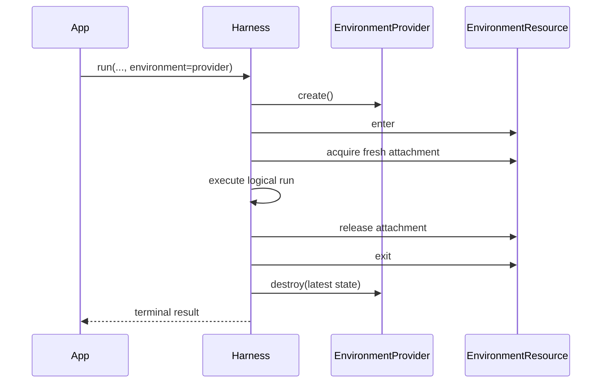
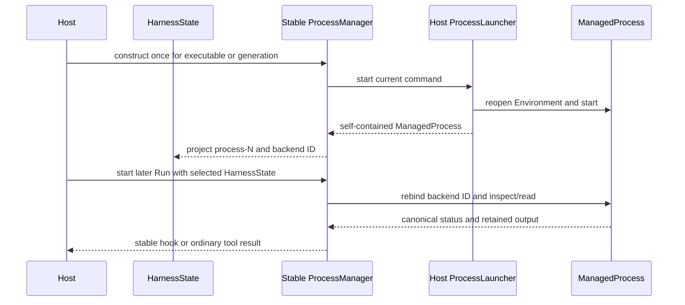

# Environments

An Environment is the Harness run-scoped boundary for files, commands, processes, retained output, and ports. Most applications supply an Environment provider or an already entered resource directly to `run()` or `stream()`; they do not assemble attachments, runtime mounts, or an `EnvironmentRuntime`.

Environment lifecycle is separate from model-facing tools:

- an Environment makes operations available to trusted application code through `AgentContext.environment`;
- `DynamicEnvironmentCapability` optionally exposes selected Environment operations to the model;
- source type determines who owns the provider resource lifecycle.

## Start without an Environment

Environment input is optional. Ordinary embedded runs need no `RunBindings` value and receive a zero-mount Environment runtime:

```python
result = await executable.run("Answer without using a workspace")
```

This is the simplest path for Agents that only need a model and non-Environment tools.

## Let the Harness own a temporary resource

Pass an `EnvironmentProvider` when one temporary resource should exist only for the logical run:

```python
from pathlib import Path

from a13n_environment_provider import (
    DirectLocalEnvironmentProvider,
    DirectLocalProviderConfiguration,
    DirectLocalRootConfiguration,
)

provider = DirectLocalEnvironmentProvider(
    DirectLocalProviderConfiguration(
        environment_id="local-workspace",
        root=DirectLocalRootConfiguration(path=Path("./workspace").resolve()),
    )
)

result = await executable.run(
    "Update the workspace",
    environment=provider,
)
```

The Harness performs the complete ephemeral lifecycle:



Provider destruction completes before `run()` returns or a terminal stream result is delivered. The same cleanup runs when input preparation, model execution, stream consumption, or run cleanup fails. If a lifecycle call has an unknown outcome, `EnvironmentProvider.ephemeral()` reconciles the exact operation before performing its one bounded retry or recovery step.

A Provider input is always ephemeral, including when a run returns `suspended`. Use a Host-owned Resource when continuation must retain the same external resource.

## Keep and reuse a Host-owned resource

An entered `EnvironmentResource` is borrowed. The Host creates, enters, retains, exits, pauses, resumes, and destroys it; the Harness only acquires and releases one fresh attachment per run.

```python
from a13n_environment_provider import (
    EnvironmentManagementAction,
    EnvironmentOperationContext,
)

correlation = "resource-conversation-workspace"
create_operation = EnvironmentOperationContext(
    operation_id="operation-create-conversation-workspace",
    action=EnvironmentManagementAction.CREATE,
    resource_correlation=correlation,
    attempt=1,
)
resource = await provider.create(operation=create_operation)

try:
    async with resource:
        first = await executable.run(
            "Create /workspace/plan.md",
            environment=resource,
        )
        second = await executable.run(
            "Read and revise /workspace/plan.md",
            environment=resource,
            previous_state=first.state,
        )
finally:
    await provider.destroy(
        resource.state,
        operation=EnvironmentOperationContext(
            operation_id="operation-destroy-conversation-workspace",
            action=EnvironmentManagementAction.DESTROY,
            resource_correlation=correlation,
            attempt=1,
        ),
    )
```

The Resource must already be inside its single-entry async scope when passed to the Harness. An unentered or closed Resource fails when the stream enters. Each Harness run receives a fresh attachment and a fresh runtime mount, so live attachments and entered providers are never reused as continuation state.

`HarnessState` and `EnvironmentProviderResourceState` solve different problems:

- `HarnessState` continues Agent messages and bounded portable Environment values;
- `EnvironmentProviderResourceState` identifies and validates the provider-owned resource;
- neither value contains a live Resource, attachment, client, credential, or authority grant.

## Use several Environments

Pass `environments=` to name several sources. One mapping can mix Harness-owned Providers and Host-owned entered Resources:

```python
from a13n_harness import (
    EnvironmentAccess,
    EnvironmentMount,
)

result = await executable.run(
    "Read the source data and write the build output",
    environments={
        "build": build_provider,
        "data": EnvironmentMount(
            data_resource,
            access=EnvironmentAccess.READ_ONLY,
        ),
    },
    default_environment="build",
)
```

The routing rules are deterministic:

| Input                                             | Mount name(s)  | Default route |
| ------------------------------------------------- | -------------- | ------------- |
| `environment=source`                              | `workspace`    | `workspace`   |
| one `environments` entry                          | supplied name  | that entry    |
| several entries with `default_environment="name"` | supplied names | named entry   |
| several entries without `default_environment`     | supplied names | none          |

The default mount serves `/workspace`. Every named mount is always addressable at `/environment/{name}`:

```python
async def prepare(context):
    source = await context.environment.files.read_text(
        "/environment/data/input.json"
    )
    await context.environment.files.write_text(
        "/workspace/result.json",
        transform(source.text),
        mode="upsert",
    )
    return "Review the prepared result"

result = await executable.run(
    input_factory=prepare,
    environments={"build": build_provider, "data": data_resource},
    default_environment="build",
)
```

With several entries and no explicit default, `/workspace/...` fails instead of selecting the first mapping entry. Mapping order never grants authority. Use alias-qualified paths in that form:

```python
result = await executable.run(
    "Compare both workspaces",
    environments={"left": left_provider, "right": right_provider},
)
# Use /environment/left/... and /environment/right/...
```

Setup is atomic. The Harness does not publish a partial initial mount set. If a later source fails to enter, already entered Provider-owned sources are released and destroyed in reverse order, while borrowed Resources remain under Host ownership.

## Restrict a mount

`EnvironmentMount` adds a user-facing access level and default working directory to one source:

```python
from a13n_harness import (
    EnvironmentAccess,
    EnvironmentMount,
)

read_only_docs = EnvironmentMount(
    docs_resource,
    access=EnvironmentAccess.READ_ONLY,
    working_directory="/reference",
)
```

Access defaults to `EnvironmentAccess.FULL`. `READ_ONLY` exposes file reads, `READ_WRITE` exposes all file operations, and `FULL` exposes every Agent-facing Environment capability offered by the Provider, including command and process operations when supported. Provider capabilities always narrow the selected level. `FULL` does not grant Host administration, bypass a sandbox, or override operating-system security.

Exact action sets remain an internal advanced runtime and Provider enforcement seam rather than ordinary `EnvironmentMount` configuration. `working_directory` must be `None` or a canonical absolute provider path without `.` or `..` segments.

## Expose tools to the model

The Environment can exist without model-facing tools. Add `DynamicEnvironmentCapability` when the model should receive a selected stable tool surface:

```python
from a13n_harness.environment import (
    DynamicEnvironmentCapability,
    DynamicEnvironmentConfiguration,
)

capabilities = (
    DynamicEnvironmentCapability(DynamicEnvironmentConfiguration()),
)
```

Three decisions remain separate:

1. the Agent definition includes or omits the dynamic Environment Capability;
2. an optional run policy can narrow a managed invocation for the current identity and arguments;
3. the selected Environment mount and Provider enforce the exact operation.

Without an explicit Invocation Policy, managed Environment tools default to allow at the Harness boundary. That default does not create Provider capability, credentials, approval, or mount access. Tool injection improves discovery and cannot replace execution-time checks.

The tool surface follows the union of effective actions across current mounts:

- `read_only` exposes `view`, `ls`, `glob`, and `grep`;
- `read_write` adds `write`, `edit`, `multi_edit`, `mkdir`, `move`, `copy`, and `delete`;
- `full` adds `shell_exec` when a Provider offers shell execution, and background process tools when the configured operator supports them.

When `shell_exec` is present, it supersedes exactly `move`, `copy`, and `delete`; `mkdir` remains available. An empty Environment exposes no Environment tools.

The shell Toolset has one compact six-tool surface:

| Tool           | Behavior                                                                                            |
| -------------- | --------------------------------------------------------------------------------------------------- |
| `shell_exec`   | Runs a command in the foreground, or asks the configured operator to start with `background=True`   |
| `shell_wait`   | Waits for bounded process-tree cleanup and drains the next stdout/stderr page; zero polls once      |
| `shell_status` | Returns a non-consuming bounded page of managed processes known to the current Thread               |
| `shell_input`  | Writes UTF-8 stdin and can close stdin in the same call                                             |
| `shell_signal` | Sends the portable `interrupt` or `terminate` signal                                                |
| `shell_kill`   | Forces process-tree termination, waits boundedly for cleanup, and drains the next final output page |

The shell surface is deliberately context-safe:

- `shell_status` is metadata-only: each item contains compact identity, status, stdin state, and stdout/stderr produced-byte counts, never stream contents;
- status uses `cursor` and `limit`, then applies the shared serialized-result bound; if even the requested page is too large, it returns a smaller bounded prefix and tells the Agent to retry from the same cursor with a smaller limit;
- `shell_wait` and `shell_kill` are the only background tools that drain output, and each call returns one bounded incremental page from independent stdout/stderr offsets;
- foreground overflow can use the shared spill disclosure, while retained background output stays with the managed process and is pulled repeatedly instead of being copied into another file;
- completion enqueue and `ProcessEventHook` values carry status hints only and never inject stdout or stderr into model context.

A background start returns an opaque `process-N` ID. The parent projection stores one operator backend ID, independent next-unread stdout/stderr offsets, and bounded observations in `AgentContextState`. Output reads advance offsets only after bytes are delivered to the model; `shell_status` never consumes output. The projection stores no live handle, provider identity, callback, output buffer, credential, attachment, or authority.

`background=True` is available only when the configured operator declares background support. The standard `ProcessManager` accepts a Host launcher that creates one real process inside an Environment or process service and returns a self-contained `ManagedProcess`. After acceptance, the Manager is the canonical owner of completion, control, output access, and cleanup. The launcher must not return a handle that borrows the initiating Run's `BoundEnvironment` or attachment.

While a parent Toolset Turn is active, Manager observation can enqueue one bounded hint so the Agent calls `shell_wait`; an observation gap tells it to call `shell_status` or `shell_wait`. Stable Host hooks are dispatched independently and include Host-only correlation from `AgentInstanceContext.host_refs`. Hints never consume output or replace canonical status. Ending the Turn releases only the current observer and does not terminate accepted Manager work.

A Host can add stable event sinks when it wants to record or react to Manager transitions. In the example, `launch_process` implements the public `ProcessLauncher` contract:

```python
from a13n_harness.capabilities import ProcessEvent, ProcessManager


async def record_process_event(event: ProcessEvent) -> None:
    await telemetry.record(
        event.kind,
        thread_id=event.thread_id,
        run_id=event.run_id,
        agent_instance_id=event.agent_instance_id,
        process_id=event.process_id,
        backend_id=event.backend_id,
        status=event.status,
    )


process_manager = ProcessManager(
    launch_process,
    event_hooks=(record_process_event,),
)
capability = DynamicEnvironmentCapability(
    DynamicEnvironmentConfiguration(),
    operator=process_manager,
)
```

`ProcessEventHook` values receive `completion` or `gap` hints and may bridge them to telemetry or scheduling. Hook failure does not fail a committed start or change process state. The standard Manager dispatches hooks independently of current-Run observation, but a hook is still best-effort unless the Host builds a durable delivery contract outside Harness.

### Host integration ownership

For a process to remain usable across Turns, a Host keeps one stable operator for every Run that may address its work:

1. construct one `ProcessManager` for an embedding executable or Runner generation;
2. implement `ProcessLauncher` by reopening exact Host-selected Environment inputs and returning a self-contained `ManagedProcess`;
3. persist and later supply the complete `HarnessState`, which contains `process-N`, its backend ID, and unread offsets;
4. reconstruct later Agents with the same Manager instance and let the projection rebind that backend ID;
5. use stable Manager hooks to wake a later Run when product policy requires it;
6. call `force_close()` when the executable or generation ends.

Do not persist `BoundProcessHandle`, copy a parent `BoundEnvironment`, or create a new default Manager for every Run. The default Manager is process-local and loses canonical work on restart. A Host requiring restart survival implements a custom `ShellOperator` backed by its own retained process/output service; missing records become lost and are never retargeted.



`glob` and `grep` send their include pattern, repository-ignore and hidden-name policy, context width, and scan/result ceilings to the selected `FileOperator` in one call. Direct Local performs one worker-thread scan; EIP performs one `file.find` or `file.search` request. Set `include_ignored=True` only when ignored repository paths should be searched.

For supported image, audio, and video files, `view` either attaches native `BinaryContent` or invokes a dedicated understanding Agent. The `model_characteristics` construction value on the active Harness `AgentSpec` is the sole native-input authority; Harness never infers support from a model name or Pydantic AI `Model.profile`. Dedicated defaults read ordinary process environment variables, and a fresh run Capability can override them.

See [Multimedia Understanding](multimedia-understanding.md) for capability declarations, environment configuration, default prompt behavior, run-scoped providers, usage attribution, and ordinary tool-result failures.

## Manage a durable provider lifecycle explicitly

Use explicit provider operations when a resource must outlive one Harness run. The Host generates stable operation identities, persists the latest `EnvironmentProviderResourceState`, and reconciles an exact operation after an unknown outcome.

The full lifecycle for a provider that supports full pause is:

```python
from a13n_environment_provider import (
    EnvironmentManagementAction,
    EnvironmentOperationContext,
    EnvironmentPauseMode,
    EnvironmentReconciliationPhase,
)

correlation = "resource-durable-workspace"

create = EnvironmentOperationContext(
    operation_id="operation-create-durable-workspace",
    action=EnvironmentManagementAction.CREATE,
    resource_correlation=correlation,
    attempt=1,
)
resource = await provider.create(operation=create)
persist(resource.state)

async with resource:
    first = await executable.run("Start the task", environment=resource)
    pause = EnvironmentOperationContext(
        operation_id="operation-pause-durable-workspace",
        action=EnvironmentManagementAction.PAUSE,
        resource_correlation=correlation,
        attempt=1,
    )
    paused_state = await provider.pause(
        resource,
        operation=pause,
        mode=EnvironmentPauseMode.FULL,
    )
persist(paused_state)

pause_observation = await provider.reconcile(
    pause,
    last_known_state=paused_state,
)
assert pause_observation.phase is EnvironmentReconciliationPhase.PAUSED

resume = EnvironmentOperationContext(
    operation_id="operation-resume-durable-workspace",
    action=EnvironmentManagementAction.RESUME,
    resource_correlation=correlation,
    attempt=1,
)
resumed = await provider.resume(paused_state, operation=resume)
persist(resumed.state)

async with resumed:
    second = await executable.run(
        "Continue the task",
        environment=resumed,
        previous_state=first.state,
    )
    final_state = resumed.state

destroy = EnvironmentOperationContext(
    operation_id="operation-destroy-durable-workspace",
    action=EnvironmentManagementAction.DESTROY,
    resource_correlation=correlation,
    attempt=1,
)
await provider.destroy(final_state, operation=destroy)
remove_persisted_state()
```

Check `provider.lifecycle_capabilities.pause_modes` before selecting a pause mode. A provider with no pause support must fail explicitly; it must not silently convert pause into destroy. `resume()` targets the resource described by validated state and never silently creates a replacement.

When `create()`, `resume()`, `pause()`, or `destroy()` reports `EnvironmentProviderOutcomeCertainty.UNKNOWN`, do not issue a new unrelated operation. Call `reconcile()` with the same `EnvironmentOperationContext` and latest known state, then follow provider recovery guidance. `EnvironmentProvider.ephemeral()` implements this bounded protocol for Harness-owned temporary resources.

## Advanced Host route

Most applications should use `environment=` or `environments=`. Hosts that need exact permission sets, live mount mutation, provider-binding adapters, or runtime-wide extensions can use the explicit advanced module:

```python
from a13n_harness import RunBindings
from a13n_harness.environment import EnvironmentPermissionSet
from a13n_harness.environment.advanced import (
    EnvironmentRuntimeMount,
    create_environment_provider_binding,
    create_environment_runtime,
)

workspace_mount = EnvironmentRuntimeMount(
    binding=create_environment_provider_binding(workspace_attachment),
    permission_ceiling=EnvironmentPermissionSet(operations=allowed_actions),
    working_directory="/",
)
runtime = create_environment_runtime(
    mounts={"workspace": workspace_mount},
    default_mount="workspace",
)
run_bindings = RunBindings.embedded(environment=runtime)
```

The advanced route constructs one single-use `EnvironmentRuntime` and places it in `RunBindings.embedded(environment=...)` or in a directly constructed `RunBindings` with a Host-issued `AgentInstanceContext`. The Host retains the runtime while the run is active and may call its linearizable `mount()`, `replace()`, `unmount()`, and `set_default()` methods. New or replacement candidates are entered before commit; a failed candidate leaves the current mount set unchanged. `mount(..., make_default=True)` commits both changes atomically, `replace()` preserves default selection, and unmounting the default clears it.

High-level Environment arguments and `RunBindings.environment` are mutually exclusive. They normalize into the same runtime and operation engine; there is no second lifecycle implementation.

## Direct Local boundary

`a13n.direct-local` exposes an explicitly selected existing Host directory. It is an operation backend, not a sandbox claim:

- the Host creates, selects, retains, backs up, shares, and removes the directory;
- Direct Local validates it and issues fresh attachments;
- `destroy()` detaches the logical provider resource but never deletes the directory;
- `read_only` constrains mounted provider operations but is not an OS sandbox against an allowed child process.

Use Local Envd or an implemented third-party isolated EIP provider when untrusted code needs a real sandbox boundary. Docker and E2B are extension architectures, not current built-in Providers.
