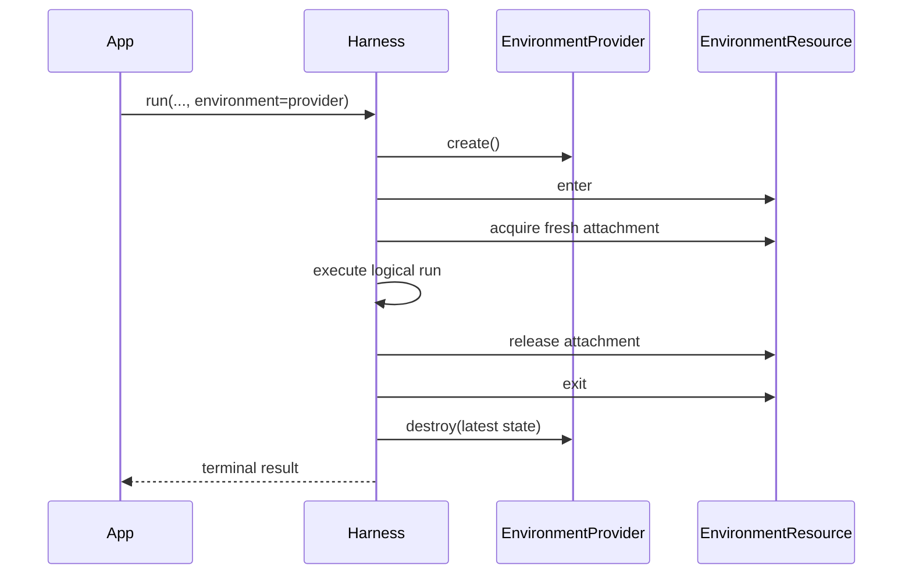

# Environments

An Environment is the Harness run-scoped boundary for files, commands, processes, retained output, and ports. Most applications supply an Environment provider or an already entered resource directly to `run()` or `stream()`; they do not assemble attachments, bindings, or topologies.

Environment lifecycle is separate from model-facing tools:

- an Environment makes operations available to trusted application code through `AgentContext.environment`;
- `DynamicEnvironmentCapability` optionally exposes selected Environment operations to the model;
- source type determines who owns the provider resource lifecycle.

## Start without an Environment

Environment input is optional. Ordinary embedded runs need no `RunBindings` value and receive an empty Environment topology:

```python
result = await executable.run("Answer without using a workspace")
```

This is the simplest path for Agents that only need a model and non-Environment tools.

## Let the Harness own a temporary resource

Pass an `EnvironmentProvider` when one temporary resource should exist only for the logical run:

```python
from pathlib import Path

from a13n_environment_provider import (
    DirectLocalEnvironmentProvider,
    DirectLocalProviderConfiguration,
    DirectLocalRootConfiguration,
)

provider = DirectLocalEnvironmentProvider(
    DirectLocalProviderConfiguration(
        environment_id="local-workspace",
        root=DirectLocalRootConfiguration(path=Path("./workspace").resolve()),
    )
)

result = await executable.run(
    "Update the workspace",
    environment=provider,
)
```

The Harness performs the complete ephemeral lifecycle:



Provider destruction completes before `run()` returns or a terminal stream result is delivered. The same cleanup runs when input preparation, model execution, stream consumption, or run cleanup fails. If a lifecycle call has an unknown outcome, `EnvironmentProvider.ephemeral()` reconciles the exact operation before performing its one bounded retry or recovery step.

A Provider input is always ephemeral, including when a run returns `suspended`. Use a Host-owned Resource when continuation must retain the same external resource.

## Keep and reuse a Host-owned resource

An entered `EnvironmentResource` is borrowed. The Host creates, enters, retains, exits, pauses, resumes, and destroys it; the Harness only acquires and releases one fresh attachment per run.

```python
from a13n_environment_provider import (
    EnvironmentManagementAction,
    EnvironmentOperationContext,
)

correlation = "resource-conversation-workspace"
create_operation = EnvironmentOperationContext(
    operation_id="operation-create-conversation-workspace",
    action=EnvironmentManagementAction.CREATE,
    resource_correlation=correlation,
    attempt=1,
)
resource = await provider.create(operation=create_operation)

try:
    async with resource:
        first = await executable.run(
            "Create /workspace/plan.md",
            environment=resource,
        )
        second = await executable.run(
            "Read and revise /workspace/plan.md",
            environment=resource,
            previous_state=first.state,
        )
finally:
    await provider.destroy(
        resource.state,
        operation=EnvironmentOperationContext(
            operation_id="operation-destroy-conversation-workspace",
            action=EnvironmentManagementAction.DESTROY,
            resource_correlation=correlation,
            attempt=1,
        ),
    )
```

The Resource must already be inside its single-entry async scope when passed to the Harness. An unentered or closed Resource fails when the stream enters. Each Harness run receives a fresh attachment, so live attachments and bindings are never reused as continuation state.

`HarnessState` and `EnvironmentProviderResourceState` solve different problems:

- `HarnessState` continues Agent messages and bounded portable Environment values;
- `EnvironmentProviderResourceState` identifies and validates the provider-owned resource;
- neither value contains a live Resource, attachment, client, credential, or authority grant.

## Use several Environments

Pass `environments=` to name several sources. One mapping can mix Harness-owned Providers and Host-owned entered Resources:

```python
from a13n_harness import EnvironmentAccess, EnvironmentMount

result = await executable.run(
    "Read the source data and write the build output",
    environments={
        "build": build_provider,
        "data": EnvironmentMount(
            data_resource,
            access=EnvironmentAccess.READ_ONLY,
        ),
    },
    default_environment="build",
)
```

The routing rules are deterministic:

| Input                                             | Alias and binding ID                  | Default route |
| ------------------------------------------------- | ------------------------------------- | ------------- |
| `environment=source`                              | `workspace`, `environment-workspace`  | `workspace`   |
| one `environments` entry                          | supplied alias, `environment-{alias}` | that entry    |
| several entries with `default_environment="name"` | supplied aliases                      | named entry   |
| several entries without `default_environment`     | supplied aliases                      | none          |

A default binding serves `/workspace`. Every named binding is always addressable at `/environment/{alias}`:

```python
async def prepare(context):
    source = await context.environment.files.read_text(
        "/environment/data/input.json"
    )
    await context.environment.files.write_text(
        "/workspace/result.json",
        transform(source.text),
        mode="upsert",
    )
    return "Review the prepared result"

result = await executable.run(
    input_factory=prepare,
    environments={"build": build_provider, "data": data_resource},
    default_environment="build",
)
```

With several entries and no explicit default, `/workspace/...` fails instead of selecting the first mapping entry. Mapping order never grants authority. Use alias-qualified paths in that form:

```python
result = await executable.run(
    "Compare both workspaces",
    environments={"left": left_provider, "right": right_provider},
)
# Use /environment/left/... and /environment/right/...
```

Setup is atomic. The Harness does not publish a partial topology. If a later source fails to enter, already entered Provider-owned sources are released and destroyed in reverse order, while borrowed Resources remain under Host ownership.

## Restrict a mount

`EnvironmentMount` adds a permission ceiling and default working directory to one source:

```python
from a13n_harness import EnvironmentAccess, EnvironmentMount

read_only_docs = EnvironmentMount(
    docs_resource,
    access=EnvironmentAccess.READ_ONLY,
    working_directory="/reference",
)
```

`EnvironmentAccess.FULL` selects the complete current operation catalog. `READ_ONLY` permits file and resource observation plus the release operations needed to retire observation handles. It does not permit file mutation or process creation. A provider can always narrow the requested ceiling further.

Advanced callers can pass an exact `EnvironmentPermissionSet` instead of a preset. `working_directory` must be `None` or a canonical absolute provider path without `.` or `..` segments.

## Expose tools to the model

The Environment can exist without model-facing tools. Add `DynamicEnvironmentCapability` when the model should receive a selected stable tool surface:

```python
from a13n_harness import (
    DynamicEnvironmentCapability,
    DynamicEnvironmentConfiguration,
)

capabilities = (
    DynamicEnvironmentCapability(
        DynamicEnvironmentConfiguration(
            file_tools=True,
            shell_tools=False,
            process_tools=False,
            port_tools=False,
            max_reference_entries=64,
        )
    ),
)
```

Three decisions remain separate:

1. the Agent definition exposes a file, shell, process, or port tool;
2. current run policy authorizes the invocation for the current identity and arguments;
3. the selected Environment binding and provider permit the operation.

Provider denial always narrows a Harness allow decision. Provider availability never grants authorization.

With `file_tools=True`, the file Toolset includes `view`, `write`, `edit`, `multi_edit`, `mkdir`, `move`, `copy`, `delete`, `ls`, `glob`, and `grep`. When `shell_tools=True`, the prepared shell command supersedes exactly `move`, `copy`, and `delete`; those three tools and their Toolset instruction blocks are omitted, while `mkdir` remains available. Disable shell tools when the dedicated file mutation tools are required.

`glob` and `grep` send their include pattern, repository-ignore and hidden-name policy, context width, and scan/result ceilings to the selected `FileOperator` in one call. Direct Local performs one worker-thread scan; EIP performs one `file.find` or `file.search` request. Set `include_ignored=True` only when ignored repository paths should be searched.

For supported image, audio, and video files, `view` either attaches native `BinaryContent` or invokes a dedicated understanding Agent. The `model_config` construction value on the active Harness `AgentSpec` is the sole native-input authority; Harness never infers support from a model name or Pydantic AI `Model.profile`. Dedicated defaults read ordinary process environment variables, and a fresh run Capability can override them.

See [Multimedia Understanding](multimedia-understanding.md) for capability declarations, environment configuration, default prompt behavior, run-scoped providers, usage attribution, and ordinary tool-result failures.

## Manage a durable provider lifecycle explicitly

Use explicit provider operations when a resource must outlive one Harness run. The Host generates stable operation identities, persists the latest `EnvironmentProviderResourceState`, and reconciles an exact operation after an unknown outcome.

The full lifecycle for a provider that supports full pause is:

```python
from a13n_environment_provider import (
    EnvironmentManagementAction,
    EnvironmentOperationContext,
    EnvironmentPauseMode,
    EnvironmentReconciliationPhase,
)

correlation = "resource-durable-workspace"

create = EnvironmentOperationContext(
    operation_id="operation-create-durable-workspace",
    action=EnvironmentManagementAction.CREATE,
    resource_correlation=correlation,
    attempt=1,
)
resource = await provider.create(operation=create)
persist(resource.state)

async with resource:
    first = await executable.run("Start the task", environment=resource)
    pause = EnvironmentOperationContext(
        operation_id="operation-pause-durable-workspace",
        action=EnvironmentManagementAction.PAUSE,
        resource_correlation=correlation,
        attempt=1,
    )
    paused_state = await provider.pause(
        resource,
        operation=pause,
        mode=EnvironmentPauseMode.FULL,
    )
persist(paused_state)

pause_observation = await provider.reconcile(
    pause,
    last_known_state=paused_state,
)
assert pause_observation.phase is EnvironmentReconciliationPhase.PAUSED

resume = EnvironmentOperationContext(
    operation_id="operation-resume-durable-workspace",
    action=EnvironmentManagementAction.RESUME,
    resource_correlation=correlation,
    attempt=1,
)
resumed = await provider.resume(paused_state, operation=resume)
persist(resumed.state)

async with resumed:
    second = await executable.run(
        "Continue the task",
        environment=resumed,
        previous_state=first.state,
    )
    final_state = resumed.state

destroy = EnvironmentOperationContext(
    operation_id="operation-destroy-durable-workspace",
    action=EnvironmentManagementAction.DESTROY,
    resource_correlation=correlation,
    attempt=1,
)
await provider.destroy(final_state, operation=destroy)
remove_persisted_state()
```

Check `provider.lifecycle_capabilities.pause_modes` before selecting a pause mode. A provider with no pause support must fail explicitly; it must not silently convert pause into destroy. `resume()` targets the resource described by validated state and never silently creates a replacement.

When `create()`, `resume()`, `pause()`, or `destroy()` reports `EnvironmentProviderOutcomeCertainty.UNKNOWN`, do not issue a new unrelated operation. Call `reconcile()` with the same `EnvironmentOperationContext` and latest known state, then follow provider recovery guidance. `EnvironmentProvider.ephemeral()` implements this bounded protocol for Harness-owned temporary resources.

## Advanced Host route

Most applications should use `environment=` or `environments=`. Hosts that need exact permission sets, custom binding IDs, live topology mutation, provider-binding adapters, or aggregate extensions can use the explicit advanced module:

```python
from a13n_harness import RunBindings
from a13n_harness.environment.advanced import (
    EnvironmentBindingRequest,
    EnvironmentTopologyRequest,
    create_environment_provider_binding,
    create_environment_run_binding,
)
```

The advanced route constructs one single-use `EnvironmentRunBinding` and places it in `RunBindings.embedded(environment=...)` or in a directly constructed `RunBindings` with a Host-issued `AgentInstanceContext`. Retain `environment_binding.controller` before transferring the binding when live topology changes are required.

High-level Environment arguments and `RunBindings.environment` are mutually exclusive. They normalize into the same aggregate coordinator and operation engine; there is no second lifecycle implementation.

## Direct Local boundary

`a13n.direct-local` exposes an explicitly selected existing Host directory. It is an operation backend, not a sandbox claim:

- the Host creates, selects, retains, backs up, shares, and removes the directory;
- Direct Local validates it and issues fresh attachments;
- `destroy()` detaches the logical provider resource but never deletes the directory;
- `read_only` constrains binding operations but is not an OS sandbox against an allowed child process.

Use Docker, E2B, or another isolated EIP provider when untrusted code needs a real sandbox boundary.
