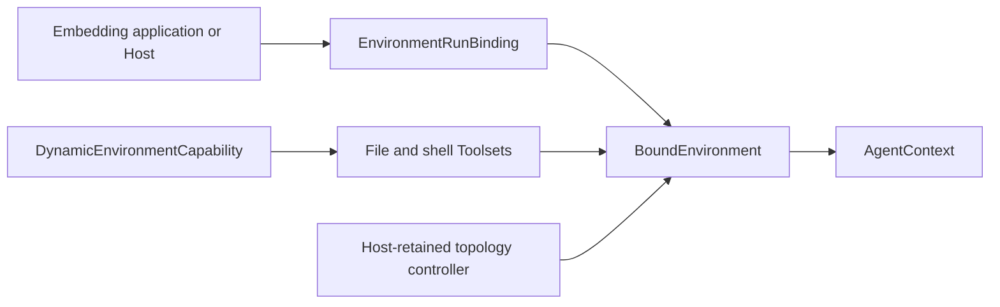

# Environments

An Environment is the Harness run-scoped resource boundary for files, shell commands, processes, retained output, and ports. It is provider-neutral and separate from the optional Capability that exposes those operations to a model.

## Mental Model



- The caller supplies one fresh, single-use `EnvironmentRunBinding` through `RunBindings`.
- The Harness enters it before input production and closes it after the logical run.
- `AgentContext.environment` exposes one stable `BoundEnvironment` facade.
- `DynamicEnvironmentCapability` optionally projects selected operations to the model.
- A Host can retain the paired topology controller to change bindings during one active logical run.

Environment lifecycle is not a Pydantic Capability. A Capability cannot create, mount, refresh, or destroy provider resources merely by being present.

## No-op Environment

`RunBindings.local()` uses `NoopEnvironmentRunBinding` when no Environment is supplied:

```python
bindings = RunBindings.local()
```

This is the right default for an Agent that needs only a model and non-Environment tools.

## Direct Local

Direct Local exposes an explicitly selected existing Host directory to a trusted embedded application. It is an operation backend, not a sandbox claim. Its public configuration and lifecycle Manager belong to `a13n-environment-provider`; the Harness receives only a fresh runtime attachment.

```python
from collections.abc import AsyncGenerator
from contextlib import asynccontextmanager
from pathlib import Path

from a13n_environment_provider import (
    DirectLocalProviderRuntime,
    EnvironmentManagementAction,
    EnvironmentManager,
    EnvironmentOperationContext,
    EnvironmentProviderSpec,
    build_environment_provider_factory_catalog,
)
from a13n_harness import (
    EnvironmentAction,
    EnvironmentBindingRequest,
    EnvironmentPermissionSet,
    EnvironmentStateLimits,
    EnvironmentTopologyLimits,
    EnvironmentTopologyRequest,
    RunBindings,
    create_environment_provider_binding,
    create_environment_run_binding,
)


def direct_local_manager(workspace: Path) -> EnvironmentManager:
    catalog = build_environment_provider_factory_catalog(
        builtin_keys=("a13n.direct-local",),
    )
    return catalog.create_manager(
        EnvironmentProviderSpec(
            provider_key="a13n.direct-local",
            schema_version="1",
            parameters={
                "environment_id": "local-app",
                "root": {"path": str(workspace)},
            },
        ),
        runtime=DirectLocalProviderRuntime(),
    )


@asynccontextmanager
async def local_bindings(
    manager: EnvironmentManager,
    *,
    attempt: int,
) -> AsyncGenerator[RunBindings]:
    correlation = "resource-local-app"
    managed = await manager.create(
        operation=EnvironmentOperationContext(
            operation_id=f"operation-create-{attempt}",
            action=EnvironmentManagementAction.CREATE,
            resource_correlation=correlation,
            attempt=1,
        )
    )
    state = managed.state
    try:
        async with managed:
            async with managed.acquire_attachment() as attachment:
                provider_binding = create_environment_provider_binding(attachment)
                topology = EnvironmentTopologyRequest(
                    topology_version=1,
                    bindings=(
                        EnvironmentBindingRequest(
                            binding_id="workspace",
                            binding_revision=1,
                            alias="local",
                            permission_ceiling=EnvironmentPermissionSet(
                                operations=frozenset(
                                    {
                                        EnvironmentAction.FILE_READ_TEXT,
                                        EnvironmentAction.FILE_WRITE_TEXT,
                                    }
                                )
                            ),
                            default_working_directory="/workspace",
                            provider_binding=provider_binding,
                        ),
                    ),
                    default_binding_id="workspace",
                )
                environment = create_environment_run_binding(
                    initial_topology=topology,
                    topology_limits=EnvironmentTopologyLimits(),
                    state_limits=EnvironmentStateLimits(),
                )
                yield RunBindings.local(environment=environment)
    finally:
        await manager.destroy(
            state,
            operation=EnvironmentOperationContext(
                operation_id=f"operation-destroy-{attempt}",
                action=EnvironmentManagementAction.DESTROY,
                resource_correlation=correlation,
                attempt=1,
            ),
        )
```

Keep `local_bindings()` open for the complete Harness run. A later Harness continuation gets another fresh managed-resource scope and attachment. The Harness restores `HarnessState`; it never calls the provider Manager's `resume()` method. A Host calls Manager `resume()` only when its own persisted provider resource state and lifecycle policy require provider-resource resume.

The Direct Local root has no Provider, Agent, Session, or binding owner. The Host creates, shares, retains, and removes it. Direct Local validates it and never creates, deletes, tags, or locks it. The virtual `/workspace` path routes to the selected default binding; `/environment/{alias}` addresses an explicit alias in a multi-binding topology.

Direct Local should be used only when the embedding process intentionally grants its own OS access. Use an isolated provider when untrusted code requires a real sandbox boundary.

## Expose Environment Tools

The Environment can exist without model-facing tools. Add `DynamicEnvironmentCapability` to the Agent definition to select a stable tool surface:

```python
from a13n_harness import (
    DynamicEnvironmentCapability,
    DynamicEnvironmentConfiguration,
)

capabilities = (
    DynamicEnvironmentCapability(
        DynamicEnvironmentConfiguration(
            file_tools=True,
            shell_tools=False,
            process_tools=False,
            port_tools=False,
            max_reference_entries=64,
        )
    ),
)
```

The configuration controls which Toolsets are composed. The current binding's descriptor and permission ceiling control which operations can actually execute.

## Authorization and Provider Enforcement

Three decisions remain distinct:

1. **Tool surface:** the definition exposes a file, shell, process, or port operation.
2. **Fresh invocation policy:** a run Capability authorizes the managed invocation for the current identity and arguments.
3. **Environment enforcement:** the selected binding's exact `EnvironmentPermissionSet` and provider implementation permit the operation.

A provider denial always narrows a Harness allow decision. Provider availability never grants authorization.

The `local` layer of the repository's [Agent Application example](https://github.com/converge-ai-labs/agent-foundation/tree/main/examples/agent-app) uses a deliberately simple allow evaluator only inside a caller-owned temporary workspace. A real application should evaluate current identity, tool metadata, normalized arguments, effects, and resources.

## Multiple Bindings and Routing

`create_environment_run_binding()` accepts a finite topology of binding requests. Each request has:

- a stable `binding_id` for one logical slot;
- a monotonic `binding_revision`;
- a unique model-facing `alias`;
- an exact permission ceiling;
- a default working directory;
- one fresh provider binding candidate.

The aggregate publishes routing atomically. Operations select one revision and remain fenced to it; a refresh does not silently retarget an in-flight handle, cursor, or path.

## Dynamic Topology

Every `EnvironmentRunBinding` exposes its paired `controller`. Application code that needs live mutation retains the controller before transferring the single-use binding into `RunBindings`:

```python
environment_binding = create_environment_run_binding(
    initial_topology=topology,
    topology_limits=topology_limits,
    state_limits=state_limits,
)
controller = environment_binding.controller
bindings = RunBindings.local(environment=environment_binding)
```

The controller is process-local authority and exists only for that logical run. A trusted Host can prepare and publish add, refresh, or remove changes while the stream is active. The stable `BoundEnvironment` facade and model tool schemas do not change. Topology observations enter the canonical Harness event stream.

Do not place the controller in `RunBindings.metadata`, model context, a Capability state namespace, or durable storage.

## Portable Environment State

At safe state-export boundaries, the aggregate can collect bounded provider-defined portable values into `HarnessState.environment_state`. On resume:

1. the caller reconstructs the desired topology and fresh provider bindings;
2. the Harness enters those bindings;
3. compatible portable Environment state is restored;
4. the Environment activates for the new logical run.

Portable state cannot create a binding, choose a provider, reconnect a sandbox, restore credentials, or grant access.

## EIP-backed Operations

The Harness includes an `EIPEnvironmentProviderBinding` adapter for fresh single-use runtime attachments from `a13n-environment-provider`. It maps the generated Environment Interaction Protocol file, process, output, and port operations onto the same provider-neutral interfaces used by Direct Local.

Carrier acquisition and provider resource lifecycle remain outside the Agent definition. A Host must keep the attachment-acquisition scope alive for the complete lifetime of the adapted binding and transfer each attachment at most once.

The documented Harness boundary begins with an already selected fresh run binding or runtime attachment. Provider resource specification, allocation, resume, pause, destruction, reconciliation, credentials, and durable resource state remain outside the Agent definition and Harness run.

## Extensions

Use an `EnvironmentRunExtension` only when a resource needs the complete entered aggregate rather than one provider revision. Extensions enter after portable state restoration and exit in reverse order before provider teardown. They are trusted process-local lifecycle code and are not model-visible by themselves.

See [Plugins and Extensions](plugins.md) for direct composition and explicit factory discovery.
