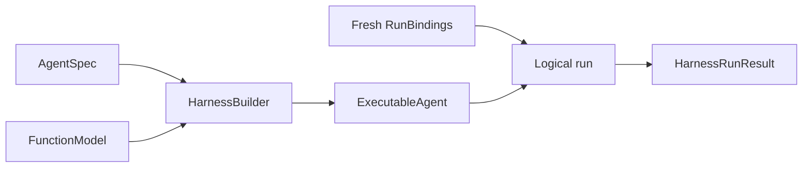

# Getting Started

This guide builds and runs the smallest useful Agent Harness application. It uses a deterministic Pydantic AI `FunctionModel`, so it needs no API key or network access.

## Requirements

- Python 3.13 or later
- `converge-agent-harness`

```bash
pip install converge-agent-harness
```

The package includes Pydantic AI's slim runtime. Add the model-provider dependency required by your application separately.

## Run an Offline Agent

Create `app.py`:

```python
import asyncio
from collections.abc import AsyncIterator

from converge_agent_harness import HarnessBuilder, RunBindings
from pydantic_ai.agent.spec import AgentSpec
from pydantic_ai.messages import ModelMessage
from pydantic_ai.models.function import AgentInfo, FunctionModel


async def respond(
    messages: list[ModelMessage],
    info: AgentInfo,
) -> AsyncIterator[str]:
    del messages, info
    yield "Hello from the Harness"


async def main() -> None:
    executable = HarnessBuilder().build_code(
        AgentSpec(model="logical:example"),
        output_type=str,
        model=FunctionModel(stream_function=respond),
    )

    async with executable:
        result = await executable.run(
            "Say hello",
            bindings=RunBindings.local(),
        )

    print(result.output_or_raise())


if __name__ == "__main__":
    asyncio.run(main())
```

Run it:

```bash
python app.py
```

The output is:

```text
Hello from the Harness
```

## What Each Part Owns



- `AgentSpec` is native Pydantic AI configuration.
- `HarnessBuilder` validates Harness composition and creates one reusable `ExecutableAgent`.
- `FunctionModel` mocks the model provider. A production application can supply any supported Pydantic AI model or resolve a logical model through a fresh model binding.
- `RunBindings` supplies current identity, Environment, model integration, and run-scoped Capabilities. Create fresh bindings for every logical run.
- `HarnessRunResult` normalizes completion, suspension, failure, cancellation, state, usage, and correlation IDs.
- `async with executable` closes recursively owned child executables deterministically.

The logical model string and the concrete `FunctionModel` are intentionally separate. `"logical:example"` is the definition-facing model identity; the concrete model is trusted process-local build input in this example.

## Build Once, Run More Than Once

An executable is reusable until it is closed. Each call still receives fresh bindings and produces a new `run_id`:

```python
async with executable:
    first = await executable.run("First turn", bindings=RunBindings.local())
    second = await executable.run(
        "Second turn",
        bindings=RunBindings.local(),
        previous_state=first.state,
    )
```

When `previous_state` is supplied, the second run continues the same Thread and therefore preserves `thread_id`. It is still a distinct process-local run with a new `run_id`.

## Add Behavior Deliberately

The minimal Agent has the mandatory Harness boundaries but no optional tools. Add behavior through definition-selected Capabilities:

```python
from converge_agent_harness import RuntimeContextCapability, WorkingStateCapability

executable = HarnessBuilder().build_code(
    AgentSpec(model="logical:example"),
    output_type=str,
    model=FunctionModel(stream_function=respond),
    capabilities=(
        RuntimeContextCapability(),
        WorkingStateCapability(),
    ),
)
```

Definition Capabilities describe stable Agent behavior. Provider clients, authorization policy, user-specific selection, and other current authority belong in fresh `RunBindings.capabilities` instead.

## Next Steps

- Run the `basic` layer of the repository's [Agent Application example](https://github.com/converge-ai-labs/agent-foundation/tree/main/examples/agent-app) for this minimal path with an injectable model.
- Read [Agents and Runs](agents-and-runs.md) for the complete build, stream, result, and cleanup path.
- Read [Capabilities](capabilities.md) to choose optional first-party behavior.
- Read [Environments](environments.md) before exposing files, shell commands, processes, or ports.
- Continue with the example's `local` layer for a complete offline tool, working-state, suspension, and resume flow.
