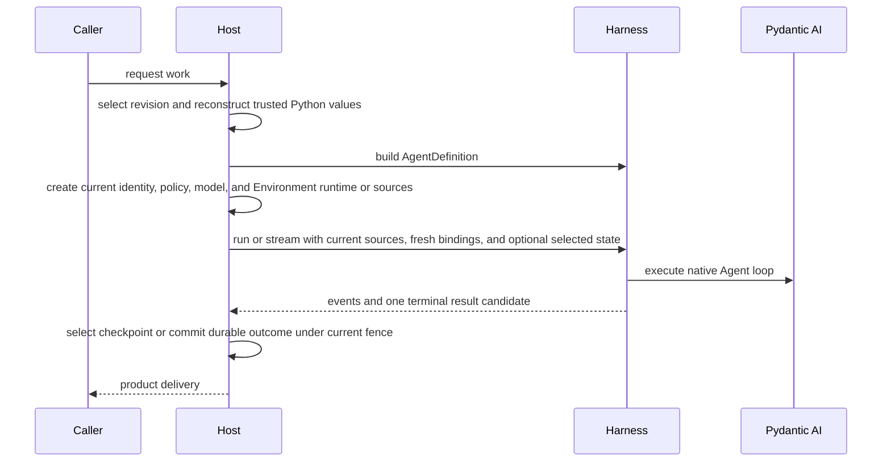

# Embedding in a Host

Embedded applications and hosted execution workers use the same Agent Harness API. A Host adds durable definition selection, current authority, checkpoint selection, worker ownership, and terminal commit around the process-local Harness path; it does not need a second Agent format or execution loop.

## Core Integration Path



The Harness owns the process-local portion from build through clean result delivery. The Host owns everything that must survive or coordinate multiple processes.

## Reconstruct Trusted Definitions

A Host can persist its own schema containing values such as:

- logical model IDs and model settings;
- native `AgentSpec` fields selected by the product;
- output-schema selection;
- Capability and tool declarations under Host-owned schemas;
- plugin configuration and exact artifact locks;
- child topology and recovery policy.

At execution time, trusted adapters reconstruct native Python objects and call `HarnessBuilder`. Do not persist Python classes, callables, model instances, Toolsets, Capabilities, plugin objects, or live clients in a Harness definition document.

Harness owns only its narrow middleware-plugin configuration envelope. It is not a universal Agent or Environment configuration language.

## Build and Reuse

A worker can cache a built executable for one exact trusted definition revision and reuse it across non-overlapping or supported concurrent runs. Each run still receives fresh bindings:

```python
result = await executable.run(
    input_value,
    bindings=reconstruct_current_bindings(execution_attempt),
    previous_state=selected_checkpoint,
)
```

Close the executable when its owning cache entry or process shuts down. Replacement builders or plugin graphs should be constructed and validated before routing new runs to them.

## Fresh Authority

For each logical run, reconstruct:

- authenticated `AgentInstanceContext` when the embedded default is insufficient;
- one current Environment Provider, entered Resource, or single-use `EnvironmentRuntime`;
- current model resolver and credentials;
- run Capabilities for invocation policy, approvals, media/documents/Web, monitoring, delegation, or Skill selection;
- bounded non-authoritative metadata.

Saved messages and Capability state never restore these values. A resume must re-evaluate current policy and provider availability. Model-cost policy is definition-scoped rather than a fresh run attachment: the Builder inserts the default catalog policy or accepts exactly one code-first replacement, and inline descendants inherit the parent's effective policy.

## Durable State Boundary

Persist a complete `HarnessState` candidate only as one part of a Host checkpoint. Keep the following Host facts alongside or outside it:

- exact definition revision and dependency/artifact lock;
- Execution and ExecutionAttempt identity;
- current generation, lease, and opaque fence;
- selected checkpoint reference and producing provenance;
- desired Environment mount definitions and provider resource state;
- pending deferred calls, approvals, or external delivery records;
- durable asynchronous-child state;
- usage/accounting and terminal output records.

The state candidate itself remains portable process-local continuation data.

## Attempts and Recovery

One logical Harness run can contain bounded internal model attempts. They share one context, Environment, plugin graph, state coordinator, usage accumulator, `thread_id`, and `run_id`.

A replacement worker attempt is different. It starts a new Harness run with:

- a new `run_id`;
- fresh bindings and provider scopes;
- the Host-selected prior `HarnessState`;
- current fenced lifecycle ownership.

Do not create another durable worker-attempt record for an internal model recovery. Do not blindly replay a tool or provider mutation whose prior outcome is uncertain.

## Events and Streaming

The Host consumes one `HarnessRunStream` and can project observations to its own stream protocol or storage. Earlier events remain observations even if a later model attempt succeeds.

The terminal `HarnessRunResultEvent` is emitted only after Harness-owned cleanup succeeds. It still does not mean:

- the Host committed durable completion;
- an output was delivered to a user or connector;
- usage was reconciled for billing;
- an external side effect happened exactly once.

Commit those facts under the Host's own current fence and transaction rules.

## Deferred Work

A suspended root Harness result closes the process-local run. The Host owns:

- durable pending-call or approval records;
- authentication of the person or external executor;
- idempotent feedback acceptance;
- exact result/category coverage;
- selection of the continuation checkpoint;
- reconstruction of the exact current tool surface.

Resume through `DeferredToolResume` in a new root run. Do not keep a database transaction, worker lease call, or live stream open while waiting for human input.

Child runs never create durable deferred work. Declaratively deferred tools are absent, and runtime `CallDeferred` or `ApprovalRequired` requests become denied tool results inside the same child run. If a custom path unexpectedly returns terminal deferred requests, the child fails with `subagent_deferred_unsupported`. A Host asynchronous-child service therefore persists active or terminal child records only; it must not create a waiting child state, collect child deferred responses, or interpret deferred stream events as suspension authority.

## Environments

Environment source type communicates ownership:

- a Provider passed through `environment=` or `environments=` delegates one complete ephemeral Resource lifecycle to the Harness;
- an already entered Resource is borrowed for one fresh attachment while the Host retains its outer lifecycle;
- an `EnvironmentRuntime` in `RunBindings.environment` is the advanced route for exact mounts and Host-retained mutation authority.

Use Provider input only for a temporary Resource that should be destroyed before terminal result delivery, including a suspended result. Use an entered Resource when the same provider resource must survive sequential runs, deferred continuation, or Host scheduling. A mixed `environments` mapping can contain both forms. With several aliases, set `default_environment` explicitly when `/workspace` should route to one of them; mapping order never grants authority.

The Host remains responsible for provider plugin selection, specification validation, credentials, durable desired mount definitions, and authoritative `EnvironmentProviderResourceState` persistence. It explicitly creates, resumes, pauses, reconciles, and destroys reusable Resources. Each Harness run acquires a fresh attachment and never restores live authority from `HarnessState`.

Advanced attachment and runtime-mount assembly lives under `a13n_harness.environment.advanced`. Keep every attachment-acquisition scope open for the complete lifetime of the adapted mount. Never copy provider credentials, Resource objects, attachments, an `EnvironmentRuntime`, or provider launch state into `HarnessState` or model context.

## Background Processes Across Turns and Restarts

A background process has two distinct owners:

| Domain              | Stored fact                                                                   | Owner                              |
| ------------------- | ----------------------------------------------------------------------------- | ---------------------------------- |
| Parent continuation | `process-N`, opaque backend ID, unread offsets, sequence, bounded observation | `HarnessState.agent_context_state` |
| Canonical work      | Process object, controls, retained output, Environment scope, cleanup         | Configured `ShellOperator`         |

The standard `ProcessManager` is the process-local canonical owner. Construct it once for an embedding executable or Runner generation. Its Host `ProcessLauncher` may reopen exact provider state into a fresh Environment, reuse an underlying sandbox according to provider semantics, start the process, and return a self-contained `ManagedProcess`. The launcher must finish this construction before returning and must not borrow the parent Run's `BoundEnvironment`.

Parent Run or Environment exit never closes the Manager. `force_close()` is an explicit Host decision, normally made when the embedding executable or Runner generation ends. A Host with a broader canonical process service can retain or replace the operator under its own lifecycle policy.

For every later Run that may address existing work, reconstruct the Capability with the same Manager and supply the complete selected `HarnessState`. The parent projection rebinds its opaque backend ID through that Manager. A missing record becomes explicitly lost; Harness never reconstructs it from a mount name, PID, provider enumeration, or another process.

Current-Run observers can enqueue bounded wait/status notices. Stable Manager hooks are independent and include `AgentInstanceContext.host_refs`, so a Host can correlate completion after the Run closes and optionally schedule a new Run from its selected continuation. Hook delivery is best-effort unless the Host adds a durable contract outside Harness.

The default Manager does not survive a Host process or Runner-generation restart. A Host requiring that guarantee supplies a custom background-capable `ShellOperator` backed by independently retained process and output state. The standard Toolset, compact projections, and loss behavior remain unchanged.

## Minimal vs. Production Host

| Embedded application                            | Distributed Host                                   |
| ----------------------------------------------- | -------------------------------------------------- |
| Omit `bindings` or use `RunBindings.embedded()` | Explicit authenticated instance context            |
| In-memory selected state                        | Durable immutable checkpoints and selection        |
| No Environment or Harness-owned Provider        | Host-owned Resources and fresh per-run attachments |
| Process-local policy collaborators              | Current tenant/user policy and credentials         |
| Direct result handling                          | Fenced terminal commit and delivery lifecycle      |
| Inline child execution                          | Optional durable child Execution lifecycle         |

Start with the embedded path and add Host-owned durable boundaries only when the product requires them.

## Runnable Example

The [Agent Application example](https://github.com/converge-ai-labs/agent-foundation/tree/main/examples/agent-app) runs entirely offline and demonstrates the boundary before a full durable Host: it streams repeated turns, atomically stores the returned `HarnessState` only after successful completion, resumes the same Thread after application restart, and creates and destroys one Harness-owned Provider Resource per turn.

Its single state file is application teaching code, not an Execution ledger, lease, fence, or prescribed production persistence implementation. Add the Host-owned records described above when multiple workers, replacement attempts, side effects, or durable terminal delivery require them.
