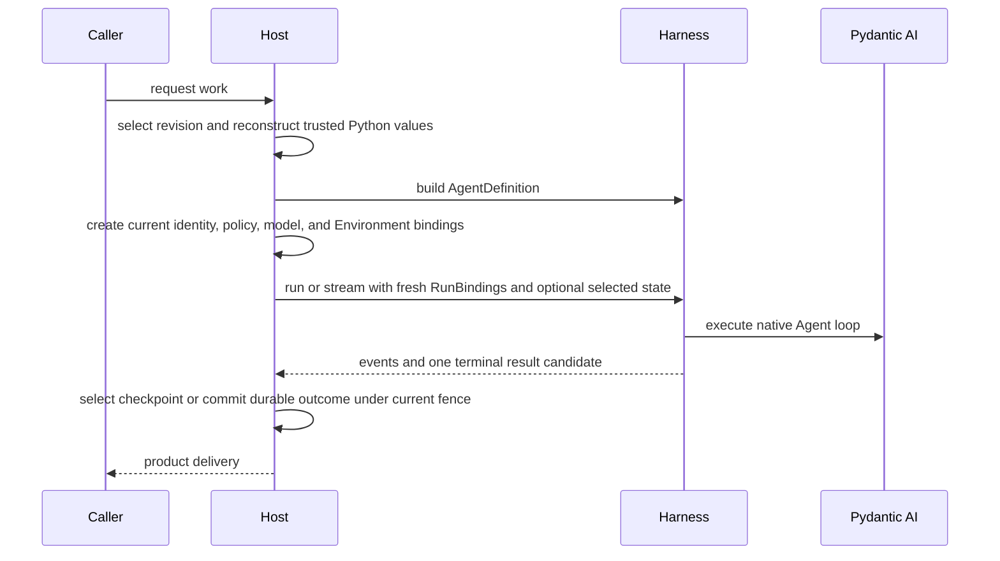

# Embedding in a Host

Embedded applications and hosted execution workers use the same Agent Harness API. A Host adds durable definition selection, current authority, checkpoint selection, worker ownership, and terminal commit around the process-local Harness path; it does not need a second Agent format or execution loop.

## Core Integration Path



The Harness owns the process-local portion from build through clean result delivery. The Host owns everything that must survive or coordinate multiple processes.

## Reconstruct Trusted Definitions

A Host can persist its own schema containing values such as:

- logical model IDs and model settings;
- native `AgentSpec` fields selected by the product;
- output-schema selection;
- Capability and tool declarations under Host-owned schemas;
- plugin configuration and exact artifact locks;
- child topology and recovery policy.

At execution time, trusted adapters reconstruct native Python objects and call `HarnessBuilder`. Do not persist Python classes, callables, model instances, Toolsets, Capabilities, plugin objects, or live clients in a Harness definition document.

Harness owns only its narrow middleware-plugin configuration envelope. It is not a universal Agent or Environment configuration language.

## Build and Reuse

A worker can cache a built executable for one exact trusted definition revision and reuse it across non-overlapping or supported concurrent runs. Each run still receives fresh bindings:

```python
result = await executable.run(
    input_value,
    bindings=reconstruct_current_bindings(execution_attempt),
    previous_state=selected_checkpoint,
)
```

Close the executable when its owning cache entry or process shuts down. Replacement builders or plugin graphs should be constructed and validated before routing new runs to them.

## Fresh Authority

For each logical run, reconstruct:

- authenticated `AgentInstanceContext`;
- one fresh Environment run binding or fresh runtime attachment;
- current model binding and credentials;
- run Capabilities for invocation policy, approvals, media/documents/Web, monitoring, usage pricing, delegation, or Skill selection;
- bounded non-authoritative metadata.

Saved messages and Capability state never restore these values. A resume must re-evaluate current policy and provider availability.

## Durable State Boundary

Persist a complete `HarnessState` candidate only as one part of a Host checkpoint. Keep the following Host facts alongside or outside it:

- exact definition revision and dependency/artifact lock;
- Execution and ExecutionAttempt identity;
- current generation, lease, and opaque fence;
- selected checkpoint reference and producing provenance;
- desired Environment topology and provider resource state;
- pending deferred calls, approvals, or external delivery records;
- durable asynchronous-child state;
- usage/accounting and terminal output records.

The state candidate itself remains portable process-local continuation data.

## Attempts and Recovery

One logical Harness run can contain bounded internal model attempts. They share one context, Environment, plugin graph, state coordinator, usage accumulator, `thread_id`, and `run_id`.

A replacement worker attempt is different. It starts a new Harness run with:

- a new `run_id`;
- fresh bindings and provider scopes;
- the Host-selected prior `HarnessState`;
- current fenced lifecycle ownership.

Do not create another durable worker-attempt record for an internal model recovery. Do not blindly replay a tool or provider mutation whose prior outcome is uncertain.

## Events and Streaming

The Host consumes one `HarnessRunStream` and can project observations to its own stream protocol or storage. Earlier events remain observations even if a later model attempt succeeds.

The terminal `HarnessRunResultEvent` is emitted only after Harness-owned cleanup succeeds. It still does not mean:

- the Host committed durable completion;
- an output was delivered to a user or connector;
- usage was reconciled for billing;
- an external side effect happened exactly once.

Commit those facts under the Host's own current fence and transaction rules.

## Deferred Work

A suspended Harness result closes the process-local run. The Host owns:

- durable pending-call or approval records;
- authentication of the person or external executor;
- idempotent feedback acceptance;
- exact result/category coverage;
- selection of the continuation checkpoint;
- reconstruction of the exact current tool surface.

Resume through `DeferredToolResume` in a new run. Do not keep a database transaction, worker lease call, or live stream open while waiting for human input.

## Environments

The Harness begins with a fresh `EnvironmentRunBinding` or runtime attachment. A Host remains responsible for provider selection, resource create/resume/pause/destroy, credentials, desired topology, and authoritative resource-state persistence.

If a provider exposes an attachment acquisition scope, retain that scope for the complete lifetime of the adapted Harness binding. Never copy provider credentials or launch state into `HarnessState` or model context.

## Minimal vs. Production Host

| Embedded application               | Distributed Host                                 |
| ---------------------------------- | ------------------------------------------------ |
| `RunBindings.local()`              | Explicit authenticated instance context          |
| In-memory selected state           | Durable immutable checkpoints and selection      |
| Direct Local or no-op Environment  | Provider-managed resources and fresh attachments |
| Process-local policy collaborators | Current tenant/user policy and credentials       |
| Direct result handling             | Fenced terminal commit and delivery lifecycle    |
| Inline child execution             | Optional durable child Execution lifecycle       |

Start with the embedded path and add Host-owned durable boundaries only when the product requires them.

## Runnable Example

The [Host persistence example](https://github.com/converge-ai-labs/agent-foundation/tree/main/examples/hosting) runs entirely offline and demonstrates:

- Host-owned Execution and ExecutionAttempt records;
- opaque fencing and stale-attempt rejection;
- selection of a safe interrupted-state candidate;
- fresh bindings on replacement;
- a separate Host terminal commit.

Its JSON file store is teaching code, not a prescribed persistence implementation.
