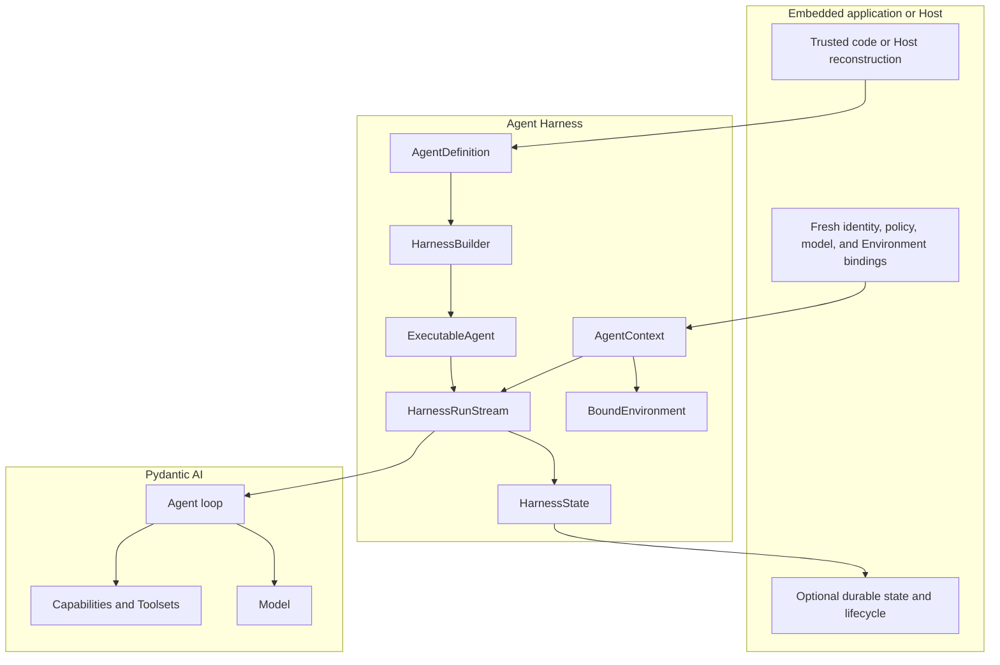

# Agent Harness

`a13n-harness` is an embeddable, process-local runtime for building Pydantic AI agents with typed run bindings, provider-neutral tools and Environments, portable continuation state, normalized events, usage attribution, inline delegation, and restricted CodeAct orchestration.

It is a Python code library, not a hosted service or a second Agent framework.

## Start Here

```bash
pip install a13n-harness
```

The smallest application follows one path:

```text
AgentSpec -> HarnessBuilder -> ExecutableAgent -> RunBindings -> run/stream -> HarnessRunResult
```

Follow [Getting Started](getting-started.md) to run that path entirely offline, then read [Agents and Runs](agents-and-runs.md) for the complete lifecycle.

## What the Harness Adds

Pydantic AI remains responsible for the Agent loop, Models, Toolsets, Capabilities, messages, deferred values, output validation, events, and native usage. Agent Harness adds the reusable boundaries around that loop:

- code-first `AgentDefinition` and `HarnessBuilder` construction;
- one reusable `ExecutableAgent` with deterministic child ownership and cleanup;
- fresh typed `RunBindings` and one `AgentContext` per logical run;
- mandatory tool-result, message-integrity, model-context, lifecycle-event, and usage boundaries;
- trusted outer middleware plugins;
- provider-neutral Environment operations and live topology coordination;
- optional first-party Capabilities for context, files, shell, processes, Skills, working state, interaction, media, documents, Web, delegation, and CodeAct;
- one canonical event/result stream;
- portable `HarnessState`, deferred resume, and bounded model recovery;
- mixed model/provider usage attribution.

## Architecture



The Host reconstructs current authority and optionally persists selected state. The Harness runs one process-local logical execution. Pydantic AI owns the inner Agent loop.

## Documentation Map

| Goal                                                   | Guide                                               |
| ------------------------------------------------------ | --------------------------------------------------- |
| Run the smallest offline application                   | [Getting Started](getting-started.md)               |
| Build definitions, run, stream, and handle results     | [Agents and Runs](agents-and-runs.md)               |
| Select first-party behavior and fresh collaborators    | [Capabilities](capabilities.md)                     |
| Expose files, shell, processes, output, or ports       | [Environments](environments.md)                     |
| Continue, fork, checkpoint, suspend, and resume        | [State and Resume](state-and-resume.md)             |
| Use blocking child Agents or restricted Python         | [Delegation and CodeAct](delegation-and-codeact.md) |
| Discover and select Skill packages                     | [Skills](skills.md)                                 |
| Add trusted outer middleware or Environment extensions | [Plugins and Extensions](plugins.md)                |
| Add Host persistence, fencing, and durable lifecycle   | [Embedding in a Host](hosting.md)                   |

## Documented Boundary

These guides cover the process-local Harness surface and its tested integration boundaries:

- Direct Local and EIP-backed Environment **operations** enter through fresh run bindings and attachments.
- Media, document, Web, monitoring, model, policy, and pricing integrations are typed seams; applications supply their live implementations per run.
- Inline delegation waits for a child result; durable or background child scheduling remains a Host concern.
- `HarnessState` is continuation data; it is not a durable Execution record or restored authority.
- Observability at this boundary consists of the canonical event stream and usage records; exporter and telemetry-backend configuration belongs to the embedding application.
- Provider resource lifecycle begins outside the Harness with an already selected fresh binding or runtime attachment.

## Trust and Ownership

| Concern                                                                  | Owner                |
| ------------------------------------------------------------------------ | -------------------- |
| Native Agent loop, Model, Capability, Toolset, messages, deferred values | Pydantic AI          |
| Process-local definition, run, Environment facade, events, result, state | Agent Harness        |
| Provider client, credentials, resource lifecycle, external side effects  | Integration/provider |
| Durable definitions, checkpoints, executions, leases, delivery           | Embedding Host       |
| Product authorization and presentation                                   | Application/product  |

Installed extension metadata means code is available, not authorized. Saved state means prior data is available, not that prior authority remains valid.

## Runnable Examples

- [Agent Application](https://github.com/converge-ai-labs/agent-foundation/tree/main/examples/agent-app): one progressive project covering the minimal embedded run, Direct Local tools and structured resume, then Host-owned attempts, fencing, checkpoint selection, and terminal commit.
- [Plugin Integration](https://github.com/converge-ai-labs/agent-foundation/tree/main/examples/plugins): packaged middleware and Environment extension discovery.

The examples use deterministic `FunctionModel` implementations so their Agent loops and tool boundaries are reproducible without external model credentials.

## Normative Design

These pages are user documentation. The accepted architecture, invariants, compatibility rules, and ownership contracts remain in the [Agent Harness specification](https://github.com/converge-ai-labs/agent-foundation/tree/main/spec/agent-harness).
