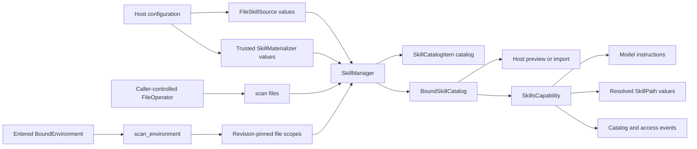

# Integrate Skill Discovery in a Host

`converge-agent-harness` keeps Skill discovery reusable outside Agent execution. A Host chooses one of two explicit modes:

| Host situation                                                 | API                                              | Result                         | Consistency owner                                                                          |
| -------------------------------------------------------------- | ------------------------------------------------ | ------------------------------ | ------------------------------------------------------------------------------------------ |
| A CLI or embedded process directly controls one `FileOperator` | `SkillManager.scan(files=...)`                   | `tuple[SkillCatalogItem, ...]` | The caller keeps the operator's namespace stable                                           |
| A Host uses an entered `BoundEnvironment`                      | `SkillManager.scan_environment(environment=...)` | `BoundSkillCatalog`            | The manager pins binding revisions; the Host checks catalog currency before later path use |

Both modes use the same `SkillSource`, `SkillMaterializer`, frontmatter parser, limits, conflict policy, and path-containment checks. Neither mode scans a home directory, installed package, or sibling workspace implicitly.

## Design



The design separates four responsibilities:

- `FileSkillSource` discovers bounded metadata below explicitly configured FileOperator roots.
- `SkillMaterializer` is trusted Host code that publishes managed packages beneath one declared root.
- `SkillManager` performs materialization, discovery, validation, conflict resolution, and optional Environment revision binding without depending on an Agent run.
- `SkillsCapability` adapts one bound catalog into run selection, model instructions, resolved `SkillPath` values, access observations, and model/tool-boundary stale checks.

The first-version API has no compatibility or discovery fallback:

- `scan(files=...)` uses exactly the supplied FileOperator and never constructs or probes an Environment;
- `scan_environment(environment=...)` uses only revision-pinned scopes and never retries through the unpinned `environment.files` facade or direct scan mode;
- a source reads only its declared roots and never tries the process working directory, home directory, package locations, or alternate workspace paths;
- a relevant route change raises `skill_catalog_stale`; it never triggers an automatic rescan or retarget;
- `FileSkillSource`, `SkillSource.roots`, and `SkillManager.roots` are the only source/root names; there are no legacy aliases.

`required=False` is explicit source policy rather than fallback discovery. It can omit that exact missing, unroutable, or unsupported root, but it never substitutes another path.

## Skill Package Layout

A selected root can itself be a Skill package, and each immediate child directory can be one Skill package. Discovery does not recurse beyond that level.

```text
.agents/skills/
├── SKILL.md
├── code-review/
│   ├── SKILL.md
│   └── checklist.md
└── release/
    └── SKILL.md
```

Each `SKILL.md` starts with bounded YAML frontmatter:

```markdown
---
name: code-review
description: Review a code change for correctness and maintainability.
---

# Code review

Follow the repository review workflow.
```

`name` is the conflict and run-selection identity. Skill content is untrusted model context; it grants no tools, credentials, filesystem access, plugin loading, or package authority.

## Scan a Direct FileOperator

Use direct scanning when the Host already owns a non-virtual FileOperator and controls its lifetime and retargeting. Roots are canonical absolute paths in that operator's namespace: repeated separators, traversal segments, and a trailing slash other than `/` are rejected. For example, a root-confined local operator whose `/` is the project directory uses `/.agents/skills`, not `/workspace/.agents/skills`:

```python
from converge_agent_harness import (
    FileSkillSource,
    FileOperator,
    SkillCatalogItem,
    SkillManager,
)


async def scan_cli_skills(
    files: FileOperator,
) -> tuple[SkillCatalogItem, ...]:
    manager = SkillManager(
        (
            FileSkillSource(
                "project",
                ("/.agents/skills",),
                required=False,
            ),
        )
    )
    return await manager.scan(files=files)
```

This mode intentionally has no Environment topology or binding-revision semantics. Keep the FileOperator's backing namespace stable until every path derived from the returned catalog has been consumed. If another process can replace the backing directory concurrently, provide an operator with the snapshot or locking behavior your Host requires, or use an entered Environment instead.

`SkillManager.default()` is designed for Environment-backed runs and contains the canonical `/workspace/.agents/skills` source. A direct FileOperator Host normally constructs an explicit manager with roots in its own namespace.

## Scan an Entered Environment

Use Environment-aware scanning when paths can route through `/workspace` or `/environment/{alias}` and topology can change while the Host is active:

```python
from converge_agent_harness import BoundEnvironment, BoundSkillCatalog, SkillManager


async def scan_environment_skills(
    environment: BoundEnvironment,
) -> BoundSkillCatalog:
    manager = SkillManager.default()
    catalog = await manager.scan_environment(environment=environment)

    # Call again immediately before consuming catalog paths after any await.
    catalog.require_current(environment)
    return catalog
```

`scan_environment()`:

1. captures every configured root with `BoundEnvironment.select_files()` before awaiting provider I/O;
2. opens revision-pinned file scopes for those roots;
3. runs materialization, listing, frontmatter reads, and final `SKILL.md` validation through the pinned scopes;
4. resolves every final item to exact directory and document `EnvironmentPath` values;
5. verifies that every configured scan route, including empty and conflict-overridden roots, is still current before returning.

A `BoundSkillCatalogItem` contains:

- `name`, `description`, `path`, and `source_id`;
- `directory`, the exact resolved Skill directory;
- `document`, the exact resolved `SKILL.md` path;
- `observed_generation`, the provider generation held during scanning.

`BoundSkillCatalog.require_current(environment)` reselects only paths represented by catalog items. Adding or refreshing an unrelated Environment binding does not invalidate the catalog. Changing a relevant binding revision, provider generation, default route, alias route, or resolved provider path raises `DefinitionError` with code `skill_catalog_stale`.

Do not persist `EnvironmentPath` values as durable authority. They describe one entered Environment and are useful only while that Environment remains active. A Host that imports Skill packages should copy and validate package content into its own immutable revision format.

## Add Explicit Sources

Retain the canonical workspace source and append Host roots with normal later-source precedence:

```python
from converge_agent_harness import FileSkillSource, SkillManager

manager = SkillManager.default(
    additional_sources=(
        FileSkillSource(
            "organization",
            ("/environment/shared/skills",),
            required=True,
        ),
    )
)
```

Pass an explicit `SkillManager(...)` when the Host wants to replace the default composition completely. Source order is deterministic. Configure `SkillsPolicy(conflict="error")` when duplicate final names must fail rather than use precedence.

With `required=False`, each missing, unroutable, or unsupported root is skipped independently. Permission denial, malformed paths or frontmatter, provider failures, and catalog overflow remain errors.

## Materialize Managed Skills

A trusted Host adapter can implement `SkillMaterializer` to populate one declared source root before scanning:

```python
from converge_agent_harness import FileOperator


class ManagedSkillMaterializer:
    materializer_id = "managed-snapshot"
    target_root = "/workspace/.agents/skills"

    async def materialize(self, *, files: FileOperator) -> None:
        # Verify the Host-owned package manifest and digest first.
        # Then publish only beneath target_root through `files`.
        ...
```

`target_root` must equal one configured source root. It is a composition and provenance contract, not a sandbox wrapper. The materializer is trusted Host code and must stay beneath that root; the supplied FileOperator or Environment remains the actual authority boundary.

## Use Skills in a Harness Run

Pass the manager to the definition-selected `SkillsCapability`. The Capability uses Environment-aware scanning, publishes exact `SkillPath` values, injects bounded routing instructions, observes ordinary `SKILL.md` reads, and fences the selected catalog at model and tool boundaries.

```python
from converge_agent_harness import (
    RunBindings,
    SkillSelectionRunCapability,
    SkillsCapability,
)

skills = SkillsCapability(manager)

bindings = RunBindings.local(
    environment=environment_binding,
    capabilities=(
        SkillSelectionRunCapability(
            names=frozenset({"code-review", "release"})
        ),
    ),
)
```

Selection is exact and fresh for each root, resumed, or child run:

- omit `SkillSelectionRunCapability` to expose the complete conflict-resolved catalog;
- provide a non-empty set to expose only those names;
- provide an empty set to inject no Skill instructions or paths;
- an unknown name fails run preparation with `skill_selection_unknown`.

Selection is not portable `HarnessState` and grants no source or file authority. If a relevant Environment route changes, the current run fails with `skill_catalog_stale`; it does not silently rescan or retarget frozen instructions.

## Host Responsibilities

The Harness scanner deliberately does not own:

- source CRUD or enablement;
- native path authorization;
- package manifests, digests, signatures, or immutable revisions;
- symlink and traversal policy for imported package copies;
- persistence or refresh history;
- durable execution or retry;
- credentials, plugins, Capabilities, or tools.

An importing Host should scan through `scan_environment()`, select one exact item, verify the catalog remains current, enumerate and validate the package through the same entered Environment, copy it into Host-owned immutable storage, and validate the copied package again before publication.
