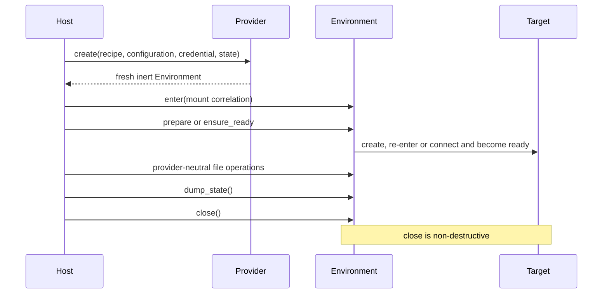
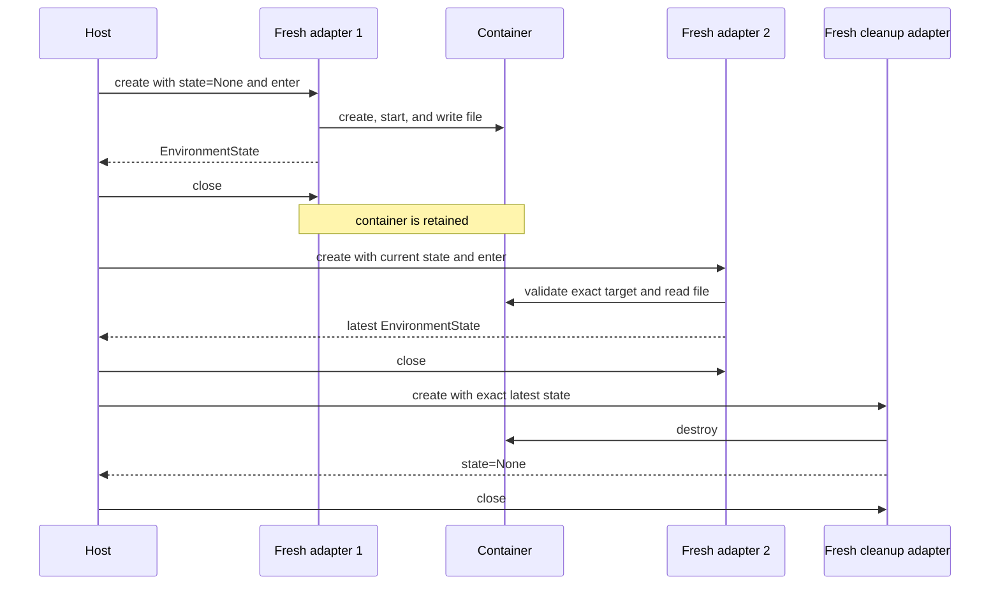

The runnable [`examples/environment-provider`](https://github.com/converge-ai-labs/agent-foundation/tree/main/examples/environment-provider) project shows how Host code uses selected built-in Environment Providers directly. For cloud backends, see [Cloud providers](providers.md#cloud-providers). It runs no Agent and needs no model credentials.

Native and Envd backends follow the same Host-owned sequence:



## Install the example

The example is an independent project that resolves the Provider package from the local checkout:

```bash
cd examples/environment-provider
uv sync --locked
```

For an external application, depend on the released distribution instead:

```bash
uv add a13n-harness
```

## Direct Local

Run the fully offline example:

```bash
uv run environment-provider-example direct_local
```

The command:

- creates a Host-owned workspace;
- selects only `direct_local` in an immutable catalog;
- validates a credential-free recipe against the Provider's declared model;
- constructs and enters one fresh adapter;
- writes and reads `/provider-example.txt` through `EnvironmentOperations.files`;
- observes that `dump_state()` is `None`;
- closes the adapter and verifies that the workspace remains.

Use another workspace with:

```bash
uv run environment-provider-example direct_local \
  --workspace /absolute/path/to/workspace
```

Direct Local is appropriate only when the Environment may share the embedding Host account. The configured operation policy does not provide operating-system isolation from an allowed child process.

## Local Envd

Build or install a compatible `a13n-envd`, then run:

```bash
uv run environment-provider-example local_envd \
  --executable /absolute/path/to/a13n-envd
```

Without `--executable`, the Host-side resolver checks `A13N_ENVD_EXECUTABLE` and then `PATH`. The example supplies that resolved path and a `TemporaryLocalEnvdRuntimeAllocator` through a fresh `LocalEnvdProviderRuntime`.

The shared Host runtime lazily starts a Device. Each adapter uses EIP through its own fixed-cwd Session; adapter `close()` closes that Session only. The example explicitly closes the Host runtime afterward. The selected directory remains Host-owned and `dump_state()` is `None`; another fresh adapter can access the same files without inheriting Session handles.

See [Operate `a13n-envd`](../a13n-envd/index.md) for executable installation, compatibility, and platform prerequisites.

## Docker

With a local Docker Engine available, build the repository sandbox image and run:

```bash
# From the repository root
make image-docker-environment

cd examples/environment-provider
uv run environment-provider-example docker
```

The example selects `a13n-docker-environment:local`, the image produced by `make image-docker-environment`. Pass `--image IMAGE` to use another compatible image; ordinary Docker authentication and pull behavior apply.

The Docker path demonstrates state and retention explicitly:



The example supplies a native `DockerSDKEngine` through `DockerProviderRuntime`. The image needs Python and a POSIX shell; no Envd executable or bootstrap directory is needed.

A production Host persists the latest state before releasing ownership of the lifecycle operation. If creation, readiness, execution, or close fails, read `dump_state()` during unconditional finalization: Docker may already have published the exact target identity even when a later step failed. Never infer absence from an unavailable inspection or select a container by a friendly name.

## Use the adapter with Harness

These examples stop at the single-Environment Provider boundary. In an Agent application, pass the already constructed fresh adapter to Harness:

```python
result = await executable.run(
    "Inspect the workspace",
    environment=environment,
)
```

Harness enters and closes the adapter for that Run. It does not select Providers, construct runtime collaborators, persist authoritative Provider state, or call `destroy()`. Add `DynamicEnvironmentCapability` separately when the model should receive Environment tools.

For a complete offline Harness application, see the [Agent application example](https://github.com/converge-ai-labs/agent-foundation/tree/main/examples/agent-app). For packaging a third-party Provider, see the [Provider plugin example](https://github.com/converge-ai-labs/agent-foundation/tree/main/examples/plugins#environment-provider).

## Validate the examples

From the repository root:

```bash
make examples-check-all
```

The gate lints, type-checks, tests, and builds the independent project. Its smoke path runs Direct Local only; Local Envd and Docker require explicitly provisioned external runtimes.

## HTTP and WebSocket Envd

For a one-command local trial, connection to an existing daemon, and a minimal Host WebSocket handler, use the [Remote Envd guide](remote-envd.md). Both examples use the same two-Run file round trip and preserve the daemon on Provider close. The local demo separately shows operator-owned startup and cleanup.

```bash
uv run environment-provider-example remote_envd_demo \
  --transport http --executable ../../target/debug/a13n-envd
uv run environment-provider-example remote_envd_demo \
  --transport websocket --executable ../../target/debug/a13n-envd
```
