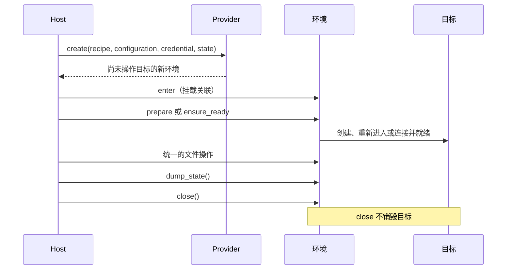
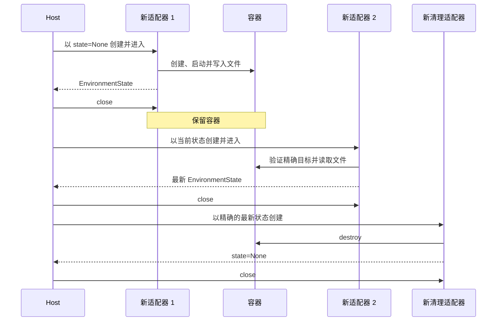

可运行的 [`examples/environment-provider`](https://github.com/converge-ai-labs/agent-foundation/tree/main/examples/environment-provider) 项目展示 Host 代码如何直接使用选定的内置环境 provider。云后端见[云 provider](providers.md#cloud-providers)。示例不运行 agent，也不需要模型凭据。

Native 和 Envd 后端遵循相同的 Host 管理流程：



## 安装示例

该示例是独立项目，从本地检出解析 provider 包：

```bash
cd examples/environment-provider
uv sync --locked
```

外部应用则依赖已发布分发包：

```bash
uv add a13n-harness
```

## Direct Local

运行完全离线的示例：

```bash
uv run environment-provider-example direct_local
```

该命令会：

- 创建 Host 管理的工作空间；
- 在不可变目录中仅选择 `direct_local`；
- 按 provider 声明的模型验证不含凭据的目标配置；
- 构建并进入一个新适配器；
- 通过 `EnvironmentOperations.files` 写入和读取 `/provider-example.txt`；
- 确认 `dump_state()` 为 `None`；
- 关闭适配器并验证工作空间仍存在。

使用另一个工作空间：

```bash
uv run environment-provider-example direct_local \
  --workspace /absolute/path/to/workspace
```

只有环境可以共享嵌入它的 Host 账号时，才适合使用 Direct Local。配置的操作策略不提供针对获准子进程的操作系统隔离。

## Local Envd

构建或安装兼容的 `a13n-envd`，再运行：

```bash
uv run environment-provider-example local_envd \
  --executable /absolute/path/to/a13n-envd
```

未指定 `--executable` 时，Host 解析器依次检查 `A13N_ENVD_EXECUTABLE` 和 `PATH`。示例通过新的 `LocalEnvdProviderRuntime` 提供已解析路径和 `TemporaryLocalEnvdRuntimeAllocator`。

共享 Host 运行时延迟启动设备。每个适配器通过自己的固定 cwd 会话使用 EIP；适配器 `close()` 只关闭该会话。随后示例显式关闭 Host 运行时。所选目录仍由 Host 管理，`dump_state()` 为 `None`；另一个新适配器可访问同一批文件，不继承会话句柄。

可执行文件安装、兼容性和平台前置条件见[运维 `a13n-envd`](../a13n-envd/index.md)。

## Docker

本地 Docker Engine 可用时，构建仓库沙箱镜像并运行：

```bash
# From the repository root
make image-docker-environment

cd examples/environment-provider
uv run environment-provider-example docker
```

示例选择 `make image-docker-environment` 生成的镜像 `a13n-docker-environment:local`。传入 `--image IMAGE` 可使用其他兼容镜像；遵循普通 Docker 身份验证和拉取行为。

Docker 路径显式展示状态和保留：



示例通过 `DockerProviderRuntime` 提供原生 `DockerSDKEngine`。镜像需要 Python 和 POSIX shell；不需要 Envd 可执行文件或启动目录。

生产 Host 应在释放生命周期操作归属前，持久保存最新状态。创建、就绪、执行或关闭失败时，在必定执行的收尾步骤中读取 `dump_state()`：即使后续步骤失败，Docker 可能已经发布精确目标身份。绝不能从检查不可用推断目标不存在，也不能根据友好名称选择容器。

## 在 Harness 中使用适配器

这些示例止于单环境 provider 边界。agent 应用将已构建的新适配器交给 Harness：

```python
result = await executable.run(
    "Inspect the workspace",
    environment=environment,
)
```

Harness 在该次执行中进入和关闭适配器，不选择 provider、构建运行时协作对象、持久保存权威 provider 状态或调用 `destroy()`。模型需要环境工具时，另外添加 `DynamicEnvironmentCapability`。

完整离线 Harness 应用见 [agent 应用示例](https://github.com/converge-ai-labs/agent-foundation/tree/main/examples/agent-app)。第三方 provider 打包见 [provider 插件示例](https://github.com/converge-ai-labs/agent-foundation/tree/main/examples/plugins#environment-provider)。

## 验证示例

在仓库根目录运行：

```bash
make examples-check-all
```

该检查对独立项目执行 lint、类型检查、测试和构建。冒烟路径只运行 Direct Local；Local Envd 和 Docker 需要显式准备外部运行时。

## HTTP 与 WebSocket Envd

单命令本地试用、连接已有守护进程和最小 Host WebSocket handler 见 [Remote Envd 指南](remote-envd.md)。两个示例采用相同的两次执行文件读写流程，provider 关闭后保留守护进程。本地演示还单独展示运维人员管理的启动和清理。

```bash
uv run environment-provider-example remote_envd_demo \
  --transport http --executable ../../target/debug/a13n-envd
uv run environment-provider-example remote_envd_demo \
  --transport websocket --executable ../../target/debug/a13n-envd
```
