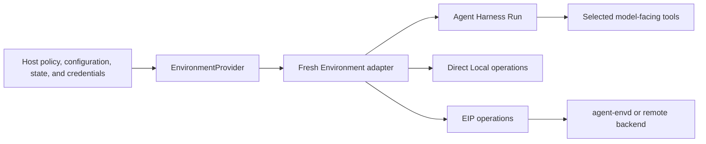

# Environments

An Environment gives an Agent a provider-neutral way to work with files, commands, processes, retained output, and ports. A Host uses an Environment Provider to construct one fresh adapter for a selected workspace, sandbox, container, VM, or remote execution target.

You do not need an Environment for an Agent that only calls ordinary application tools or remote APIs.

## Choose a backend

| Need                                        | Start with                  | Important boundary                                                   |
| ------------------------------------------- | --------------------------- | -------------------------------------------------------------------- |
| No files or command execution               | No Environment              | Keep the Agent surface minimal                                       |
| Trusted access to a Host-selected directory | Direct Local                | Shares the Host account; it is not an operating-system sandbox       |
| Local native command isolation              | Local Envd                  | Launches `agent-envd` and uses EIP over a private stdio carrier      |
| Local container isolation                   | Docker                      | Provider owns the container; EIP owns Agent-visible operations       |
| A remote or vendor sandbox                  | Environment Provider plugin | Construct a fresh adapter that exposes the provider-neutral contract |

Use Direct Local for development, trusted automation, and tests where sharing the Host account is acceptable. Use Local Envd, Docker, or another EIP-backed Provider when command execution must cross an explicit isolation or remote-execution boundary.

## How the layers fit



- **Host** selects a trusted Provider, desired configuration, current state, runtime collaborators, retention policy, and authorization.
- **Environment Provider** validates configuration and constructs fresh single-use adapters without external I/O.
- **Environment** enters or creates one exact target, exposes typed operations, caches the latest state, closes process-local resources, and supports explicit Host destruction.
- **Agent Harness** owns Run-local mount names, access ceilings, routing, state aggregation, and non-destructive cleanup.
- **EIP** is the typed operation protocol used by `agent-envd` and remote backends.

`EnvironmentState` and `HarnessState` are different records. The former is a Provider-owned soft reference to a target; the latter is Agent continuation state. Neither restores current credentials or authorization.

## Build an Environment-aware Agent

Binding an Environment supplies runtime authority but does not automatically expose operations to the model. Add the dynamic Environment Capability; it derives model-visible tools from each mount's effective access and Provider capabilities:

```python
from a13n_harness import AgentSpec, HarnessBuilder
from a13n_harness.environment import (
    DynamicEnvironmentCapability,
    DynamicEnvironmentConfiguration,
)

executable = HarnessBuilder().build(
    AgentSpec(model="openai-responses:gpt-5"),
    output_type=str,
    capabilities=(
        DynamicEnvironmentCapability(DynamicEnvironmentConfiguration()),
    ),
)
```

Configure the selected model provider before running the examples, or replace the model with a deterministic `FunctionModel` in tests.

## Start with Direct Local

Direct Local exposes an existing directory selected by the Host:

```python
from pathlib import Path

from a13n_environment_provider import (
    DirectLocalEnvironmentProvider,
    DirectLocalProviderConfiguration,
    DirectLocalRootConfiguration,
)

provider = DirectLocalEnvironmentProvider()
configuration = provider.validate_configuration(
    schema_version="1",
    value=DirectLocalProviderConfiguration(
        environment_id="workspace",
        root=DirectLocalRootConfiguration(
            path=Path("./workspace").resolve(),
        ),
    ).model_dump(mode="json"),
)
environment = provider.create_environment(
    configuration=configuration,
    state=None,
)

result = await executable.run(
    "Inspect the workspace",
    environment=environment,
)
```

The Provider does not inspect the directory until Harness enters the fresh adapter. Harness closes the adapter after the Run but never destroys a target. Direct Local preserves the selected directory on close and explicit destroy.

Direct Local restrictions apply through the current Environment mount. They do not isolate an allowed child process from the Host user account.

## Use Local Envd

Local Envd launches one compatible `agent-envd` generation for a Host-selected workspace. The Host supplies the executable and private-runtime allocator when constructing the adapter:

```python
from pathlib import Path

from a13n_environment_provider import (
    LocalEnvdProviderRuntime,
    LocalEnvdWorkspaceConfiguration,
    TemporaryLocalEnvdRuntimeAllocator,
    build_environment_provider_catalog,
    resolve_agent_envd_executable,
)

catalog = build_environment_provider_catalog(
    builtin_keys=("a13n.local-envd",),
)
provider = catalog.require("a13n.local-envd")
configuration = provider.validate_configuration(
    schema_version="1",
    value={
        "environment_id": "sandbox",
        "workspace": LocalEnvdWorkspaceConfiguration(
            path=Path("./workspace").resolve(),
        ).model_dump(mode="json"),
        "execution_network": "deny",
    },
)
environment = provider.create_environment(
    configuration=configuration,
    state=None,
    runtime=LocalEnvdProviderRuntime(
        executable=resolve_agent_envd_executable(),
        allocate_private_runtime=TemporaryLocalEnvdRuntimeAllocator(),
    ),
)

result = await executable.run(
    "Inspect the sandboxed workspace",
    environment=environment,
)
```

Executable resolution checks an explicit argument, `A13N_AGENT_ENVD_EXECUTABLE`, then `agent-envd` on `PATH`. The client and Provider packages do not install or download the native binary.

Local Envd validates exact daemon/client compatibility and the required isolation probe. It does not fall back to Direct Local or silently disable isolation. Read the [`agent-envd` guide](../agent-envd/index.md) for installation and platform prerequisites.

## Re-enter and retain a target

A stateful Provider such as Docker returns `EnvironmentState`. The Host persists the latest state and supplies it when constructing the next fresh adapter:

```python
current_state = await state_store.load(environment_key)
environment = provider.create_environment(
    configuration=configuration,
    state=current_state,
    runtime=fresh_runtime,
)

try:
    result = await executable.run(
        "Continue the task",
        environment=environment,
        previous_state=previous_harness_state,
    )
finally:
    await state_store.publish(environment_key, environment.dump_state())
```

`dump_state()` is a synchronous detached read of the adapter's latest validated cache. The Host can call it after entry failure, cancellation, Run failure, or close failure without causing more provider I/O.

Close and destruction are deliberately separate:

| Operation                 | Owner   | Effect                                                                                   |
| ------------------------- | ------- | ---------------------------------------------------------------------------------------- |
| Enter and Run-local use   | Harness | Enters one fresh adapter and mounts its operations                                       |
| `close()`                 | Harness | Releases process-local resources without removing the target                             |
| State persistence         | Host    | Selects and stores the latest authoritative `EnvironmentState`                           |
| Fresh-adapter `destroy()` | Host    | Removes the exact Provider-owned target and bootstrap material when retention selects it |

A suspended or failed Run still closes its adapter non-destructively. Harness never infers temporary ownership and never calls `destroy()`.

## Use several Environments

Pass multiple fresh adapters with explicit Run-local policy:

```python
from a13n_harness import EnvironmentAccess, EnvironmentMount

result = await executable.run(
    "Read the source data and write the build output",
    environments={
        "build": build_environment,
        "data": EnvironmentMount(
            data_environment,
            access=EnvironmentAccess.READ_ONLY,
        ),
    },
    default_environment="build",
)
```

The default mount is available at `/workspace`; named mounts are available at `/environment/{name}`. When several entries are present, select `default_environment` explicitly or leave `/workspace` unbound. Mapping order never grants authority.

Harness validates the complete mount set before entry. If one adapter fails, it closes every supplied adapter that may own process-local resources and publishes no partial mount set. It never destroys a target during unwind.

## Select only required operations

`EnvironmentMount` narrows Provider capability with `READ_ONLY`, `READ_WRITE`, or `FULL` access. `DynamicEnvironmentConfiguration` controls which stable Environment Toolsets the model can see. Keep shell, background-process, retained-output, and port operations absent unless the Agent definition requires them.

The [Harness Environment guide](../agent-harness/environments.md) covers complete Capability configuration, deterministic routing, state export, portable process references, and advanced Host runtimes.

## Next steps

- [Run the built-in Provider examples](../agent-environment-provider/examples.md)
- [Use Environments from Agent Harness](../agent-harness/environments.md)
- [Manage Provider state and implement plugins](../agent-environment-provider/index.md)
- [Operate and configure `agent-envd`](../agent-envd/index.md)
- [Read the EIP and agent-envd specifications](https://github.com/converge-ai-labs/agent-foundation/tree/main/spec/agent-envd)
