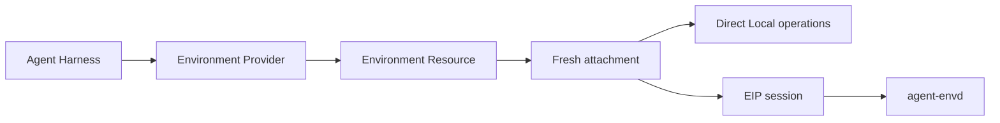

# Environments

An Environment gives an Agent a provider-neutral way to work with files, commands, processes, retained output, and ports. It separates the operations visible to the Harness from the resource lifecycle owned by an Environment Provider.

You do not need an Environment for an Agent that only calls ordinary application tools or remote APIs.

## Choose a backend

| Need                                        | Start with                  | Important boundary                                       |
| ------------------------------------------- | --------------------------- | -------------------------------------------------------- |
| No files or command execution               | No Environment              | Keep the Agent surface minimal                           |
| Trusted access to a Host-selected directory | Direct Local                | Shared Host account; not an OS sandbox                   |
| Local native command isolation              | Local Envd                  | Provider launches `agent-envd` and speaks EIP over stdio |
| Container, VM, or remote sandbox            | An EIP-backed provider      | Provider owns outer lifecycle; EIP owns operations       |
| A new vendor integration                    | Environment Provider plugin | Implement lifecycle plus a supported attachment backend  |

Use Direct Local for development, trusted automation, and tests where sharing the Host account is acceptable. Use Local Envd or another EIP-backed provider when command execution must cross an explicit isolation or remote-execution boundary.

## How the layers fit



- **Agent Harness** binds an Environment attachment into one logical run and exposes selected tools.
- **Environment Provider** creates, resumes, pauses, destroys, and reconciles provider resources.
- **Environment Resource** is one identified provider resource with a process-local scope.
- **Attachment** is fresh, process-local, single-use runtime authority.
- **EIP** is the typed operation protocol used by `agent-envd` and remote backends.

Provider state and Harness continuation state are different records. Persist `EnvironmentProviderResourceState` for provider lifecycle recovery and `HarnessState` for Agent continuation. Neither restores current credentials or authorization.

## Build an Environment-aware Agent

Binding an Environment supplies runtime authority but does not automatically expose operations to the model. Add the dynamic Environment Capability; it derives the model-visible tools from each mount's effective access and Provider capabilities:

```python
from a13n_harness import (
    AgentSpec,
    HarnessBuilder,
)
from a13n_harness.environment import (
    DynamicEnvironmentCapability,
    DynamicEnvironmentConfiguration,
)

executable = HarnessBuilder().build(
    AgentSpec(model="openai-responses:gpt-5"),
    output_type=str,
    capabilities=(
        DynamicEnvironmentCapability(DynamicEnvironmentConfiguration()),
    ),
)
```

The examples below reuse this executable. Configure the selected model provider before running them, or replace the model selection with a deterministic `FunctionModel` in tests.

## Start with Direct Local

Direct Local exposes an existing directory selected by the Host:

```python
from pathlib import Path

from a13n_environment_provider import (
    DirectLocalEnvironmentProvider,
    DirectLocalProviderConfiguration,
    DirectLocalRootConfiguration,
)

provider = DirectLocalEnvironmentProvider(
    DirectLocalProviderConfiguration(
        environment_id="workspace",
        root=DirectLocalRootConfiguration(
            path=Path("./workspace").resolve(),
        ),
    )
)

result = await executable.run(
    "Inspect the workspace",
    environment=provider,
)
```

Passing a Provider gives the Harness one temporary lifecycle: create, enter, acquire a fresh attachment, release, exit, and destroy. Direct Local does not remove the selected directory when that logical provider resource is destroyed.

Direct Local restrictions apply through the current Environment mount. They do not isolate an allowed child process from the Host user account.

## Add Local Envd

Local Envd is the built-in provider path for a locally launched `agent-envd`:

```python
from pathlib import Path

from a13n_environment_provider import (
    EnvironmentProviderSpec,
    LocalEnvdProviderRuntime,
    TemporaryLocalEnvdRuntimeAllocator,
    build_environment_provider_factory_catalog,
    resolve_agent_envd_executable,
)

catalog = build_environment_provider_factory_catalog(
    builtin_keys=("a13n.local-envd",),
)
spec = EnvironmentProviderSpec(
    provider_key="a13n.local-envd",
    schema_version="1",
    parameters={
        "environment_id": "sandbox",
        "workspace": {"path": str(Path("./workspace").resolve())},
        "execution_network": "deny",
    },
)
runtime = LocalEnvdProviderRuntime(
    executable=resolve_agent_envd_executable(),
    allocate_private_runtime=TemporaryLocalEnvdRuntimeAllocator(),
)
provider = catalog.create_provider(spec, runtime=runtime)

result = await executable.run(
    "Inspect the sandboxed workspace",
    environment=provider,
)
```

The Host selects the executable. Resolution checks an explicit argument, `A13N_AGENT_ENVD_EXECUTABLE`, then `agent-envd` on `PATH`. The client and Provider packages do not install or download the native binary.

Local Envd validates the exact daemon/client release and the required isolation probe. It does not fall back to Direct Local or silently disable isolation. Read the [`agent-envd` guide](../agent-envd/index.md) for installation and platform prerequisites.

## Choose lifecycle ownership

Pass a Provider when one run should own a temporary resource. Pass an already entered `EnvironmentResource` when the Host must retain the resource across runs or restarts.

| Input to the Harness          | Outer lifecycle owner | Harness behavior                                   |
| ----------------------------- | --------------------- | -------------------------------------------------- |
| `EnvironmentProvider`         | Harness for one run   | Creates and destroys one temporary Resource        |
| Entered `EnvironmentResource` | Host                  | Acquires and releases one fresh attachment         |
| Named mapping                 | Source type per entry | Supports mixed ownership and multiple Environments |

A suspended run still closes and destroys a Harness-owned temporary resource. Durable workflows should use Host-owned resources, persist their latest provider state, and make resume/pause/destroy/reconcile decisions explicitly.

## Select additional operations

The example enables file tools only. Add shell, process, retained-output, or port operations through `DynamicEnvironmentConfiguration` only when the Agent definition requires them. Keep unnecessary operations disabled.

The [Harness Environment guide](../agent-harness/environments.md) covers complete Capability configuration, single and multiple Environments, portable process references, mount changes, and advanced Host runtimes.

## Next steps

- [Use Environments from Agent Harness](../agent-harness/environments.md)
- [Operate and configure `agent-envd`](../agent-envd/index.md)
- [Manage provider lifecycle or implement a plugin](../agent-environment-provider/index.md)
- [Read the EIP and agent-envd specifications](https://github.com/converge-ai-labs/agent-foundation/tree/main/spec/agent-envd)
