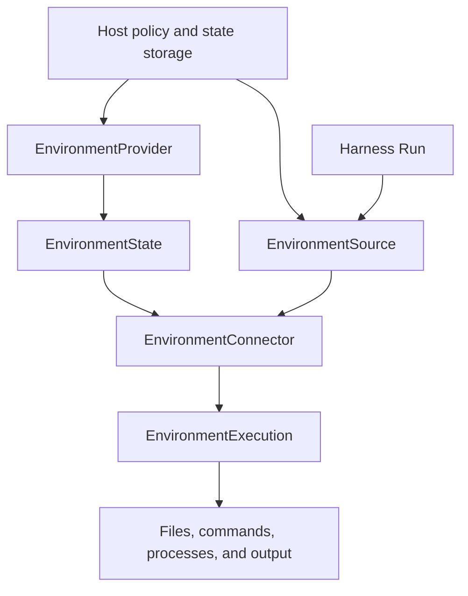

`a13n-environment` provides files, commands, processes, output, and ports without depending on Harness, an Agent, or a model. Applications can use it directly or pass an `EnvironmentConnector` to Harness, which opens an independent execution for each Run. Optional SDKs belong to this package's `docker`, `e2b`, and `modal` extras.

## Start here

| Task                                                        | Guide                                                  |
| ----------------------------------------------------------- | ------------------------------------------------------ |
| Read and write a file with no network dependencies          | [Getting started](getting-started.md)                  |
| Choose local, sandbox, container, or remote execution       | [Choose a backend](#choose-a-backend)                  |
| Understand close, state, re-entry, and destruction          | [Lifecycle and state](lifecycle.md)                    |
| Configure built-ins, credentials, and runtime collaborators | [Provider configuration](configuration.md)             |
| Compare the six cloud Providers                             | [Cloud Providers](providers.md#cloud-providers)        |
| Implement a Provider or supply Host runtimes                | [Providers and runtime](providers.md)                  |
| Run commands, inspect processes, and read retained output   | [Commands and processes](commands.md)                  |
| Understand paths, search patterns, and output limits        | [Operations](operations.md)                            |
| Run a complete built-in lifecycle                           | [Runnable examples](examples.md)                       |
| Connect HTTP or reverse WebSocket Envd                      | [Remote Envd](remote-envd.md)                          |
| Expose Environment tools to an Agent                        | [Harness integration](../a13n-harness/environments.md) |

## Choose a backend

Use no Environment when the Agent needs only ordinary tools or remote APIs. Otherwise select a Native or Envd route:

| Route  | Provider         | Use it for                          | Operation and ownership boundary                            |
| ------ | ---------------- | ----------------------------------- | ----------------------------------------------------------- |
| Native | `direct_local`   | Trusted local automation            | Host OS operations; existing directory, no sandbox claim    |
| Native | `e2b`            | Native managed cloud sandbox        | E2B SDK; sandbox create/pause/resume/renew/destroy          |
| Native | `daytona`        | Cloud sandbox                       | Native stop/start and preserved files                       |
| Native | `modal`          | Cloud sandbox                       | Snapshot-backed stop/resume; fixed running lifetime         |
| Native | `vercel`         | Cloud sandbox                       | Named persistent sandbox with native sessions               |
| Native | `sprites`        | Cloud sandbox                       | Persistent disk and automatic sleep/wake                    |
| Native | `runloop`        | Cloud sandbox                       | Devbox suspend/resume and idle keepalive                    |
| Envd   | `local_envd`     | CLI and local Agents                | Private stdio daemon; close preserves files                 |
| Native | `docker`         | Single-host services                | Docker Engine lifecycle and exec; close preserves container |
| Envd   | `http_envd`      | Network-reachable external daemons  | HTTP(S) EIP; connect-only                                   |
| Envd   | `websocket_envd` | Daemons that connect back to a Host | Reverse WebSocket EIP; Host-integrated SDK, connect-only    |

[Try the remote examples locally](remote-envd.md) without a model, Docker or cloud account.

## Management, connection, and execution

The Host explicitly manages targets through `EnvironmentProvider` and saves `EnvironmentState`. An `EnvironmentConnector` describes one fixed target with no construction-time I/O; each `open()` returns a new, ready `EnvironmentExecution`.

Executions expose operations and have distinct `execution_id` values. Closing an execution releases its resources without destroying the target. Readiness never creates, starts, replaces, or renews a target. Later reconnection requires an explicit new execution.



## Use with Harness

The working directory must already exist:

Use the Host-owned `PreparedSource` implementation from the [Harness environment guide](../a13n-harness/environments.md#supply-a-source). It returns the prepared connector on first use.

```python
from pathlib import Path
from a13n_environment.direct_local.provider import DIRECT_LOCAL

connector = DIRECT_LOCAL.execution_connector(
    {"root": {"path": str(Path("./workspace").resolve())}},
    environment_id="env-workspace",
)
result = await executable.run("Inspect the workspace", environment=PreparedSource(connector))
```

Harness validates and publishes the static mount set without opening executions. First use prepares and opens only the selected mount. Each used mount has its own execution; Run exit closes these executions without destroying targets.

Enable `DynamicEnvironmentCapability` to expose permitted tools to the model. Use `EnvironmentMount` for mount paths and permission ceilings; Harness owns these policies, and they do not enter shared Environment state.

## Use Local Envd

Local Envd requires a borrowed `LocalEnvdProviderRuntime`. The Host chooses a compatible executable and private-runtime allocator. Each execution opens an independent EIP Session, while the Host closes the shared Device. See [Providers and runtime](providers.md#local-envd-runtime).

Direct Local uses the Host account without OS isolation. For Local Envd, the Host selects sandbox and network policy at launch, and Envd enforces it for each Session. Remote HTTP and WebSocket Envd connect only to registered devices; see [Remote Envd](remote-envd.md).

## Retain targets and manage state

Create or start a target explicitly, publish the result under Host concurrency control, then generate a connector. Execution produces no new management state to write back after a Run. Stop, renewal, and destruction are explicit Host actions; see [Lifecycle and state](lifecycle.md).

Service builds templates, managed instances, and Run mounts on this library; see [Service environments](../a13n-service/environments.md). For more embedding patterns, see [Harness environments](../a13n-harness/environments.md).
