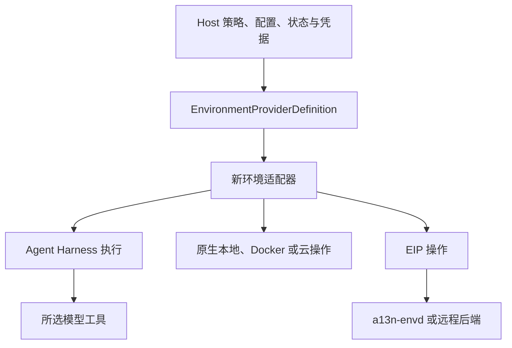

环境（Environment）以统一方式提供文件、命令、进程、保留输出和端口访问。可以直接用于自动化，也可以把新适配器交给 Harness，让 agent 在所选工作空间、沙箱、容器、虚拟机或远程执行目标中工作。它不要求 agent、模型凭据或托管服务。

环境 provider 内置于 `a13n-harness`；只有厂商 SDK 通过 [extras](../a13n-harness/plugins.md#harness-extras) 按需安装。只调用普通应用工具或远程 API 的 agent 无需环境。

## 从这里开始

| 任务                                    | 指南                                            |
| --------------------------------------- | ----------------------------------------------- |
| 无需网络依赖读写文件                    | [快速入门](getting-started.md)                  |
| 选择本地、沙箱、容器或远程执行          | [选择后端](#choose-a-backend)                   |
| 理解关闭、状态、重新进入和销毁          | [生命周期与状态](lifecycle.md)                  |
| 配置内置 provider、凭据和运行时协作对象 | [Provider 配置](configuration.md)               |
| 比较六个云 provider                     | [云 provider](providers.md#cloud-providers)     |
| 实现 provider 或提供 Host 运行时        | [Provider 与运行时](providers.md)               |
| 运行命令、检查进程和读取保留输出        | [命令与进程](commands.md)                       |
| 理解路径、搜索模式和输出限制            | [操作](operations.md)                           |
| 运行完整的内置生命周期                  | [可运行示例](examples.md)                       |
| 连接 HTTP 或反向 WebSocket Envd         | [Remote Envd](remote-envd.md)                   |
| 向 agent 提供环境工具                   | [Harness 集成](../a13n-harness/environments.md) |

## 三个概念

- **Provider 定义：** 验证账号输入、凭据和目标配置，再构建适配器，不进行目标 I/O。
- **Environment：** 一次性使用的适配器，负责准备目标、提供操作和关闭本地资源。
- **`EnvironmentState`：** 由 provider 管理的可移植目标证据，可交给后续新适配器。

`close()` 不销毁目标；显式 `destroy()` 是 Host 的独立决策。Direct Local 等 provider 没有可移植目标状态，也不负责销毁目标。根目录、目标 ID 或连接成功都不能证明存在隔离。

## 选择后端

agent 只需要普通工具或远程 API 时，不使用环境。否则选择 Native 或 Envd 路线：

| 路线   | Provider         | 适用场景             | 操作与归属边界                                 |
| ------ | ---------------- | -------------------- | ---------------------------------------------- |
| Native | `direct_local`   | 可信本地自动化       | 宿主 OS 操作；已有目录，不承诺沙箱隔离         |
| Native | `e2b`            | 原生托管云沙箱       | E2B SDK；创建、暂停、恢复、续期和销毁沙箱      |
| Native | `daytona`        | 云沙箱               | 原生停止/启动并保留文件                        |
| Native | `modal`          | 云沙箱               | 基于快照停止/恢复；固定运行寿命                |
| Native | `vercel`         | 云沙箱               | 具有原生会话的命名持久沙箱                     |
| Native | `sprites`        | 云沙箱               | 持久磁盘与自动休眠/唤醒                        |
| Native | `runloop`        | 云沙箱               | Devbox 挂起/恢复和空闲保活                     |
| Envd   | `local_envd`     | CLI 和本地 agent     | 私有 stdio 守护进程；关闭后保留工作空间        |
| Native | `docker`         | 单机服务             | Docker Engine 生命周期和 exec；关闭后保留容器  |
| Envd   | `http_envd`      | 网络可达的外部环境   | HTTP(S) EIP；仅连接                            |
| Envd   | `websocket_envd` | 主动连接 Host 的环境 | 反向 WebSocket EIP；与 Host 集成的 SDK，仅连接 |

[在本地试用远程示例](remote-envd.md)，无需模型、Docker 或云账号。

## 各层如何配合



- **Host** 选择可信 provider、期望配置、当前状态、运行时协作对象、保留策略和授权。
- **环境 provider 定义** 验证账号输入、凭据和目标配置，构建新的单次使用适配器；只在运行时工厂中获取活跃协作对象。
- **Environment** 进入或创建精确目标，提供结构化操作，缓存最新状态，关闭进程内资源，并支持 Host 显式销毁。
- **Agent Harness** 负责执行内挂载名称、访问上限、路由、状态聚合和非破坏性清理。
- **EIP** 是 `a13n-envd` 和远程后端使用的结构化操作协议。

`EnvironmentState` 和 `HarnessState` 是不同记录。前者是 provider 管理的目标软引用；后者是 agent 续接状态。两者都不恢复当前凭据或授权。

## 构建能使用环境的 agent

绑定环境提供运行时权限，但不会自动向模型开放操作。添加动态环境 Capability，它会根据每个挂载的有效访问范围和 provider 能力生成模型可见工具：

```python
from a13n_harness import AgentSpec, HarnessBuilder
from a13n_harness.environment import (
    DynamicEnvironmentCapability,
    DynamicEnvironmentConfiguration,
)

executable = HarnessBuilder().build(
    AgentSpec(model="openai-responses:gpt-5"),
    output_type=str,
    capabilities=(
        DynamicEnvironmentCapability(DynamicEnvironmentConfiguration()),
    ),
)
```

运行示例前配置所选模型 provider，或在测试中将模型替换为确定性的 `FunctionModel`。

## 从 Direct Local 开始

Direct Local 开放 Host 选择的已有目录：

```python
from pathlib import Path

from a13n_harness.providers.environment.builtins import select_builtin_environment_providers

(direct_local,) = select_builtin_environment_providers(("direct_local",))
environment = await direct_local.create(
    {"root": {"path": str(Path("./workspace").resolve())}},
    environment_id="workspace",
)

result = await executable.run(
    "Inspect the workspace",
    environment=environment,
)
```

provider 在准备阶段检查目录，不在进入范围时检查。Harness 在执行后关闭适配器，绝不销毁目标。Direct Local 在关闭时保留目录，并拒绝目标销毁。

Direct Local 限制通过当前环境挂载生效。它们不会把获准运行的子进程与 Host 用户账号隔离。

## 使用 Local Envd

Host 管理共享 Local Envd 运行时及其延迟启动的设备。每个新适配器都会打开独立会话，使用固定的设备工作目录：

```python
from a13n_harness.providers.environment.builtins import select_builtin_environment_providers
from a13n_harness.providers.environment.local_envd.runtime import (
    LocalEnvdProviderRuntime,
    TemporaryLocalEnvdRuntimeAllocator,
    resolve_a13n_envd_executable,
)

(local_envd,) = select_builtin_environment_providers(("local_envd",))
async with LocalEnvdProviderRuntime(
    executable=resolve_a13n_envd_executable(),
    allocate_private_runtime=TemporaryLocalEnvdRuntimeAllocator(),
) as runtime:
    environment = await local_envd.create(
        {"working_directory": "/absolute/path/to/workspace"},
        environment_id="workspace",
        runtime=runtime,
    )
    result = await executable.run(
        "Inspect the working directory",
        environment=environment,
    )
    # Harness closes this adapter's Session. The Host can use another adapter
    # on the same runtime; leaving this context closes the shared Device.
```

可执行文件解析依次检查显式参数、`A13N_ENVD_EXECUTABLE`，再检查 `PATH` 上的 `a13n-envd`。客户端和 provider 包不会安装或下载原生二进制文件。

Local Envd 验证守护进程与客户端的精确兼容性，绝不会回退到 Direct Local。Envd 路径指向设备文件系统；固定 cwd 不提供访问隔离。Host 管理的账号、容器或沙箱负责文件系统与网络隔离。设置和安全边界见 [`a13n-envd` 指南](../a13n-envd/index.md)。

## 重新进入并保留目标

Docker 等有状态 provider 返回 `EnvironmentState`。Host 持久保存最新状态，并在构建下一新适配器时提供：

```python
current_state = await state_store.load(environment_key)
environment = await docker.create(
    recipe,
    configuration={"docker_host": "unix:///var/run/docker.sock"},
    environment_id="workspace",
    state=current_state,
)

try:
    result = await executable.run(
        "Continue the task",
        environment=environment,
        previous_state=previous_harness_state,
    )
finally:
    await state_store.publish(environment_key, environment.dump_state())
```

`dump_state()` 同步读取适配器最新已验证缓存，返回独立副本。进入失败、取消、执行失败或关闭失败后，Host 仍可调用，不会产生额外 provider I/O。

关闭和销毁是两个明确独立的操作：

| 操作                   | 负责方  | 效果                                                       |
| ---------------------- | ------- | ---------------------------------------------------------- |
| 进入和执行内使用       | Harness | 进入新适配器并挂载其操作                                   |
| `close()`              | Harness | 释放进程内资源，不移除目标                                 |
| 状态持久化             | Host    | 选择并保存最新权威 `EnvironmentState`                      |
| 新适配器的 `destroy()` | Host    | 保留策略决定删除时，移除 provider 管理的精确目标和启动材料 |

执行暂停或失败后仍会非破坏性关闭适配器。Harness 绝不推断临时所有权，也绝不调用 `destroy()`。

## 使用多个环境

传入多个新适配器，并显式提供执行内策略：

```python
from a13n_harness import EnvironmentMount
from a13n_harness.environment import FILE_READ_ACTIONS, EnvironmentPermissionSet

result = await executable.run(
    "Read the source data and write the build output",
    environments={
        "build": build_environment,
        "data": EnvironmentMount(
            data_environment,
            permission_ceiling=EnvironmentPermissionSet(operations=FILE_READ_ACTIONS),
        ),
    },
    default_environment="build",
)
```

默认挂载可通过 `/workspace` 访问；命名挂载可通过 `/environment/{name}` 访问。存在多个条目时，显式选择 `default_environment`，或让 `/workspace` 保持未绑定。映射顺序绝不授予权限。

Harness 在进入前验证完整挂载集合。一个适配器失败时，会关闭所有可能持有进程内资源的已提供适配器，且不会发布部分挂载集合。回退清理中绝不销毁目标。

## 仅选择必需操作

`EnvironmentMount` 通过精确的 `permission_ceiling` 收窄 provider 能力；`FILE_READ_ACTIONS` 和 `FILE_ACTIONS` 是共享操作集合。`DynamicEnvironmentConfiguration` 控制模型可见的稳定环境 Toolset。agent 定义不需要的 shell、后台进程、保留输出和端口操作应保持关闭。

[Harness 环境指南](../a13n-harness/environments.md)介绍完整 Capability 配置、确定性路由、状态导出、可移植进程引用和高级 Host 运行时。

## 下一步

- [运行内置 provider 示例](examples.md)
- [在 Agent Harness 中使用环境](../a13n-harness/environments.md)
- [管理 provider 状态](lifecycle.md)和[实现 provider 插件](providers.md#provider-catalog-and-plugins)
- [运维和配置 `a13n-envd`](../a13n-envd/index.md)
- [阅读 EIP 和 a13n-envd 规范](https://github.com/converge-ai-labs/agent-foundation/tree/main/spec/a13n-envd)

## 托管准备与恢复

Service 基于这些 provider 工作：从模板创建托管 Docker 和云沙箱环境，通过端点和 token 连接外部 envd 目标，并冻结每次执行的挂载；参见 [Service 环境](../a13n-service/environments.md)。上文介绍的嵌入式 provider 生命周期仍可独立使用。

直接 SDK 集成请参考[环境生命周期与错误](lifecycle.md)和[远程 Envd](remote-envd.md)。
