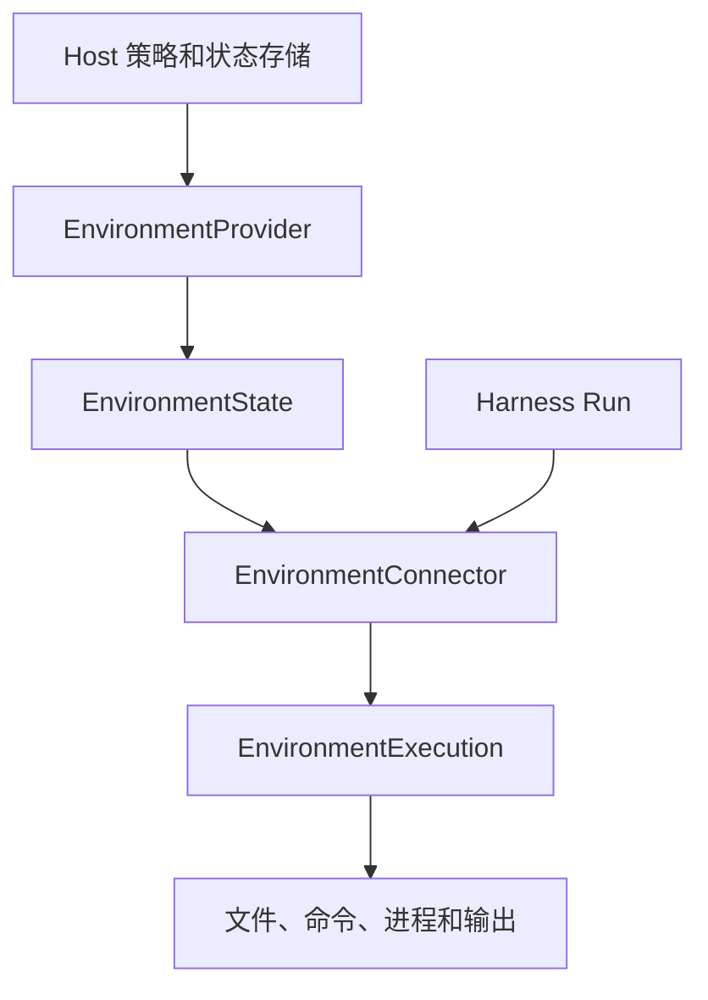

`a13n-environment` 提供文件、命令、进程、输出和端口操作，不依赖 Harness、Agent 或模型。应用可以直接使用，也可以将 `EnvironmentConnector` 交给 Harness，由每个 Run 打开独立执行对象。可选 SDK 位于该包的 `docker`、`e2b` 和 `modal` extras 中。

## 从这里开始

| 任务                                    | 指南                                            |
| --------------------------------------- | ----------------------------------------------- |
| 无需网络依赖读写文件                    | [快速入门](getting-started.md)                  |
| 选择本地、沙箱、容器或远程执行          | [选择后端](#choose-a-backend)                   |
| 理解关闭、状态、重新进入和销毁          | [生命周期与状态](lifecycle.md)                  |
| 配置内置 provider、凭据和运行时协作对象 | [Provider 配置](configuration.md)               |
| 比较六个云 provider                     | [云 provider](providers.md#cloud-providers)     |
| 实现 provider 或提供 Host 运行时        | [Provider 与运行时](providers.md)               |
| 运行命令、检查进程和读取保留输出        | [命令与进程](commands.md)                       |
| 理解路径、搜索模式和输出限制            | [操作](operations.md)                           |
| 运行完整的内置生命周期                  | [可运行示例](examples.md)                       |
| 连接 HTTP 或反向 WebSocket Envd         | [Remote Envd](remote-envd.md)                   |
| 向 agent 提供环境工具                   | [Harness 集成](../a13n-harness/environments.md) |

## 选择后端

agent 只需要普通工具或远程 API 时，不使用环境。否则选择 Native 或 Envd 路线：

| 路线   | Provider         | 适用场景                 | 操作与归属边界                                 |
| ------ | ---------------- | ------------------------ | ---------------------------------------------- |
| Native | `direct_local`   | 可信本地自动化           | 宿主 OS 操作；已有目录，不承诺沙箱隔离         |
| Native | `e2b`            | 原生托管云沙箱           | E2B SDK；创建、暂停、恢复、续期和销毁沙箱      |
| Native | `daytona`        | 云沙箱                   | 原生停止/启动并保留文件                        |
| Native | `modal`          | 云沙箱                   | 基于快照停止/恢复；固定运行寿命                |
| Native | `vercel`         | 云沙箱                   | 具有原生会话的命名持久沙箱                     |
| Native | `sprites`        | 云沙箱                   | 持久磁盘与自动休眠/唤醒                        |
| Native | `runloop`        | 云沙箱                   | Devbox 挂起/恢复和空闲保活                     |
| Envd   | `local_envd`     | CLI 和本地 agent         | 私有 stdio 守护进程；关闭后保留文件            |
| Native | `docker`         | 单机服务                 | Docker Engine 生命周期和 exec；关闭后保留容器  |
| Envd   | `http_envd`      | 网络可达的外部守护进程   | HTTP(S) EIP；仅连接                            |
| Envd   | `websocket_envd` | 主动连接 Host 的守护进程 | 反向 WebSocket EIP；与 Host 集成的 SDK，仅连接 |

[在本地试用远程示例](remote-envd.md)，无需模型、Docker 或云账号。

## 管理、连接与执行

Host 通过 `EnvironmentProvider` 显式管理目标并保存 `EnvironmentState`。`EnvironmentConnector` 只描述固定目标，构造时不进行 I/O；每次 `open()` 返回一个新的、已就绪的 `EnvironmentExecution`。

执行对象提供操作并拥有自己的 `execution_id`。关闭执行会释放其资源，但不销毁目标。检查就绪不会创建、启动、替换或续期目标。后续重新连接必须显式打开新执行。



## 与 Harness 一起使用

工作目录必须已经存在：

```python
from pathlib import Path
from a13n_environment.direct_local.provider import DIRECT_LOCAL

connector = DIRECT_LOCAL.execution_connector(
    {"root": {"path": str(Path("./workspace").resolve())}},
    environment_id="env-workspace",
)
result = await executable.run("Inspect the workspace", environment=connector)
```

Harness 在发布挂载前打开所有执行对象。若其中一个失败，已打开的执行会关闭，不会发布部分挂载集合。连接配置可以供后续 Run 重用；打开的执行对象不能共享给其他 Run。

启用 `DynamicEnvironmentCapability` 后，模型才能看见允许的环境工具。使用 `EnvironmentMount` 设置挂载路径和权限上限；这些策略由 Harness 管理，不写入共享环境状态。

## 使用 Local Envd

Local Envd 必须借用 Host 提供的 `LocalEnvdProviderRuntime`。Host 选择兼容的可执行文件和私有运行目录分配器；执行对象分别打开独立 EIP Session，Host 负责关闭共享 Device。具体配置见 [Provider 与运行时](providers.md#local-envd-runtime)。

Direct Local 使用 Host 账号，不提供 OS 隔离。Local Envd 的隔离和网络策略由 Host 在启动时选择，Envd 为每个 Session 执行这些策略。远程 HTTP 和 WebSocket Envd 只连接已注册设备，见 [Remote Envd](remote-envd.md)。

## 保留目标与管理状态

先通过管理方法创建或启动目标，在 Host 的并发控制下保存结果，再生成连接配置。执行不产生新的管理状态，Run 完成后无需回写目标引用。停止、续期和销毁由 Host 显式发起，见[生命周期与状态](lifecycle.md)。

Service 在此基础上提供模板、托管实例和 Run 挂载，见 [Service 环境](../a13n-service/environments.md)。更多接入方式见 [Harness 环境](../a13n-harness/environments.md)。
