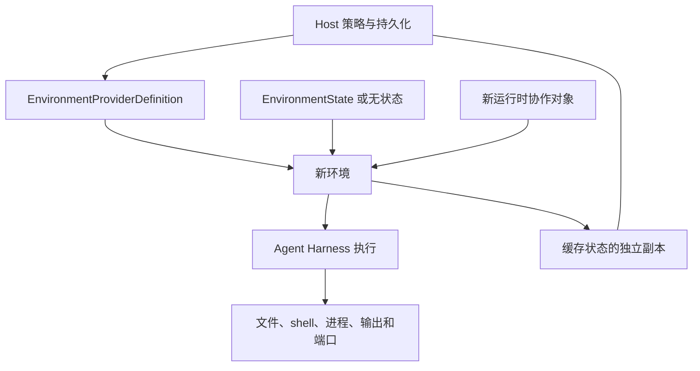

要在执行之间保留工作，保存环境状态，并在下一次执行时提供给新适配器。provider 构建适配器；每个适配器连接一个目标。

无需 agent 的首次文件操作见[快速入门](getting-started.md)。

## 生命周期概览



正常执行按以下顺序进行：

1. Host 从目录中解析允许使用的 provider 类型。
2. 定义先验证不含凭据的目标配置，再验证账号配置和凭据（除非 Host 提供运行时）。
3. Host 提供最新权威 `EnvironmentState`。
4. 定义获取运行时协作对象，再构建新适配器；运行时工厂之前的全部步骤均无副作用。Host 传入的运行时为借用；定义获取的运行时属于适配器。
5. Host 主动提前准备，或让首次操作延迟准备。Harness 绑定本地范围、使用操作、导出缓存状态并关闭范围。
6. Host 单独持久保存最新状态并应用保留策略。

`close()` 释放适配器管理的会话、临时输出、客户端和接纳资源，包括 `create()` 为其获取的运行时。它幂等且不销毁目标。Host 传入的共享 Envd 设备运行时属于 Host，在 Host 关闭时另行关闭。Harness 绝不调用 `destroy()`。

保留策略决定移除时，Host 从精确当前状态构建另一个新适配器，显式调用 `destroy()`。销毁成功清空该适配器缓存状态。失败或结果未知时，保留最后验证状态用于检查或重试。

## 解析并构建环境

持久保存的 `EnvironmentProviderSpec` 只包含 provider 类型和不含凭据的 JSON 目标配置：

```python
from a13n_harness.providers.catalog import ProviderCatalog
from a13n_harness.providers.environment.builtins import select_builtin_environment_providers
from a13n_harness.providers.environment.models import EnvironmentProviderSpec

spec = EnvironmentProviderSpec(
    provider_key="direct_local",
    configuration={
        "root": {"path": "/srv/agent-workspaces/current"},
    },
)

catalog = ProviderCatalog(select_builtin_environment_providers(("direct_local",)))
definition = catalog.require(spec.provider_key)
environment = await definition.create(
    spec.configuration,
    environment_id="workspace",
    state=None,
)
```

没有配置 schema 版本：provider 只管理一个目标配置模型，改变输入含义就改变 provider 类型。选择、配置验证和适配器构建不进行目标操作。`enter()` 也不进行目标 I/O。`prepare()` 创建、恢复或连接目标；延迟准备时，`ensure_ready()` 在首次使用触发准备。

将新适配器传给 Harness：

```python
result = await executable.run(
    "Inspect the workspace",
    environment=environment,
)
```

Harness 对适配器进入和关闭各一次。每次独立执行都构建另一个适配器，即使多次执行使用同一工作空间、容器、虚拟机或远程沙箱。

## 重新进入有状态目标

Host 在进入前提供状态：

```python
current_state = await state_store.load(environment_key)
environment = await definition.create(
    spec.configuration,
    configuration=backend_configuration,
    credential=current_credential,
    environment_id="workspace",
    state=current_state,
)

try:
    result = await executable.run(
        "Continue the task",
        environment=environment,
        previous_state=previous_harness_state,
    )
finally:
    await state_store.publish(environment_key, environment.dump_state())
```

`dump_state()` 同步执行，不进行目标 I/O。它返回最新已验证缓存状态的独立深拷贝，调用者修改不会影响适配器缓存。目标身份变化一经确定，provider 就更新缓存，先于可能失败的后续就绪工作。

状态是软引用，不证明目标仍存在。构建时验证编解码器和兼容性；准备时，provider 检查已验证状态选择的精确目标。仅进入适配器不会执行检查。只有权威确认目标不存在，且符合 provider 契约时，才可创建替代目标。绝不会把不兼容目标、含糊发现、不可用控制平面或未知修改结果视为目标不存在。

`EnvironmentState` 不包含 bearer 凭据、活跃客户端、任务、进程内句柄、Harness 挂载策略或销毁权限。存储、授权、保留、调度和权威版本选择仍由 Host 负责。

## 显式销毁

销毁要求尚未进入的新适配器：

```python
cleanup = await definition.create(
    spec.configuration,
    configuration=backend_configuration,
    credential=current_credential,
    environment_id="workspace",
    state=current_state,
    allow_create=False,
)
try:
    await cleanup.destroy()
finally:
    await state_store.publish(environment_key, cleanup.dump_state())
    await cleanup.close()
```

provider 只移除已验证状态代表的精确底层目标和自身管理的启动材料。共享 Host 目录、Docker 绑定源和外部命名卷仍由外部管理。

不要把退出上下文、Harness 完成、暂停或取消当作隐式销毁信号。这些路径只关闭进程内资源。

## 就绪、恢复与维护

| 操作                                        | 行为                                                             |
| ------------------------------------------- | ---------------------------------------------------------------- |
| `enter()` / `async with`                    | 绑定一次性范围；不准备目标                                       |
| `prepare()`                                 | 从已验证状态创建、恢复或连接；Host 可在进入前调用                |
| `check_ready(operations)`                   | 检查已进入的连接，不供应或恢复目标                               |
| `ensure_ready(operations)`                  | 首次使用时准备，检查必需类别，仅执行 provider 支持的恢复         |
| `recover()`                                 | 在支持时执行已显式授权的范围内恢复；不提供通用修改重放           |
| `reconcile()`                               | 将已放弃准备的目标观测为运行/停止/不存在，不创建、启动或替换目标 |
| `stop()`                                    | 在支持时可恢复地停止目标；不同于关闭和销毁                       |
| `keepalive(deadline=..., operation_id=...)` | 由 Host 负责维护，为支持的目标刷新保留期限                       |
| `dump_state()`                              | 读取独立缓存状态，不进行目标 I/O                                 |
| `close()`                                   | 幂等清理本地资源                                                 |
| `destroy()`                                 | 通过尚未进入的新适配器移除精确自有目标                           |

支持的就绪恢复可能报告 `environment_connection_refreshed` 或 `environment_rebuilt`，不会悄悄继续原请求操作。重连同一目标与替换丢失代次的后果不同。继续前重新检查进程观测和临时文件。Remote Envd 准备失败需要新适配器，不能假定支持范围内恢复。

provider 能力声明告诉 Host 可以选择哪些维护路径：

| 内置 provider              | 托管选择     | 可恢复停止                         | 销毁                               | 需要保活       |
| -------------------------- | ------------ | ---------------------------------- | ---------------------------------- | -------------- |
| Direct Local               | 是，无状态   | 已声明，对 Host 目录不执行实际操作 | 已声明，对 Host 目录不执行实际操作 | 否             |
| Local Envd                 | 是，无状态   | 否                                 | 否                                 | 否             |
| Docker                     | 是           | 是                                 | 是                                 | 否             |
| E2B                        | 是           | 是                                 | 是                                 | 是             |
| Daytona                    | 是           | 是                                 | 是                                 | 否             |
| Modal                      | 是           | 仅托管，文件系统快照               | 是                                 | 是，仅固定期限 |
| Vercel Sandbox             | 是           | 是                                 | 是                                 | 是             |
| Fly.io Sprites             | 是           | 否；原生自动休眠                   | 是                                 | 否             |
| Runloop                    | 是           | 是                                 | 是                                 | 是             |
| 远程 HTTP / WebSocket Envd | 否，外部管理 | 否                                 | 否                                 | 否             |

文件系统、内存和过期差异见[六个云平台比较](providers.md#reconnection-and-lifecycle)。支持托管选择不代表所有 provider 都创建存储或拥有 Host 目录。不支持的基类方法不会仅因出现在抽象接口中就变得可用。根据 provider 的 `keepalive_horizon` 和实际目标策略调度保活；不要把基类默认值当作通用云 TTL。

## 处理结构化失败

配置、目录、生命周期和后端失败使用 `EnvironmentProviderError`。操作失败使用 `EnvironmentError`。两者不能与模型工具错误封装互换。

provider 错误具有稳定代码、类别、确定性、恢复提示、有界上下文，以及更详细的本地描述/详情。类别为 `invalid`、`unsupported`、`missing`、`denied`、`conflict`、`unavailable`、`timeout`、`unknown_outcome`、`cleanup` 和 `provider_failure`。

| 证据                        | Host 应对方式                                     |
| --------------------------- | ------------------------------------------------- |
| 确定性 `not_dispatched`     | 未分派；先修复所述输入/运行时条件，再决定是否尝试 |
| 确定性 `known`              | 使用已知结果；不要推断所有已知错误都可重试        |
| 确定性 `unknown`            | 任何可能的重放前，先核对原操作/目标               |
| 提示 `fix_input`            | 修正已验证配置或请求数据                          |
| 提示 `refresh_runtime`      | 重建当前获授权的运行时协作对象                    |
| 提示 `retry_same_operation` | 保留所属操作身份及其重试契约                      |
| 提示 `reconcile`            | 检查持久 provider/Host 证据                       |
| 提示 `none`                 | 没有自动恢复建议                                  |

公开展示使用 `error.safe_projection()`。它保留有界关联和可安全公开的类别消息，排除详细本地描述/详情。按 Host 的实际需求控制本地诊断访问；直接序列化异常不等于使用安全投影。

始终按 Host 策略发布最新已验证缓存状态，包括就绪失败或清理结果未知后。绝不能把控制平面不可用变为目标不存在、为了掩盖不兼容状态而替换目标，或把 `destroy()` 用作通用错误处理。

## Host 检查清单

- 每次独立执行（包括恢复后的执行）都构建新适配器。
- 成功或失败后持久保存最新独立状态；是否发布仍由 Host 策略决定。
- 控制平面不可用或修改结果未知应视为不确定，不是目标不存在。
- 本地资源关闭独立于保留策略。只通过新适配器销毁精确已验证目标。
- 凭据、授权和活跃客户端不能放入环境或 Harness 续接数据。
