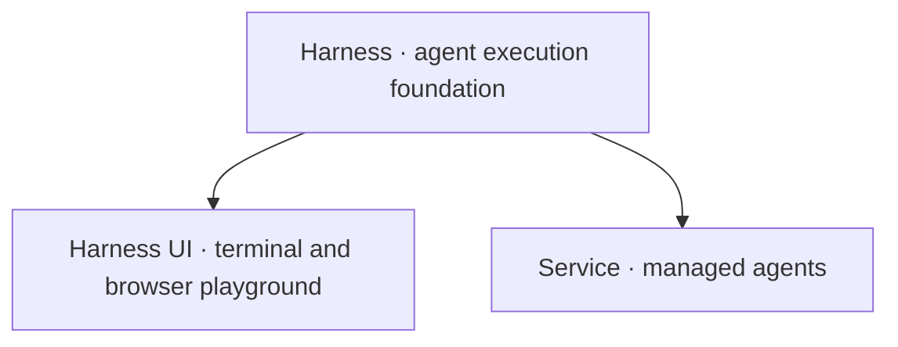

# Agent Foundation

**Build agents. Work with them. Run them as a managed service.**

Agent Foundation has one execution foundation and two ready-to-use applications. **Harness** is the SDK. **Harness UI** is its playground and interactive workbench for individuals and trusted small teams. **Service** is the managed-agent runtime.



Both applications embed Harness. Choose by who owns execution and access, not by whether the machine is local or remote.

## Start here

| Your goal                                         | Guide                                                                                                       |
| ------------------------------------------------- | ----------------------------------------------------------------------------------------------------------- |
| Work on a project with an agent                   | [Harness UI](a13n-harness-ui/index.md) — install, connect a model, and start in the terminal or browser     |
| Experiment with models, tools, and agent behavior | [Configure Harness UI](a13n-harness-ui/configuration-recipes.md) — editable resources and practical recipes |
| Build agents into your own Python application     | [Harness](a13n-harness/index.md) — composition, execution, streaming, and continuation                      |
| Operate managed agents for users or applications  | [Service](a13n-service/index.md) — deployment, access control, durable runs, Console, and API               |

## Try the playground

Install [uv](https://docs.astral.sh/uv/getting-started/installation/), then:

```console
uv tool install a13n-harness-ui
cd your-repository
```

Run `a13n-harness-ui` for the terminal or `a13n-harness-ui webui` for the browser workbench. First-use setup connects a model and asks you to choose execution permissions. No SDK code, Service deployment, or Node.js is required.

Ask the agent to explain a codebase, make a focused change, or run checks. The browser also offers shared conversations and drafts, files, Git changes, terminal sessions, and configuration editing.

**Share deliberately.** Harness UI is for trusted people using one instance, not isolated tenants. Full Control runs as the host account. WebUI shares native host files and terminals by default; `--no-share-computer` disables those browser features. Closing a browser does not stop active work, but losing the server process can lose work since the last checkpoint. See [browser access and lifecycle](a13n-harness-ui/webui.md).

[Install and upgrade](a13n-harness-ui/installation.md) · [Use the terminal](a13n-harness-ui/everyday-use.md) · [Use the browser](a13n-harness-ui/webui.md)

## Build with Harness

Embed Harness when your application should own users, storage, credentials, and delivery. Compose agents from instructions, tools, and capabilities; execute scoped runs; consume typed observations; and persist returned state when your application accepts a checkpoint.

Start with the [offline quickstart](a13n-harness/getting-started.md), then follow [Agents and Runs](a13n-harness/agents-and-runs.md) and [Embedding in a Host](a13n-harness/hosting.md).

## Operate managed agents

Use Service when agents need centrally managed resources, permissions, durable acceptance, and worker recovery. Organizations and workspaces hold versioned agents, models, tools, environments, and conversations. Console and API clients use the same managed runtime.

Harness UI does not become Service when shared over a network. Service adds its own resource and execution lifecycle; it is not a remote mode of the playground.

[Deploy Service](a13n-service/get-started.md) · [Identity and access](a13n-service/identity.md) · [SDKs and CLI](a13n-service/sdks.md)

## Supporting components

These components support the foundation rather than adding more top-level products. Use only what your integration needs.

| Component                                        | Purpose                                                                                             |
| ------------------------------------------------ | --------------------------------------------------------------------------------------------------- |
| [Environments](environments/index.md)            | Portable file, command, and process access; also usable without an agent                            |
| [Envd](a13n-envd/index.md)                       | Native daemon for the Environment Interaction Protocol; it does not run agents                      |
| [Stream Protocol](a13n-stream-protocol/index.md) | Project Harness observations into typed UI events; it does not store continuation or deliver events |
| [Logging](a13n-logging/index.md)                 | Shared structured logging                                                                           |

See the [package catalog](packages.md) for source locations, distribution names, release boundaries, and independent Service clients.

## Releases and contributions

This site tracks the repository's `main` branch. Use the locked source setup to reproduce examples; match published packages to their release notes and dependency metadata. Agent Foundation is in active `0.x` development, so APIs and configuration may change between minor releases.

Harness and Stream Protocol share an exact release version. Harness UI, Service, and supporting components have their own release boundaries. Development setup and validation live in [Contributing](https://github.com/converge-ai-labs/agent-foundation/blob/main/CONTRIBUTING.md); accepted architecture lives in the [specifications](https://github.com/converge-ai-labs/agent-foundation/tree/main/spec).
