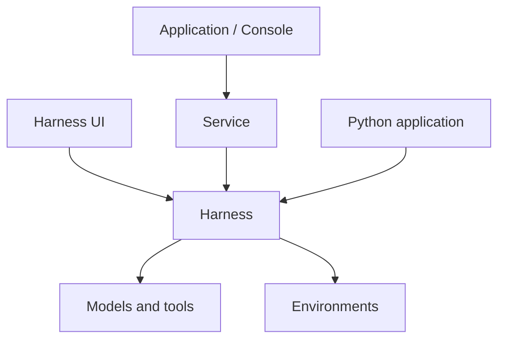

# Agent Foundation

**The open-source, self-hosted foundation for enterprise AI agents.**

Agent Foundation is an open-source library and platform for building and running your own agent systems. Build on the managed Service, embed the Harness library, or explore agents interactively with Harness UI.

## Choose your starting point

| You want to                                 | Start with                                                                                                     |
| ------------------------------------------- | -------------------------------------------------------------------------------------------------------------- |
| Add managed agents to your application      | [Service quickstart](a13n-service/get-started.md) — run the stack, configure a model, and start a conversation |
| Build an agent in Python                    | [Harness quickstart](a13n-harness/getting-started.md) — run an offline example, then add tools and models      |
| Work interactively in a repository          | [Harness UI setup](a13n-harness-ui/setup.md) — connect a model and use the terminal or browser                 |
| Give an application file and command access | [Environments quickstart](environments/getting-started.md) — use the same providers with or without an agent   |

## How the pieces fit

Service and Harness UI both run agents through Harness. Service manages identities, resources, and durable execution. Harness UI provides an interactive workbench for individuals and trusted collaborators. An embedded application supplies its own storage and access policy.



### Run Service

The [Docker Compose quickstart](a13n-service/get-started.md) starts Service, Console, PostgreSQL, and Redis and creates a local administrator. Add your model provider credentials in Console, create an agent, and send a message.

For application integration, follow [Agents, threads and runs](a13n-service/agents-and-runs.md) and [SDKs and CLI](a13n-service/sdks.md). For a shared deployment, start with [configuration](a13n-service/configuration.md) and [identity and access](a13n-service/identity.md).

### Embed Harness

Compose an agent from instructions, tools, and capabilities. Run it, consume its stream, and save the returned state for the next turn. Your application owns persistence and recovery.

Start with the [offline quickstart](a13n-harness/getting-started.md), then follow [Agents and Runs](a13n-harness/agents-and-runs.md) and [Embedding in a Host](a13n-harness/hosting.md). The [example projects](packages.md#runnable-example-projects) demonstrate complete integrations.

### Use Harness UI

Install [uv](https://docs.astral.sh/uv/getting-started/installation/), then:

```bash
uv tool install a13n-harness-ui
cd your-repository
a13n-harness-ui
# Or: a13n-harness-ui webui
```

First-use setup connects a model and selects execution permissions. Ask the agent to explain a codebase, make a change, or run checks. The browser adds shared conversations, files, Git changes, terminals, and configuration editing.

Full Control runs as your host account. Share the browser only with trusted collaborators; `--no-share-computer` disables its native host file and terminal access. See [execution permissions](a13n-harness-ui/environments-and-projects.md#execution-permissions) and [browser access](a13n-harness-ui/webui.md).

## Supporting components

| Component                                        | Use it for                                                               |
| ------------------------------------------------ | ------------------------------------------------------------------------ |
| [Environments](environments/index.md)            | Portable file, command, process, and computer access                     |
| [Envd](a13n-envd/index.md)                       | File and process operations through the Environment Interaction Protocol |
| [Stream Protocol](a13n-stream-protocol/index.md) | Convert Harness observations into typed UI events                        |
| [Logging](a13n-logging/index.md)                 | Structured logs and process-wide logging setup                           |

The [package catalog](packages.md) lists source locations, examples, and release groups.

## Versions and contributions

This site tracks `main`. For published packages, check their release notes and dependency metadata. Agent Foundation is in active `0.x` development; APIs and configuration may change between minor releases.

See [Contributing](https://github.com/converge-ai-labs/agent-foundation/blob/main/CONTRIBUTING.md) for source setup and validation, and the [specifications](https://github.com/converge-ai-labs/agent-foundation/tree/main/spec) for architecture contracts.
