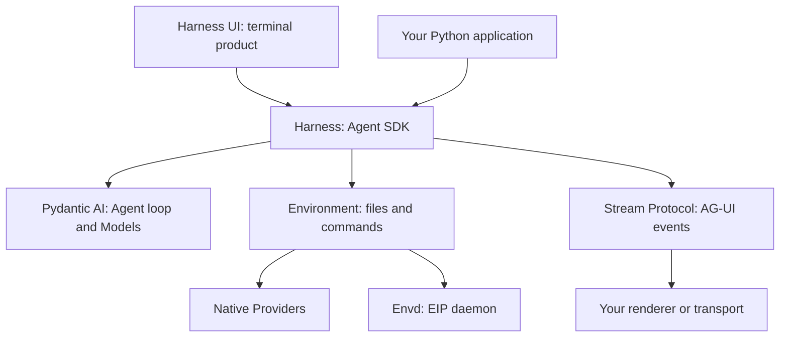

# Agent Foundation

Use an AI agent in your terminal, embed one in a Python application, or build the infrastructure around it. Agent Foundation provides a ready-to-use local product and focused SDKs built on Pydantic AI.

## Start with what you want to do

| Goal                                                  | Start here                                                                                                  |
| ----------------------------------------------------- | ----------------------------------------------------------------------------------------------------------- |
| Work on a repository with an AI agent                 | **[Harness UI](a13n-harness-ui/index.md)** — install, connect a model, and start chatting                   |
| Find or change terminal configuration                 | **[Configuration recipes](a13n-harness-ui/configuration-recipes.md)** — exact files, settings, and examples |
| Build an agent into a Python application              | **[Harness](a13n-harness/index.md)** — offline quickstart and feature guides                                |
| Give software portable file and command access        | **[Environment](a13n-environment/index.md)** — independent Python operations and Providers                  |
| Run Environment operations through a daemon           | **[Envd](a13n-envd/index.md)** — installation, configuration, isolation, and EIP                            |
| Convert agent observations for a UI or event consumer | **[Stream Protocol](a13n-stream-protocol/index.md)** — typed AG-UI projection                               |

## Use Harness UI

```console
uv tool install a13n-harness-ui
cd your-repository
a13n-harness-ui
```

First-use setup connects a subscription or API-key Model and asks you to choose execution permissions. No SDK code or service deployment is required.

The configuration root is normally `~/.a13n-harness-ui/a13n-harness-ui.yaml`. Run `a13n-harness-ui config path` or type `/config` in chat to find the selected tree.

[Get started](a13n-harness-ui/index.md) · [Configure](a13n-harness-ui/configuration.md) · [Use the terminal](a13n-harness-ui/everyday-use.md)

## Build with the SDKs



You do not need every component. Environment works without an Agent; Harness works without an Environment; Stream Protocol is optional when you need AG-UI rather than native Harness observations.

| Component       | Python distribution / import                          | Responsibility                                                                   |
| --------------- | ----------------------------------------------------- | -------------------------------------------------------------------------------- |
| Harness UI      | `a13n-harness-ui` / `a13n_harness_ui`                 | Local configuration, conversations, terminal interaction, and Host lifecycle     |
| Harness         | `a13n-harness` / `a13n_harness`                       | Agent composition, scoped Runs, continuation, and observation                    |
| Environment     | `a13n-harness` / `a13n_harness.providers.environment` | Providers, single-Environment operations, and target state                       |
| Envd            | Native `a13n-envd` executable                         | Environment Interaction Protocol (EIP), command containment, and file operations |
| Envd client     | `a13n-envd-client` / `a13n_envd_client`               | Generated low-level Python EIP client                                            |
| Stream Protocol | `a13n-stream-protocol` / `a13n_stream_protocol`       | Harness-to-AG-UI conversion, not transport or rendering                          |

These are component names, not alternative names for the same runtime. In particular, Envd does not run an Agent, and a saved stream snapshot is not Agent continuation state.

## Hosted services

**[Service](a13n-service/index.md)** embeds Harness for managed execution, with **[Console](a13n-service/console.md)** for browser resource management and conversations. Follow [Agents, Threads, and Runs](a13n-service/agents-and-runs.md) to submit durable work, or [SDKs](a13n-service/sdks.md) to integrate an application. Client coverage differs by language; these SDKs are not the Harness SDK or an umbrella installation.

For an application embedding Harness directly, start with [Embedding in a Host](a13n-harness/hosting.md) instead of deploying the Service unnecessarily.

For the complete repository package map, including Service clients, logging, private frontends, and runnable examples, see the [package catalog](packages.md).

## Documentation and releases

The site tracks the repository's `main` branch. Source examples use the locked workspace; published packages should be used with their corresponding release documentation and dependency metadata. The project remains in `0.x` development, so do not assume compatibility across every release.

Harness, Environment, and Stream Protocol share one exact release version. Harness UI and Envd have their own release boundaries. Accepted architecture lives in [specifications](https://github.com/converge-ai-labs/agent-foundation/tree/main/spec); repository setup and validation live in [Contributing](https://github.com/converge-ai-labs/agent-foundation/blob/main/CONTRIBUTING.md).
