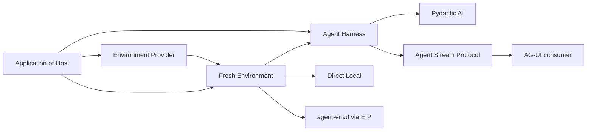

# Agent Foundation

Agent Foundation provides reusable, process-local building blocks for applications that run agents. Start with the Agent Harness, then add an Environment or a stream projection only when your product needs those boundaries.

The project builds on [Pydantic AI](https://ai.pydantic.dev/). Pydantic AI owns the Agent loop, models, messages, tools, output validation, and native events. Agent Foundation adds application-facing composition, continuation state, Environment integration, observation, and hosting contracts without taking ownership of your product lifecycle.

## Choose your path

| If you want to...                                                        | Read...                                                                                                  |
| ------------------------------------------------------------------------ | -------------------------------------------------------------------------------------------------------- |
| Build and run an Agent inside a Python application                       | [Agent Harness overview](agent-harness/index.md) and [Getting Started](agent-harness/getting-started.md) |
| Integrate the Harness into a Host with persistence and current authority | [Embedding in a Host](agent-harness/hosting.md)                                                          |
| Give an Agent access to files, commands, processes, or ports             | [Environment overview](environments/index.md)                                                            |
| Run local Environment operations through native isolation                | [`agent-envd`](agent-envd/index.md)                                                                      |
| Implement or operate an Environment provider                             | [Environment Provider](agent-environment-provider/index.md)                                              |
| Convert Harness observations into AG-UI events                           | [Agent Stream Protocol](agent-stream-protocol/index.md)                                                  |

## The main execution path

These components stay separate deliberately:

- the **application or Host** owns identity, authorization, persistence, delivery, and product policy;
- the **Agent Harness** owns one process-local definition and logical run;
- **Pydantic AI** owns the inner Agent loop;
- an **Environment Provider** validates configuration and constructs fresh Environment adapters;
- **`agent-envd`** serves one configured Environment generation over EIP;
- **Agent Stream Protocol** projects public observations but does not run or resume an Agent.

## Agent Harness

Use `a13n-harness` when you want a reusable execution boundary around Pydantic AI. It provides:

- code-first Agent definitions and a reusable `ExecutableAgent`;
- definition-selected Capabilities and fresh run collaborators;
- provider-neutral Environment tools;
- normalized streams, results, usage, and correlation;
- portable `HarnessState`, resume, and deferred interaction;
- Skills, inline delegation, restricted CodeAct, and trusted plugins;
- OpenTelemetry-native observation boundaries.

[Run the offline quickstart](agent-harness/getting-started.md) or [choose a Harness guide](agent-harness/index.md#choose-a-guide).

## Environments

An Environment is one fresh single-use adapter through which an Agent can work with files, commands, processes, retained output, and ports. The Host selects a trusted Provider, configuration, current state, and runtime collaborators before passing the constructed adapter to Harness. Harness closes it non-destructively; target destruction remains an explicit Host operation.

Use Direct Local for trusted work against a Host-selected directory. Use Local Envd or another EIP-backed provider when the workload needs an isolation or remote-execution boundary.

[Choose an Environment backend](environments/index.md) or [operate `agent-envd`](agent-envd/index.md).

## Streaming

`a13n-stream-protocol` converts public Harness stream items into typed AG-UI events. It is useful when a browser, terminal, event store, or another AG-UI consumer needs one stable projection. Persistence, replay IDs, transport, and rendering remain Host responsibilities.

[Read the Agent Stream Protocol guide](agent-stream-protocol/index.md).

## Project status

Agent Foundation is under active 0.x development. These pages track implemented and tested public API surfaces on `main` and currently target the next Harness release; the latest published packages predate some documented APIs. Use the source setup in [Getting Started](agent-harness/getting-started.md) until the documentation-aligned release is available.

Compatibility may still change between releases. Normative architecture and compatibility contracts live in the repository's [accepted specifications](https://github.com/converge-ai-labs/agent-foundation/tree/main/spec).
