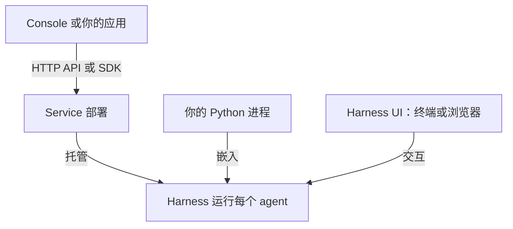

Agent Foundation 通过 Service 提供托管执行，通过 Harness 提供嵌入式执行，通过 Harness UI 提供交互式工作台。

| 你的目标                   | 所需条件                                         | 从这里开始                                             |
| -------------------------- | ------------------------------------------------ | ------------------------------------------------------ |
| 部署共享 agent 平台        | 本地试用需要 Docker Compose 和模型 provider 账号 | [Service 快速入门](../a13n-service/get-started.md)     |
| 使用团队的 agent           | Console 地址、账号和运行 agent 的权限            | [使用已有平台](../a13n-service/use-platform.md)        |
| 从应用调用远程 agent       | Service 地址、工作空间 API 密钥和已配置的 agent  | [连接你的应用](../a13n-service/connect-application.md) |
| 在 Python 进程内运行 agent | Python 3.13+ 和 uv；首个示例使用离线模型         | [Harness 快速入门](../a13n-harness/getting-started.md) |
| 在仓库中交互式工作         | Harness UI 和受支持的模型订阅或 API 密钥         | [配置 Harness UI](../a13n-harness-ui/setup.md)         |

## 选择执行位置

- **Service：** 应用向已运行的部署提交任务。Service 负责身份管理、会话保存和持久执行；Console 是它的浏览器应用。
- **Harness：** Python 进程构建并运行 agent。存储、访问策略和结果交付由你的应用负责。
- **Harness UI：** 终端和浏览器工作台使用自己的配置和会话历史来运行 agent。只与可信的协作者共享实例；Harness UI 没有按用户划分的权限或隔离。

**Service SDK** 是远程执行的客户端。**Harness 库** 在你的进程中执行 agent。Console 和 Harness UI 的 WebUI 是两个独立的浏览器应用。

## 单独使用组件

| 需求                                       | 指南                                                |
| ------------------------------------------ | --------------------------------------------------- |
| 可移植的文件和命令操作，无论是否使用 agent | [Environments](../environments/index.md)            |
| 通过守护进程操作环境                       | [Envd](../a13n-envd/index.md)                       |
| 将 Harness 观测转换为 AG-UI 事件           | [Stream Protocol](../a13n-stream-protocol/index.md) |
| 发行包名、导入路径和可运行示例             | [软件包目录](packages.md)                           |

要了解一次对话的完整流程，请阅读[核心概念](core-concepts.md)。部署运维请参阅[运维 Service](../a13n-service/operations.md)。Service 客户端独立发布版本，请核对其[支持的协议约定](../a13n-service/sdks.md#keep-version-ownership-clear)是否匹配你的部署。
