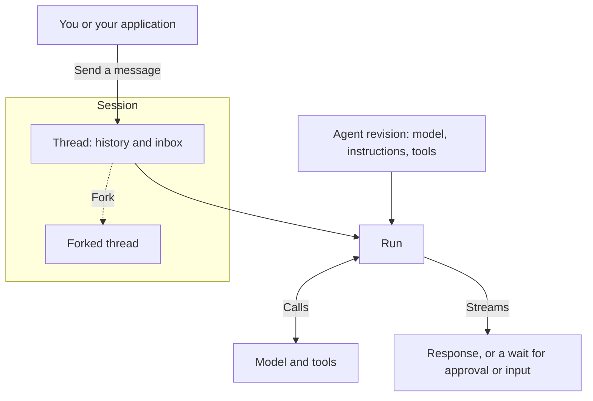

Follow one conversation with an agent that reports project status. This example uses **Service**, the managed-agent runtime, through **Console** or the HTTP API. For embedded or interactive execution, see [Choose your path](choose-your-path.md).

## Build the agent

An administrator gives you a role in a **workspace**, which contains your team's agents, other resources, and conversations. Your roles in the organization and workspace determine what you can use or change.

An **agent** combines a model, instructions, and tools. Example instructions: “Summarize project progress and cite the information you used.” Each save creates an immutable **revision**. A run uses the agent's default revision unless the message pins another one.

| Part            | Role in the agent's work                                                   |
| --------------- | -------------------------------------------------------------------------- |
| **Model**       | Interprets requests and produces responses or tool calls                   |
| **Tool**        | Looks up a task, reads a file, or performs another configured action       |
| **Connection**  | Gives access to external tools through MCP or an app account               |
| **Environment** | Provides the files and command execution used by tools                     |
| **Memory**      | Holds project decisions the agent can read and update across conversations |

Start with a model and instructions. Before you ask the agent to look up real progress, add a tool or connection that reads your project data. [Tools and connections](../a13n-service/tools.md) explains the setup.

## Start a conversation

Ask: “Summarize the project status and list the next two tasks.”

A **session** is one conversation; it groups **threads**. Each thread has its own history and inbox. Through the API, forking a run creates another thread in the same session to explore a different direction. A **run** advances a thread using the agent's model and tools.

You see output as it streams. A message sent while a run is active joins that run at its next model request when it is compatible; otherwise it waits in the inbox for a later run.

## Answer a question or approve a tool call

If the agent asks which project you mean, answer in the conversation. If a tool call needs approval, approve or deny it. The conversation continues with your response. Applications handle these through [Waits, approvals and questions](../a13n-service/agents-and-runs.md#waits-approvals-and-questions).

## Continue later

Ask “Which task should I do first?” in the same thread to continue from its history. An active run continues when you disconnect, and Service stores the thread's history for your return.

| Information       | Purpose                                            |
| ----------------- | -------------------------------------------------- |
| Thread history    | Continue this thread                               |
| Memory            | Save and retrieve information across conversations |
| Environment files | Store documents and other working files for tools  |

Mount a [memory](../a13n-service/memory.md) on the thread, or set it as an agent default, to share saved decisions across conversations. It can supply file context or recall relevant records automatically; enabled memory tools let the agent search and update it. The idle policy of the [environment](../a13n-service/environments.md) template determines how long an environment's files remain available.

Next, [try an agent in Console](../a13n-service/use-platform.md) or [connect your application](../a13n-service/connect-application.md). See [Agents, threads and runs](../a13n-service/agents-and-runs.md) for revision selection and execution details.
