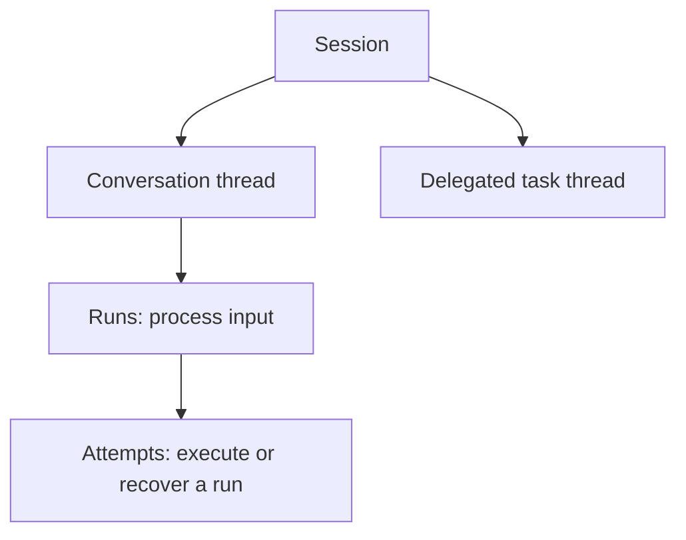

Use **Console** or a Service SDK to ask an agent for a project update. This walkthrough introduces **Service** through that conversation. For Harness and Harness UI, see [Choose your path](choose-your-path.md).

## Choose an agent

An administrator gives you a role in a **workspace**, which contains your team's agents, other resources, and conversations. Your roles in the organization and workspace determine what you can use or change.

An **agent** combines a model, instructions, and tools. Example instructions: “Summarize project progress and cite the information you used.”

| Part            | Role in the agent's work                                                   |
| --------------- | -------------------------------------------------------------------------- |
| **Model**       | Interprets requests and produces responses or tool calls                   |
| **Tool**        | Looks up a task, reads a file, or performs another configured action       |
| **Connection**  | Gives access to external tools through MCP or an app account               |
| **Environment** | Provides the files and command execution used by tools                     |
| **Memory**      | Holds project decisions the agent can read and update across conversations |

Start with a model and instructions. Before you ask the agent to look up real progress, add a tool or connection that reads your project data. [Tools and connections](../a13n-service/tools.md) explains the setup.

## Start a conversation

Ask: “Summarize the project status and list the next two tasks.”

In Console, choose an agent and send your message. In an application, [start a conversation through an SDK](../a13n-service/connect-application.md).

You see replies and tool activity as they arrive. While the agent works, you can add guidance or stop it. Compatible guidance joins the active run at its next model request; other messages stay queued.

## Answer a question or approve a tool call

Answer questions and approve or deny tool calls in their conversation cards. Submit the complete set of pending answers to continue. Applications use the [resume API](../a13n-service/agents-and-runs.md#waits-approvals-and-questions).

## Continue later

Open **Sessions** and choose **Continue conversation**, then ask “Which task should I do first?” Applications send the follow-up to the returned thread reference. Work continues when you disconnect, and Service stores the history for your return. **Inspect execution** opens the diagnostic view when you need to investigate a problem.

| Information       | Purpose                                            |
| ----------------- | -------------------------------------------------- |
| Thread history    | Continue this thread                               |
| Memory            | Save and retrieve information across conversations |
| Environment files | Store documents and other working files for tools  |

To share decisions across conversations, add [memory](../a13n-service/memory.md) to the thread or agent defaults. [Environment storage and lifecycle](../a13n-service/environments.md) determine how long working files remain available.

## Understand execution when you need it

A **session** groups related **threads**, each with its own history and inbox. A **run** processes input using the agent's model and tools. An **attempt** is one execution of that run; recovery starts another attempt.

Console's Debug view shows these execution details. Guidance can join an active run; answering a waiting request creates a successor run.

Configuration changes create immutable **revisions**, listed under **Versions**. New messages use the default revision unless they select another. Active runs and approval continuations keep their original revision.

Next, [try an agent in Console](../a13n-service/use-platform.md) or [connect your application](../a13n-service/connect-application.md). See [Agents, threads and runs](../a13n-service/agents-and-runs.md) for revision selection and execution details.
