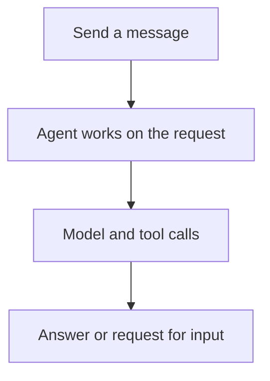

Follow a project assistant through one conversation. This example uses **Service**, the shared platform accessed through **Console** or the HTTP API. For embedded or interactive execution, see [Choose your path](choose-your-path.md).

## Configure the assistant

Your organization gives you access to a **workspace**, which contains your team's agents, resources, and conversations. Your roles in the organization and workspace determine what you can use or change.

An **agent** combines a model, instructions, and tools. For example: “Summarize project progress and cite the information you used.” Each saved configuration is a **revision**; each run uses a selected revision.

| Component       | In this example                                                            |
| --------------- | -------------------------------------------------------------------------- |
| **Model**       | Interprets requests and produces responses or tool calls                   |
| **Tool**        | Looks up a task, reads a file, or performs another configured action       |
| **Connection**  | Gives access to external tools through MCP or an app account               |
| **Environment** | Provides the files and command execution used by tools                     |
| **Memory**      | Holds project decisions the agent can read and update across conversations |

Start with a model and instructions. Add access to your project data before asking the assistant to look up real progress. [Resource basics](../a13n-service/resources.md) explains the setup.

## Start a conversation

Ask: “Summarize the project status and list the next two tasks.”

A **session** groups the conversation's **threads**. Each thread has its own history and inbox. Forking creates another thread in the same session to explore a different direction. A **run** advances a thread using the agent's model and tools.

You see output as it streams. A message sent during execution can guide the active run or wait in the inbox for later work.

## Answer a question or approval

If the assistant asks which project you mean, answer in the conversation. If a tool needs approval, approve or reject it. The conversation continues with your response. Applications handle these through [Waits, approvals and questions](../a13n-service/agents-and-runs.md#waits-approvals-and-questions).

## Continue later

Ask “Which task should I do first?” in the same thread to continue from its history. Service keeps running when you disconnect and stores the conversation for your return.

| Information          | Purpose                                            |
| -------------------- | -------------------------------------------------- |
| Conversation history | Continue this discussion                           |
| Memory               | Save and retrieve information across conversations |
| Environment files    | Store documents and other working files for tools  |

Attach [memory](../a13n-service/memory.md) to share saved decisions across conversations. It can supply file context or recall relevant records automatically; enabled memory tools let the agent search and update it. [Environment](../a13n-service/environments.md) configuration determines how long its files remain available.

Next, [try an agent in Console](../a13n-service/use-platform.md) or [connect your application](../a13n-service/connect-application.md). See [Agents, threads and runs](../a13n-service/agents-and-runs.md) for revision selection and execution details.
