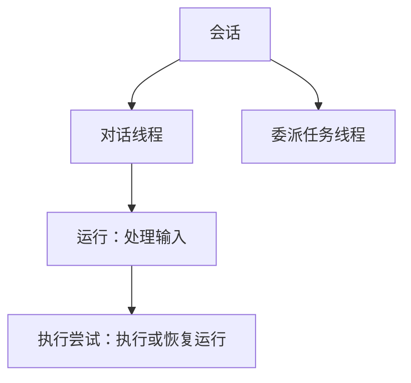

通过 **Console** 或 Service SDK，让 agent 汇报项目进展。本页用这次对话介绍 **Service** 的核心概念。Harness 和 Harness UI 的用法见[选择使用方式](choose-your-path.md)。

## 选择 agent

管理员授予你某个**工作空间**的角色。工作空间中包含团队的 agent、其他资源和对话。你在组织和工作空间中的角色决定了可以使用或修改哪些内容。

一个 **agent** 由模型、指令和工具组成。指令示例：“总结项目进展，并引用所使用的信息”。

| 组成部分 | 在 agent 工作中的作用                         |
| -------- | --------------------------------------------- |
| **模型** | 理解请求，生成回复或工具调用                  |
| **工具** | 查找任务、读取文件或执行其他已配置的操作      |
| **连接** | 通过 MCP 或应用账号访问外部工具               |
| **环境** | 为工具提供文件访问和命令执行能力              |
| **记忆** | 保存项目决策，让 agent 在不同对话中读取和更新 |

先配置模型和指令。让 agent 查询实际进展前，先添加能读取项目数据的工具或连接。[工具与连接](../a13n-service/tools.md)介绍了配置方法。

## 开始对话

发送：“总结项目状态，并列出接下来的两个任务。”

在 Console 中选择 agent 并发送消息。在应用中，[通过 SDK 开始对话](../a13n-service/connect-application.md)。

回复和工具活动会随进度显示。agent 工作时，可以补充说明或停止执行。兼容的补充说明会在下一次模型请求时加入当前运行，其他消息继续排队。

## 回答问题或审批工具调用

在对话卡片中回答问题、批准或拒绝工具调用。提交整组待处理请求的回答后，对话继续。应用通过[恢复 API](../a13n-service/agents-and-runs.md#waits-approvals-and-questions)处理这些情况。

## 稍后继续

打开**会话**列表，选择**继续对话**，再问“我应该先做哪个任务？”。应用向返回的线程发送后续消息。断开连接后，agent 仍会继续工作，Service 会保存历史。排查问题时，选择**检查执行**。

| 信息     | 用途                             |
| -------- | -------------------------------- |
| 线程历史 | 继续当前线程                     |
| 记忆     | 在不同对话之间保存和检索信息     |
| 环境文件 | 保存文档和工具使用的其他工作文件 |

要跨对话共享决策，在当前线程或 agent 默认配置中添加[记忆](../a13n-service/memory.md)。[环境的存储方式和生命周期](../a13n-service/environments.md)决定了工作文件可以保留多久。

## 需要时再了解执行细节

**会话（session）** 包含相关的 **线程（thread）**，每个线程有独立的历史和收件箱。一次 **运行（run）** 使用 agent 的模型和工具处理输入。**执行尝试（attempt）** 是运行的一次实际执行；恢复时会开始新的尝试。

Console 的 Debug 视图展示这些执行细节。补充说明可以加入正在进行的运行，回答等待中的请求则会创建后继运行。

修改配置会创建不可变的 **修订版本**，可在 **版本** 中查看。新消息使用默认版本，也可以指定其他版本。正在执行的运行和审批后继续的运行沿用原版本。

接下来，可以[在 Console 中试用 agent](../a13n-service/use-platform.md)，或[连接你的应用](../a13n-service/connect-application.md)。修订版本选择和执行细节请参阅[Agent、线程与运行](../a13n-service/agents-and-runs.md)。
