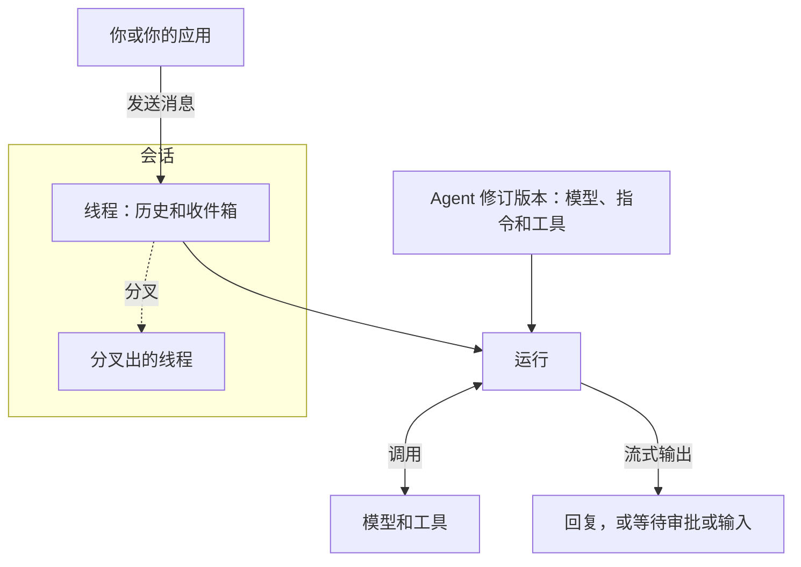

通过与一个汇报项目状态的 agent 的一次对话来了解这些概念。此示例通过 **Console** 或 HTTP API 使用托管 agent 运行时 **Service**。嵌入式执行和交互式工作请参阅[选择使用方式](choose-your-path.md)。

## 构建 agent

管理员授予你某个**工作空间** 中的角色。工作空间中包含团队的 agent、其他资源和对话。你在组织和工作空间中的角色决定了可以使用或修改哪些内容。

一个 **agent** 由模型、指令和工具组成。指令示例：“总结项目进展，并引用所使用的信息”。每次保存都会创建一个不可变的**修订版本** 。运行使用 agent 的默认修订版本，除非消息固定了另一个修订版本。

| 组成部分 | 在 agent 工作中的作用                         |
| -------- | --------------------------------------------- |
| **模型** | 理解请求，生成回复或工具调用                  |
| **工具** | 查找任务、读取文件或执行其他已配置的操作      |
| **连接** | 通过 MCP 或应用账号访问外部工具               |
| **环境** | 为工具提供文件访问和命令执行能力              |
| **记忆** | 保存项目决策，让 agent 在不同对话中读取和更新 |

先配置模型和指令。让 agent 查询实际进展前，先添加能读取项目数据的工具或连接。[工具与连接](../a13n-service/tools.md)介绍了配置方法。

## 开始对话

发送：“总结项目状态，并列出接下来的两个任务。”

一个**会话** 就是一次对话，它将多个**线程** 组织在一起。每个线程都有自己的历史和收件箱。通过 API 分叉某次运行，会在同一会话中创建另一个线程，用于探索不同方向。一次**运行** 使用 agent 的模型和工具推进线程。

输出会实时流式显示。运行进行中发送的消息如果与该运行兼容，会在下一次模型请求时并入该运行；否则留在收件箱中，等待后续运行。

## 回答问题或审批工具调用

如果 agent 询问你指的是哪个项目，就在对话中回答。如果工具调用需要审批，批准或拒绝即可。对话会根据你的回复继续。应用通过[等待、审批和问题](../a13n-service/agents-and-runs.md#waits-approvals-and-questions)处理这些情况。

## 稍后继续

在同一线程中询问“我应该先做哪个任务？”，即可根据历史继续讨论。断开连接后，进行中的运行会继续，Service 会保存线程历史，供你回来后继续。

| 信息     | 用途                             |
| -------- | -------------------------------- |
| 线程历史 | 继续当前线程                     |
| 记忆     | 在不同对话之间保存和检索信息     |
| 环境文件 | 保存文档和工具使用的其他工作文件 |

将[记忆](../a13n-service/memory.md)挂载到线程，或将其设为 agent 的默认挂载，即可跨对话共享保存的决策。记忆可以提供文件上下文或自动召回相关记录；启用记忆工具后，agent 可以搜索和更新记忆。[环境](../a13n-service/environments.md)模板的空闲策略决定了环境中的文件可以保留多久。

接下来，可以[在 Console 中试用 agent](../a13n-service/use-platform.md)，或[连接你的应用](../a13n-service/connect-application.md)。修订版本选择和执行细节请参阅[Agent、线程与运行](../a13n-service/agents-and-runs.md)。
