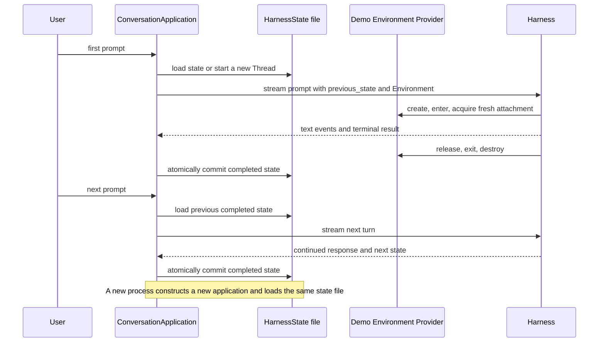

# Agent Application Example

This project is one small, complete application: an offline streaming chat that keeps one conversation across multiple turns, persists `HarnessState`, and resumes the same Thread after the process is restarted.

It intentionally uses only:

- one offline Pydantic AI `FunctionModel`;
- one local demo Environment;
- one state file;
- one `ConversationApplication` execution path.

Environment permutations and advanced ownership combinations belong in the Harness Environment tests and documentation, not in this application example.

## Run It

From the repository root:

```bash
make examples-check-all
```

Or run the application directly:

```bash
cd examples/agent-app
uv sync --locked
uv run agent-app-example
```

Enter several messages and use `/quit` to stop. The default state file is `.agent-app/conversation-state.json`; the demo Environment workspace is `.agent-app/workspace`.

Start the command again and the next turn resumes the same Harness Thread and message history.

The same lifecycle can be demonstrated non-interactively:

```bash
uv run agent-app-example \
  --state ./conversation-state.json \
  "Remember that the release is Friday." \
  "When is the release?"

uv run agent-app-example \
  --state ./conversation-state.json \
  "Continue after the application restart."
```

Use `--workspace PATH` only when you want the single demo Environment rooted somewhere else.

## Application Flow



The Provider, Resource, attachment, credentials, and grants are fresh authority and are not serialized into `HarnessState`. The checkpoint can contain portable provider-defined Environment continuation state, which the Harness restores only into a compatible freshly bound Environment. Conversation history resumes because the application reloads the last completed state and passes it as `previous_state`.

## Main API

```python
from pathlib import Path

from a13n_agent_app_example import (
    ConversationApplication,
    create_demo_environment,
)

state_path = Path("conversation-state.json")
environment = create_demo_environment(Path("workspace"))

async with ConversationApplication(
    model=model,
    state_path=state_path,
    environment=environment,
) as application:
    async with application.stream_turn("Hello") as stream:
        async for text in stream:
            print(text, end="", flush=True)
```

`ConversationApplication` owns one reusable `ExecutableAgent` for its process lifetime. For each turn it:

1. serializes turn execution with an async lock;
2. loads the last successfully committed `HarnessState` if present;
3. opens one explicitly scoped turn stream with the Environment and `previous_state`;
4. yields text start and delta events immediately;
5. closes the Harness stream and Environment lifecycle if the consumer stops early;
6. requires a successful terminal result;
7. atomically replaces the state file with the returned continuation state.

Closing the application closes its executable. The Harness owns the demo Provider's temporary Resource lifecycle for each turn: create, Resource entry, attachment acquisition, attachment release, Resource exit, and destroy.

A failed or abandoned turn does not replace the last completed state. Callers must enter `stream_turn()` with `async with`; leaving that scope deterministically closes the Harness stream and temporary Environment lifecycle. The next application instance can therefore recover only from a committed checkpoint.

## Source Layout

```text
src/a13n_agent_app_example/
  application.py  # Multi-turn streaming and HarnessState persistence
  environment.py  # The single offline demo Environment
  cli.py          # Interactive and non-interactive entry point

tests/
  test_application.py  # Multi-turn chat, restart recovery, failure, and cleanup
```

## Using a Real Model

The runnable CLI uses an offline `FunctionModel`, but `ConversationApplication` accepts any native Pydantic AI `Model`:

```python
from a13n_harness import infer_model

model = infer_model(
    "openai-responses:gpt-5",
    provider_factory=provider_factory,
    patches=(apply_provider_patch,),
)
```

The caller owns model credentials, SDK clients, retry policy, and client cleanup.

## Boundaries

- `HarnessState` is portable conversation continuation data, not live Environment authority.
- The state file is a small single-process example, not a distributed checkpoint store or lease protocol.
- The local demo Environment is intentionally the only Environment in this application.
- Advanced multi-Environment routing and mixed ownership remain documented in the [Environment guide](../../docs/agent-harness/environments.md).
- Production Host lifecycle and checkpoint authority are documented in [Embedding in a Host](../../docs/agent-harness/hosting.md).
