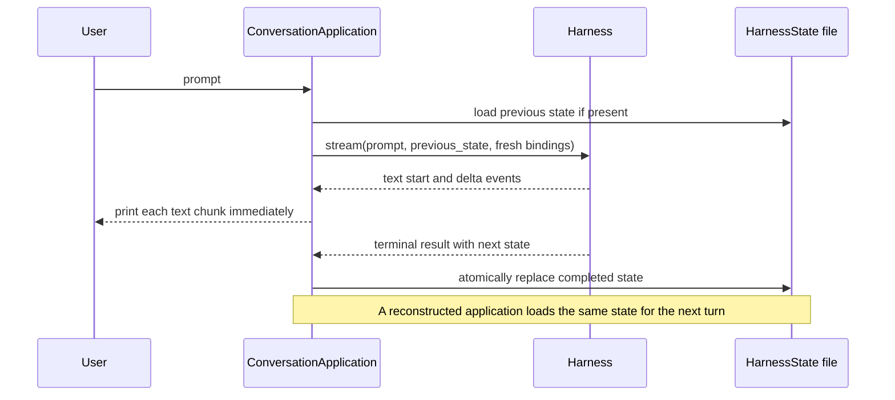

# Agent Application Example

This standalone project contains one complete application: a repeated, streaming conversation that persists `HarnessState` after every successful turn and resumes that conversation after the application is reconstructed.

The demo uses an offline Pydantic AI `FunctionModel`, so all checks run without provider credentials. The Harness build, event stream, message history, state serialization, continuation, and lifecycle are real.

## Run It

From the repository root:

```bash
make examples-check-all
```

Or run this project directly:

```bash
cd examples/agent-app
uv sync --locked

uv run agent-app-example
uv run pytest
uv run pyright
```

The CLI is interactive. Enter multiple messages, then use `/quit` to stop. By default it stores state in `.agent-app/conversation-state.json`. Start the command again to continue the same Harness Thread.

You can also run several turns non-interactively and choose the state file:

```bash
uv run agent-app-example \
  --state ./conversation-state.json \
  "Remember that the release is Friday." \
  "When is the release?"

uv run agent-app-example \
  --state ./conversation-state.json \
  "Continue after the application restart."
```

Each response is printed as text events arrive rather than waiting for the terminal result.

## Application Structure

```text
src/a13n_agent_app_example/
  application.py  # Harness build, stream consumption, and state persistence
  cli.py          # Interactive and non-interactive application entry point

tests/
  test_application.py  # Real multi-turn streaming and restart recovery
```



## Main API Path

`ConversationApplication.stream_turn()` is an async iterator:

```python
from pathlib import Path

from a13n_agent_app_example import ConversationApplication

application = ConversationApplication(
    model=model,
    state_path=Path("conversation-state.json"),
)

async for text in application.stream_turn("Hello"):
    print(text, end="", flush=True)
```

For every turn the application:

1. loads the last successfully committed `HarnessState`, or starts a new Thread;
2. builds an `ExecutableAgent` with the caller-provided native Pydantic AI `Model`;
3. creates fresh `RunBindings.local()`;
4. consumes `ExecutableAgent.stream()` and yields `TextPart` / `TextPartDelta` content immediately;
5. requires the terminal Harness result to succeed;
6. atomically writes the returned state only after successful completion.

A new `ConversationApplication` instance with the same state path and a newly constructed Model resumes the same Thread and full message history. The state is portable continuation data, not live authority or a provider client.

## Using a Real Model

The application accepts any native Pydantic AI `Model`. Construct one yourself or use the optional Harness inference layer:

```python
from a13n_harness import infer_model

model = infer_model(
    "openai-responses:gpt-5",
    provider_factory=provider_factory,
    common_headers={"x-session-id": session_id},
    patches=(apply_provider_patch,),
)
```

For `gateway@provider:model` routes, pass `gateway_provider_factory`. The factory owns credentials, provider SDK setup, retries, any HTTP client, and client cleanup. You can skip Harness `infer_model()` entirely and pass a self-constructed native Model.

## Boundaries

- `HarnessState` stores portable continuation data and the stable Thread ID.
- The application owns checkpoint selection by deciding which state file to load.
- Fresh bindings and current authority are reconstructed for every Harness run; they are not restored from state.
- The state file is a small single-application example, not a distributed lease or concurrent writer protocol.
- Abandoned or failed streams are not committed as completed turns.
- The caller owns the Model and any provider resources behind it.

For production Host lifecycle and checkpoint authority, read [Embedding in a Host](../../docs/agent-harness/hosting.md). For the state contract, read [State and Resume](../../docs/agent-harness/state-and-resume.md).
