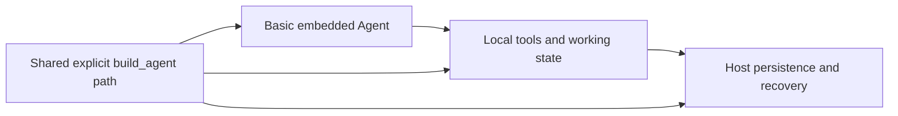
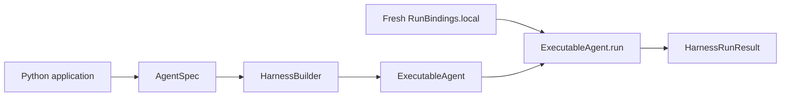
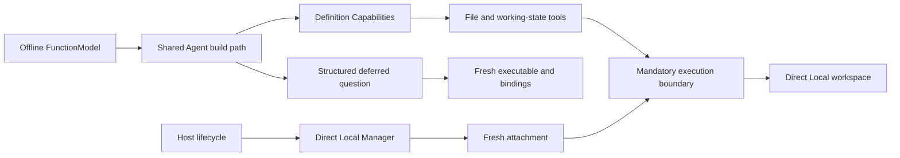
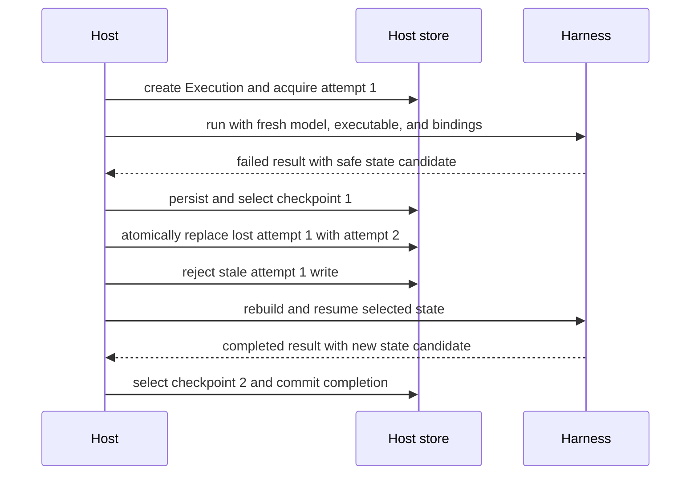

# Agent Application Example

This standalone project shows one Python application adopting `converge-agent-harness` progressively. Start with the minimal embedded Agent, add first-party Capabilities and a Direct Local Environment, then add Host-owned checkpoint selection, fencing, and recovery. The three layers share one explicit Agent build path instead of presenting separate application templates.

All commands run offline. Deterministic Pydantic AI `FunctionModel` implementations replace only the external model provider; the Harness build, Agent loop, tools, run lifecycle, state, usage, and result boundaries are real.

## Run It

From the repository root:

```bash
make examples-check-all
```

Or run this project directly:

```bash
cd examples/agent-app
uv sync --locked

uv run agent-app-example basic "Describe the embedded Harness path."
uv run agent-app-example local
uv run agent-app-example host
uv run pytest
```

Retain the local workspace or Host records in caller-owned directories when you want to inspect them:

```bash
uv run agent-app-example local --workspace ./agent-workspace --review-style Broad
uv run agent-app-example host --state-dir ./host-state
```

Do not put `host-state` inside an Agent workspace or disposable Environment. The Host must be able to select a checkpoint after the worker, process, or Environment that produced it is gone.

## Progressive Structure

```text
src/converge_agent_app_example/
  application.py  # Shared build path and minimal embedded run
  workspace.py    # Local Capabilities, tools, suspension, and resume
  recovery.py     # Host-owned execution and recovery orchestration
  store.py        # Teaching-only local Host authority store
  cli.py          # One command exposing the three layers
```



The layers are alternatives you can run independently, not lifecycle stages that must all execute in one process. Copy only the layer your application needs.

## Layer 1: Basic Embedded Agent

`application.py` contains the normal code-library path:

```python
executable = build_agent(model=model)

async with executable:
    result = await executable.run(
        prompt,
        bindings=RunBindings.local(),
    )

output = result.output_or_raise()
```

`build_agent()` uses:

```python
HarnessBuilder(configured_plugins_enabled=False).build_code(...)
```

Disabling configured plugins makes the example composition independent from ambient plugin environment variables. This layer selects no optional Capability, tool, child Agent, or configured Environment operation. `RunBindings.local()` still supplies the required no-op Environment binding internally.

The basic path is:



Pass any Pydantic AI model or model name in a real application:

```python
result = await run_basic_agent(
    "Explain the change.",
    model="openai:gpt-5-mini",
)
```

Install the matching provider dependency and configure its credentials before using a real model.

## Layer 2: Local Capabilities and Environment

`workspace.py` reuses `build_agent()` and adds definition-selected:

- `DynamicEnvironmentCapability` for file tools;
- `WorkingStateCapability` for tasks and notes;
- `UserInteractionCapability` for structured suspension.

For every Harness run, the application creates fresh:

- a Direct Local `ManagedEnvironment` through the Host-facing Provider Manager;
- a runtime attachment transferred into a Direct Local Harness binding and topology;
- `InvocationPolicyCapability` authorizing the teaching workspace;
- `RunBindings` identity and run-local collaborators.

The offline model calls `write`, `task_create`, `note`, and `ask_user_question`. The first run suspends, the application rebuilds the executable and current bindings through a second Provider create/attachment scope, and a second Harness run resumes from the portable `HarnessState` plus a correlated `DeferredToolResume`. The Harness does not resume the Provider resource.



The allow-all evaluator is appropriate only for this isolated example workspace. A real Host evaluates current identity, tool metadata, normalized arguments, and resources before each managed invocation.

## Layer 3: Host Persistence and Recovery

`recovery.py` and `store.py` add application-owned durable lifecycle authority without treating `HarnessState` as that authority. The example keeps separate:

- the portable continuation candidate exported by Harness;
- the Host-owned Execution, ExecutionAttempt, opaque fence, selected checkpoint, and terminal result;
- fresh identity, model, executable, and Environment bindings reconstructed for every attempt.

The first model emits completed thinking, visible text, and unfinished thinking before a simulated interruption. Harness returns a safe state candidate that retains the visible text and completed thinking while excluding unfinished thinking. The Host selects that candidate without committing the Harness-local failure as its terminal result. A reopened Host store then atomically replaces the lost attempt without its fence, builds a fresh model and executable, recreates bindings, resumes from the selected checkpoint, and performs a separate fenced terminal commit.



`JsonFileHostStore` writes bounded teaching records:

```text
<state-dir>/
  executions/
    execution-1/
      execution.json
      checkpoints/
        checkpoint-1.json
        checkpoint-2.json
```

The store demonstrates payload-before-authority ordering, orphan-payload reconciliation, immutable checkpoint selection, Host-authorized attempt replacement, fresh fencing, stale-attempt rejection, and terminal separation. Use only one active store caller for a root at a time. Its `asyncio.Lock` does not coordinate separate store instances or processes, so this is not a distributed lease or production database implementation.

A production Host must reconstruct current authority before every run and keep these facts outside `HarnessState`:

| Concern                                                | Durable owner             |
| ------------------------------------------------------ | ------------------------- |
| Definition revision and artifact selection             | Host                      |
| Current identity, policy, grants, and credentials      | Host                      |
| Desired Environment topology and provider launch state | Host/provider integration |
| ExecutionAttempt generation, lease, and fence          | Host                      |
| Selected checkpoint and provenance                     | Host                      |
| Side-effect reconciliation and pending delivery        | Host/provider integration |
| Terminal result, lifecycle events, and accounting      | Host/product              |

A checkpoint records observations; it does not make an external mutation exactly once. After an uncertain side effect, reconcile provider state or reuse an operation-specific idempotency contract before replaying work.

## Boundaries Demonstrated

| Part                                         | Basic                     | Local                     | Host                      |
| -------------------------------------------- | ------------------------- | ------------------------- | ------------------------- |
| Shared explicit `HarnessBuilder` composition | Yes                       | Yes                       | Yes                       |
| Fresh run bindings                           | Yes                       | Yes                       | Yes                       |
| Optional first-party Capabilities            | No                        | Yes                       | No                        |
| Direct Local Environment tools               | No                        | Yes                       | No                        |
| Harness suspension and resume                | No                        | Yes                       | Resume after interruption |
| Host-selected durable checkpoint             | No                        | No                        | Yes                       |
| Attempt fence and terminal authority         | No                        | No                        | Yes                       |
| External model provider                      | Deterministic replacement | Deterministic replacement | Deterministic replacement |

The Host store and offline models are application teaching code, not additional Agent Foundation APIs.

## Next Steps

- Read the [Agent Harness guide](../../docs/agent-harness/index.md) for the public application surface.
- Read [State and Resume](../../docs/agent-harness/state-and-resume.md) before persisting continuation data.
- Read the [Environment Provider guide](../../docs/agent-environment-provider/index.md) for Manager lifecycle, state, attachments, and plugin development.
- Read [Embedding in a Host](../../docs/agent-harness/hosting.md) before adding durable lifecycle authority.
- Use the [plugin integration example](../plugins/README.md) for packaged middleware and Environment extensions.
- Consult the normative [Agent Harness specification](../../spec/agent-harness/README.md) for ownership and compatibility contracts.
