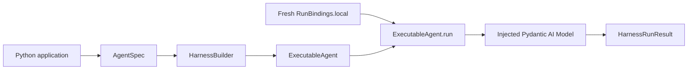

# General Agent Application

This standalone example shows the smallest normal Python application that embeds `converge-agent-harness` as a code library. It builds one reusable Agent definition, supplies fresh local run bindings, executes one prompt, and consumes the normalized Harness result.

The example intentionally uses no optional Harness Capability, tool, plugin, child Agent, or configured Environment. It explicitly disables ambient configured plugins so deployment environment variables cannot change that composition. `RunBindings.local()` supplies the required no-op Environment binding internally, but the application neither configures nor exposes Environment operations.

## Run It

From the repository root:

```bash
make examples-check-all
```

Or run only this project:

```bash
cd examples/general-agent
uv sync --locked
uv run general-agent-example "Describe the minimal Harness path."
uv run pytest
```

The command needs no model API key or network access. Its deterministic `FunctionModel` replaces only the external model provider.

## Main Path



The complete application-owned path is in `application.py`:

```python
from converge_agent_harness import HarnessBuilder, RunBindings
from pydantic_ai.agent.spec import AgentSpec


executable = HarnessBuilder(configured_plugins_enabled=False).build_code(
    AgentSpec(model="logical:general-agent"),
    output_type=str,
    model=model,
)

async with executable:
    result = await executable.run(
        prompt,
        bindings=RunBindings.local(),
    )

output = result.output_or_raise()
```

This is the same public path used by richer embedded applications and hosted workers.

## What Is Real and What Is Mocked

| Part                                        | Behavior in this example                              |
| ------------------------------------------- | ----------------------------------------------------- |
| `AgentSpec` and `HarnessBuilder`            | Real Harness build path with ambient plugins disabled |
| `ExecutableAgent.run()`                     | Real Harness logical-run lifecycle                    |
| Pydantic AI Agent loop                      | Real                                                  |
| Mandatory Harness boundaries                | Real and installed by the builder                     |
| `RunBindings.local()`                       | Real fresh identity plus no-op Environment binding    |
| `HarnessRunResult`, state, usage, and IDs   | Real                                                  |
| External model provider                     | Replaced by deterministic `FunctionModel`             |
| Optional Capabilities and Environment tools | Not selected                                          |

The mock lives in `demo.py`, outside the reusable application function. Tests inject another `FunctionModel` through the same public model argument and therefore still execute the real Harness runtime.

## Use a Real Model

`run_general_agent()` accepts any Pydantic AI `Model` or model name:

```python
result = await run_general_agent(
    "Explain the change.",
    model="openai:gpt-5-mini",
)
```

Install the matching Pydantic AI provider dependency and configure its credentials before using a real model. Harness application code does not otherwise change.

## Next Steps

- Use the [Local Agent example](../local-agent/README.md) for first-party Capabilities, Direct Local tools, working state, suspension, and resume.
- Use the [Host persistence example](../hosting/README.md) for durable checkpoint selection and fencing.
- Use the [plugin integration example](../plugins/README.md) for middleware and Environment extensions.
- Read the [Agent Harness guide](../../docs/agent-harness/index.md) for the complete public surface.
