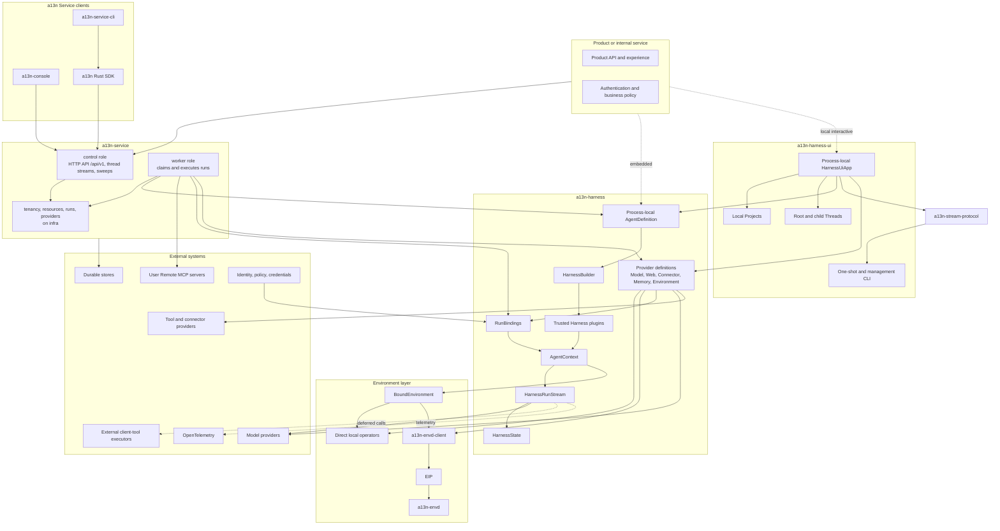
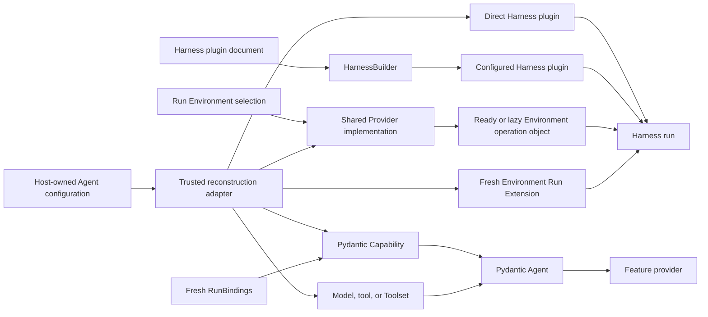
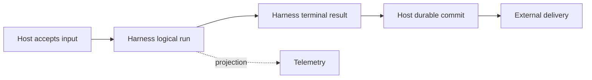

# Open-Source Agent Platform Overview

## Platform Definition

Agent Foundation is an open-source foundation for embedding Agents or hosting them as durable services. It provides reusable process-local execution, Environment, protocol, and hosting semantics while leaving product experience, business workflow, and infrastructure vendors to adopters.

The platform consists of:

- `a13n-harness`, distributed as `a13n-harness`, for code-first Pydantic AI execution and the five Provider domains, including Environment Providers, fresh process-local adapters, portable state, and built-ins;
- `a13n-stream-protocol`, distributed as `a13n-stream-protocol`, for shared Harness-to-AG-UI observation;
- `a13n-harness-ui`, distributed as `a13n-harness-ui`, for human-editable local Agent resources, Project-scoped roots, mutable continuation-backed Threads, trusted Capability and extension discovery, and full-terminal CLI and bundled WebUI interaction over a reusable App boundary;
- `a13n-envd`, distributed as `a13n-envd`, for Environment Interaction Protocol operations;
- `a13n-envd-client`, the generated low-level Python EIP client;
- `a13n-service`, distributed as `a13n-service`, for optional durable hosting;
- a13n Service SDKs for typed access to the Service HTTP API (`/api/v1`);
- `a13n-service-cli`, a cross-platform remote CLI built above the `a13n` Rust SDK.

An application can embed the Harness directly, install Harness UI for a local interactive Host, use a13n Service through an SDK or the CLI, or replace providers through documented typed and protocol boundaries.

| Direct Agent use                                                                                                            | Managed Agent use                                                                                                                |
| --------------------------------------------------------------------------------------------------------------------------- | -------------------------------------------------------------------------------------------------------------------------------- |
| An application embeds `a13n-harness`, or a user runs `a13n-harness-ui`.                                                     | A client calls `a13n-service` through an `a13n` SDK or `a13n-service-cli`.                                                       |
| The application or Harness UI owns execution, configuration, continuation storage, Environment policy, and recovery policy. | a13n Service owns managed resources and revisions, durable acceptance, scheduling, runs and attempts, permissions, and recovery. |
| Models and execution Environments can be remote.                                                                            | The Service can be deployed on the same machine as its client.                                                                   |

Service workers embed the same Harness. `a13n` is only the Service client SDK, not an umbrella distribution and not a second Agent execution engine. `a13n-console` is the Service management and interaction browser application; Harness UI remains the local interactive Host.

## Architecture

Dependency direction is one-way: Hosts embed Harness and can use its Environment Providers directly, while the Provider domains import no Host lifecycle, presentation, or Agent-loop type. Harness UI and hosted transports consume Agent Stream Protocol above public Harness observations. Service clients call only the Service HTTP API (`/api/v1`), and a13n Service CLI consumes the Rust SDK rather than implementing a second transport client.

## Component Responsibilities

| Component              | Owns                                                                                                                                                                                                                                                                                                                                                                                          | Does not own                                                                                                                                        |
| ---------------------- | --------------------------------------------------------------------------------------------------------------------------------------------------------------------------------------------------------------------------------------------------------------------------------------------------------------------------------------------------------------------------------------------- | --------------------------------------------------------------------------------------------------------------------------------------------------- |
| `a13n-harness`         | Process-local Agent construction, SDK-first Model OAuth, trusted plugins, Run context, fresh Environment entry, multi-mount aggregate-path routing/policy, recovery, execution, results, continuation state, and the Model, Web, Connector, Memory, and Environment Provider definitions with their built-ins                                                                                 | Durable resource records, Host state authority, backing-target retention policy, durable Agent schemas, presentation, delivery, or billing          |
| `a13n-stream-protocol` | Standard AG-UI conversion, generic `CUSTOM` fallback, optional replay-stable Host processing, process-local accumulation, and source-history reconstruction                                                                                                                                                                                                                                   | Agent execution, lifecycle invention, Host acceptance, durable history or replay, HTTP/SSE, or rendering                                            |
| `a13n-harness-ui`      | Human-editable multi-file resources, trusted Capability and extension catalogs, Projects, Full Control and Sandbox execution modes, Host-path-preserving and virtual Environment layouts, sticky root and child Thread configuration, immutable per-Run composition, Host Environment state, one process-local `HarnessUiApp`, full-terminal CLI, foreground WebUI, and reusable adapter APIs | Durable root-input acceptance, distributed execution, worker takeover, multi-tenant authorization, or another Agent loop                            |
| `a13n-envd-client`     | Generated EIP control/data models, codecs, stubs, async file transfer, and bounded transport/session runtime                                                                                                                                                                                                                                                                                  | Harness routing, product-user authorization, executable discovery/download/launch, provider provisioning, Host lifecycle                            |
| `a13n-envd`            | Client-neutral EIP Environment hosting, raw file transfer, operations, receipts, disk-backed command output, daemon generation, Session ownership, and bounded resource collection                                                                                                                                                                                                            | Agent loop, browser/product authentication, arbitrary URL fetch, durable execution, model policy                                                    |
| a13n SDKs              | Language-typed access to the Service HTTP API (`/api/v1`), including the thread stream                                                                                                                                                                                                                                                                                                        | Service internals, standard-protocol replacement, product policy, or durable lifecycle authority                                                    |
| `a13n-service-cli`     | Cross-platform command-line interaction with public a13n Service operations through the Rust SDK                                                                                                                                                                                                                                                                                              | A second HTTP client, service process management, persistence, queues, migrations, or infrastructure control                                        |
| `a13n-service`         | Tenancy, managed resources, Environment Providers/templates/instances and lifecycle, immutable Run selections, installed plugin configuration, durable Runs/Attempts, connections, the HTTP API, webhooks and trace queries                                                                                                                                                                   | Pydantic Agent loop, live Python object persistence, third-party credentials held by external integration services, and telemetry storage/authority |
| Product                | Caller authentication, business policy, user experience, and final delivery                                                                                                                                                                                                                                                                                                                   | Harness internals and provider implementation                                                                                                       |

## Harness Foundation

The Harness is built directly on Pydantic AI 2:

- `AgentDefinition` is an immutable process-local Python value containing native `AgentSpec`, one build-time explicit or schema-derived output contract, an optional concrete Model, top-level Capabilities, plugins, and recovery configuration;
- Capability is the only top-level feature-behavior plane; each feature Capability owns its tools, Toolsets, instructions, settings, and hooks;
- `HarnessBuilder` resolves an explicit or disabled-by-default ambient plugin Build Context, creates fresh configured instances, binds all trusted plugins, authorizes custom Capability types, and calls `Agent.from_spec()` once;
- Run arguments supply optional already constructed Environment adapters, while `RunBindings` supplies a fresh Agent instance, optional async `RunModelResolver`, Run Capabilities, metadata, and bounded Host references;
- one logical Harness Run owns one context, Environment, plugin graph, state coordinator, usage accumulator, public `run_id`, and stable Thread correlation;
- bounded model recovery can start several `ModelAttempt` values with unique upstream model-attempt IDs inside that Run;
- `HarnessState` carries one stable `thread_id`, public messages, detached Capability JSON namespaces, and `environment_states: Mapping[str, EnvironmentState]`; desired mounts, current managed state, runtime collaborators, and lifecycle policy remain Host-owned;
- Pydantic AI owns native Model profiles, transport/output retries, provider-suspended continuation, deferred external calls/approvals, Toolsets, messages, events, and usage; Harness `providers.model.oauth` adds provider-compatible OAuth sources and lifecycle where upstream SDK behavior must be shared by embedded and hosted callers.

Harness middleware plugins are trusted concrete objects, and Harness does not compile serialized Agent definitions. It owns a narrow versioned preferred YAML or supported JSON plugin document and Build Context that may, when explicitly enabled, select `a13n_harness.plugins` factories and append fresh concrete plugins during each definition build. Environment Provider definitions, catalogs, `Environment`, `EnvironmentState`, and built-ins belong to the Harness Provider subsystem. A Run receives fresh Environment adapters only. A Host owns serializable Agent schemas, artifact locks, package trust, current Environment state and associations, runtime collaborators, lifecycle policy, and durable execution; package presence and Harness import alone never enable behavior or supply an arbitrary import target.

The complete design is indexed in [a13n-harness/README.md](a13n-harness/README.md).

## Local Agent Interaction

Harness UI (`a13n-harness-ui`) is the local Agent workbench above the Harness, with a personal CLI and trusted-team collaborative WebUI, distributed by the independent `a13n-harness-ui` library. One root YAML, fixed resource-YAML directories, and canonical sibling Markdown subagents form a human-editable configuration tree for Models, Capabilities, the three extension planes, MCP servers, Agents, Projects, and global defaults. Codex and Grok subscription Models reuse their product-compatible account stores, and a Harness UI-originated login writes back to that shared store instead of creating another token copy. A root or child Thread owns sticky mutable resource selections; each admitted Run captures one immutable resolved composition and continues the selected `HarnessState`, even when the Thread changed Agent, Plugin, MCP, Project, or Environment selection since the preceding Run. Projects own ordered local roots, conversation creation configuration, and root-Thread organization; Harness UI defines no Workspace resource, and the invocation workspace is an exact-directory projection backed by internal Projects. One process-local `HarnessUiApp` reconstructs fresh Model, extension, and Environment authority and runs Harness directly. Root input, active Runs, partial output, and shell observation references remain process-local. Native command recovery is Provider-owned. Every delegate or linked resume creates one child execution segment; exact `HarnessState` is resume authority, and bounded compact AG-UI display is inspection authority. SQLite owns compact mutable Thread and execution heads plus accepted-generation indexes, while immutable files own resolved compositions and checkpoints. The full-terminal CLI and WebUI call reusable App operations. The browser adds transient shared prompt drafts and page presence, configuration composition, and explicitly enabled Git-aware native Host files and PTY for human remote access. Draft synchronization is not durable execution acceptance; native human tools do not target Agent Environments. Participants share one server authority without multi-tenancy. Configuration-file publication follows its owning source contract. Harness UI adds no Runner generation, private worker protocol, durable root queue, child lease, takeover, or distributed recovery.

`a13n-harness` and `a13n-stream-protocol` form the Harness release group. One `release/a13n-harness-v<version>` tag assigns the same version to both distributions, and published Stream Protocol metadata pins the exact Harness version. Harness UI releases independently through `release/a13n-harness-ui-v<version>` and its published artifacts use the [bounded cross-group requirements](repository-model.md#dependency-compatibility-lines) owned by consuming manifests. Source checkouts keep project versions at `0.0.0` and resolve unversioned package dependencies from the shared uv workspace. Each tag version is a stable `X.Y.Z` identity or an RC `X.Y.Z-rc.N` identity as defined by [repository release automation](repository-model.md#release-automation). Component source directories and distributions use canonical `a13n-` names, while Python import packages use the corresponding `a13n_` names.

The complete local Host design is indexed in [a13n-harness-ui/README.md](a13n-harness-ui/README.md), and the shared presentation protocol is indexed in [a13n-stream-protocol/README.md](a13n-stream-protocol/README.md).

## Recovery Boundaries

| Concern                                   | Owner                                      |
| ----------------------------------------- | ------------------------------------------ |
| Provider-suspended continuation           | Pydantic AI                                |
| Provider transport retry                  | Provider/client and Pydantic `RetryConfig` |
| Exact provider-history repair             | Harness `SelfHealingModel`                 |
| Interrupted `ModelAttempt` recovery       | Harness run coordinator                    |
| Harness UI process loss                   | Resume from the last selected continuation |
| Service worker crash and durable recovery | a13n Service                               |
| Provider-lifecycle uncertainty            | The embedding Host reports or retries it   |

Recovery never converts missing evidence into rollback or exactly-once success. Interrupted tool history records that the operation may have partially or fully completed and directs the next model to inspect state before retrying.

## Environment Foundation

The shared Environment model has only `EnvironmentProviderDefinition`, `Environment`, and `EnvironmentState`. A definition constructs a fresh adapter from optional state without I/O. The entered Environment implements provider-neutral file, shell, process, output, port, readiness, state dump, non-destructive close, and explicit Host-only destroy. Harness owns only the Run-local multi-mount facade, routing, access ceilings, stale-incarnation checks, model projection, and continuation aggregation. Direct Local and EIP are the operation backends.

The Environment Provider domain owns the three core entities, single-Environment operation contracts, and eleven built-in Providers, including `direct_local`, `local_envd`, `docker`, and `e2b`. Every independent Run receives fresh adapters. `close()` is always non-destructive; only explicit Host policy invokes `destroy()`. Local Envd opens a fresh Session over a Host-owned reusable daemon connection. The Host selects a typed Device execution boundary; Envd prepares and cleans up complete Session workers under that boundary, without silent fallback. Docker state contains the exact container ID, while Local Envd keeps raw PID and private runtime data process-local.

Envd-backed Providers adapt EIP `a13n-envd-client` sessions into fresh Provider-specific `Environment` adapters; a Run receives only those constructed adapters. Other trusted consumers can use the low-level client independently. The client communicates only over a supplied session source and never discovers, downloads, installs, or launches an executable. `a13n-envd` carries JSON-RPC control and raw file transfer over trusted stdio, Host-dialed HTTP, or an envd-initiated reverse WebSocket. Each Session owns operation/receipt evidence, process handles, disk-backed output and transfers; the daemon supplies aggregate accounting and periodic/high-water reclamation. The Host supplies OS identity and outer containment rather than an envd command-security engine. Carrier direction never changes the low-level client's requester role or envd's responder role.

Harness UI exposes Direct Local as Full Control and Host-sandboxed Local Envd as Sandbox. It lazily acquires the matching envd executable or validates an explicit override, and reuses compatible App-owned daemon connections with independent Sessions. [Device Environment bindings](a13n-harness-ui/04a-devices-and-environment-bindings.md) add remote-only and mixed working sets with immutable admission capture. Service registers connect-only HTTP(S) envd targets and freezes run mounts under its [Environment contract](a13n-service/06-environments.md#external-targets).

Provider-defined portable data enters only `HarnessState.environment_states`, a direct mapping from mount name to `EnvironmentState`. State is supplied before entry when a Host constructs each adapter; Harness never restores it afterward. Managed Host current state wins, including authoritative `None`; portable fallback is adopted only through an explicit unmanaged/import flow. Live clients, sockets, credentials, PIDs, process handles, readiness, Run-local mutation authority, Host associations, and retention policy do not become Harness state. Optional `DynamicEnvironmentCapability` composes File/Shell tools with dynamic model context but owns no backing-target lifecycle.

## a13n Client Surfaces

a13n Service SDKs, the remote CLI, and the browser management application operate only through the Service HTTP API (`/api/v1`). Agent-facing Service tools are in-process built-in toolsets bound to one attempt and expose no a13n SDK or network product API. The language SDKs provide idiomatic typed resource objects and bounded conveniences over existing Service concepts, with complete low-level protocol access for advanced use. Independent SDK repositories own their public APIs and releases. Applications retain business orchestration and cross-Run completion policy. The `a13n-service-cli` executable is a user-facing composition layer above the Rust SDK and does not duplicate HTTP serialization, authentication transport, retries, or service models.

The Service API is HTTP with a thread stream of provisional output and signed lifecycle webhooks ([API](a13n-service/10-api.md)); the [Service boundaries](a13n-service/00-overview.md#boundaries) list what it does not provide. Shared protocol adapters remain available to other Hosts.

A CLI network command and its backing SDK operation enter the platform together with the corresponding real service API and end-to-end behavior. The CLI does not reserve unsupported commands as placeholders. Service-process startup, migrations, databases, Redis, queues, containers, Kubernetes, and other operator internals remain owned by a13n Service deployment surfaces rather than the remote client.

The remote CLI and the language SDKs live in independent repositories ([repository model](repository-model.md#repository-surfaces)).

## Hosted Service

The a13n Service is a managed-agent runtime organized around tenancy, resources, runs and providers. [The Service contract](a13n-service/README.md) owns workspace authorization, configured resources, acceptance, claim, execution, sealing, checkpoint and display durability, delivery and provider integration; [its overview](a13n-service/00-overview.md#boundaries) states what it does not provide.

## Deployment Profiles

| Profile             | Persistence and coordination                                                                                                                                                   | Execution                                                                |
| ------------------- | ------------------------------------------------------------------------------------------------------------------------------------------------------------------------------ | ------------------------------------------------------------------------ |
| Embedded            | Application-selected                                                                                                                                                           | Harness in product process                                               |
| Local Harness UI    | Human-editable YAML/Markdown resources, SQLite mutable heads, and immutable Run-composition, continuation, Skill, and Environment-state files; expected-digest/version updates | Harness plus fresh Environment adapters and process-local async children |
| Minimal service     | PostgreSQL, Redis, and local objects                                                                                                                                           | The `all` role: control and worker together in one process               |
| Distributed service | PostgreSQL, Redis, and shared S3-compatible object storage                                                                                                                     | Separately scalable `control` and `worker` roles                         |

a13n Service configuration, role ownership, dependency requirements, and readiness are defined by [Runtime](a13n-service/09-runtime.md). [Facts and delivery](a13n-service/07-facts-and-delivery.md) owns durable state and objects; [layout](a13n-service/02-layout.md) and [runtime](a13n-service/09-runtime.md) own distribution composition and migration authority.

Coordination streams and queues do not become durable lifecycle authority.

## Identity and Version Boundaries

The shared [`Session`, `Thread`, `Run`, and `Item` interaction model](interaction-model.md) defines public interaction identity and relationships. Platform-wide versioning, naming, ownership, and compatibility rules are defined by [Platform Data Conventions](data-conventions.md). Concrete subsystems own their object catalogs, schemas, and explicitly scoped or external identifiers within those rules.

The platform distinguishes:

- caller/actor identity;
- stable Agent workload Identity and Agent instance;
- Host-owned `Session`, `Thread`, `Run`, and `Item` identities;
- Host-owned immutable definition revision, dependency bindings, and selection policy;
- Service-owned immutable Asset publication identity;
- process-local Harness Run and `ModelAttempt`;
- Service durable run and attempt;
- Environment identity and generation;
- credential binding and invocation grant.

A Host definition revision contains only serializable Host data, exact pins, and explicitly owner-defined stable bindings whose mutable selections are resolved at Run acceptance. It contains no plugin/Capability class, native Model, Toolset, output Python type, callable, client, plaintext credential, or process-local object. A worker reconstructs those values without mutating the selected revision or re-resolving the accepted Run's pins.

## Service API Boundaries

[The API contract](a13n-service/10-api.md) owns public management, submission, observation and resume, and the [Service boundaries](a13n-service/00-overview.md#boundaries) list what it does not provide. Service SDK and remote CLI repositories own their consumers of the exported contract.

## Extension Model

Model, Connector and Environment Providers use domain-specific contracts with the shared [Provider identity and configuration conventions](data-conventions.md#public-and-internal-naming). A configured Provider's `id` identifies one account or endpoint, and its `type` selects trusted implementation code with a code-owned configuration schema. This convention does not impose a common runtime, discovery operation, credential model, or lifecycle on Model, Connector, and Environment integrations.

Installed plugins and native objects are trusted in-process code. Harness Plugin, Environment Run Extension, and Provider package presence is only availability; an operator explicitly selects trusted implementations before use. Capabilities remain native Agent features rather than a fourth Harness plugin plane. Provider-constructed Environment adapters and directly constructed code-first objects enter their owning concrete composition paths. Untrusted or independently governed behavior belongs behind feature-specific protocols. The core defines no universal remote-plugin or runtime package-installation system. Service's [Harness plugin integration](a13n-service/08-providers.md#installed-harness-plugins) and selected [distribution providers](a13n-service/08-providers.md#registry) are packaged in its build artifact and update through image rolling deployment; their catalogs and runtimes remain distinct. Retained Runs preserve normalized configuration and state while allowing compatible new plugin code.

## Observability and Cost

Pydantic AI instrumentation owns Agent/model/tool spans. Harness features add spans only for Harness-owned context, plugins, recovery, state, Environment, and delegation work. Service adds no spans of its own: it exports Harness spans to the operator's trace backend with tenant and attempt correlation attributes ([observability](a13n-service/12-observability.md#traces)).

Native `RunUsage` remains process-local. Harness Context State retains the latest single-writer usage snapshot and derives public `RunUsageSummary` values under the [usage contract](a13n-harness/12-events-observability-and-usage.md#context-usage-snapshot). The Harness captures one current or explicitly pinned build-time pricing policy; Hosts own durable snapshot replacement, deduplication, cross-run aggregation, negotiated adjustments, budgets, billing, and payment.

## Completion Boundaries

Run acceptance, ModelAttempt completion, Harness terminal delivery, Host Run commit, usage recording, telemetry export, external delivery, billing, and payment are independent facts.

## Design Principles

01. Reuse Pydantic AI, OpenTelemetry, databases, streams, and provider ecosystems.
02. Keep one authority for every durable fact.
03. Preserve native Python composition inside the execution process.
04. Keep durable Host schemas outside the Harness library.
05. Bind Identity and current authority freshly at the Host boundary.
06. Keep process-local continuation separate from durable lifecycle state.
07. Never infer rollback or exactly-once tool execution from a missing checkpoint; tools that require cross-crash reconciliation own idempotency or a durable provider lifecycle.
08. Use optional typed packages and protocols instead of a universal extension framework.
09. Use the same Harness API in embedded and hosted modes.
10. Support deployment-specific requirements through the same boundaries rather than forks.

## Specification Set

| Area                                           | Document                                                                                                                                                                             |
| ---------------------------------------------- | ------------------------------------------------------------------------------------------------------------------------------------------------------------------------------------ |
| Repository content and workflow model          | [repository-model.md](repository-model.md)                                                                                                                                           |
| Frontend shared design system                  | [frontend/README.md](frontend/README.md)                                                                                                                                             |
| Platform interaction model                     | [interaction-model.md](interaction-model.md)                                                                                                                                         |
| Platform data conventions                      | [data-conventions.md](data-conventions.md)                                                                                                                                           |
| Platform API conventions                       | [api-conventions.md](api-conventions.md)                                                                                                                                             |
| Harness catalog                                | [a13n-harness/README.md](a13n-harness/README.md)                                                                                                                                     |
| Provider subsystem                             | [a13n-harness/22-provider-subsystem.md](a13n-harness/22-provider-subsystem.md)                                                                                                       |
| Environment Providers                          | [a13n-harness/08a-environment-providers.md](a13n-harness/08a-environment-providers.md)                                                                                               |
| Harness architecture                           | [a13n-harness/00-overview.md](a13n-harness/00-overview.md)                                                                                                                           |
| Harness definition/build                       | [a13n-harness/03-agent-definition-and-build.md](a13n-harness/03-agent-definition-and-build.md)                                                                                       |
| Harness plugins                                | [a13n-harness/05-plugin-system.md](a13n-harness/05-plugin-system.md)                                                                                                                 |
| Harness execution and recovery                 | [a13n-harness/06-execution-context-and-lifecycle.md](a13n-harness/06-execution-context-and-lifecycle.md)                                                                             |
| Harness state                                  | [a13n-harness/10-snapshot-and-resume.md](a13n-harness/10-snapshot-and-resume.md)                                                                                                     |
| Harness public API                             | [a13n-harness/14-public-api-and-packaging.md](a13n-harness/14-public-api-and-packaging.md)                                                                                           |
| Harness model/output boundary                  | [a13n-harness/16-input-model-and-output.md](a13n-harness/16-input-model-and-output.md)                                                                                               |
| Agent Stream Protocol catalog                  | [a13n-stream-protocol/README.md](a13n-stream-protocol/README.md)                                                                                                                     |
| AG-UI observation contract                     | [a13n-stream-protocol/00-overview.md](a13n-stream-protocol/00-overview.md)                                                                                                           |
| Harness UI catalog                             | [a13n-harness-ui/README.md](a13n-harness-ui/README.md)                                                                                                                               |
| Harness UI architecture, Projects, and Threads | [a13n-harness-ui/00-overview.md](a13n-harness-ui/00-overview.md), [a13n-harness-ui/04-projects-threads-and-environments.md](a13n-harness-ui/04-projects-threads-and-environments.md) |
| Harness Model authentication                   | [a13n-harness/16a-model-authentication.md](a13n-harness/16a-model-authentication.md)                                                                                                 |
| Harness UI compatible Model account stores     | [a13n-harness-ui/02a-model-authentication-and-account-stores.md](a13n-harness-ui/02a-model-authentication-and-account-stores.md)                                                     |
| a13n-envd catalog                              | [a13n-envd/README.md](a13n-envd/README.md)                                                                                                                                           |
| EIP architecture and protocol                  | [a13n-envd/00-overview.md](a13n-envd/00-overview.md), [a13n-envd/02-eip-protocol.md](a13n-envd/02-eip-protocol.md)                                                                   |
| Service product and architecture               | [Service contract](a13n-service/README.md)                                                                                                                                           |
