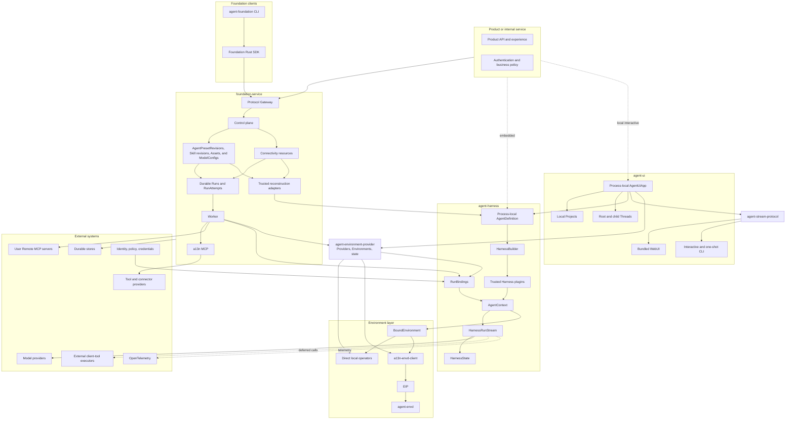
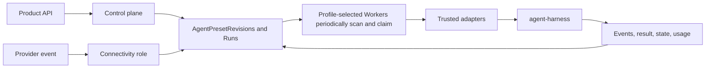
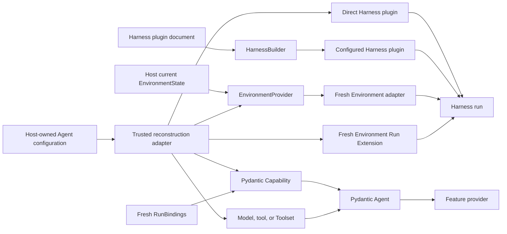
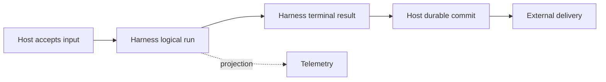

# Open-Source Agent Platform Overview

## Platform Definition

Agent Foundation is an open-source foundation for embedding Agents or hosting them as durable services. It provides reusable process-local execution, Environment, protocol, and hosting semantics while leaving product experience, business workflow, and infrastructure vendors to adopters.

The platform consists of:

- `agent-harness`, distributed as `a13n-harness`, for code-first Pydantic AI execution;
- `agent-environment-provider`, distributed as `a13n-environment-provider`, for shared Environment Provider specifications, fresh process-local adapters, portable state, and built-ins;
- `agent-stream-protocol`, distributed as `a13n-stream-protocol`, for shared Harness-to-AG-UI observation;
- `agent-ui`, distributed as `a13n-ui`, for human-editable local Agent resources, Project-scoped roots, mutable continuation-backed Threads, trusted Capability and extension discovery, and complete WebUI/CLI interaction;
- `agent-envd`, distributed as `agent-envd`, for Environment Interaction Protocol operations;
- `a13n-envd-client`, the generated low-level Python EIP client;
- `foundation-service`, distributed as `a13n-service`, for optional durable hosting;
- Foundation Service SDKs for typed access to the hosted `/api` boundary;
- `agent-foundation`, a cross-platform remote CLI built above the Foundation Rust SDK.

An application can embed the Harness directly, install Agent UI for a local interactive Host, use Foundation Service through an SDK or the CLI, or replace providers through documented typed and protocol boundaries.

## Architecture

Dependency direction is one-way: Hosts embed Harness and can use the shared Environment Provider package directly; Harness depends on the Provider package's single-Environment contracts, while the Provider package imports no Harness, Host lifecycle, or presentation type. Agent UI and hosted transports consume Agent Stream Protocol above public Harness observations. Foundation clients call only the public service `/api` boundary, and the Foundation CLI consumes the Rust SDK rather than implementing a second transport client.

## Component Responsibilities

| Component                    | Owns                                                                                                                                                                                                                                                                                                                                                                                           | Does not own                                                                                                                                                                                                       |
| ---------------------------- | ---------------------------------------------------------------------------------------------------------------------------------------------------------------------------------------------------------------------------------------------------------------------------------------------------------------------------------------------------------------------------------------------- | ------------------------------------------------------------------------------------------------------------------------------------------------------------------------------------------------------------------ |
| `agent-harness`              | Process-local Agent construction, trusted plugins, Run context, fresh Environment entry, multi-mount routing/policy, recovery, execution, results, and continuation state                                                                                                                                                                                                                      | Provider discovery, backing-target lifecycle, durable Agent schemas, presentation, delivery, or billing                                                                                                            |
| `agent-environment-provider` | Provider specifications/catalog, `EnvironmentProvider`, `Environment`, `EnvironmentState`, single-Environment operations, and Direct Local/Local Envd/Docker/E2B built-ins                                                                                                                                                                                                                     | Harness multi-mount routing, Agent execution, durable storage, Host state authority, retention policy, or product APIs                                                                                             |
| `agent-stream-protocol`      | Standard AG-UI conversion, generic `CUSTOM` fallback, optional replay-stable Host processing, process-local accumulation, and source-history reconstruction                                                                                                                                                                                                                                    | Agent execution, lifecycle invention, Host acceptance, durable history or replay, HTTP/SSE, or rendering                                                                                                           |
| `agent-ui`                   | Human-editable multi-file resources, trusted Capability and extension catalogs, Projects, sticky root and child Thread configuration, immutable per-Run composition, Host Environment state, one process-local `AgentUiApp`, WebUI, and CLI                                                                                                                                                    | Durable root-input acceptance, distributed execution, worker takeover, multi-tenant authorization, or another Agent loop                                                                                           |
| `agent-envd-client`          | Generated EIP control/data models, codecs, stubs, async file transfer, and bounded transport/session runtime                                                                                                                                                                                                                                                                                   | Harness routing, product-user authorization, executable discovery/download/launch, provider provisioning, Host lifecycle                                                                                           |
| `agent-envd`                 | Client-neutral EIP Environment hosting, raw file transfer, operations, receipts, disk-backed command output, daemon generation, and native command containment                                                                                                                                                                                                                                 | Agent loop, browser/product authentication, arbitrary URL fetch, durable execution, model policy                                                                                                                   |
| Foundation SDKs              | Language-typed access to the public Foundation Service Native `/api` contract, including streams and notifications                                                                                                                                                                                                                                                                             | Service internals, standard-protocol replacement, product policy, or durable lifecycle authority                                                                                                                   |
| `agent-foundation`           | Cross-platform command-line interaction with public Foundation Service operations through the Rust SDK                                                                                                                                                                                                                                                                                         | A second HTTP client, service process management, persistence, queues, migrations, or infrastructure control                                                                                                       |
| `foundation-service`         | Managed Secrets, ModelConfigs, AgentPresets and immutable AgentPresetRevisions, Skills, Connectivity resources and safe external references, Environment revisions, immutable Assets, managed Harness plugin artifacts and Runtime locks, durable Runs/RunAttempts, Protocol Gateway, a13n MCP, events, raw usage, generic OTel tracing, authorized trace queries, and optional web projection | Pydantic Agent loop, Python object serialization, client-side effects, third-party account credentials held by Connector services, external provider resource authority, telemetry storage, or telemetry authority |
| Product                      | Caller authentication, business policy, user experience, and final delivery                                                                                                                                                                                                                                                                                                                    | Harness internals and provider implementation                                                                                                                                                                      |

## Harness Foundation

The Harness is built directly on Pydantic AI 2:

- `AgentDefinition` is an immutable process-local Python value containing native `AgentSpec`, one build-time explicit or schema-derived output contract, an optional concrete Model, top-level Capabilities, plugins, and recovery configuration;
- Capability is the only top-level feature-behavior plane; each feature Capability owns its tools, Toolsets, instructions, settings, and hooks;
- `HarnessBuilder` resolves an explicit or disabled-by-default ambient plugin Build Context, creates fresh configured instances, binds all trusted plugins, authorizes custom Capability types, and calls `Agent.from_spec()` once;
- Run arguments supply optional already constructed Environment adapters, while `RunBindings` supplies a fresh Agent instance, optional async `RunModelResolver`, Run Capabilities, metadata, and bounded Host references;
- one logical Harness Run owns one context, Environment, plugin graph, state coordinator, usage accumulator, public `run_id`, and stable Thread correlation;
- bounded model recovery can start several `ModelAttempt` values with unique upstream model-attempt IDs inside that Run;
- `HarnessState` carries one stable `thread_id`, public messages, detached Capability JSON namespaces, and `environment_states: Mapping[str, EnvironmentState]`; desired mounts, current managed state, runtime collaborators, and lifecycle policy remain Host-owned;
- Pydantic AI owns native Model profiles, transport/output retries, provider-suspended continuation, deferred external calls/approvals, Toolsets, messages, events, and usage.

Harness middleware plugins are trusted concrete objects, and Harness does not compile serialized Agent definitions. It owns a narrow versioned preferred YAML or supported JSON plugin document and Build Context that may, when explicitly enabled, select `a13n_harness.plugins` factories and append fresh concrete plugins during each definition build. Environment Provider specifications, catalogs, `EnvironmentProvider`, `Environment`, `EnvironmentState`, and built-ins belong to `a13n-environment-provider`. Harness receives fresh Environment adapters only. A Host owns serializable Agent schemas, artifact locks, package trust, current Environment state and associations, runtime collaborators, lifecycle policy, and durable execution; package presence and Harness import alone never enable behavior or supply an arbitrary import target.

The complete design is indexed in [agent-harness/README.md](agent-harness/README.md).

## Local Agent Interaction

Agent UI is a complete local single-user workstation above the Harness. One root YAML, fixed resource-YAML directories, and canonical sibling Markdown subagents form a human-editable configuration tree for Models, Capabilities, the three extension planes, MCP servers, Agents, Projects, and global defaults. Codex and Grok subscription Models reuse their product-compatible account stores, and an Agent UI-originated login writes back to that shared store instead of creating another token copy. A root or child Thread owns sticky mutable resource selections; each admitted Run captures one immutable resolved composition and continues the selected `HarnessState`, even when the Thread changed Agent, Plugin, MCP, Project, or Environment selection since the preceding Run. Projects own ordered local roots, and no separate Workspace resource exists. One process-local `AgentUiApp` reconstructs fresh Model, extension, and Environment authority and runs Harness directly. Root input, active Runs, partial output, and Run-owned processes remain process-local. Every delegate or linked resume creates one child execution segment; exact `HarnessState` is resume authority, and bounded compact AG-UI display is inspection authority. SQLite owns compact mutable heads and accepted-generation indexes, while immutable files own resolved compositions and checkpoints. CLI and WebUI call the same App operations, and expected source digests prevent stale managed writes from knowingly replacing newer text edits. Agent UI adds no Runner generation, private worker protocol, durable root queue, child lease, takeover, or distributed recovery.

`a13n-harness`, `a13n-environment-provider`, and `a13n-stream-protocol` form the Harness release group. One `release/harness-v<version>` tag assigns the same version to all three distributions. Published Harness metadata pins the exact provider-package version, and published Stream Protocol metadata pins the exact Harness version. Agent UI releases independently through `release/agent-ui-v<version>` and its published artifact pins the reviewed Harness release dependencies. Source checkouts continue to resolve unversioned package dependencies from the shared uv workspace. Each tag version is a stable `X.Y.Z` identity or an RC `X.Y.Z-rc.N` identity as defined by [repository release automation](repository-model.md#release-automation). Source directories omit the distribution prefix (`packages/agent-*`), while Python distribution names use `a13n-` and import packages use `a13n_`.

The complete local Host design is indexed in [agent-ui/README.md](agent-ui/README.md), and the shared presentation protocol is indexed in [agent-stream-protocol/README.md](agent-stream-protocol/README.md).

## Recovery Boundaries

| Concern                                   | Owner                                      |
| ----------------------------------------- | ------------------------------------------ |
| Provider-suspended continuation           | Pydantic AI                                |
| Provider transport retry                  | Provider/client and Pydantic `RetryConfig` |
| Exact provider-history repair             | Harness `SelfHealingModel`                 |
| Interrupted `ModelAttempt` recovery       | Harness run coordinator                    |
| Agent UI process loss                     | Resume from the last selected continuation |
| Service worker crash and durable recovery | Foundation Service                         |
| Provider-lifecycle uncertainty            | The embedding Host reports or retries it   |

Recovery never converts missing evidence into rollback or exactly-once success. Interrupted tool history records that the operation may have partially or fully completed and directs the next model to inspect state before retrying.

## Environment Foundation

The shared Environment model has only `EnvironmentProvider`, `Environment`, and `EnvironmentState`. A Provider constructs a fresh adapter from optional state without I/O. The entered Environment implements provider-neutral file, shell, process, output, port, readiness, state dump, non-destructive close, and explicit Host-only destroy. Harness owns only the Run-local multi-mount facade, routing, access ceilings, stale-incarnation checks, model projection, and continuation aggregation. Direct Local and EIP are the operation backends.

`a13n-environment-provider` owns provider specifications/catalog, the three core entities, single-Environment operation contracts, and built-in `a13n.direct-local`, `a13n.local-envd`, `a13n.docker`, and `a13n.e2b` Providers. Every independent Run receives fresh adapters. `close()` is always non-destructive; only explicit Host policy invokes `destroy()`. Local Envd owns a fresh required-isolation daemon process over a Host-selected workspace and never falls back to Direct Local. Docker state contains the exact container ID, while Local Envd keeps raw PID and private runtime data process-local.

The Environment Provider package adapts EIP-backed `a13n-envd-client` sessions into fresh Provider-specific `Environment` adapters; Harness receives only those constructed adapters. Other trusted consumers can use the low-level client independently. The client communicates only over a supplied session source and never discovers, downloads, installs, or launches an executable. `agent-envd` carries JSON-RPC control and raw file transfer over trusted stdio, Host-dialed HTTP, or an envd-initiated reverse WebSocket. It owns daemon-generation operation/receipt evidence, process handles, disk-backed command output with explicit-offset reads, session-scoped transfers, and Linux/macOS/Windows command containment. Carrier direction never changes the low-level client's requester role or envd's responder role.

Agent UI exposes Direct Local as Native and `a13n.local-envd` as Local EIP. Native is the omission default and explicit unrestricted Host choice. Local EIP pins one exact agent-envd version and target hashes, lazily acquires only the selected Host binary into an Agent UI-managed runtime cache, and never searches ambient `PATH`; an advanced absolute executable override must pass version, isolation, and EIP compatibility checks. Docker, E2B, and other Agent UI Environments require explicitly enabled Provider extensions.

Provider-defined portable data enters only `HarnessState.environment_states`, a direct mapping from mount name to `EnvironmentState`. State is supplied before entry when a Host constructs each adapter; Harness never restores it afterward. Managed Host current state wins, including authoritative `None`; portable fallback is adopted only through an explicit unmanaged/import flow. Live clients, sockets, credentials, PIDs, process handles, readiness, Run-local mutation authority, Host associations, and retention policy do not become Harness state. Optional `DynamicEnvironmentCapability` composes File/Shell tools with dynamic model context but owns no backing-target lifecycle.

## Foundation Client Surfaces

Foundation Service SDKs, the remote CLI, and the browser management application operate only through the public `/api` namespace. The Agent-facing a13n MCP is a RunAttempt-authorized tool surface, not a Foundation SDK or general product API. The language SDKs own typed management transport and service-contract mapping. The `agent-foundation` executable is a user-facing composition layer above the Rust SDK and does not duplicate HTTP serialization, authentication transport, retries, or service models.

Standard AG-UI clients and A2A peers use the Foundation Service Protocol Gateway directly and require no Foundation SDK. Their wire versions, errors, streaming, and external identities remain distinct from Native `/api/v1`, while all three adapters call the same Foundation application and authorization authority.

A CLI network command and its backing SDK operation enter the platform together with the corresponding real service API and end-to-end behavior. The CLI does not reserve unsupported commands as placeholders. Service-process startup, migrations, databases, Redis, queues, containers, Kubernetes, and other operator internals remain owned by Foundation Service deployment surfaces rather than the remote client.

The CLI source, workspace isolation, validation, and binary-only release channel are defined by the [repository model](repository-model.md).

## Hosted Service Foundation

Foundation Service adds durability without changing Harness execution semantics:

Foundation AgentPresetRevisions are Host-owned serializable documents, not Harness
`AgentDefinition` wire values. Run acceptance pins the Preset-owned on-demand
lock or the active runner-profile lock. The selected Worker execution loop verifies that exact lock and the Revision's exact
managed-resource references, reconstructs native Pydantic/Harness objects,
resolves current authorized ConnectorConnections, Secrets, permissions, and
operator-approved Environment Providers, and constructs fresh Environment
adapters from the Run's exact desired configuration plus current Foundation
state. Harness enters and closes those adapters non-destructively. Foundation
owns changed-only state publication, Thread association, explicit cleanup, and
orphan prune.

Workspace Skills are stable authoring resources with immutable ZIP- or
GitHub-imported revisions in shared object storage. Each AgentPresetRevision locks exact
Skill revisions, names, and content digests. The worker supplies an explicit
`SkillManager`, exact Host materializer, and fresh selection. After Harness
enters the fresh Environment and before model exposure, `SkillsCapability`
materializes only those verified bytes and publishes the Host completion
manifest last. Upload receipts and GitHub refs never become runtime sources.

Workspace Assets are independent immutable binary publications. Every distinct upload or Agent `publish_asset` invocation creates a new `asset_id`; exact idempotent replay returns the existing publication. Accepted Agent input stores that exact ID, while Run output and Items can retain bounded Asset references in their existing values. Foundation defines no Asset revision, content overwrite, Run-to-Asset link table, or Asset-specific `state.json` namespace.

Every Foundation Agent invocation selects or creates a Session and Thread and
accepts one durable Run. One `RunAttempt` starts at most one logical Harness
Run; internal Harness `ModelAttempt` values are not durable worker generations.
Every Worker periodically scans durable Run state. For an expired lease, one
short transaction marks the old Attempt `failed` and creates at most one new
fenced `RunAttempt`; Foundation defines no separate Scheduler, recovery
controller, or Attempt `lost` state. The new owner validates the latest complete
continuation, Run-owned budget, frozen dependencies, and current authority
outside the claim transaction. It creates fresh providers, bindings, and a
fresh Harness Run only after a fenced preparation decision. It does not inspect
or reconcile the prior Sandbox, and it cannot reconstruct tool work that never
entered the selected continuation. Every Run owns one deterministic state key;
Foundation replaces that key at complete checkpoints and exposes no separate
base, result, or checkpoint-history object. Tools that require cross-crash
duplicate suppression or outcome reconciliation own an idempotency key or a
tool-specific durable task protocol.

Client-side tools use native Pydantic deferred values. Foundation's [Agent control input and continuation contract](foundation-service/18-agent-control-input-and-continuation.md) seals the waiting Run with its complete pending set, atomically normalizes authenticated upstream feedback into a full reject, no-response, or supplied-result batch, and accepts a new Run whose `parent_run_id` names that waiting Run. An explicitly declared waiting Continue instead stores default resolutions and new `AgentInput` in one successor whose first model request receives both. The same contract can explicitly continue from any retained readable completed historical Run while preserving its Thread. [Queued submissions](foundation-service/20-agent-control-queued-submissions.md) give ordinary input queue-if-busy semantics: eligible idle Threads accept a Run immediately, while busy or state-blocked Threads retain editable input outside the Run DAG. Explicit waiting Continue leaves that queue untouched. A completed Run can prepublish its queued successor's state and atomically seal, consume the queue entry, and accept that successor only after its eligible inbox delivery drains; terminal relational scanning recovers paths that do not combine. The new Foundation Run starts a later Harness Run with fresh bindings. [Active Agent control](foundation-service/19-agent-control-active-execution.md) persists steering and asynchronous results in one PostgreSQL acceptance-order FIFO, couples incorporation to complete Run state, rolls pending delivery through waiting, and uses an expiring Thread Redis Stream only as a wakeup optimization. Waiting-derived delivery remains invisible until a Foundation-owned awaited Capability hook runs after the successor's first model request and any resulting tool batch. A failed or cancelled Run suppresses its own pending child results and supersedes other pending delivery bound to it. [Async subagents](foundation-service/34-async-subagents.md) use independent Threads and Runs rather than Pydantic deferred spawn calls. Spawn never waits for child completion: when the spawning Run remains eligible, a terminal child result enters the current active parent-Thread Run as a live Agent message, remains sourced to a waiting head, or automatically accepts an eligible successor Run when the Thread is otherwise inactive; queued submissions retain their independent precedence. If the spawning Run failed or was cancelled first, the result remains queryable but can neither enter nor create another Run, including through Retry.

Foundation's [Thread persistence](foundation-service/11-thread-persistence.md)
owns one independent versioned relational Thread resource, its Session
membership, current Run, and selected continuation head. [Run
persistence](foundation-service/12-run-persistence.md) owns
durable Agent-work identity, scheduling, the recovery budget, the interactive
recovery boundary, and complete Run-state object schema. [Run Attempt scheduling
and recovery](foundation-service/13-run-attempt-scheduling-and-recovery.md) owns
the `run_attempts` table, Worker scans, claims, leases, fences, and replacement
generation recovery. [Lifecycle and stream
persistence](foundation-service/24-lifecycle-and-stream-persistence.md) owns
one lifecycle-event table and Redis Agent-message transport with object-backed
retained replay. Active Agent control separately owns the `thread_inbox` table,
its Thread-level sequence/budget counter, and expiring Thread control signal Stream; pending calls, Items, stream entries,
and generic provider receipts do not receive separate relational tables.

The hosted service boundary is defined in [Foundation Service](foundation-service/README.md).

## Deployment Profiles

| Profile             | Persistence and coordination                                                                                                                                                   | Execution                                                                |
| ------------------- | ------------------------------------------------------------------------------------------------------------------------------------------------------------------------------ | ------------------------------------------------------------------------ |
| Embedded            | Application-selected                                                                                                                                                           | Harness in product process                                               |
| Local Agent UI      | Human-editable YAML/Markdown resources, SQLite mutable heads, and immutable Run-composition, continuation, Skill, and Environment-state files; expected-digest/version updates | Harness plus fresh Environment adapters and process-local async children |
| Minimal service     | SQLite, in-memory Redis, and local objects                                                                                                                                     | Control and worker together in one process                               |
| Distributed service | PostgreSQL, real Redis, and shared object storage                                                                                                                              | Separately scalable control, worker, and connectivity roles              |

Foundation Service configuration, role ownership, dependency requirements, and readiness are defined by [Runtime Configuration and Deployment](foundation-service/01-runtime-configuration-and-deployment.md). The internal relational, Redis-compatible, object, and mounted-filesystem surfaces are defined by [Foundation Storage Capabilities](foundation-service/03-storage.md). The final distribution's relational metadata and migration authority are defined by the [Relational Schema Lifecycle](foundation-service/04-relational-schema.md).

Coordination streams and queues do not become durable lifecycle authority.

## Identity and Version Boundaries

The shared [`Session`, `Thread`, `Run`, and `Item` interaction model](interaction-model.md) defines public interaction identity and relationships. Platform-wide versioning, naming, ownership, and compatibility rules are defined by [Platform Data Conventions](data-conventions.md). Concrete subsystems own their object catalogs, schemas, and explicitly scoped or external identifiers within those rules.

The platform distinguishes:

- caller/actor identity;
- stable Agent workload Identity and Agent instance;
- Host-owned `Session`, `Thread`, `Run`, and `Item` identities;
- Host-owned immutable definition revision and dependency locks;
- Foundation-owned immutable Asset publication identity;
- process-local Harness Run and `ModelAttempt`;
- Foundation durable Run and `RunAttempt`;
- Environment identity and generation;
- credential binding and invocation grant.

A Host definition revision contains only serializable Host data and exact locks. It contains no plugin/Capability class, native Model, Toolset, output Python type, callable, client, plaintext credential, or process-local object. A worker reconstructs those values without mutating the selected revision.

## Service API Boundaries

Foundation-owned resource-oriented JSON APIs and their first-party SDKs follow [Platform API Conventions](api-conventions.md). The shared contract owns HTTP resource shape, JSON representation, pagination, errors, mutation safety, and compatibility. Process-local APIs, EIP, Agent Stream Protocol observation, provider APIs, and external webhook schemas retain their defining contracts.

Foundation Service additionally exposes the [Protocol Gateway](foundation-service/15-protocol-gateway.md): Native APIs and streams, Hosted AG-UI, and A2A are separate public protocols over common application authority. Upstream AG-UI and A2A wire contracts do not inherit Foundation JSON naming or `/api/v1` error semantics.

Foundation Service also exposes the Agent-facing a13n MCP defined by [Agent-Facing Tools](foundation-service/40-connectivity/04-agent-facing-tools.md). It uses MCP's protocol and error contract, authenticates one current RunAttempt grant, and does not become a resource-oriented `/api/v1` operation. User Remote MCP endpoints remain separate sources configured through [`MCPConnection`](foundation-service/40-connectivity/06-remote-mcp-connections.md).

## Extension Model

Installed plugins and native objects are trusted in-process code. Harness Plugin, Environment Run Extension, Connectivity adapter, and Environment Provider package presence is only availability; an operator explicitly enables or selects the relevant key and exact artifact before import/use. Capabilities remain native Agent features rather than a fourth Harness plugin plane. Provider-constructed Environment adapters, Connectivity adapters, and directly constructed code-first objects enter their owning concrete composition paths. Untrusted or independently governed behavior belongs behind feature-specific protocols. The core defines no universal remote-plugin or package-installation system. Foundation's [managed Harness plugins and Runtime](foundation-service/36-managed-harness-plugins-and-runtime.md) are a Host-specific internal code-deployment boundary that preserves this trust model rather than a new platform-wide extension mechanism.

## Observability and Cost

Pydantic AI instrumentation owns Agent/model/tool spans. Harness features add spans only for Harness-owned context, plugins, recovery, state, Environment, and delegation work. Foundation adds durable lifecycle, queue, child, client-delivery, and Connectivity spans.

`RunUsage` is a process-local accumulator. The Harness applies one release-pinned or Host-replaced build-time pricing policy and records its revision; Hosts own durable deduplication, cross-run aggregation, negotiated adjustments, budgets, billing, and payment.

## Completion Boundaries

Run acceptance, ModelAttempt completion, Harness terminal delivery, Host Run commit, usage recording, telemetry export, external delivery, billing, and payment are independent facts.

## Design Principles

01. Reuse Pydantic AI, OpenTelemetry, databases, streams, and provider ecosystems.
02. Keep one authority for every durable fact.
03. Preserve native Python composition inside the execution process.
04. Keep durable Host schemas outside the Harness library.
05. Bind Identity and current authority freshly at the Host boundary.
06. Keep process-local continuation separate from durable lifecycle state.
07. Never infer rollback or exactly-once tool execution from a missing checkpoint; tools that require cross-crash reconciliation own idempotency or a durable provider lifecycle.
08. Use optional typed packages and protocols instead of a universal extension framework.
09. Use the same Harness API in embedded and hosted modes.
10. Add enterprise behavior through the same boundaries rather than forks.

## Specification Set

| Area                                          | Document                                                                                                                                                 |
| --------------------------------------------- | -------------------------------------------------------------------------------------------------------------------------------------------------------- |
| Repository content and workflow model         | [repository-model.md](repository-model.md)                                                                                                               |
| Platform interaction model                    | [interaction-model.md](interaction-model.md)                                                                                                             |
| Platform data conventions                     | [data-conventions.md](data-conventions.md)                                                                                                               |
| Platform API conventions                      | [api-conventions.md](api-conventions.md)                                                                                                                 |
| Managed Skill package contract                | [managed-skill-packages.md](managed-skill-packages.md)                                                                                                   |
| Harness catalog                               | [agent-harness/README.md](agent-harness/README.md)                                                                                                       |
| Environment Provider catalog                  | [agent-environment-provider/README.md](agent-environment-provider/README.md)                                                                             |
| Harness architecture                          | [agent-harness/00-overview.md](agent-harness/00-overview.md)                                                                                             |
| Harness definition/build                      | [agent-harness/03-agent-definition-and-build.md](agent-harness/03-agent-definition-and-build.md)                                                         |
| Harness plugins                               | [agent-harness/05-plugin-system.md](agent-harness/05-plugin-system.md)                                                                                   |
| Harness execution and recovery                | [agent-harness/06-execution-context-and-lifecycle.md](agent-harness/06-execution-context-and-lifecycle.md)                                               |
| Harness state                                 | [agent-harness/10-snapshot-and-resume.md](agent-harness/10-snapshot-and-resume.md)                                                                       |
| Harness public API                            | [agent-harness/14-public-api-and-packaging.md](agent-harness/14-public-api-and-packaging.md)                                                             |
| Harness model/output boundary                 | [agent-harness/16-input-model-and-output.md](agent-harness/16-input-model-and-output.md)                                                                 |
| Agent Stream Protocol catalog                 | [agent-stream-protocol/README.md](agent-stream-protocol/README.md)                                                                                       |
| AG-UI observation contract                    | [agent-stream-protocol/00-overview.md](agent-stream-protocol/00-overview.md)                                                                             |
| Agent UI catalog                              | [agent-ui/README.md](agent-ui/README.md)                                                                                                                 |
| Agent UI architecture, Projects, and Threads  | [agent-ui/00-overview.md](agent-ui/00-overview.md), [agent-ui/04-projects-threads-and-environments.md](agent-ui/04-projects-threads-and-environments.md) |
| Agent UI Model authentication                 | [agent-ui/02a-model-authentication-and-account-stores.md](agent-ui/02a-model-authentication-and-account-stores.md)                                       |
| agent-envd catalog                            | [agent-envd/README.md](agent-envd/README.md)                                                                                                             |
| EIP architecture and protocol                 | [agent-envd/00-overview.md](agent-envd/00-overview.md), [agent-envd/02-eip-protocol.md](agent-envd/02-eip-protocol.md)                                   |
| Foundation Service boundary                   | [foundation-service/README.md](foundation-service/README.md)                                                                                             |
| Foundation runtime and deployment             | [foundation-service/01-runtime-configuration-and-deployment.md](foundation-service/01-runtime-configuration-and-deployment.md)                           |
| Foundation distribution composition           | [foundation-service/02-distribution-composition-and-extensions.md](foundation-service/02-distribution-composition-and-extensions.md)                     |
| Foundation interaction/runtime mapping        | [foundation-service/10-interactions-runs-and-attempts.md](foundation-service/10-interactions-runs-and-attempts.md)                                       |
| Foundation Run persistence                    | [foundation-service/12-run-persistence.md](foundation-service/12-run-persistence.md)                                                                     |
| Foundation RunAttempt scheduling and recovery | [foundation-service/13-run-attempt-scheduling-and-recovery.md](foundation-service/13-run-attempt-scheduling-and-recovery.md)                             |
| Foundation Protocol Gateway                   | [foundation-service/15-protocol-gateway.md](foundation-service/15-protocol-gateway.md)                                                                   |
| Foundation public API                         | [foundation-service/16-management-api.md](foundation-service/16-management-api.md)                                                                       |
| Foundation Agent input                        | [foundation-service/17-agent-input.md](foundation-service/17-agent-input.md)                                                                             |
| Foundation Agent control input                | [foundation-service/18-agent-control-input-and-continuation.md](foundation-service/18-agent-control-input-and-continuation.md)                           |
| Foundation active Agent control               | [foundation-service/19-agent-control-active-execution.md](foundation-service/19-agent-control-active-execution.md)                                       |
| Foundation queued Agent control               | [foundation-service/20-agent-control-queued-submissions.md](foundation-service/20-agent-control-queued-submissions.md)                                   |
| Foundation Native streaming                   | [foundation-service/21-native-streaming-and-notifications.md](foundation-service/21-native-streaming-and-notifications.md)                               |
| Foundation Hosted AG-UI                       | [foundation-service/22-hosted-ag-ui.md](foundation-service/22-hosted-ag-ui.md)                                                                           |
| Foundation A2A                                | [foundation-service/23-a2a.md](foundation-service/23-a2a.md)                                                                                             |
| Foundation lifecycle and Run streams          | [foundation-service/24-lifecycle-and-stream-persistence.md](foundation-service/24-lifecycle-and-stream-persistence.md)                                   |
| Foundation Hook notifications                 | [foundation-service/26-hook-notifications.md](foundation-service/26-hook-notifications.md)                                                               |
| Foundation Secret management                  | [foundation-service/27-secret-management.md](foundation-service/27-secret-management.md)                                                                 |
| Foundation Agent management                   | [foundation-service/28-agent-management.md](foundation-service/28-agent-management.md)                                                                   |
| Foundation model management                   | [foundation-service/30-model-management.md](foundation-service/30-model-management.md)                                                                   |
| Foundation Skill management                   | [foundation-service/31-skill-management.md](foundation-service/31-skill-management.md)                                                                   |
| Foundation Asset management                   | [foundation-service/32-asset-management.md](foundation-service/32-asset-management.md)                                                                   |
| Foundation managed Harness plugins            | [foundation-service/36-managed-harness-plugins-and-runtime.md](foundation-service/36-managed-harness-plugins-and-runtime.md)                             |
| Foundation SDKs and clients                   | [foundation-service/37-service-sdks-and-clients.md](foundation-service/37-service-sdks-and-clients.md)                                                   |
| External Connectivity catalog                 | [foundation-service/40-connectivity/README.md](foundation-service/40-connectivity/README.md)                                                             |
