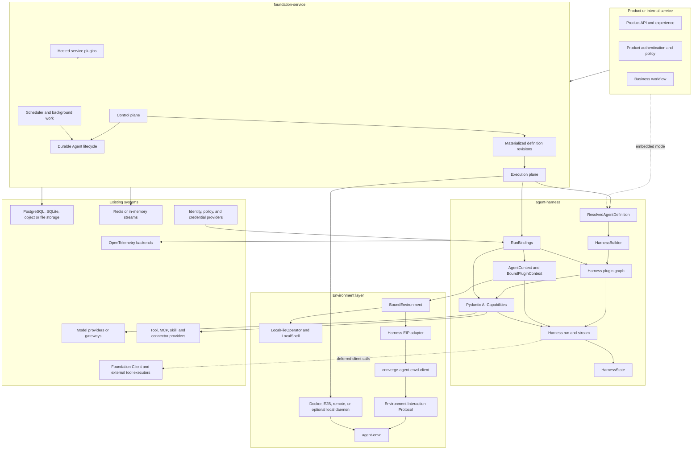
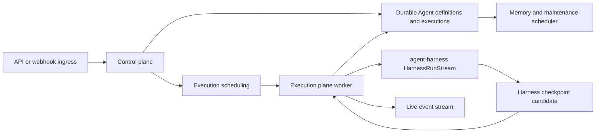
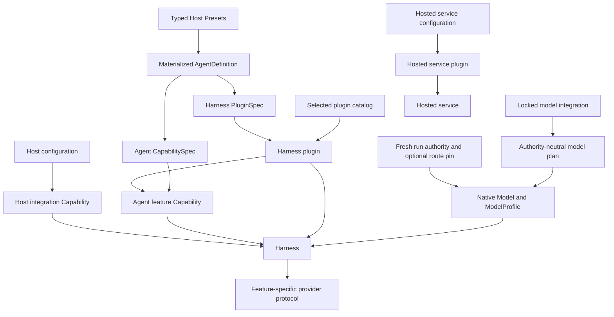
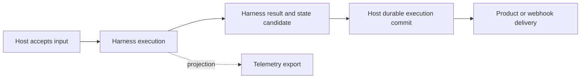

# Open-Source Agent Platform Overview

## Platform Definition

The Agent Platform is an open-source foundation for building an Agent product or operating Agents as internal services. It provides reusable execution, Environment, and hosting semantics while leaving product experience, business workflows, and infrastructure vendors to adopters.

The first platform boundary consists of:

- `agent-harness`: the Pydantic AI 2-based Harness, distributed as `converge-agent-harness`;
- `agent-envd`: the first-class EIP daemon backend for sandboxed and remote Environment operations, packaged as `converge-agent-envd`, with its generated low-level Python client packaged as `converge-agent-envd-client`;
- `foundation-service`: the optional hosted control and execution service, distributed as `converge-foundation-service`.

An application can embed the Harness directly, use the complete service, or replace providers through documented Capability and protocol boundaries.

## Architecture

The dependency direction is one-way: a host such as `foundation-service` embeds the Harness; the Harness uses Environment and provider protocols; provider implementations do not import host lifecycle types.

## Component Responsibilities

| Component            | Owns                                                                                                                                                                                                                                                                                                                                                                                                                            | Does not own                                                                                                                                                                                           |
| -------------------- | ------------------------------------------------------------------------------------------------------------------------------------------------------------------------------------------------------------------------------------------------------------------------------------------------------------------------------------------------------------------------------------------------------------------------------- | ------------------------------------------------------------------------------------------------------------------------------------------------------------------------------------------------------ |
| `agent-harness`      | Canonical materialized Agent definition contract, resolved process-local build plan, first-class plugin construction and input-to-result middleware, Capability composition, Agent Identity propagation, execution, first-class direct-local and EIP-backed multi-Environment access including direct EIP adaptation, client-side external-tool deferral, context state, delegation, events, usage, and continuation state      | Preset catalogs, immutable Host revisions, durable execution lifecycle, low-level EIP transport/codecs, client handler execution, queues, worker leases, product authentication, or billing settlement |
| `agent-envd-client`  | Generated Python EIP models, codecs, method metadata, typed stubs, and bounded stdio/HTTP/WebSocket session runtime                                                                                                                                                                                                                                                                                                             | Harness routing and model policy, provider provisioning, daemon resource enforcement, or Host lifecycle                                                                                                |
| `agent-envd`         | Shared EIP JSON-RPC semantics over stdio, authenticated HTTP, and authenticated WebSocket; generated Rust protocol/dispatch surface; daemon-side files, processes, handles, bounded retained output, recoverable state, generation, provider receipts, and fail-closed or explicitly delegated command containment                                                                                                              | Direct-local operator implementation, outer sandbox provisioning, Agent loop, durable execution lifecycle, model policy, or product workflow                                                           |
| `foundation-service` | Hosted definition sources, typed Agent/Model/Toolset Presets, model-integration catalog revisions, immutable materialized definition revisions and dependency locks, durable root and asynchronous child executions, client-tool pending and child-result delivery lifecycles, accepted inputs, scheduling, worker coordination, durable state, webhooks, memory jobs, model-usage records, pricing revisions, and service APIs | Pydantic Agent-loop, `ModelProfile`, or adapter-rendering semantics; client-side effects; a platform Sandbox resource; or interpretation of provider-native Environment state                          |
| Product              | Caller authentication, user experience, business policy, workflow, and final delivery                                                                                                                                                                                                                                                                                                                                           | Harness internals and provider implementation details                                                                                                                                                  |

## Harness Foundation

The Harness is built directly on Pydantic AI 2:

- one canonical materialized `AgentDefinition` and code-first native `AgentSpec` input produce the same process-local `ResolvedAgentDefinition` contract;
- first-class Harness plugins wrap the semantic-input-to-complete-result path and can contribute ordinary `AbstractCapability[AgentContext]` instances;
- Pydantic Capabilities remain the sole reusable model/node/tool lifecycle inside the Agent loop, while trusted native models, tools, and Toolsets can remain explicit resolved build inputs;
- `AgentContext` is the single Pydantic run dependency, contains the multi-Environment facade and `BoundPluginContext`, and coordinates Capability-namespaced recoverable state;
- Pydantic AI owns the Agent loop, messages, `ModelSettings`, native `ModelProfile` resolution and adapter rendering, outputs, Toolsets, external and approval deferred tools, events, usage, and Capability lifecycle;
- `HarnessRunStream` is the single-consumer observation and control facade for one process-local execution;
- `HarnessState` is portable continuation state, not a host durable execution snapshot.

Harness plugin packages provide outer run middleware and can contribute Agent features; Capability packages provide Agent-loop features and Host integrations. Definition-level `PluginSpec` plus plugin `from_spec` configure Harness middleware, while Pydantic `CapabilitySpec` and Capability `from_spec` configure Pydantic-run behavior; they do not duplicate native `ModelProfile` compatibility facts. Host Preset, model-integration, definition-revision, provider, and artifact schemas remain independently typed. Native Pydantic tools and Toolsets remain usable through the resolved build plan, while metadata-aware tools opt into Harness Identity, policy, credential, retry, and result guarantees. Reentrant behavior with no current-run authority can enter as a build Capability. The locked model resolver receives current Identity, policy, credentials, and any continuation route pin through its fresh run Capability; it and the run Capabilities for checkpointing, credential brokerage, Environment integration, inline child binding, Host-owned asynchronous child submission, telemetry correlation, and other execution-scoped work enter through fresh `RunBindings`.

The complete Harness design is indexed in [agent-harness/README.md](agent-harness/README.md).

## Environment Foundation

`BoundEnvironment` gives tools a run- and Identity-bound multi-Environment facade over provider-neutral file, shell, process, port, and state operations. Zero bindings are the no-operation case and one binding is the ordinary simple case. A host-side controller can atomically replace live topology without changing Agent instructions or tool schemas; current routing context and change notices enter at the user-content suffix to preserve the cacheable prefix. A provider owns canonical resources, native authorization, state generation, handles, cursors, process trees, and side-effect evidence.

`LocalFileOperator` and `LocalShell` implement that surface directly under explicitly configured roots and command policy. `VirtualFileOperator` composes direct and remote mounts through immutable longest-prefix routing snapshots. The Harness directly adapts its Environment protocols through the generated `converge-agent-envd-client`; `agent-envd` implements the equally first-class [Environment Interaction Protocol](agent-envd/00-overview.md) backend over stdio, env-secret-authenticated HTTP, and env-secret-authenticated WebSocket, with the same JSON-RPC methods and payload semantics on every transport. It applies fail-closed bubblewrap or Seatbelt command isolation by default; a container, VM, or remote sandbox deployment explicitly disables only that inner layer when the outer host owns containment. Docker, E2B, remote, and optional local-daemon adapters make a compatible daemon reachable; direct-local adapters require none. The Harness imports no vendor API, and the Foundation Service does not deploy or persist a separate Sandbox subsystem.

The recoverable portion of every selected Environment binding is exported as the Environment Capability's versioned state entry. It is saved with the other `AgentContextState` entries and Pydantic `message_history` in `HarnessState`. Native files and processes remain provider-owned; saved references restore no authority and are revalidated against fresh bindings.

## Hosted Service Foundation

`foundation-service` adds durable hosting without replacing Harness execution semantics.

The control plane materializes inline or typed Preset input, binds each logical model selection to an exact model-integration revision, commits an immutable Agent definition revision with dependency locks, durably accepts one `Execution` against a selected revision, and schedules monotonic fenced `Attempt` generations. Build resolution produces a process-local `ResolvedAgentDefinition` with authority-neutral model-integration descriptors and only attested credential-free Models. At build, the service supplies the exact operator-selected plugin catalog and unchanged materialized plugin specs; the Harness constructs and orders the plugin graph. At run start, fresh `RunBindings` supply exactly one locked integration Capability per node together with Identity, any continuation route pin, policy, credentials, model pricing, checkpointing, observability correlation, and selected direct-local, EIP-backed, or mixed Environment binding; the Harness derives fresh run-bound plugins. The integration then constructs an allowed native Model with its effective Pydantic `ModelProfile` or fails closed before the worker consumes the Attempt's `HarnessRunStream`; it never delegates to ambient inference. A stale Attempt cannot commit a checkpoint, event, waiting boundary, or outcome.

The hosted service architecture is indexed in [foundation-service/README.md](foundation-service/README.md); [Agent Definitions and Presets](foundation-service/01-agent-definitions-and-presets.md) owns source, Preset, revision, materialization, and provenance semantics.

The hosted service wraps the complete `HarnessState` with resolved Agent, launch, delivery, and recovery state. Default inline subagent continuation, including each child's message history, remains nested in the parent Delegation State. In local task mode, shared task coordination has one snapshot owner in the parent Working State entry; in provider mode, the Host task provider remains authoritative and Harness State carries no task map or scope selector. Foundation Service selects provider mode for cross-Execution coordination and gives asynchronous subagents independent child Executions, Attempts, checkpoints, and a durable result-delivery ledger. Launch/recovery can include an opaque provider-adapter lifecycle record consumed before the next Environment binding is built; backend-local Environment state remains inside `HarnessState`. A client-side deferred chain separately retains its exact accepted external-tool attachment and authoritative pending `DeferredToolRequests` outside `HarnessState`. The service applies generic encryption, size, retention, and deletion controls to opaque provider state, while provider adapters and codecs own its schema and meaning. It owns checkpoint selection, client-result fencing, and durable completion. A process-local Harness result becomes durable only after the service commits its own state transition.

External webhook handling uses a pre-Agent processing pipeline before accepted input becomes `RunInput`. Execution acceptance and every active-run command return idempotent durable receipts; lifecycle transitions append replayable durable events before SSE, WebSocket, webhook, or other delivery projects them. Client-side tools use native Pydantic `ExternalToolset` and deferred values: Foundation Service durably commits and authenticates pending-call feedback, Foundation Client executes under its own authority, and a later Attempt resumes with fresh bindings. Memory extraction and consolidation run as scheduled host work. Every delivered `ModelUsageObservation` creates one idempotent model-usage record with stable response identity, the Foundation-selected pricing revision, actual cost source, and custom-pricing coverage. Terminal and inline `RunUsage` values remain overlapping process-local observations rather than additional contributions; billing and payment remain separate facts.

## Deployment Profiles

The same domain contracts support three profiles.

| Profile             | Persistence and coordination                                                                          | Execution                                        |
| ------------------- | ----------------------------------------------------------------------------------------------------- | ------------------------------------------------ |
| Embedded            | Application-selected memory, file, or database adapters                                               | Harness inside the product process               |
| Minimal service     | SQLite durable state and in-memory event/queue adapters                                               | Control and execution in one deployment          |
| Distributed service | PostgreSQL durable authority, Redis coordination/live streams, optional shared file or object storage | Separately scalable control and execution planes |

The hosted service realizes these profiles from one versioned package and container image with three process roles: `all` starts both planes, `control` starts control-plane APIs and coordination, and `execution` starts execution workers. All roles use the same durable contracts and schema. A role is a component-ownership and scaling boundary, not a tenant, data, or authorization boundary.

Redis, in-memory streams, and live SSE projections are coordination or delivery mechanisms rather than independent durable authorities. NFS or object storage is optional and selected through state and Environment adapters.

## Agent Identity and Definition Version

The platform distinguishes:

- caller or actor identity;
- stable Agent workload Identity;
- immutable materialized Agent definition revision and dependency locks;
- root or child Agent instance;
- process-local Harness run;
- host durable execution and attempt;
- Environment identity and generation;
- credential binding and invocation grant.

A Host definition revision stores the complete materialized definition and binds exact Preset, model-integration, and executable plugin-artifact dependencies for profile construction, Capability, native Toolset, tool-adapter, and model-adapter realizations, but stores no plaintext credential or process-local model, profile callable, tool, Toolset, or client object. An execution resolves those live build inputs without mutating the selected revision. A run receives a trusted Agent instance binding. Tools, shell operations, inline delegation, Host-managed asynchronous child execution, policy, credentials, events, and usage derive their Identity from that binding rather than from prompts or environment variables.

This relationship supports workload identity: external systems bind policy or short-lived credentials to the Agent Identity and current invocation context, while definition revisions and execution processes can change independently.

## Extension Model

| Extension                   | Boundary                                                                                                         |
| --------------------------- | ---------------------------------------------------------------------------------------------------------------- |
| Model integration           | Locked logical-model plan plus fail-closed run-time native model/provider/adapter construction and profile input |
| Harness plugin              | Semantic-input, stream-event, error, and complete-result middleware plus optional Capability contribution        |
| Agent feature Capability    | Instructions, request settings, Toolsets, public request hooks, and Capability state                             |
| Host integration Capability | Environment, checkpoint storage, policy, credentials, telemetry, or another run collaborator                     |
| Hosted service plugin       | Ingress, storage, scheduler, lifecycle projection, connector, or hosted policy behavior outside the Agent loop   |
| Provider adapter            | Model, Environment, MCP, skill registry, memory, secret, telemetry, or external operation                        |

Installed Python Harness plugins, plugin-contributed Capabilities, and native Toolsets are trusted in-process code. Untrusted or separately governed behavior stays behind a tool or provider protocol. The core defines no universal remote-plugin RPC system.

Enterprise packages can add SSO, audit retention, centralized policy, advanced connectors, and fine-grained skill/tool control through the same open-source boundaries.

## Observability and Cost

Pydantic AI's OpenTelemetry `Instrumentation` Capability owns Agent, model, and tool spans. Harness Capabilities add spans only for Harness-owned context, state, control, Environment, and inline delegation work. A hosted service adds asynchronous child dispatch, durable lifecycle, queue, scheduler, and delivery spans.

The default telemetry model is vendor-neutral OTel. Vendor packages enrich the same spans; a Langfuse profile propagates its session, user, tag, metadata, version, environment, and observation-type fields without introducing duplicate model/tool tracing.

Harness usage values are process-local observations. The host owns aggregation, deduplication, provider reconciliation, pricing versions, budgets, and cost records.

## Completion Boundaries

Input acceptance, Harness completion, Host durable execution commit, external delivery, telemetry export, durable usage recording, billing, and payment are independent facts. No downstream projection becomes an execution authority merely because it observes a completion event.

## Design Principles

01. Reuse Pydantic AI, OpenTelemetry, databases, streams, and provider ecosystems instead of rebuilding them.
02. Keep one authority for every durable fact.
03. Use native Pydantic `ModelProfile` for compatibility facts and Capability for reusable Agent behavior while retaining native model, tool, and Toolset build inputs.
04. Keep `AgentContext` cohesive and stateful, with typed `BoundPluginContext` lookup rather than a service locator.
05. Keep host durability outside process-local Harness state.
06. Bind Identity at the host boundary and propagate it through every side-effect path.
07. Enforce Environment authority again at the provider.
08. Make optional integrations explicit packages rather than base dependencies.
09. Use the same contracts in embedded, minimal, distributed, cloud, and private deployments.
10. Add enterprise behavior through extensions, not forks of core semantics.

## Specification Set

| Area                                      | Document                                                                                                         |
| ----------------------------------------- | ---------------------------------------------------------------------------------------------------------------- |
| Repository content and workflow model     | [repository-model.md](repository-model.md)                                                                       |
| Harness overview and catalog              | [agent-harness/README.md](agent-harness/README.md)                                                               |
| agent-envd overview and catalog           | [agent-envd/README.md](agent-envd/README.md)                                                                     |
| agent-envd and provider architecture      | [agent-envd/00-overview.md](agent-envd/00-overview.md)                                                           |
| EIP core protocol                         | [agent-envd/02-eip-protocol.md](agent-envd/02-eip-protocol.md)                                                   |
| EIP source, generated client, and release | [agent-envd/08-protocol-source-client-and-generation.md](agent-envd/08-protocol-source-client-and-generation.md) |
| Foundation Service overview and catalog   | [foundation-service/README.md](foundation-service/README.md)                                                     |
| Hosted Agent definitions and Presets      | [foundation-service/01-agent-definitions-and-presets.md](foundation-service/01-agent-definitions-and-presets.md) |
| Hosted client-side tools                  | [foundation-service/02-client-side-tools.md](foundation-service/02-client-side-tools.md)                         |
| Durable Execution lifecycle               | [foundation-service/03-execution-lifecycle.md](foundation-service/03-execution-lifecycle.md)                     |
| Foundation Client API and durable events  | [foundation-service/04-execution-api-and-events.md](foundation-service/04-execution-api-and-events.md)           |
| Usage recording and cost estimation       | [foundation-service/05-usage-accounting.md](foundation-service/05-usage-accounting.md)                           |
| Harness architecture                      | [agent-harness/00-overview.md](agent-harness/00-overview.md)                                                     |
| Pydantic AI foundation                    | [agent-harness/01-pydantic-ai-foundation.md](agent-harness/01-pydantic-ai-foundation.md)                         |
| Capability and AgentContext model         | [agent-harness/04-capability-model.md](agent-harness/04-capability-model.md)                                     |
| Plugin system                             | [agent-harness/05-plugin-system.md](agent-harness/05-plugin-system.md)                                           |
| Public API and packaging                  | [agent-harness/14-public-api-and-packaging.md](agent-harness/14-public-api-and-packaging.md)                     |
