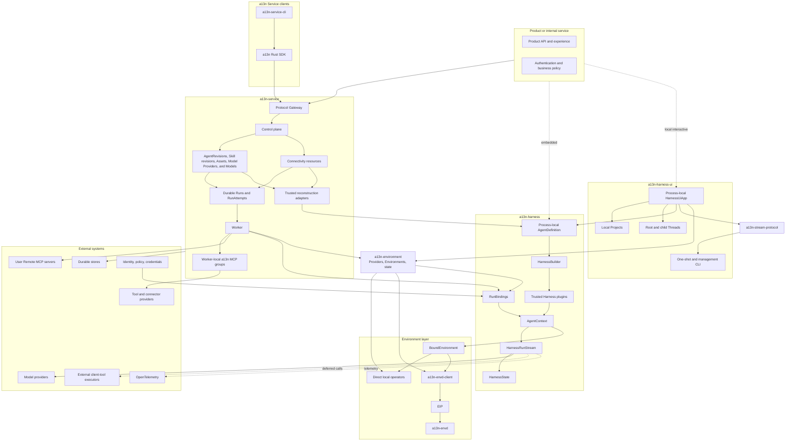
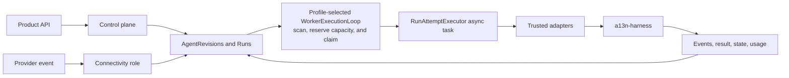
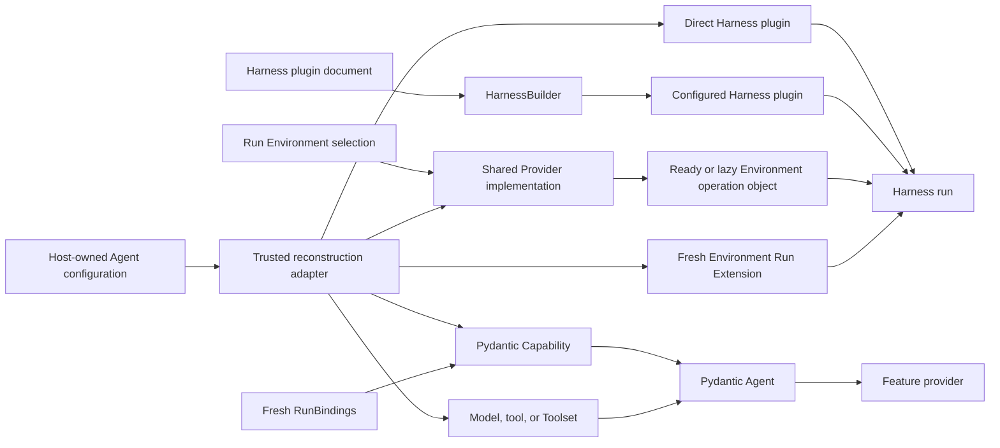
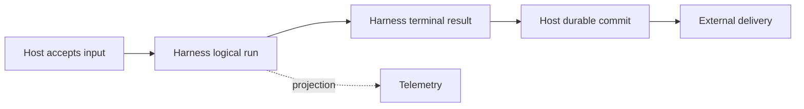

# Open-Source Agent Platform Overview

## Platform Definition

Agent Foundation is an open-source foundation for embedding Agents or hosting them as durable services. It provides reusable process-local execution, Environment, protocol, and hosting semantics while leaving product experience, business workflow, and infrastructure vendors to adopters.

The platform consists of:

- `a13n-harness`, distributed as `a13n-harness`, for code-first Pydantic AI execution;
- `a13n-environment`, distributed as `a13n-environment`, for shared Environment Provider specifications, fresh process-local adapters, portable state, and built-ins;
- `a13n-stream-protocol`, distributed as `a13n-stream-protocol`, for shared Harness-to-AG-UI observation;
- `a13n-harness-ui`, distributed as `a13n-harness-ui`, for human-editable local Agent resources, Project-scoped roots, mutable continuation-backed Threads, trusted Capability and extension discovery, and full-terminal CLI and bundled WebUI interaction over a reusable App boundary;
- `a13n-envd`, distributed as `a13n-envd`, for Environment Interaction Protocol operations;
- `a13n-envd-client`, the generated low-level Python EIP client;
- `a13n-service`, distributed as `a13n-service`, for optional durable hosting;
- a13n Service SDKs for typed access to the hosted `/api` boundary;
- `a13n-service-cli`, a cross-platform remote CLI built above the `a13n` Rust SDK.

An application can embed the Harness directly, install Harness UI for a local interactive Host, use a13n Service through an SDK or the CLI, or replace providers through documented typed and protocol boundaries.

| Direct Agent use                                                                                                            | Managed Agent use                                                                                                                   |
| --------------------------------------------------------------------------------------------------------------------------- | ----------------------------------------------------------------------------------------------------------------------------------- |
| An application embeds `a13n-harness`, or a user runs `a13n-harness-ui`.                                                     | A client calls `a13n-service` through an `a13n` SDK or `a13n-service-cli`.                                                          |
| The application or Harness UI owns execution, configuration, continuation storage, Environment policy, and recovery policy. | a13n Service owns managed resources and revisions, durable acceptance, scheduling, Runs and RunAttempts, permissions, and recovery. |
| Models and execution Environments can be remote.                                                                            | The Service can be deployed on the same machine as its client.                                                                      |

Service workers embed the same Harness. `a13n` is only the Service client SDK, not an umbrella distribution and not a second Agent execution engine. `a13n-service-ui` is reserved for a possible future Service management application; Harness UI is not that application.

## Architecture

Dependency direction is one-way: Hosts embed Harness and can use the shared Environment package directly; Harness depends on its single-Environment contracts, while the Environment package imports no Harness, Host lifecycle, or presentation type. Harness UI and hosted transports consume Agent Stream Protocol above public Harness observations. Service clients call only the public `/api` boundary, and a13n Service CLI consumes the Rust SDK rather than implementing a second transport client.

## Component Responsibilities

| Component              | Owns                                                                                                                                                                                                                                                                                                                                                                                          | Does not own                                                                                                                                        |
| ---------------------- | --------------------------------------------------------------------------------------------------------------------------------------------------------------------------------------------------------------------------------------------------------------------------------------------------------------------------------------------------------------------------------------------- | --------------------------------------------------------------------------------------------------------------------------------------------------- |
| `a13n-harness`         | Process-local Agent construction, SDK-first Model OAuth, trusted plugins, Run context, fresh Environment entry, multi-mount aggregate-path routing/policy, recovery, execution, results, and continuation state                                                                                                                                                                               | Provider discovery, backing-target lifecycle, durable Agent schemas, presentation, delivery, or billing                                             |
| `a13n-environment`     | Provider specifications/catalog, `EnvironmentProvider`, `Environment`, `EnvironmentState`, single-Environment operations, and Native (Direct Local/E2B) and Envd (Local/Docker/HTTP/WebSocket) built-ins                                                                                                                                                                                      | Harness multi-mount routing, Agent execution, durable storage, Host state authority, retention policy, or product APIs                              |
| `a13n-stream-protocol` | Standard AG-UI conversion, generic `CUSTOM` fallback, optional replay-stable Host processing, process-local accumulation, and source-history reconstruction                                                                                                                                                                                                                                   | Agent execution, lifecycle invention, Host acceptance, durable history or replay, HTTP/SSE, or rendering                                            |
| `a13n-harness-ui`      | Human-editable multi-file resources, trusted Capability and extension catalogs, Projects, Full Control and Sandbox execution modes, Host-path-preserving and virtual Environment layouts, sticky root and child Thread configuration, immutable per-Run composition, Host Environment state, one process-local `HarnessUiApp`, full-terminal CLI, foreground WebUI, and reusable adapter APIs | Durable root-input acceptance, distributed execution, worker takeover, multi-tenant authorization, or another Agent loop                            |
| `a13n-envd-client`     | Generated EIP control/data models, codecs, stubs, async file transfer, and bounded transport/session runtime                                                                                                                                                                                                                                                                                  | Harness routing, product-user authorization, executable discovery/download/launch, provider provisioning, Host lifecycle                            |
| `a13n-envd`            | Client-neutral EIP Environment hosting, raw file transfer, operations, receipts, disk-backed command output, daemon generation, and native command containment                                                                                                                                                                                                                                | Agent loop, browser/product authentication, arbitrary URL fetch, durable execution, model policy                                                    |
| a13n SDKs              | Language-typed access to the public a13n Service Native `/api` contract, including streams and notifications                                                                                                                                                                                                                                                                                  | Service internals, standard-protocol replacement, product policy, or durable lifecycle authority                                                    |
| `a13n-service-cli`     | Cross-platform command-line interaction with public a13n Service operations through the Rust SDK                                                                                                                                                                                                                                                                                              | A second HTTP client, service process management, persistence, queues, migrations, or infrastructure control                                        |
| `a13n-service`         | Managed resources, Environment Providers/templates/actual targets and lifecycle, immutable Run selections, installed plugin configuration, durable Runs/Attempts, Protocol Gateway, connectivity, events and observability                                                                                                                                                                    | Pydantic Agent loop, live Python object persistence, third-party credentials held by external integration services, and telemetry storage/authority |
| Product                | Caller authentication, business policy, user experience, and final delivery                                                                                                                                                                                                                                                                                                                   | Harness internals and provider implementation                                                                                                       |

## Harness Foundation

The Harness is built directly on Pydantic AI 2:

- `AgentDefinition` is an immutable process-local Python value containing native `AgentSpec`, one build-time explicit or schema-derived output contract, an optional concrete Model, top-level Capabilities, plugins, and recovery configuration;
- Capability is the only top-level feature-behavior plane; each feature Capability owns its tools, Toolsets, instructions, settings, and hooks;
- `HarnessBuilder` resolves an explicit or disabled-by-default ambient plugin Build Context, creates fresh configured instances, binds all trusted plugins, authorizes custom Capability types, and calls `Agent.from_spec()` once;
- Run arguments supply optional already constructed Environment adapters, while `RunBindings` supplies a fresh Agent instance, optional async `RunModelResolver`, Run Capabilities, metadata, and bounded Host references;
- one logical Harness Run owns one context, Environment, plugin graph, state coordinator, usage accumulator, public `run_id`, and stable Thread correlation;
- bounded model recovery can start several `ModelAttempt` values with unique upstream model-attempt IDs inside that Run;
- `HarnessState` carries one stable `thread_id`, public messages, detached Capability JSON namespaces, and `environment_states: Mapping[str, EnvironmentState]`; desired mounts, current managed state, runtime collaborators, and lifecycle policy remain Host-owned;
- Pydantic AI owns native Model profiles, transport/output retries, provider-suspended continuation, deferred external calls/approvals, Toolsets, messages, events, and usage; Harness `model_auth` adds provider-compatible OAuth sources and lifecycle where upstream SDK behavior must be shared by embedded and hosted callers.

Harness middleware plugins are trusted concrete objects, and Harness does not compile serialized Agent definitions. It owns a narrow versioned preferred YAML or supported JSON plugin document and Build Context that may, when explicitly enabled, select `a13n_harness.plugins` factories and append fresh concrete plugins during each definition build. Environment Provider specifications, catalogs, `EnvironmentProvider`, `Environment`, `EnvironmentState`, and built-ins belong to `a13n-environment`. Harness receives fresh Environment adapters only. A Host owns serializable Agent schemas, artifact locks, package trust, current Environment state and associations, runtime collaborators, lifecycle policy, and durable execution; package presence and Harness import alone never enable behavior or supply an arbitrary import target.

The complete design is indexed in [a13n-harness/README.md](a13n-harness/README.md).

## Local Agent Interaction

Harness UI (`a13n-harness-ui`) is the local single-user coding product above the Harness, distributed by the independent `a13n-harness-ui` library. One root YAML, fixed resource-YAML directories, and canonical sibling Markdown subagents form a human-editable configuration tree for Models, Capabilities, the three extension planes, MCP servers, Agents, Projects, and global defaults. Codex and Grok subscription Models reuse their product-compatible account stores, and a Harness UI-originated login writes back to that shared store instead of creating another token copy. A root or child Thread owns sticky mutable resource selections; each admitted Run captures one immutable resolved composition and continues the selected `HarnessState`, even when the Thread changed Agent, Plugin, MCP, Project, or Environment selection since the preceding Run. Projects own ordered local roots and root-Thread organization; Harness UI defines no Workspace resource, and the invocation workspace is an exact-directory projection backed by internal Projects. One process-local `HarnessUiApp` reconstructs fresh Model, extension, and Environment authority and runs Harness directly. Root input, active Runs, partial output, and shell observation references remain process-local. Native command recovery is Provider-owned. Every delegate or linked resume creates one child execution segment; exact `HarnessState` is resume authority, and bounded compact AG-UI display is inspection authority. SQLite owns compact mutable Thread and execution heads plus accepted-generation indexes, while immutable files own resolved compositions and checkpoints. The full-terminal CLI calls reusable App operations, and expected source digests prevent stale managed writes from knowingly replacing newer text edits. Harness UI adds no Runner generation, private worker protocol, durable root queue, child lease, takeover, or distributed recovery.

`a13n-harness`, `a13n-environment`, and `a13n-stream-protocol` form the Harness release group. One `release/a13n-harness-v<version>` tag assigns the same version to all three distributions. Published Harness metadata pins the exact Environment-package version, and published Stream Protocol metadata pins the exact Harness version. Harness UI releases independently through `release/a13n-harness-ui-v<version>` and its published artifact pins the reviewed Harness release dependencies. Source checkouts continue to resolve unversioned package dependencies from the shared uv workspace. Each tag version is a stable `X.Y.Z` identity or an RC `X.Y.Z-rc.N` identity as defined by [repository release automation](repository-model.md#release-automation). Component source directories and distributions use canonical `a13n-` names, while Python import packages use the corresponding `a13n_` names.

The complete local Host design is indexed in [a13n-harness-ui/README.md](a13n-harness-ui/README.md), and the shared presentation protocol is indexed in [a13n-stream-protocol/README.md](a13n-stream-protocol/README.md).

## Recovery Boundaries

| Concern                                   | Owner                                      |
| ----------------------------------------- | ------------------------------------------ |
| Provider-suspended continuation           | Pydantic AI                                |
| Provider transport retry                  | Provider/client and Pydantic `RetryConfig` |
| Exact provider-history repair             | Harness `SelfHealingModel`                 |
| Interrupted `ModelAttempt` recovery       | Harness run coordinator                    |
| Harness UI process loss                   | Resume from the last selected continuation |
| Service worker crash and durable recovery | a13n Service                               |
| Provider-lifecycle uncertainty            | The embedding Host reports or retries it   |

Recovery never converts missing evidence into rollback or exactly-once success. Interrupted tool history records that the operation may have partially or fully completed and directs the next model to inspect state before retrying.

## Environment Foundation

The shared Environment model has only `EnvironmentProvider`, `Environment`, and `EnvironmentState`. A Provider constructs a fresh adapter from optional state without I/O. The entered Environment implements provider-neutral file, shell, process, output, port, readiness, state dump, non-destructive close, and explicit Host-only destroy. Harness owns only the Run-local multi-mount facade, routing, access ceilings, stale-incarnation checks, model projection, and continuation aggregation. Direct Local and EIP are the operation backends.

`a13n-environment` owns provider specifications/catalog, the three core entities, single-Environment operation contracts, and built-in `a13n.direct-local`, `a13n.local-envd`, `a13n.docker`, and `a13n.e2b` Providers. Every independent Run receives fresh adapters. `close()` is always non-destructive; only explicit Host policy invokes `destroy()`. Local Envd owns a fresh required-isolation daemon process over a Host-selected workspace and never falls back to Direct Local. Docker state contains the exact container ID, while Local Envd keeps raw PID and private runtime data process-local.

The Environment package adapts EIP-backed `a13n-envd-client` sessions into fresh Provider-specific `Environment` adapters; Harness receives only those constructed adapters. Other trusted consumers can use the low-level client independently. The client communicates only over a supplied session source and never discovers, downloads, installs, or launches an executable. `a13n-envd` carries JSON-RPC control and raw file transfer over trusted stdio, Host-dialed HTTP, or an envd-initiated reverse WebSocket. It owns daemon-generation operation/receipt evidence, process handles, disk-backed command output with explicit-offset reads, session-scoped transfers, and Linux/macOS/Windows command containment. Carrier direction never changes the low-level client's requester role or envd's responder role.

Harness UI exposes Direct Local as Native and `a13n.local-envd` as Local EIP. Native is the omission default and explicit unrestricted Host choice. Local EIP selects one exact a13n-envd version, derives the release archive name from the Host platform, and lazily acquires that binary into a Harness UI-managed runtime cache, and never searches ambient `PATH`; an advanced absolute executable override must pass version, isolation, and EIP compatibility checks. Docker, E2B, and other Harness UI Environments require explicitly enabled Provider extensions.

Provider-defined portable data enters only `HarnessState.environment_states`, a direct mapping from mount name to `EnvironmentState`. State is supplied before entry when a Host constructs each adapter; Harness never restores it afterward. Managed Host current state wins, including authoritative `None`; portable fallback is adopted only through an explicit unmanaged/import flow. Live clients, sockets, credentials, PIDs, process handles, readiness, Run-local mutation authority, Host associations, and retention policy do not become Harness state. Optional `DynamicEnvironmentCapability` composes File/Shell tools with dynamic model context but owns no backing-target lifecycle.

## a13n Client Surfaces

a13n Service SDKs, the remote CLI, and the browser management application operate only through the public `/api` namespace. The Agent-facing a13n MCP consists of in-process RunAttempt-bound tool groups and exposes no a13n SDK or network product API. The language SDKs own typed management transport and service-contract mapping. The `a13n-service-cli` executable is a user-facing composition layer above the Rust SDK and does not duplicate HTTP serialization, authentication transport, retries, or service models.

Standard AG-UI clients and A2A peers use the a13n Service Protocol Gateway directly and require no a13n SDK. Their wire versions, errors, streaming, and external identities remain distinct from Native `/api/v1`, while all three adapters call the same Service application and authorization authority.

A CLI network command and its backing SDK operation enter the platform together with the corresponding real service API and end-to-end behavior. The CLI does not reserve unsupported commands as placeholders. Service-process startup, migrations, databases, Redis, queues, containers, Kubernetes, and other operator internals remain owned by a13n Service deployment surfaces rather than the remote client.

The CLI source, workspace isolation, validation, and binary-only release channel are defined by the [repository model](repository-model.md).

## Hosted Service

a13n Service adds durability without changing Harness execution semantics:

Service AgentRevisions are Host-owned serializable documents, not Harness wire values. Workers validate frozen plugin configuration against the installed build and reconstruct native Agent objects. [Environment Management](a13n-service/29-environment-management.md) separately owns Organization/Workspace Providers and versioned templates, plus Workspace-owned actual Environments. Threads remember mutable defaults and Runs fix logical Environment selections. Provider implementations prepare ready or lazy operation objects, resume stopped targets and rebuild confirmed-missing managed targets. Service coordinates active use, approval/idle stop and delete deadlines and current state; Harness binds and closes local scopes without target lifecycle policy.

Workspace Skills have permanent opaque identity, one immutable active key derived from `SKILL.md` `name`, mutable user-visible names, and immutable ZIP- or GitHub-imported Revisions in shared object storage. An AgentRevision binds each selection to a stable Skill identity and either pins an integer version or elects current-at-new-Run-acceptance. Every accepted Run records exact Revision locks. The worker supplies an explicit `SkillManager`, exact Host materializer, and fresh selection. After Harness enters the fresh Environment and before model exposure, `SkillsCapability` materializes only those verified bytes and publishes the Host completion manifest last. Upload receipts and GitHub refs never become runtime sources.

Workspace Assets are independent immutable binary publications. Every distinct upload or Agent `publish_asset` invocation creates a new `asset_id`; exact idempotent replay returns the existing publication. Accepted Agent input stores that exact ID, while Run output and Items can retain bounded Asset references in their existing values. Service defines no Asset revision, content overwrite, Run-to-Asset link table, or Asset-specific `state.json` namespace.

Every Service Agent invocation selects or creates a Session and Thread and accepts one durable Run. One `RunAttempt` starts at most one logical Harness Run; internal Harness `ModelAttempt` values are not durable worker generations. Every Worker periodically scans durable Run state. For an expired lease, one short transaction marks the old Attempt `failed` and creates at most one new fenced `RunAttempt`; Service defines no separate Scheduler, recovery controller, or Attempt `lost` state. The new owner validates the latest complete continuation, Run-owned budget, frozen dependencies, and current authority outside the claim transaction. It creates fresh providers, bindings, and a fresh Harness Run only after a fenced preparation decision. It does not inspect or reconcile the prior Sandbox, and it cannot reconstruct tool work that never entered the selected continuation. Every Run owns one deterministic state key; Service replaces that key at complete checkpoints and exposes no separate base, result, or checkpoint-history object. Tools that require cross-crash duplicate suppression or outcome reconciliation own an idempotency key or a tool-specific durable task protocol.

Client-side tools use native Pydantic deferred values. Service's [Agent control input and continuation contract](a13n-service/18-agent-control-input-and-continuation.md) seals the waiting Run with its complete pending set, atomically normalizes authenticated upstream feedback into a full reject, no-response, or supplied-result batch, and accepts a new Run whose `parent_run_id` names that waiting Run. An explicitly declared waiting Continue instead stores default resolutions and new `AgentInput` in one successor whose first model request receives both. The same contract can explicitly continue from any retained readable completed historical Run while preserving its Thread. [Queued submissions](a13n-service/20-agent-control-queued-submissions.md) give ordinary input queue-if-busy semantics: eligible idle Threads accept a Run immediately, while accepted, running, or waiting Threads and a completed Thread with earlier queued intent retain editable input outside the Run DAG. A failed or cancelled current Run instead accepts an eligible immediate successor or rejects the new submission without adding to the queue. Explicit waiting Continue leaves that queue untouched. A completed Run can prepublish its queued successor's state and atomically seal, consume the queue entry, and accept that successor only after its eligible inbox delivery drains. Permanent invalidity terminally fails only the queued intent without creating a Run; recoverable blockers leave it editable, and transient failures or races preserve it for bounded retry and terminal relational recovery. The new Service Run starts a later Harness Run with fresh bindings. [Active Agent control](a13n-service/19-agent-control-active-execution.md) persists steering and asynchronous results in one PostgreSQL acceptance-order FIFO, accepts steer against the current accepted or running Run or current/head waiting Run, couples incorporation to complete Run state, rolls pending delivery through waiting, and uses an expiring Thread Redis Stream only as a wakeup optimization. Waiting-derived delivery remains invisible until a Service-owned awaited Capability hook runs after the successor's first model request and any resulting tool batch. A failed or cancelled Run suppresses its own pending child results and supersedes other pending delivery bound to it. [Async subagents](a13n-service/34-async-subagents.md) use independent Threads and Runs rather than Pydantic deferred spawn calls. Spawn never waits for child completion: when the spawning Run remains eligible, a terminal child result enters the current active parent-Thread Run as a live Agent message, remains sourced to a waiting head, or automatically accepts an eligible successor Run when the Thread is otherwise inactive; queued submissions retain their independent precedence. If the spawning Run failed or was cancelled first, the result remains queryable but can neither enter nor create another Run, including through Retry.

Service's [Thread persistence](a13n-service/11-thread-persistence.md) owns one independent versioned relational Thread resource, its Session membership, current Run, and selected continuation head. [Run persistence](a13n-service/12-run-persistence.md) owns durable Agent-work identity, scheduling, the recovery budget, the interactive recovery boundary, and complete Run-state object schema. [Run Attempt scheduling and recovery](a13n-service/13-run-attempt-scheduling-and-recovery.md) owns the `run_attempts` table, Worker scans, claims, leases, fences, and replacement generation recovery. [Lifecycle and stream persistence](a13n-service/24-lifecycle-and-stream-persistence.md) owns one lifecycle-event table and Redis Agent-message transport with object-backed retained replay. Active Agent control separately owns the `thread_inbox` table, its Thread-level sequence/budget counter, and expiring Thread control signal Stream; pending calls, Items, stream entries, and generic provider receipts do not receive separate relational tables.

The hosted service boundary is defined in [a13n Service](a13n-service/README.md).

## Deployment Profiles

| Profile             | Persistence and coordination                                                                                                                                                   | Execution                                                                |
| ------------------- | ------------------------------------------------------------------------------------------------------------------------------------------------------------------------------ | ------------------------------------------------------------------------ |
| Embedded            | Application-selected                                                                                                                                                           | Harness in product process                                               |
| Local Harness UI    | Human-editable YAML/Markdown resources, SQLite mutable heads, and immutable Run-composition, continuation, Skill, and Environment-state files; expected-digest/version updates | Harness plus fresh Environment adapters and process-local async children |
| Minimal service     | SQLite, in-memory Redis, and local objects                                                                                                                                     | Control and worker together in one process                               |
| Distributed service | PostgreSQL, real Redis, and shared object storage                                                                                                                              | Separately scalable control, worker, and connectivity roles              |

a13n Service configuration, role ownership, dependency requirements, and readiness are defined by [Runtime Configuration and Deployment](a13n-service/01-runtime-configuration-and-deployment.md). The internal relational, Redis-compatible, object, and mounted-filesystem surfaces are defined by [Service Storage Capabilities](a13n-service/03-storage.md). The final distribution's relational metadata and migration authority are defined by the [Relational Schema Lifecycle](a13n-service/04-relational-schema.md).

Coordination streams and queues do not become durable lifecycle authority.

## Identity and Version Boundaries

The shared [`Session`, `Thread`, `Run`, and `Item` interaction model](interaction-model.md) defines public interaction identity and relationships. Platform-wide versioning, naming, ownership, and compatibility rules are defined by [Platform Data Conventions](data-conventions.md). Concrete subsystems own their object catalogs, schemas, and explicitly scoped or external identifiers within those rules.

The platform distinguishes:

- caller/actor identity;
- stable Agent workload Identity and Agent instance;
- Host-owned `Session`, `Thread`, `Run`, and `Item` identities;
- Host-owned immutable definition revision, dependency bindings, and selection policy;
- Service-owned immutable Asset publication identity;
- process-local Harness Run and `ModelAttempt`;
- Service durable Run and `RunAttempt`;
- Environment identity and generation;
- credential binding and invocation grant.

A Host definition revision contains only serializable Host data, exact locks, and explicitly owner-defined stable bindings whose mutable selections are resolved at Run acceptance. It contains no plugin/Capability class, native Model, Toolset, output Python type, callable, client, plaintext credential, or process-local object. A worker reconstructs those values without mutating the selected revision or re-resolving the accepted Run's locks.

## Service API Boundaries

Service-owned resource-oriented JSON APIs and their first-party SDKs follow [Platform API Conventions](api-conventions.md). The shared contract owns HTTP resource shape, JSON representation, pagination, errors, mutation safety, and compatibility. Process-local APIs, EIP, Agent Stream Protocol observation, provider APIs, and external webhook schemas retain their defining contracts.

a13n Service additionally exposes the [Protocol Gateway](a13n-service/15-protocol-gateway.md): Native APIs and streams, Hosted AG-UI, and A2A are separate public protocols over common application authority. Upstream AG-UI and A2A wire contracts do not inherit Service JSON naming or `/api/v1` error semantics.

Service composes the [Agent-facing a13n MCP](a13n-service/40-connectivity/04-agent-facing-tools.md) as per-source in-process tool groups for Application Account actions, protected inbound replies, and Connector tools. They bind existing RunAttempt authority and require no network listener or internal MCP credential. Harness clients in the executing process directly connect user Remote MCP endpoints selected through [`MCPConnection`](a13n-service/40-connectivity/06-remote-mcp-connections.md). Harness owns MCP discovery and loading; Service retains source selections and permissions rather than frozen external tool schemas.

## Extension Model

Model, Connector and Environment Providers use domain-specific contracts with the shared [Provider identity and configuration conventions](data-conventions.md#public-and-internal-naming). A configured Provider's `id` identifies one account or endpoint, and its `type` selects trusted implementation code with a code-owned configuration schema. This convention does not impose a common runtime, discovery operation, credential model, or lifecycle on Model, Connector, and Environment integrations.

Installed plugins and native objects are trusted in-process code. Harness Plugin, Environment Run Extension, Connectivity adapter, and Environment extension package presence is only availability; an operator explicitly selects trusted implementations before use. Capabilities remain native Agent features rather than a fourth Harness plugin plane. Provider-constructed Environment adapters, Connectivity adapters, and directly constructed code-first objects enter their owning concrete composition paths. Untrusted or independently governed behavior belongs behind feature-specific protocols. The core defines no universal remote-plugin or package-installation system. Service's [installed Harness plugins](a13n-service/36-installed-harness-plugins.md) are packaged in its build artifact and update through image rolling deployment. Retained Runs preserve normalized configuration and state while allowing compatible new plugin code.

## Observability and Cost

Pydantic AI instrumentation owns Agent/model/tool spans. Harness features add spans only for Harness-owned context, plugins, recovery, state, Environment, and delegation work. Service adds durable lifecycle, queue, child, client-delivery, and Connectivity spans.

`RunUsage` is a process-local accumulator. The Harness captures one current or explicitly pinned build-time pricing policy and records its revision under the [cost calculation contract](a13n-harness/12-events-observability-and-usage.md#cost-calculation); Hosts own durable deduplication, cross-run aggregation, negotiated adjustments, budgets, billing, and payment.

## Completion Boundaries

Run acceptance, ModelAttempt completion, Harness terminal delivery, Host Run commit, usage recording, telemetry export, external delivery, billing, and payment are independent facts.

## Design Principles

01. Reuse Pydantic AI, OpenTelemetry, databases, streams, and provider ecosystems.
02. Keep one authority for every durable fact.
03. Preserve native Python composition inside the execution process.
04. Keep durable Host schemas outside the Harness library.
05. Bind Identity and current authority freshly at the Host boundary.
06. Keep process-local continuation separate from durable lifecycle state.
07. Never infer rollback or exactly-once tool execution from a missing checkpoint; tools that require cross-crash reconciliation own idempotency or a durable provider lifecycle.
08. Use optional typed packages and protocols instead of a universal extension framework.
09. Use the same Harness API in embedded and hosted modes.
10. Add enterprise behavior through the same boundaries rather than forks.

## Specification Set

| Area                                           | Document                                                                                                                                                                             |
| ---------------------------------------------- | ------------------------------------------------------------------------------------------------------------------------------------------------------------------------------------ |
| Repository content and workflow model          | [repository-model.md](repository-model.md)                                                                                                                                           |
| Frontend shared design system                  | [frontend/README.md](frontend/README.md)                                                                                                                                             |
| Platform interaction model                     | [interaction-model.md](interaction-model.md)                                                                                                                                         |
| Platform data conventions                      | [data-conventions.md](data-conventions.md)                                                                                                                                           |
| Platform API conventions                       | [api-conventions.md](api-conventions.md)                                                                                                                                             |
| Managed Skill package contract                 | [managed-skill-packages.md](managed-skill-packages.md)                                                                                                                               |
| Harness catalog                                | [a13n-harness/README.md](a13n-harness/README.md)                                                                                                                                     |
| Environment Provider catalog                   | [a13n-environment/README.md](a13n-environment/README.md)                                                                                                                             |
| Harness architecture                           | [a13n-harness/00-overview.md](a13n-harness/00-overview.md)                                                                                                                           |
| Harness definition/build                       | [a13n-harness/03-agent-definition-and-build.md](a13n-harness/03-agent-definition-and-build.md)                                                                                       |
| Harness plugins                                | [a13n-harness/05-plugin-system.md](a13n-harness/05-plugin-system.md)                                                                                                                 |
| Harness execution and recovery                 | [a13n-harness/06-execution-context-and-lifecycle.md](a13n-harness/06-execution-context-and-lifecycle.md)                                                                             |
| Harness state                                  | [a13n-harness/10-snapshot-and-resume.md](a13n-harness/10-snapshot-and-resume.md)                                                                                                     |
| Harness public API                             | [a13n-harness/14-public-api-and-packaging.md](a13n-harness/14-public-api-and-packaging.md)                                                                                           |
| Harness model/output boundary                  | [a13n-harness/16-input-model-and-output.md](a13n-harness/16-input-model-and-output.md)                                                                                               |
| Agent Stream Protocol catalog                  | [a13n-stream-protocol/README.md](a13n-stream-protocol/README.md)                                                                                                                     |
| AG-UI observation contract                     | [a13n-stream-protocol/00-overview.md](a13n-stream-protocol/00-overview.md)                                                                                                           |
| Harness UI catalog                             | [a13n-harness-ui/README.md](a13n-harness-ui/README.md)                                                                                                                               |
| Harness UI architecture, Projects, and Threads | [a13n-harness-ui/00-overview.md](a13n-harness-ui/00-overview.md), [a13n-harness-ui/04-projects-threads-and-environments.md](a13n-harness-ui/04-projects-threads-and-environments.md) |
| Harness Model authentication                   | [a13n-harness/16a-model-authentication.md](a13n-harness/16a-model-authentication.md)                                                                                                 |
| Harness UI compatible Model account stores     | [a13n-harness-ui/02a-model-authentication-and-account-stores.md](a13n-harness-ui/02a-model-authentication-and-account-stores.md)                                                     |
| a13n-envd catalog                              | [a13n-envd/README.md](a13n-envd/README.md)                                                                                                                                           |
| EIP architecture and protocol                  | [a13n-envd/00-overview.md](a13n-envd/00-overview.md), [a13n-envd/02-eip-protocol.md](a13n-envd/02-eip-protocol.md)                                                                   |
| a13n Service boundary                          | [a13n-service/README.md](a13n-service/README.md)                                                                                                                                     |
| Service runtime and deployment                 | [a13n-service/01-runtime-configuration-and-deployment.md](a13n-service/01-runtime-configuration-and-deployment.md)                                                                   |
| Service distribution composition               | [a13n-service/02-distribution-composition-and-extensions.md](a13n-service/02-distribution-composition-and-extensions.md)                                                             |
| Service Agent interaction/execution model      | [a13n-service/10-agent-interaction-and-execution-model.md](a13n-service/10-agent-interaction-and-execution-model.md)                                                                 |
| Service Run persistence                        | [a13n-service/12-run-persistence.md](a13n-service/12-run-persistence.md)                                                                                                             |
| Service RunAttempt scheduling and recovery     | [a13n-service/13-run-attempt-scheduling-and-recovery.md](a13n-service/13-run-attempt-scheduling-and-recovery.md)                                                                     |
| Service Protocol Gateway                       | [a13n-service/15-protocol-gateway.md](a13n-service/15-protocol-gateway.md)                                                                                                           |
| Service public API                             | [a13n-service/16-management-api.md](a13n-service/16-management-api.md)                                                                                                               |
| Service Agent input                            | [a13n-service/17-agent-input.md](a13n-service/17-agent-input.md)                                                                                                                     |
| Service Agent control input                    | [a13n-service/18-agent-control-input-and-continuation.md](a13n-service/18-agent-control-input-and-continuation.md)                                                                   |
| Service active Agent control                   | [a13n-service/19-agent-control-active-execution.md](a13n-service/19-agent-control-active-execution.md)                                                                               |
| Service queued Agent control                   | [a13n-service/20-agent-control-queued-submissions.md](a13n-service/20-agent-control-queued-submissions.md)                                                                           |
| Service Native streaming                       | [a13n-service/21-native-streaming-and-notifications.md](a13n-service/21-native-streaming-and-notifications.md)                                                                       |
| Service Hosted AG-UI                           | [a13n-service/22-hosted-ag-ui.md](a13n-service/22-hosted-ag-ui.md)                                                                                                                   |
| Service A2A                                    | [a13n-service/23-a2a.md](a13n-service/23-a2a.md)                                                                                                                                     |
| Service lifecycle and Run streams              | [a13n-service/24-lifecycle-and-stream-persistence.md](a13n-service/24-lifecycle-and-stream-persistence.md)                                                                           |
| Service Hook notifications                     | [a13n-service/26-hook-notifications.md](a13n-service/26-hook-notifications.md)                                                                                                       |
| Service Secret management                      | [a13n-service/27-secret-management.md](a13n-service/27-secret-management.md)                                                                                                         |
| Service Agent management                       | [a13n-service/28-agent-management.md](a13n-service/28-agent-management.md)                                                                                                           |
| Service model management                       | [a13n-service/30-model-management.md](a13n-service/30-model-management.md)                                                                                                           |
| Service Skill management                       | [a13n-service/31-skill-management.md](a13n-service/31-skill-management.md)                                                                                                           |
| Service Asset management                       | [a13n-service/32-asset-management.md](a13n-service/32-asset-management.md)                                                                                                           |
| Service installed Harness plugins              | [a13n-service/36-installed-harness-plugins.md](a13n-service/36-installed-harness-plugins.md)                                                                                         |
| a13n SDKs and clients                          | [a13n-service/37-service-sdks-and-clients.md](a13n-service/37-service-sdks-and-clients.md)                                                                                           |
| External Connectivity catalog                  | [a13n-service/40-connectivity/README.md](a13n-service/40-connectivity/README.md)                                                                                                     |
