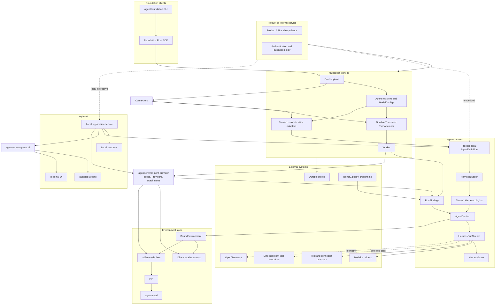
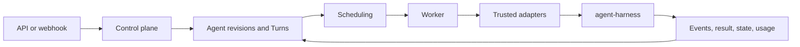
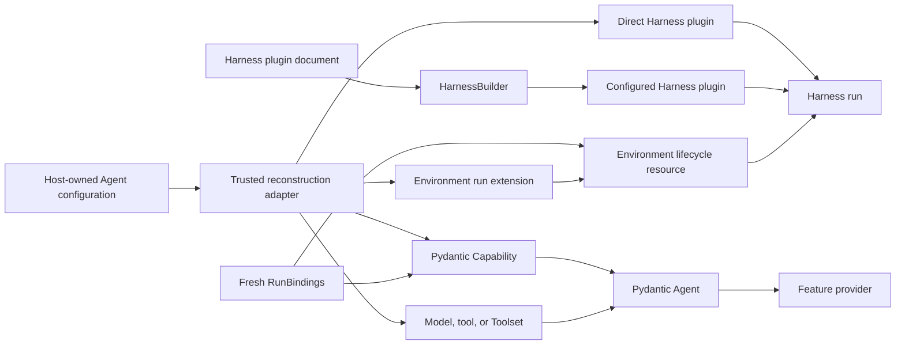
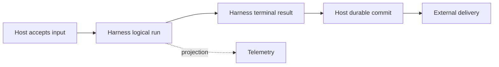

# Open-Source Agent Platform Overview

## Platform Definition

Agent Foundation is an open-source foundation for embedding Agents or hosting them as durable services. It provides reusable process-local execution, Environment, protocol, and hosting semantics while leaving product experience, business workflow, and infrastructure vendors to adopters.

The platform consists of:

- `agent-harness`, distributed as `a13n-harness`, for code-first Pydantic AI execution;
- `agent-environment-provider`, distributed as `a13n-environment-provider`, for shared Environment provider specifications, Providers, Resources, built-ins, and runtime attachments;
- `agent-stream-protocol`, distributed as `a13n-stream-protocol`, for shared Harness-to-AG-UI observation;
- `agent-ui`, distributed as `a13n-ui`, for reloadable local Agent/Environment composition, Sessions, and complete WebUI/TUI interaction;
- `agent-envd`, distributed as `agent-envd`, for Environment Interaction Protocol operations;
- `a13n-envd-client`, the generated low-level Python EIP client;
- `foundation-service`, distributed as `a13n-service`, for optional durable hosting;
- Foundation Service SDKs for typed access to the hosted `/api` boundary;
- `agent-foundation`, a cross-platform remote CLI built above the Foundation Rust SDK.

An application can embed the Harness directly, install Agent UI for a local interactive Host, use Foundation Service through an SDK or the CLI, or replace providers through documented typed and protocol boundaries.

## Architecture

Dependency direction is one-way: Hosts embed the Harness and can use the shared Environment Provider package directly; the Harness depends on provider attachments but the provider package imports no Harness, Host lifecycle, or presentation type. Agent UI and hosted transports consume Agent Stream Protocol above public Harness observations. Foundation clients call only the public service `/api` boundary, and the Foundation CLI consumes the Rust SDK rather than implementing a second transport client.

## Component Responsibilities

| Component                    | Owns                                                                                                                                                                                                                          | Does not own                                                                                                             |
| ---------------------------- | ----------------------------------------------------------------------------------------------------------------------------------------------------------------------------------------------------------------------------- | ------------------------------------------------------------------------------------------------------------------------ |
| `agent-harness`              | Process-local Agent construction, narrow plugin configuration/loading, trusted plugins, run context, recovery, execution, results, and continuation state                                                                     | Provider resource management, durable Agent schemas, local sessions, presentation, delivery, or billing                  |
| `agent-environment-provider` | Provider specifications, catalogs, create/resume/pause/destroy/reconcile Providers, Direct Local/Local Envd/Docker/E2B built-ins, resource state, and runtime attachments                                                     | Harness operations, Agent execution, durable storage, Host policy, or product APIs                                       |
| `agent-stream-protocol`      | Standard AG-UI conversion, generic `CUSTOM` fallback, optional replay-stable Host processing, process-local accumulation, and source-history reconstruction                                                                   | Agent execution, lifecycle invention, Host acceptance, durable history or replay, HTTP/SSE, or rendering                 |
| `agent-ui`                   | Reloadable local Model/Prompt/Plugin/Skill-source/Skill/Agent/Environment resources, hybrid Sessions, provider orchestration, root execution, async-only subagent jobs, application service, WebUI, and TUI                   | Distributed execution, multi-tenant authorization, or another Agent loop                                                 |
| `agent-envd-client`          | Generated EIP control/data models, codecs, stubs, async file transfer, and bounded transport/session runtime                                                                                                                  | Harness routing, product-user authorization, executable discovery/download/launch, provider provisioning, Host lifecycle |
| `agent-envd`                 | Client-neutral EIP Environment hosting, raw file transfer, operations, receipts, disk-backed command output, daemon generation, and native command containment                                                                | Agent loop, browser/product authentication, arbitrary URL fetch, durable execution, model policy                         |
| Foundation SDKs              | Language-typed access to the public Foundation Service `/api` contract                                                                                                                                                        | Service internals, product policy, or durable lifecycle authority                                                        |
| `agent-foundation`           | Cross-platform command-line interaction with public Foundation Service operations through the Rust SDK                                                                                                                        | A second HTTP client, service process management, persistence, queues, migrations, or infrastructure control             |
| `foundation-service`         | Managed Secrets, ModelConfigs, Agent/Connector revisions, Presets, managed Harness plugin artifacts, reconstruction locks, durable Turns/TurnAttempts, client tools, APIs, events, usage records, and optional web projection | Pydantic Agent loop, Python object serialization, client-side effects, provider-native state meaning                     |
| Product                      | Caller authentication, business policy, user experience, and final delivery                                                                                                                                                   | Harness internals and provider implementation                                                                            |

## Harness Foundation

The Harness is built directly on Pydantic AI 2:

- `AgentDefinition` is an immutable process-local Python value containing native `AgentSpec`, one build-time explicit or schema-derived output contract, an optional concrete Model, top-level Capabilities, plugins, and recovery configuration;
- Capability is the only top-level feature-behavior plane; each feature Capability owns its tools, Toolsets, instructions, settings, and hooks;
- `HarnessBuilder` resolves an explicit or disabled-by-default ambient plugin Build Context, creates fresh configured instances, binds all trusted plugins, authorizes custom Capability types, and calls `Agent.from_spec()` once;
- high-level run arguments supply optional Provider or Resource sources, while `RunBindings` supplies a fresh Agent instance, optional advanced Environment aggregate, optional async `RunModelResolver`, run Capabilities, and metadata;
- one logical Harness Run owns one context, Environment, plugin graph, state coordinator, usage accumulator, public `run_id`, and stable Thread correlation;
- bounded model recovery can start several `ModelAttempt` values with unique upstream model-attempt IDs inside that Run;
- `HarnessState` carries one stable `thread_id`, public messages, detached Capability JSON namespaces, and optional portable Environment backend data; desired topology, selected provider resource-state envelopes, and provider launch or reattachment data remain Host-owned;
- Pydantic AI owns native Model profiles, transport/output retries, provider-suspended continuation, deferred external calls/approvals, Toolsets, messages, events, and usage.

Harness middleware plugins are trusted concrete objects, and the Harness does not compile serialized Agent definitions. It owns a narrow versioned preferred YAML or supported JSON plugin document and Build Context that may, when explicitly enabled, select `a13n_harness.plugins` factories and append fresh concrete plugins during each definition build. Environment provider specifications, factories, Providers, Resources, and built-ins belong to `a13n-environment-provider`; the Harness can own an already constructed Provider through `ephemeral()` or borrow a fresh attachment from an entered Resource. A Host owns serializable Agent schemas, artifact locks, package trust, optional provider resource-state storage, and durable execution; package presence and Harness import alone never enable behavior or supply an arbitrary import target.

The complete design is indexed in [agent-harness/README.md](agent-harness/README.md).

## Local Agent Interaction

Agent UI is a complete local single-user workstation above the Harness. Human- and agent-editable configuration dynamically publishes validated Model, Prompt, Plugin, local Skill source/package, Agent, and Environment catalogs. Each Session pins immutable Agent and Environment snapshots plus validated root/child Skill exposure, references Host-managed Environment Provider resources through explicit assignments, selects complete `HarnessState` checkpoints, and manages Host-coordinated asynchronous child jobs over exact Harness-built subagents. Agent UI never enables the Harness blocking inline Delegation Capability. SQLite owns mutable metadata and control state, while resolved snapshots, provider state, Harness state, and retained AG-UI events live in verified compressed files; OpenTelemetry remains an independent export path. One application service exposes the same product semantics through a default bundled WebUI or a direct in-process TUI. Neither surface interprets private Harness events, reads storage for authority, operates providers independently, or owns a second Session model.

`a13n-harness`, `a13n-environment-provider`, and `a13n-stream-protocol` form the Harness release group. One `release/harness-v<version>` tag assigns the same version to all three distributions. Published Harness metadata pins the exact provider-package version, and published Stream Protocol metadata pins the exact Harness version. Agent UI releases independently through `release/agent-ui-v<version>` and its published artifact pins the reviewed Harness release dependencies. Source checkouts continue to resolve unversioned package dependencies from the shared uv workspace. Each tag version is a stable `X.Y.Z` identity or an RC `X.Y.Z-rc.N` identity as defined by [repository release automation](repository-model.md#release-automation). Source directories omit the distribution prefix (`packages/agent-*`), while Python distribution names use `a13n-` and import packages use `a13n_`.

The complete local Host design is indexed in [agent-ui/README.md](agent-ui/README.md), and the shared presentation protocol is indexed in [agent-stream-protocol/README.md](agent-stream-protocol/README.md).

## Recovery Boundaries

| Concern                             | Owner                                      |
| ----------------------------------- | ------------------------------------------ |
| Provider-suspended continuation     | Pydantic AI                                |
| Provider transport retry            | Provider/client and Pydantic `RetryConfig` |
| Exact provider-history repair       | Harness `SelfHealingModel`                 |
| Interrupted `ModelAttempt` recovery | Harness run coordinator                    |
| Worker crash and durable recovery   | Host                                       |
| External side-effect reconciliation | Provider and Host                          |

Recovery never converts missing evidence into rollback or exactly-once success. Interrupted tool history records that the operation may have partially or fully completed and directs the next model to inspect state before retrying.

## Environment Foundation

Environment is a Harness-owned run lifecycle resource, not a Capability. The public `Environment` facade gives trusted code and optional model-facing Capabilities a stable run- and Identity-bound view over provider-neutral file, shell, process, and port operations. Its paired Host-retained controller activates after initial portable-state restore and supports atomic add, refresh, and removal throughout the active logical run. Direct Local and EIP are the only operation backends.

`a13n-environment-provider` owns shared provider specifications, the create/resume/pause/destroy Provider API, provider resource state, fresh runtime attachments, and the built-in `a13n.direct-local`, `a13n.local-envd`, `a13n.docker`, and `a13n.e2b` providers. A Host chooses lifecycle actions and optional storage. Local Envd owns a required-isolation local daemon process over a Host-selected workspace and never falls back to Direct Local. The Harness either owns a Provider through its bounded ephemeral lifecycle or borrows an entered Host-owned Resource, then adapts a fresh Direct Local or EIP attachment into a single-use binding.

The Harness adapts EIP through `a13n-envd-client`; other trusted consumers can use that client independently. The client communicates only over a supplied session source and never discovers, downloads, installs, or launches an executable. `agent-envd` carries JSON-RPC control and raw file transfer over trusted stdio, Host-dialed HTTP, or an envd-initiated reverse WebSocket. It owns daemon-generation operation/receipt evidence, process handles, disk-backed command output with explicit-offset reads, session-scoped transfers, and Linux/macOS/Windows command containment. Carrier direction never changes the low-level client's requester role or envd's responder role.

Agent UI exposes `a13n.local-envd` as Local Sandbox. Its release pins one exact agent-envd version and target hashes, lazily downloads only the selected Host binary into an Agent UI-managed runtime cache, and never searches ambient `PATH`; an advanced absolute executable override must pass version, isolation, and EIP compatibility checks. Direct Local, Docker, and E2B do not trigger this Host download.

Provider-defined portable backend data can enter only the explicit `HarnessState.environment_state` field after fresh bindings are selected. Provider resource identity and generation evidence plus optional launch or reattachment data remain in Host continuation state. Live clients, sockets, credentials, process handles, readiness, controllers, and provider authority do not become Harness state. Optional `DynamicEnvironmentCapability` composes File/Shell tools with dynamic model context but owns neither provider lifecycle nor state.

## Foundation Client Surfaces

Foundation Service clients operate only through the public `/api` namespace. The language SDKs own typed transport and service-contract mapping. The `agent-foundation` executable is a user-facing composition layer above the Rust SDK and does not duplicate HTTP serialization, authentication transport, retries, or service models.

A CLI network command and its backing SDK operation enter the platform together with the corresponding real service API and end-to-end behavior. The CLI does not reserve unsupported commands as placeholders. Service-process startup, migrations, databases, Redis, queues, containers, Kubernetes, and other operator internals remain owned by Foundation Service deployment surfaces rather than the remote client.

The CLI source, workspace isolation, validation, and binary-only release channel are defined by the [repository model](repository-model.md).

## Hosted Service Foundation

Foundation Service adds durability without changing Harness execution semantics:

Foundation Agent revisions are Host-owned serializable documents, not Harness `AgentDefinition` wire values. A worker verifies their exact dependency and artifact locks, reconstructs native Pydantic/Harness objects, resolves current authorized Connections and operator-approved Environment providers, reads desired topology separately from selected encrypted provider resource state, resumes or reconciles the selected resources, acquires fresh runtime attachments, and publishes fresh run-local Harness binding versions and topology. Foundation can record a TurnAttempt-scoped effective-topology observation, while the worker retains the paired Environment controller only for that active logical run.

Every Foundation Agent invocation selects or creates a Session and Thread and
accepts one durable Turn. One `TurnAttempt` starts at most one logical Harness
Run; internal Harness `ModelAttempt` values are not durable worker generations.
Authorized desired Environment topology can advance during that Run and is
reconciled through the retained controller with separate effective publication.
Worker or lease loss terminalizes the attempt as `lost`; after Foundation
classifies unmatched Agent tool dispatches as `unknown_outcome`, applies each
non-Agent domain's owning recovery contract, and verifies the Turn-owned budget,
it creates a new fenced `TurnAttempt`, fresh provider bindings, and a fresh
Harness Run from the same Turn's latest conditionally committed state. Every Turn owns one deterministic state key; Foundation
replaces that key at complete checkpoints and exposes no separate base, result,
or checkpoint-history object.

Client-side tools use native Pydantic deferred values. Foundation seals the waiting Turn with its pending call or approval, authenticates external feedback, and accepts a new Turn whose `parent_turn_id` names that waiting Turn. The new Turn starts a later run with fresh bindings. Asynchronous children use independent Threads and Turns rather than Pydantic deferred spawn calls.

Foundation's [Thread persistence](foundation-service/24-thread-persistence.md)
owns one independent versioned relational Thread resource, its Session
membership, current Turn, and selected continuation head. [Turn
persistence](foundation-service/14-turn-persistence.md) owns
durable Agent-work identity, scheduling, the recovery budget, the interactive
recovery boundary, and complete Turn-state object schema. [Turn Attempt
persistence](foundation-service/15-turn-attempt-persistence.md) owns the
`turn_attempts` table, worker leases, and fences. [Lifecycle and stream
persistence](foundation-service/17-lifecycle-and-stream-persistence.md) owns
one lifecycle-event table and Redis Agent-message transport with object-backed
retained replay; pending calls, Items, stream entries, and generic provider
receipts do not receive separate relational tables.

The hosted service boundary is defined in [Foundation Service](foundation-service/README.md).

## Deployment Profiles

| Profile             | Persistence and coordination                                                                     | Execution                                                                   |
| ------------------- | ------------------------------------------------------------------------------------------------ | --------------------------------------------------------------------------- |
| Embedded            | Application-selected                                                                             | Harness in product process                                                  |
| Local Agent UI      | Hybrid SQLite metadata and compressed-file package/state/event storage with process coordination | Harness plus Environment Provider resources and Host-owned async child jobs |
| Minimal service     | SQLite, in-memory Redis, and local objects                                                       | Control and worker together in one process                                  |
| Distributed service | PostgreSQL, real Redis, and shared object storage                                                | Separately scalable control and worker roles                                |

Foundation Service configuration, role ownership, dependency requirements, and readiness are defined by [Runtime Configuration and Deployment](foundation-service/01-runtime-configuration-and-deployment.md). The internal relational, Redis-compatible, object, and mounted-filesystem surfaces are defined by [Foundation Storage Capabilities](foundation-service/03-storage.md). The final distribution's relational metadata and migration authority are defined by the [Relational Schema Lifecycle](foundation-service/04-relational-schema.md).

Coordination streams and queues do not become durable lifecycle authority.

## Identity and Version Boundaries

The shared [`Session`, `Thread`, `Turn`, and `Item` interaction model](interaction-model.md) defines public interaction identity and relationships. Platform-wide versioning, naming, ownership, and compatibility rules are defined by [Platform Data Conventions](data-conventions.md). Concrete subsystems own their object catalogs, schemas, and explicitly scoped or external identifiers within those rules.

The platform distinguishes:

- caller/actor identity;
- stable Agent workload Identity and Agent instance;
- Host-owned `Session`, `Thread`, `Turn`, and `Item` identities;
- Host-owned immutable definition revision and dependency locks;
- process-local Harness Run and `ModelAttempt`;
- Foundation durable Turn and `TurnAttempt`;
- Environment identity and generation;
- credential binding and invocation grant.

A Host definition revision contains only serializable Host data and exact locks. It contains no plugin/Capability class, native Model, Toolset, output Python type, callable, client, plaintext credential, or process-local object. A worker reconstructs those values without mutating the selected revision.

## Service API Boundaries

Foundation-owned resource-oriented JSON APIs and their first-party SDKs follow [Platform API Conventions](api-conventions.md). The shared contract owns HTTP resource shape, JSON representation, pagination, errors, mutation safety, and compatibility. Process-local APIs, EIP, Agent Stream Protocol observation, provider APIs, and external webhook schemas retain their defining contracts.

## Extension Model

Installed plugins and native objects are trusted in-process code. Harness plugin, Connector Provider, Environment provider, and Environment run-extension package presence is only availability; an operator explicitly enables or selects the relevant key and exact artifact before import/use. Factory-produced and directly constructed objects enter the same concrete composition path for their extension kind. Untrusted or independently governed behavior belongs behind feature-specific protocols. The core defines no universal remote-plugin or package-installation system. Foundation's [managed Harness plugin artifacts](foundation-service/26-harness-plugin-artifacts-and-runtime-loading.md) are a Host-specific internal code-deployment boundary that preserves this trust model rather than a new platform-wide extension mechanism.

## Observability and Cost

Pydantic AI instrumentation owns Agent/model/tool spans. Harness features add spans only for Harness-owned context, plugins, recovery, state, Environment, and delegation work. Foundation adds durable lifecycle, queue, child, client-delivery, and connector spans.

`RunUsage` is a process-local accumulator. The Harness applies one release-pinned or Host-replaced build-time pricing policy and records its revision; Hosts own durable deduplication, cross-run aggregation, negotiated adjustments, budgets, billing, and payment.

## Completion Boundaries

Turn acceptance, ModelAttempt completion, Harness terminal delivery, Host Turn commit, usage recording, telemetry export, external delivery, billing, and payment are independent facts.

## Design Principles

01. Reuse Pydantic AI, OpenTelemetry, databases, streams, and provider ecosystems.
02. Keep one authority for every durable fact.
03. Preserve native Python composition inside the execution process.
04. Keep durable Host schemas outside the Harness library.
05. Bind Identity and current authority freshly at the Host boundary.
06. Keep process-local continuation separate from durable lifecycle state.
07. Preserve unknown side effects, never automatically replay Agent tool calls, and retain owning reconciliation contracts for non-Agent operations.
08. Use optional typed packages and protocols instead of a universal extension framework.
09. Use the same Harness API in embedded and hosted modes.
10. Add enterprise behavior through the same boundaries rather than forks.

## Specification Set

| Area                                   | Document                                                                                                                                             |
| -------------------------------------- | ---------------------------------------------------------------------------------------------------------------------------------------------------- |
| Repository content and workflow model  | [repository-model.md](repository-model.md)                                                                                                           |
| Platform interaction model             | [interaction-model.md](interaction-model.md)                                                                                                         |
| Platform data conventions              | [data-conventions.md](data-conventions.md)                                                                                                           |
| Platform API conventions               | [api-conventions.md](api-conventions.md)                                                                                                             |
| Harness catalog                        | [agent-harness/README.md](agent-harness/README.md)                                                                                                   |
| Environment Provider catalog           | [agent-environment-provider/README.md](agent-environment-provider/README.md)                                                                         |
| Harness architecture                   | [agent-harness/00-overview.md](agent-harness/00-overview.md)                                                                                         |
| Harness definition/build               | [agent-harness/03-agent-definition-and-build.md](agent-harness/03-agent-definition-and-build.md)                                                     |
| Harness plugins                        | [agent-harness/05-plugin-system.md](agent-harness/05-plugin-system.md)                                                                               |
| Harness execution and recovery         | [agent-harness/06-execution-context-and-lifecycle.md](agent-harness/06-execution-context-and-lifecycle.md)                                           |
| Harness state                          | [agent-harness/10-snapshot-and-resume.md](agent-harness/10-snapshot-and-resume.md)                                                                   |
| Harness public API                     | [agent-harness/14-public-api-and-packaging.md](agent-harness/14-public-api-and-packaging.md)                                                         |
| Harness model/output boundary          | [agent-harness/16-input-model-and-output.md](agent-harness/16-input-model-and-output.md)                                                             |
| Agent Stream Protocol catalog          | [agent-stream-protocol/README.md](agent-stream-protocol/README.md)                                                                                   |
| AG-UI observation contract             | [agent-stream-protocol/00-overview.md](agent-stream-protocol/00-overview.md)                                                                         |
| Agent UI catalog                       | [agent-ui/README.md](agent-ui/README.md)                                                                                                             |
| Agent UI architecture and sessions     | [agent-ui/00-overview.md](agent-ui/00-overview.md), [agent-ui/04-sessions-environments-and-state.md](agent-ui/04-sessions-environments-and-state.md) |
| agent-envd catalog                     | [agent-envd/README.md](agent-envd/README.md)                                                                                                         |
| EIP architecture and protocol          | [agent-envd/00-overview.md](agent-envd/00-overview.md), [agent-envd/02-eip-protocol.md](agent-envd/02-eip-protocol.md)                               |
| Foundation Service boundary            | [foundation-service/README.md](foundation-service/README.md)                                                                                         |
| Foundation runtime and deployment      | [foundation-service/01-runtime-configuration-and-deployment.md](foundation-service/01-runtime-configuration-and-deployment.md)                       |
| Foundation distribution composition    | [foundation-service/02-distribution-composition-and-extensions.md](foundation-service/02-distribution-composition-and-extensions.md)                 |
| Foundation Secret management           | [foundation-service/11-secret-management.md](foundation-service/11-secret-management.md)                                                             |
| Foundation interaction/runtime mapping | [foundation-service/13-interactions-turns-and-attempts.md](foundation-service/13-interactions-turns-and-attempts.md)                                 |
| Foundation Turn persistence            | [foundation-service/14-turn-persistence.md](foundation-service/14-turn-persistence.md)                                                               |
| Foundation TurnAttempt persistence     | [foundation-service/15-turn-attempt-persistence.md](foundation-service/15-turn-attempt-persistence.md)                                               |
| Foundation scheduling and recovery     | [foundation-service/16-scheduling-workers-and-recovery.md](foundation-service/16-scheduling-workers-and-recovery.md)                                 |
| Foundation lifecycle and Turn streams  | [foundation-service/17-lifecycle-and-stream-persistence.md](foundation-service/17-lifecycle-and-stream-persistence.md)                               |
| Foundation public API                  | [foundation-service/21-management-api.md](foundation-service/21-management-api.md)                                                                   |
| Foundation model management            | [foundation-service/25-model-management.md](foundation-service/25-model-management.md)                                                               |
| Foundation managed Harness plugins     | [foundation-service/26-harness-plugin-artifacts-and-runtime-loading.md](foundation-service/26-harness-plugin-artifacts-and-runtime-loading.md)       |
