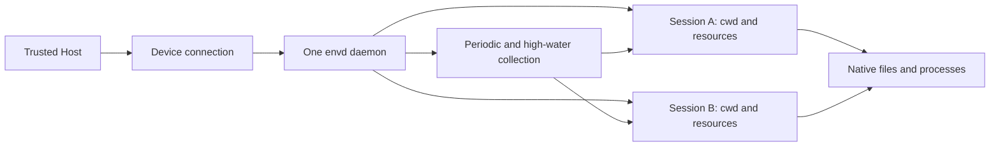

# a13n-envd Overview

## Design Position

`a13n-envd` is a device daemon for files, shells, processes and their output. One daemon per machine or outer sandbox is the normal deployment. A trusted Host connection represents a Device and carries multiple independent Sessions, rather than starting another daemon for each folder or Run.

The Host selects an immutable Device execution identity, Sandbox and egress mode. A Session has a fixed default working directory and owns its operations, processes, output and transfers. Its working directory supplies defaults, not confinement: restricted grants constrain the complete worker, while disabled Sandbox retains native filesystem authority. Envd owns the worker lifecycle; the Host owns the outer account, container or VM and product authorization.

Envd is not an Agent runtime, product authorization service, provisioner, scheduler or durable execution database. Harness opens a provider-neutral Environment execution through a connector fixed to the Host-selected environment; it does not select Devices or own their sockets. Direct Local, Docker and native cloud Providers use their own operation and lifecycle contracts.

## Architecture

HTTP, reverse WebSocket and stdio implement the same Session semantics. HTTP requests select Sessions independently of TCP pooling. One WebSocket or stdio carrier multiplexes them. Envd remains the responder even when it establishes a reverse connection.

## Owning Contracts

| Concern                                                            | Owner                                                          |
| ------------------------------------------------------------------ | -------------------------------------------------------------- |
| Identity, generation, configuration, aggregate bounds and shutdown | [Daemon Lifecycle](01-daemon-lifecycle-and-configuration.md)   |
| Device handshake, Session methods, operation evidence and errors   | [EIP](02-eip-protocol.md)                                      |
| Authentication, framing, routing and disconnect handling           | [Transports](03-transports-and-sessions.md)                    |
| Device paths, directory discovery and file publication             | [Resources](04-resource-operations.md)                         |
| Command start, process controls and cleanup evidence               | [Commands](05-command-and-process-execution.md)                |
| Output bytes, offsets and release                                  | [Output](06-output-retention.md)                               |
| Device execution boundary and native cleanup limits                | [Execution Boundary](07-execution-isolation.md)                |
| IDL, generation and shared client                                  | [Protocol Source](08-protocol-source-client-and-generation.md) |
| Session inactivity, disconnect grace and resource collection       | [Resource Lifetime](09-resource-lifetime-and-reclamation.md)   |

## Main Flow

1. The operator or Host launches envd under the chosen OS identity or outer sandbox.
2. A trusted requester initializes the Device connection, reads its default directory and optionally discovers directories before selecting a working path.
3. Each Environment connector opens an EIP Session with its captured working directory and verifies readiness.
4. Requests and binary transfers route to that Session. Its client maintains liveness while the owning scope exists, including during quiet long-running commands.
5. Scope close cleans that Session, not the daemon, shared carrier or sibling Sessions.
6. Lost owners expire; a short disconnect grace permits same-Session reattachment. Periodic and high-water collection remove abandoned Sessions and eligible completed history.

The Host owns a shared local stdio daemon's lifetime. A standalone owner can instead own a dedicated daemon. Neither model changes Session ownership.

## Identity and Ownership

A Device identifies a connected daemon installation; generation distinguishes restarts. Hosts own their Environment resource model and supply captured folder bindings. A Session is a volatile resource owner, not a tenant, Run, or Provider lifecycle entity.

Two Sessions may select the same working directory. They observe ordinary filesystem effects and races; envd creates no worktree, lock or transaction between them. Closing a Session never removes its workspace files. No Session can address another Session's handles through EIP, but processes sharing an OS account are not mutually isolated by this routing rule.

Per-Session and daemon-wide resource bounds are deliberately generous and finite. Opening more Sessions does not multiply the daemon's capacity. Collection favors abandoned Sessions and completed history, not healthy active work. Failed cleanup remains accounted for.

A lost response does not prove non-dispatch. Receipts describe observed native effects, not durable Host completion. Reattachment does not replay operations, resume transfers or revive a closed Session. No volatile selector survives daemon restart.

## Invariants

1. One Device supports concurrent independent Sessions with different working directories.
2. Session resources have one owner; no resource-import or cross-Session retention system exists.
3. Session close, expiry and cancellation do not affect healthy siblings.
4. An owned quiet process is not classified as abandoned because it emits no output.
5. The Host selects the Device boundary; Envd applies it to commands, file RPCs, transfers and directory discovery without per-command policy overrides.
6. All carriers use the same Session and cleanup contracts.

Sandbox (`disabled` or `restricted`) composes with egress (`inherit`, `deny` or `controlled`). Every controlled Session requires an explicit destination policy. [Execution Boundary](07-execution-isolation.md) owns platform support and enforcement.
