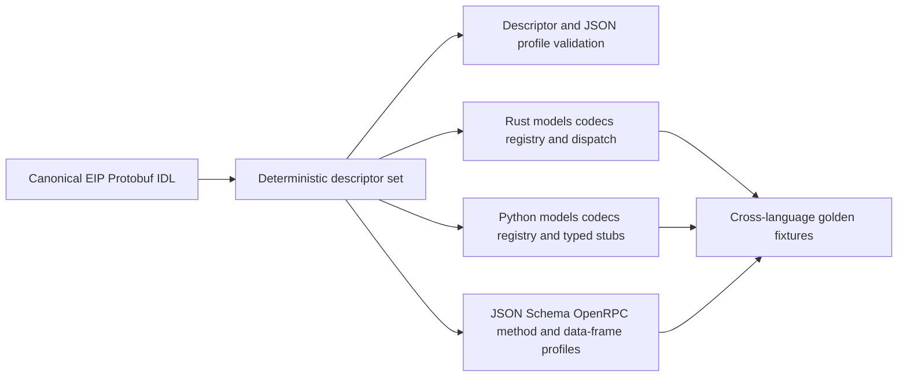

# Protocol Source, Client, and Generation

## Design Position

EIP has one language-neutral protocol source that generates the daemon wire surface and the Python client surface. The canonical source uses Protobuf service and message IDL with EIP-specific method options. JSON-RPC 2.0 remains the observable control envelope over trusted stdio, Host-dialed HTTP, and outbound reverse WebSocket, while raw file bytes use the correlated transfer mapping defined by each carrier profile. Protobuf is an IDL and generation input; EIP does not use gRPC as a mandatory transport, put binary protobuf messages inside JSON-RPC, or serialize native file content as protobuf.

The dedicated `a13n-envd-client` Python package contains the generated EIP models, method and transfer metadata, control/data codecs, typed request stubs, high-level async file readers and writers, and a small handwritten transport/session runtime. It has no Harness, provider, product, executable-discovery, artifact-download, installation, or daemon-process authority. It communicates over a session source supplied by an owning provider or Host and never searches `PATH`, selects a release, installs a binary, or launches `a13n-envd`. The Environment package owns the provider-neutral `Environment` implementation over this client; Harness receives that adapter directly and adds only Run-local multi-mount routing.

The client and `a13n-envd` daemon belong to one a13n-envd release group. Their package version is release identity, while the negotiated EIP `<major>.<minor>` version remains the independent wire-compatibility identity defined by [EIP Protocol](02-eip-protocol.md).

## Boundaries

| Concern                                                                                    | Owner                                                        | Relationship                                                   |
| ------------------------------------------------------------------------------------------ | ------------------------------------------------------------ | -------------------------------------------------------------- |
| Method semantics, fields, errors, compatibility, and transport behavior                    | `spec/a13n-envd/`                                            | Normative observable contract                                  |
| Canonical service/message IDL and EIP method options                                       | `proto/a13n-envd/`                                           | Machine-readable realization of the accepted EIP contract      |
| Descriptor validation and deterministic language generation                                | Repository generation tooling                                | Produces all language-local wire types and method surfaces     |
| Rust server models, codecs, method registry, and dispatch surface                          | Generated a13n-envd crate modules                            | Used behind daemon transport and resource owners               |
| Python models, codecs, method registry, and typed client stubs                             | `a13n-envd-client`                                           | Transport-neutral client contract                              |
| JSON-RPC framing, raw-data attachment/multiplexing, authentication, sessions, and liveness | Handwritten client and daemon runtimes over generated codecs | Implements [transport profiles](03-transports-and-sessions.md) |
| Provider-neutral Environment adaptation                                                    | `a13n-harness` Environment Providers                         | Implements fresh `Environment` adapters over EIP               |
| Multi-mount routing and model-facing result mapping                                        | `a13n-harness`                                               | Consumes already constructed Environment adapters              |
| Provider lifecycle, bootstrap, and EIP session sources                                     | `a13n-harness` Environment Providers and Host                | Supplies fresh process-local runtime collaborators             |
| Product routing, durable execution, and current Environment-state persistence              | Host                                                         | Never generated from EIP IDL                                   |
| Executable release selection, discovery, download, installation, and process ownership     | Installer, Host, or selected provider                        | Absent from the low-level client                               |

The normative Markdown specification owns meaning. The canonical IDL must encode that accepted meaning exactly and is the source from which code is generated. A mismatch between specification, IDL, generated code, or golden wire fixtures fails validation; an implementation cannot select whichever copy is convenient.

## Repository and Package Shape

The stable source and output ownership is:

| Path or distribution                                                                                | Content                                                                                                                                     |
| --------------------------------------------------------------------------------------------------- | ------------------------------------------------------------------------------------------------------------------------------------------- |
| `proto/a13n-envd/eip/v1/*.proto`                                                                    | Canonical Protobuf service, messages, custom options, package identity, and reserved field numbers/names                                    |
| `crates/a13n-envd/protocol/eip/v1/descriptor.pb`                                                    | Checked deterministic descriptor set consumed by the crate build without requiring Protobuf tooling                                         |
| `proto/a13n-envd/eip/v1/artifacts/{methods,schema,openrpc,data-frame-profile,generated-files}.json` | Checked method inventory, JSON Schema, OpenRPC view, fixed data-frame profile, descriptor digest, and manifest                              |
| `packages/a13n-envd-client/a13n_envd_client/eip/v1/`                                                | Checked generated Pydantic models, JSON/data-frame codecs, method and transfer registries, protocol identity, and typed async request stubs |
| `crates/a13n-envd/build_support/` and Cargo `OUT_DIR`                                               | Descriptor-driven Rust generator and its generated serde models, method registry, handler trait, and dispatch surface                       |
| `crates/a13n-envd/protocol/eip/v1/testdata/`                                                        | Shared hand-curated canonical JSON values and binary-frame fixtures consumed by Python and Rust conformance tests                           |
| `spec/a13n-envd/`                                                                                   | Normative architecture, protocol, transport, resource, output, isolation, and generation contracts                                          |
| `packages/a13n-harness/a13n_harness/providers/environment/`                                         | Provider specifications, Providers, Environment adapters, state codecs, and stdio/HTTP/reverse-WebSocket EIP session sources                |
| `packages/a13n-harness/a13n_harness/`                                                               | Run-local multi-mount routing and model-facing integration over already constructed Environment adapters                                    |

`a13n-envd-client` is a Python workspace member for repository development and validation, but it belongs to the a13n-envd release group rather than the a13n Service Python release group. An a13n Service release can depend on a compatible published client range but does not version or republish that package.

The client package is lower-level than both the provider package and the Harness and is reusable by product gateways, CLIs, IDEs, provider controllers, and trusted background jobs. It imports no Pydantic AI Agent type, `AgentContext`, `BoundEnvironment`, `ToolOutputPolicy`, browser principal, provider SDK, or Host lifecycle model. The Provider package uses the client session runtime to construct fresh EIP-backed Environment adapters and translates generated EIP values into provider-neutral descriptors, logical references, errors, and receipts. Harness routes those provider-neutral operations without owning an EIP adapter.

## Canonical IDL Profile

Every canonical IDL file uses the Protobuf package `a13n.agent_envd.eip.v1`. Each request-response method is one Protobuf service method with named request and result messages. Descriptor-interpreted file options also declare the fixed data-frame magic, profile version, header widths, and numeric frame/reset enums owned by the transport specification; generators consume those options rather than maintaining language-local constants. EIP 0.1 selects data-frame profile 1, including explicit Session routing. Device handshake selects the protocol; binary attachments require a ready logical Session. The major-1 IDL namespace is canonical. Generated clients and servers reject unsupported protocol versions and frame profiles. EIP-specific method options declare at least:

- exact JSON-RPC method name;
- whether the method opens, closes, commits, or aborts a typed file transfer and the permitted direction;
- device/session method scope and replay class (`terminal_evidence` or `active_only`) under origin-scoped operation identity; initialize, device.describe, directory.list, session.open and Session lifecycle controls are explicitly ledger-external;
- correlated request-response behavior;
- protocol major and first minor in which the method exists;
- owning error set or error family when narrower than the common EIP set.

The `ErrorType` enum value option declares the fixed signed JSON-RPC code for every wire error type. Codes and JSON names are unique, and generated Python and Rust outbound validation rejects a mismatched `EIPError.code` and `data.error_type` pair.

The IDL uses stable package namespaces and field numbers. Removed fields reserve both number and name. Presence-sensitive scalars use explicit presence; mutually exclusive payload alternatives use a real discriminated union; dynamic maps are limited to fields whose keys are intentionally open. Secrets, native paths, PIDs, process objects, transport headers, and provider lifecycle values are absent from the IDL unless an owning EIP contract explicitly makes a bounded representation observable.

The EIP JSON profile, not a language runtime's defaults, controls JSON-RPC `params`, `result`, and typed `error.data`:

- wire field names are `snake_case`;
- absent optional values are omitted by generated senders; `null` is accepted only where the selected EIP schema explicitly permits it;
- a bare repeated or map field with no non-empty constraint treats absence and an empty collection as the same wire value and is canonically omitted when empty; a presence-sensitive collection uses an explicit wrapper or presence field instead;
- integer, timestamp, base64, enum/string taxonomy, discriminated-union, and unknown-field behavior match the owning EIP schema and golden fixtures exactly;
- generated request decoders reject unknown or duplicate authority-bearing fields unless the negotiated minor explicitly defines them;
- generated response decoders can ignore only additive fields allowed by the selected minor-version compatibility rules;
- bounded binary values that belong to JSON control remain the explicit EIP `EncodedBytes` shape rather than an implementation-dependent Python or Rust byte serialization;
- native file content is excluded from JSON and `EncodedBytes` and uses the fixed raw data-frame/body profile;
- JSON-RPC envelopes remain JSON and never contain an encoded protobuf blob.

If standard ProtoJSON behavior differs from the accepted EIP JSON shape, the generator emits the required profile codec. A library upgrade cannot silently change field casing, 64-bit number representation, base64 form, default emission, unknown-field handling, or union decoding.

## Descriptor-Driven Generation

Generation consumes a deterministic Protobuf descriptor set including interpreted EIP custom options. No generator parses `.proto` source text with regular expressions or maintains a second hand-authored method list.



The generator produces:

- protocol identity, supported-version, and fixed data-frame-profile constants;
- Pydantic-based Python and serde-based Rust request, result, JSON-RPC request/response/error envelope, selector, transfer, and typed-error models;
- exact JSON profile encoders/decoders plus one bounded Python/Rust data-frame header codec using descriptor-defined frame/reset enums;
- one method and transfer metadata registry derived from service descriptors;
- typed Python client methods for every request-response EIP method;
- typed Rust dispatch entries or traits for every daemon method;
- JSON Schema, OpenRPC, and data-frame-profile views for inspection and non-generated tooling;
- a normalized method/transfer inventory and complete generated-file manifest.

Shared golden request, result, and error values are hand-curated wire evidence rather than generator output. Python and Rust consume the same checked fixture file so a renderer cannot redefine its own expected JSON independently.

Generated validation owns wire structure: field types and bounds, presence, unions, canonical formats, and the small cross-field invariants required to interpret a value safely, such as command output having a reference. The daemon's domain-to-wire conversion owns lifecycle coherence across observations, such as whether a running process can already have an exit code or whether terminal operation evidence is coherent. Codegen does not duplicate complete process, operation, filesystem, or isolation state machines as defensive model validators; runtime tests exercise those owners directly.

JSON Schema and OpenRPC are inspection views, not alternate canonical validators. They preserve field shape, bounds, and expressible Protobuf unions, but a standard schema need not duplicate cross-property relationships enforced by generated Python and Rust validation. Consumers that send EIP values use a generated protocol model or implement the normative IDL and specification contract rather than treating the inspection artifact alone as proof of validity.

Generated files carry a stable generated marker and are never manually edited. Python generated source is checked into the client project so source distributions, code review, and downstream type checking do not require a compiler toolchain. Rust source is generated deterministically into Cargo `OUT_DIR` from the checked descriptor during build and is never checked in as another editable copy. CI and release generation creates a candidate descriptor, Python surface, and inspection artifacts outside the repository and compares the complete manifest and bytes without first rewriting the checkout. Cargo independently regenerates the Rust surface from the checked descriptor, embeds the same digest, and rejects an invalid descriptor during build.

The Protobuf compiler, plugins, and generator dependencies are locked development/build tools. Generated runtime models use Pydantic in Python and serde in Rust, so the client does not depend on a Protobuf compiler or runtime. In particular, compiler packages such as `grpcio-tools` never enter the published client's dependencies.

## Generated and Handwritten Client Boundary

Generation owns repetitive protocol facts. The Python package generates every typed method stub from descriptor metadata; it does not keep a parallel manually written `file_read`, `process_wait`, or equivalent list that can drift from the daemon.

The handwritten client runtime owns behavior that IDL cannot safely decide:

- JSON-RPC ID allocation, response correlation, bounded in-flight multiplexing, and cancellation plumbing;
- transfer attachment, bounded per-transfer queues, fair scheduling, backpressure, offset state, terminal acknowledgement, and deterministic teardown over generated frame codecs;
- stdio content-length framing for both JSON control and EIP binary data frames;
- authenticated HTTP device handshake and independent Session creation, common eip_session control envelopes, protected raw-transfer headers, bounded concurrent POSTs and teardown;
- requester-side accepted reverse-WebSocket carrier integration, required subprotocol, first-message initialization, text control, binary transfer frames, ping/pong, and close mapping;
- carrier and message size enforcement before generated payload decode;
- device connection ownership and one physical reader/demultiplexer, independent logical Session state, immutable Host-selected working directories, exact methods, readiness, scope-owned keepalive, same-Session reattachment and generation fencing;
- relative call/transfer timeout narrowing without treating a carrier timeout as operation failure;
- same-Session retained operation replay and receipt lookup, without ambiguous mutation retry or cross-Session resource import;
- secret redaction and lifecycle cleanup.

A common async carrier protocol presents correlated control requests plus typed transfer attachments to the generated client core. Trusted stdio, Host-dialed HTTP, and a reverse-WebSocket connection accepted by the requester/control-service boundary satisfy that protocol without changing generated signatures, reader/writer behavior, readiness semantics, or EIP results. HTTP maps an attachment to one authenticated bounded streaming request or response body rather than EIP binary frames. The client never falls back to another carrier or repeats a possibly dispatched mutation.

Local request admission and response waiting have separate deadlines. An explicit `context.timeout_ms` remains the daemon's operation budget; after local admission, the client reserves that budget plus a finite transport response allowance. A longer process or port wait is not truncated by the ordinary request allowance, and a remote timeout can arrive as a typed EIP error. HTTP control-response reads use the same budget composition while connection, write, and pool waits retain their transport limits. Initialization and explicit Session readiness retain their enclosing deadlines. Local response expiry still conveys no operation outcome and never authorizes automatic mutation retry.

The low-level device connection opens fresh EIPSessions with Host-selected working directories and performs a bounded initial readiness operation before returning each. It owns no provider/daemon lifecycle. Failed readiness closes/fences only the affected Session unless framing/trust of the physical carrier is unusable. Session close never closes a sibling or a borrowed carrier. A per-Session keepalive task exists only within its owning adapter scope and runs independently of native work/transfer backpressure. It does not retain terminal history automatically. Session close/expiry cleans owned resources; short same-Session reattachment and periodic/pressure collection follow the resource-lifetime contract.

The public low-level convenience surface creates one fresh operation ID per logical operation and hides transfer handles, attachment frames, offsets, reset retirement, and digest bookkeeping:

```python
async with client.open_reader(path, byte_range=byte_range) as reader:
    async for chunk in reader:
        await sink.write(chunk)
    completion = reader.completion

async with client.open_writer(path, mode="replace") as writer:
    async for chunk in source:
        await writer.write(chunk)
    result = await writer.commit()
```

Normal reader iteration maintains a local count and SHA-256 and calls `file.close_reader` only after the public consumer drains all chunks following clean `END`. Readers never send `END_ACK`; successful close count/digest verification is the sole acceptance. The helper publishes completion state only after local verification; mismatched completion evidence leaves completion unavailable and fences the affected transfer/Session; only unrouteable carrier corruption closes healthy siblings. Early context exit sends `RESET` when possible and never calls successful close. An envd-initiated reset is already terminal and is not echoed. Transfer teardown and abandoned correlation are finite and Session-scoped; whole-carrier teardown is reserved for failures that cannot be isolated safely. Writer `commit()` seals through `END`/`END_ACK` before `file.commit_writer`; context exit without successful commit resets and calls `file.abort_writer`. Helpers iterate text/list/search pages and command output through explicit offsets and reconcile effects by operation ID. They preserve bounds, transfer expiry, integrity, cancellation, output completeness, and unknown outcomes; they never emulate an unavailable method, turn carrier loss into EOF, or materialize an unbounded value.

The client exports `normalize_http_endpoint()` for pure origin validation under the same transport policy, without constructing a network client. `WebSocketConnection` is a structural async accepted-connection interface for Host framework integration; the `websockets` server connection satisfies it directly. Framework adapters normalize disconnects to EOF or I/O errors and provide non-consuming closure observation. Authentication and subprotocol negotiation remain Host-owned; the transport validates `eip.v1` and performs EIP framing.

## Provider and Harness Boundaries

The Harness Environment Provider domain owns Provider definitions, fresh Environment adapters, portable state codecs, and EIP session sources for trusted stdio, Host-dialed HTTP, or an accepted reverse-WebSocket carrier. Its Envd-backed Providers import no Agent loop or Pydantic AI type and use vendor SDKs only for backing-target lifecycle and bootstrap. Native Providers can use vendor APIs for operations. The [Remote Envd contract](../a13n-harness/08a-environment-providers.md#remote-envd) owns the bounded Host-integrated connection SDK; the low-level client owns no listener, registry or Provider selection.

The Provider package's EIP-backed `Environment` implementation owns provider-neutral path, descriptor, command, process, output-reference, receipt, cancellation, and error translation. It wraps opaque EIP selectors with the entered adapter and daemon generation before any model-facing projection. Harness consumes that Environment directly; incompatible Provider or state variants fail before Harness entry.

Harness model-output policy is not serialized as EIP command policy. Envd always captures bounded raw command output through its spool; the Harness decides how much to read, redact, inline, truncate, or expose through its own logical reference. The client and provider packages know neither Harness virtual paths nor model/tool metadata.

A Host owns current `EnvironmentState`, selects entry, warmup, destroy, cleanup, and prune policy, and invokes those operations on fresh adapters without assuming a13n Service behavior. Direct Local Environments do not depend on envd.

## Executable Distribution and Installation

Every a13n-envd release publishes native archives for Linux x86_64 and ARM64, macOS x86_64 and ARM64, and Windows x86_64 and ARM64, plus one Release `SHA256SUMS` file. Unix assets are named `a13n-envd-<version>-<target>.tar.gz`; Windows assets are named `a13n-envd-<version>-<target>.zip`. The six exact targets are `x86_64-unknown-linux-gnu`, `aarch64-unknown-linux-gnu`, `x86_64-apple-darwin`, `aarch64-apple-darwin`, `x86_64-pc-windows-msvc`, and `aarch64-pc-windows-msvc`. Each archive contains the `a13n-envd` executable and repository license.

Invoking the executable with exactly `a13n-envd --version` writes `a13n-envd <version>\n` to stdout, writes nothing to stderr, and exits zero. `<version>` is the canonical stable `X.Y.Z` or RC `X.Y.Z-rc.N` release identity embedded at build time. This path is side-effect-free: it does not create a Tokio runtime, inspect daemon environment or configuration, prepare an execution boundary, allocate runtime state, emit logs, or open a carrier. `--version` combined with another argument is invalid rather than partially starting a daemon.

The repository provides two standalone installer entry points:

- `scripts/install-a13n-envd.sh` for Linux and macOS;
- `scripts/install-a13n-envd.ps1` for native Windows PowerShell.

Both accept an exact `--version`, an absolute `--install-dir`, and mutually exclusive `--add-to-path` or `--no-add-to-path` behavior. `A13N_ENVD_VERSION`, `A13N_ENVD_INSTALL_DIR`, and `A13N_ENVD_ADD_TO_PATH` (`1` or `0`) provide the same inputs; explicit flags override environment values, which override defaults. Without an explicit version, the installer resolves the newest stable GitHub Release whose tag matches `release/a13n-envd-v*`; prereleases are excluded, so an RC requires an explicit canonical version.

The default install directory is `~/.local/bin` for a non-root POSIX user, `/usr/local/bin` for POSIX root, and `%LOCALAPPDATA%\A13N\bin` on Windows. A supplied install directory must be absolute. Installers do not modify `PATH` by default. `--add-to-path` is the only opt-in mutation and updates the appropriate user shell or Windows user environment without changing system-wide configuration; `--no-add-to-path` explicitly preserves the default behavior.

An installer detects only the six supported target pairs, downloads the matching immutable release archive and `SHA256SUMS`, verifies the selected archive before extraction, stages the executable within the destination filesystem, and atomically replaces the destination `a13n-envd` or `a13n-envd.exe`. Unsupported targets, missing checksum entries, digest mismatch, malformed archives, and failed atomic publication fail without selecting an unverified executable. The installer owns no self-update protocol, service registration, daemon launch, install database, package registry, or mutable mirror configuration. Re-running it is an explicit installation or replacement operation.

Standalone installation is independent from product-managed runtime acquisition. Harness UI derives the native version from installed `a13n-envd-client` metadata and lazily acquires one target under its data root as defined by [Local EIP Runtime](../a13n-harness-ui/04-projects-threads-and-environments.md#local-eip-runtime). It verifies the executable's reported version rather than archive hashes and does not invoke these standalone installers.

## Compatibility and Release

EIP compatibility is negotiated by protocol major/minor and exact required/available methods, not inferred from Python or Rust package versions. The generated client can communicate with any daemon whose selected protocol and required methods are compatible, subject to explicit package-supported ranges.

One canonical stable `X.Y.Z` or RC `X.Y.Z-rc.N` release identity covers `a13n-envd-client`, the `a13n-envd` crate/binaries, and the sandbox image from the same source and descriptor digest. The release tag selects a commit that passed the required CI generation and conformance gates; release automation validates the versioned artifacts rather than repeating the full CI suites. Published artifacts must have embedded package versions, supported protocol ranges, and descriptor digests matching the release inputs.

The Python distributions, native archives, and `SHA256SUMS` are attached to a GitHub Release before client publication. Native archives and checksums must be publicly accessible before the matching client reaches PyPI, so an installed client can select an available daemon. Crate and client registry publication are independent paths; the sandbox image waits for both to succeed. The overall workflow succeeds only after all publication channels succeed. GitHub Release visibility alone is native-asset availability evidence, not all-channel completion.

Client and native artifact builds and validation complete before registry publication. Package registries are not transactionally atomic. Release retries identify existing releases by version and do not compare rebuilt native or crate bytes. Archive SHA verification belongs to standalone installation, not release selection. A client-package publish failure never causes the workflow to publish an unverified daemon image as if the release set were complete. Python package metadata uses the PEP 440-normalized `X.Y.ZrcN` spelling for the same canonical RC identity. The shared [repository release contract](../repository-model.md#release-automation) governs GitHub prerelease status and ensures an RC sandbox image does not advance `latest`.

A protocol-only compatible addition can ship in a later package release without changing EIP major. Breaking wire meaning requires a new EIP major even if package semantic-version policy also uses a major release. The package version and EIP version never substitute for each other.

## Conformance

Validation proves deterministic generation with no diff, complete generated method coverage, strict request decoding, fixed code/error pairs, shared Python/Rust canonical JSON and binary-frame fixtures, and actual Python-client-to-Rust-daemon flows over stdio, HTTP, and reverse WebSocket. Transport tests add framing or HTTP resource mapping, authentication, reconnect where applicable, streaming transfer, backpressure, and ambiguity cases without redefining method results.

Generated-model round trips alone are insufficient because both languages can reproduce the same generator mistake. Hand-curated wire fixtures and end-to-end daemon/client tests remain independent evidence.

## Trade-offs

### Shared IDL and generated control/data surface

A custom descriptor-driven generator adds maintenance and requires disciplined compatibility lint. It removes hand-maintained cross-language model, method, transfer-enum, and frame-codec duplication and makes daemon/client drift mechanically visible. The fixed raw frame avoids per-chunk JSON/base64 overhead without creating an independently editable second protocol.

### Dedicated client package and EIP-backed Environment adapter

A separate low-level client gives non-Harness consumers a reusable EIP connection without forcing them to import Pydantic AI. The Provider package owns the reusable EIP-backed Environment implementation and session-source contracts, while Harness keeps only provider-neutral multi-mount routing and model-facing mapping. This preserves one operation adapter without coupling Provider management to Harness.

### Co-released client and daemon

One release group makes source, generated descriptor, conformance fixtures, and native artifacts auditable as one unit. Protocol negotiation still permits independent deployment and rolling compatibility; co-release does not require exact package-version equality at connection time.

## Invariants

01. One canonical Protobuf descriptor defines every generated EIP method and payload surface; no language keeps a second editable method list.
02. EIP control remains JSON-RPC JSON over trusted stdio, Host-dialed HTTP, and outbound reverse WebSocket; raw file content uses correlated binary frames or HTTP streaming bodies, and Protobuf is IDL rather than a mandatory transport or content wrapper.
03. Generated codecs implement the accepted EIP JSON profile exactly and never inherit a language runtime's incompatible defaults silently. Sender canonicalization recursively omits absent values, schema-default values, and empty non-presence-sensitive collections even when a caller explicitly constructed them.
04. Request decoding fails closed for unknown authority-bearing input; response evolution follows the negotiated EIP minor compatibility rules.
05. Python typed method stubs, transfer metadata/codecs, and Rust dispatch entries are generated from one descriptor/profile bound to the negotiated EIP major and fail drift checks together.
06. Carrier, attachment authentication, correlation, backpressure, fair multiplexing, session, retry, and cleanup behavior remains handwritten, bounded, and shared beneath generated surfaces.
07. Compiler and generator tools are locked build dependencies rather than accidental client runtime dependencies.
08. `a13n-envd-client` imports no Harness or Host lifecycle type, grants no provider authority, and never discovers, downloads, installs, selects, or launches an envd executable.
09. The Environment package owns EIP session sources and Provider-specific adaptation into fresh Environment adapters; Harness receives only those constructed adapters. Neither layer reimplements wire models, method constants, or transport handshakes.
10. The client and daemon share the a13n-envd release group and descriptor digest, while package version and EIP version remain independent identities.
11. Shared hand-curated golden wire values, focused structural negative fixtures, and actual cross-language daemon/client tests are required in addition to generated-model round trips.
12. Direct-local Harness Environments remain first-class and do not depend on starting envd.
13. High-level readers and writers never expose raw handles or frame bookkeeping to ordinary consumers and never translate carrier loss into successful EOF or commit.
14. Standalone installers verify the selected immutable release archive, publish only by staged atomic replacement, and modify `PATH` only through explicit opt-in.
